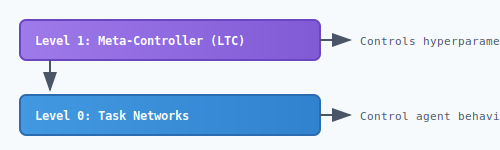

# Faber Neuroevolution

Population-based evolutionary training for neural networks.

[](https://hex.pm/packages/faber_neuroevolution)
[](https://hexdocs.pm/faber_neuroevolution)
[](https://buymeacoffee.com/beamologist)

## Overview

`faber_neuroevolution` is an Erlang library that provides domain-agnostic population-based evolutionary training for neural networks. It works with [faber_tweann](https://hex.pm/packages/faber_tweann) to evolve network weights through selection, crossover, and mutation.


## Features

- **Population Management** - Maintain and evolve populations of neural networks
- **Parallel Evaluation** - Concurrent fitness evaluation using Erlang processes
- **Sexual Reproduction** - Uniform crossover of parent weights
- **Mutation Operators** - Weight perturbation with configurable rate/strength
- **Selection Strategies** - Top-N%, tournament, roulette wheel
- **LTC Meta-Controller** - Adaptive hyperparameter optimization using Liquid Time-Constant networks
- **Lineage Tracking** - Track parent1_id, parent2_id, generation_born
- **Event Callbacks** - Pluggable event handling for UI updates
- **Target Fitness** - Automatic stopping when fitness threshold is reached

## The Liquid Conglomerate Vision

This library implements the first level of a hierarchical meta-learning system called the **Liquid Conglomerate**:



The Liquid Conglomerate is a novel architecture that uses hierarchical **Liquid Time-Constant (LTC)** neural networks to create a self-optimizing training system. Instead of manually tuning hyperparameters, the system *learns how to learn* at multiple timescales:

- **Level 0 (fast tau)**: Task networks react to immediate domain state
- **Level 1 (medium tau)**: Meta-controller adapts hyperparameters per generation
- **Level 2+ (slow tau)**: Higher-order controllers learn meta-strategies

**Key effects on training:**

1. **Self-tuning hyperparameters** - Mutation rate, selection ratio adapt automatically
2. **Automatic stagnation recovery** - Detects and escapes local optima
3. **Phase-appropriate strategies** - Different strategies for exploration vs exploitation
4. **Transfer of meta-knowledge** - Training strategies can transfer across domains

See [The Liquid Conglomerate Guide](guides/liquid-conglomerate.md) for the full explanation, or [LTC Meta-Controller](guides/meta-controller.md) for implementation details.


## Installation

Add to your `rebar.config`:

```erlang
{deps, [
    {faber_neuroevolution, "~> 0.12.0"}
]}.
```

## Quick Start

```erlang
%% Define your evaluator module (implements neuroevolution_evaluator behaviour)
-module(my_evaluator).
-behaviour(neuroevolution_evaluator).
-export([evaluate/2]).

evaluate(Individual, Options) ->
    Network = Individual#individual.network,
    %% Run your domain-specific evaluation
    Score = run_simulation(Network),
    UpdatedIndividual = Individual#individual{
        metrics = #{total_score => Score}
    },
    {ok, UpdatedIndividual}.

%% Start training
Config = #neuro_config{
    population_size = 50,
    selection_ratio = 0.20,
    mutation_rate = 0.10,
    mutation_strength = 0.3,
    network_topology = {42, [16, 8], 6},  % 42 inputs, 2 hidden layers, 6 outputs
    evaluator_module = my_evaluator
},

{ok, Pid} = neuroevolution_server:start_link(Config),
neuroevolution_server:start_training(Pid).
```

## Configuration

| Parameter | Default | Description |
|-----------|---------|-------------|
| `population_size` | 50 | Number of individuals |
| `evaluations_per_individual` | 10 | Games/tests per individual per generation |
| `selection_ratio` | 0.20 | Fraction of population that survives (top 20%) |
| `mutation_rate` | 0.10 | Probability of mutating each weight |
| `mutation_strength` | 0.3 | Magnitude of weight perturbation |
| `max_generations` | infinity | Maximum generations to run |
| `network_topology` | - | `{InputSize, HiddenLayers, OutputSize}` |
| `evaluator_module` | - | Module implementing `neuroevolution_evaluator` |
| `evaluator_options` | `#{}` | Options passed to evaluator |
| `event_handler` | `undefined` | `{Module, InitArg}` for event notifications |

## Event Handling

Subscribe to training events by providing an event handler:

```erlang
-module(my_event_handler).
-export([handle_event/2]).

handle_event({generation_started, Gen}, _State) ->
    io:format("Generation ~p started~n", [Gen]);
handle_event({generation_complete, Stats}, _State) ->
    io:format("Generation ~p: Best=~.2f, Avg=~.2f~n",
              [Stats#generation_stats.generation,
               Stats#generation_stats.best_fitness,
               Stats#generation_stats.avg_fitness]);
handle_event(_Event, _State) ->
    ok.

%% Configure with event handler
Config = #neuro_config{
    %% ... other options ...
    event_handler = {my_event_handler, undefined}
}.
```

## Custom Evaluators

Implement the `neuroevolution_evaluator` behaviour:

```erlang
-module(snake_game_evaluator).
-behaviour(neuroevolution_evaluator).
-export([evaluate/2, calculate_fitness/1]).

%% Required callback
evaluate(Individual, Options) ->
    Network = Individual#individual.network,
    NumGames = maps:get(games, Options, 10),

    %% Play multiple games and aggregate results
    Results = [play_game(Network) || _ <- lists:seq(1, NumGames)],

    TotalScore = lists:sum([R#result.score || R <- Results]),
    TotalTicks = lists:sum([R#result.ticks || R <- Results]),
    Wins = length([R || R <- Results, R#result.won]),

    UpdatedIndividual = Individual#individual{
        metrics = #{
            total_score => TotalScore,
            total_ticks => TotalTicks,
            wins => Wins
        }
    },
    {ok, UpdatedIndividual}.

%% Optional callback for custom fitness calculation
calculate_fitness(Metrics) ->
    Score = maps:get(total_score, Metrics, 0),
    Ticks = maps:get(total_ticks, Metrics, 0),
    Wins = maps:get(wins, Metrics, 0),
    Score * 50.0 + Ticks / 50.0 + Wins * 2.0.
```

## Building

```bash
rebar3 compile
rebar3 eunit
rebar3 dialyzer
```

## Academic References

### Evolutionary Algorithms

- **Holland, J.H.** (1975). *Adaptation in Natural and Artificial Systems*. MIT Press.
  - Foundational text on genetic algorithms and evolutionary computation.

- **Goldberg, D.E.** (1989). *Genetic Algorithms in Search, Optimization, and Machine Learning*. Addison-Wesley.
  - Comprehensive coverage of genetic algorithm theory and practice.

### Neuroevolution

- **Yao, X.** (1999). [Evolving Artificial Neural Networks](https://ieeexplore.ieee.org/document/784219). *Proceedings of the IEEE*, 87(9), 1423-1447.
  - Comprehensive survey of neuroevolution approaches and taxonomy.

- **Stanley, K.O. & Miikkulainen, R.** (2002). [Evolving Neural Networks through Augmenting Topologies](http://nn.cs.utexas.edu/downloads/papers/stanley.ec02.pdf). *Evolutionary Computation*, 10(2), 99-127.
  - NEAT paper introducing speciation for topology evolution (applicable to weight evolution too).

- **Sher, G.I.** (2013). [*Handbook of Neuroevolution Through Erlang*](https://www.springer.com/gp/book/9781461444626). Springer.
  - Erlang-specific neuroevolution patterns and DXNN2 architecture.

### Selection & Breeding

- **Miller, B.L. & Goldberg, D.E.** (1995). [Genetic Algorithms, Tournament Selection, and the Effects of Noise](https://www.complex-systems.com/abstracts/v09_i03_a02/). *Complex Systems*, 9(3), 193-212.
  - Tournament selection analysis and noise resistance.

- **Goldberg, D.E. & Richardson, J.** (1987). [Genetic Algorithms with Sharing for Multimodal Function Optimization](https://www.researchgate.net/publication/228552562). *Proceedings of the Second International Conference on Genetic Algorithms*.
  - Fitness sharing and speciation for maintaining diversity.

### Fitness Evaluation

- **Jin, Y.** (2005). [A Comprehensive Survey of Fitness Approximation in Evolutionary Computation](https://link.springer.com/article/10.1007/s00500-003-0328-5). *Soft Computing*, 9(1), 3-12.
  - Survey of fitness approximation techniques for expensive evaluations.

## Related Projects

### Macula Ecosystem

- **[faber_tweann](https://hex.pm/packages/faber_tweann)** - Neural network library with topology evolution, LTC neurons, and ONNX export. Core dependency for network creation and evaluation.

- **[macula](https://hex.pm/packages/macula)** - HTTP/3 mesh networking platform enabling distributed neuroevolution across edge devices with NAT traversal.

### Inspiration & Related Work

- **[DXNN2](https://github.com/CorticalComputer/DXNN2)** - Gene Sher's original TWEANN implementation in Erlang.

- **[NEAT-Python](https://neat-python.readthedocs.io/)** - Popular Python NEAT implementation with extensive documentation.

- **[OpenAI ES](https://github.com/openai/evolution-strategies-starter)** - OpenAI's evolution strategies implementation for RL.

- **[EvoTorch](https://evotorch.ai/)** - Modern PyTorch-based evolutionary algorithm library.

- **[DEAP](https://github.com/DEAP/deap)** - Distributed Evolutionary Algorithms in Python.

## Guides

### Getting Started
- [Overview](guides/overview.md) - Architecture and core concepts
- [Getting Started](guides/getting-started.md) - Quick setup guide
- [Custom Evaluators](guides/custom-evaluator.md) - Implement your own evaluator

### Advanced Topics
- [The Liquid Conglomerate](guides/liquid-conglomerate.md) - Hierarchical meta-learning explained
- [LTC Meta-Controller](guides/meta-controller.md) - Adaptive hyperparameter optimization
- [Cooperative Silos](guides/cooperative-silos.md) - Cross-silo communication in LC v2
- [Topology Evolution Roadmap](guides/topology-evolution.md) - TWEANN integration plans
- [Interoperability](guides/interoperability.md) - Export formats and cross-language deployment
- [Inference Scenarios](guides/inference-scenarios.md) - Production deployment patterns
- [Swarm Robotics](guides/swarm-robotics.md) - Coordinated autonomous systems
- [Evolution Strategies](guides/evolution-strategies.md) - Pluggable evolution algorithms

## License

Apache License 2.0

## Links

- [Documentation](https://hexdocs.pm/faber_neuroevolution)
- [GitHub](https://github.com/rgfaber/faber-neuroevolution)
- [faber_tweann](https://hex.pm/packages/faber_tweann) - Neural network library
