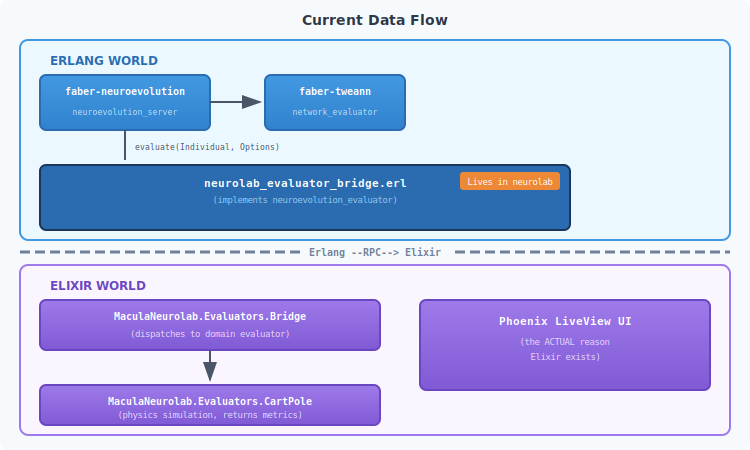
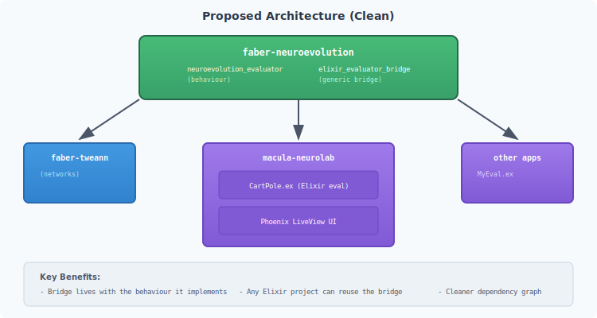
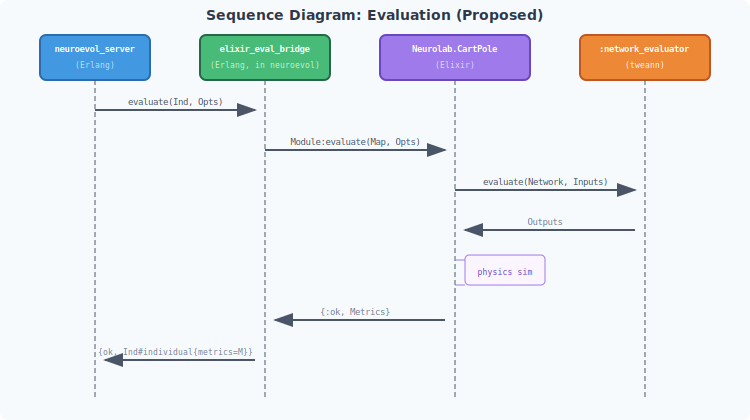

# Neuroevolution Architecture Analysis

**Date:** 2025-12-06
**Status:** Analysis / Discussion

---

## The Core Question

Why do we have an Elixir evaluator bridge (`neurolab_evaluator_bridge.erl`) living in `macula-neurolab`?

**Short answer:** Because macula-neurolab uses Phoenix LiveView for the UI, and we wrote domain evaluators (CartPole) in Elixir.

**But the deeper question is:** Should domain evaluators be in Elixir at all?

---

## Why Elixir Exists in This Stack

**The only reason Elixir is used: Phoenix LiveView for the web UI.**

Everything else could be pure Erlang:
- `faber-neuroevolution` - Erlang (evolution engine)
- `faber-tweann` - Erlang (neural networks)
- Domain evaluators - **Could be Erlang**
- Event handling - **Could be Erlang**

---

## Current Data Flow



---

## The Problem

The bridge creates a **circular dependency pattern**:

```
faber-neuroevolution          macula-neurolab
       │                              │
       │ depends on (rebar3)          │ depends on (mix)
       ▼                              ▼
  (runtime: needs                (compile: needs
   evaluator module)              neuroevolution_evaluator
                                  behaviour to implement)
```

The Erlang evaluator bridge in `macula-neurolab`:
1. Implements `neuroevolution_evaluator` behaviour (from faber-neuroevolution)
2. But lives in macula-neurolab (an Elixir project)
3. Is compiled by Mix, not Rebar3

---

## Alternative Architectures

### Option 1: Pure Erlang Evaluators (Simplest)

**Move domain evaluators to Erlang:**

```
faber-neuroevolution/
└── src/
    ├── neuroevolution_server.erl
    ├── neuroevolution_evaluator.erl
    └── evaluators/                    ← NEW
        ├── cart_pole_evaluator.erl    ← Pure Erlang
        └── snake_evaluator.erl        ← Pure Erlang

macula-neurolab/
└── (Phoenix UI only - no evaluation code)
```

**Pros:**
- No bridge needed
- All evolution code in one language
- Simpler mental model
- Reusable without Elixir

**Cons:**
- Rewrite existing Elixir evaluators
- LiveView visualization callbacks need different approach

---

### Option 2: Generic Elixir Bridge in faber-neuroevolution

**Move the bridge to where the behaviour is defined:**

```
faber-neuroevolution/
└── src/
    ├── neuroevolution_server.erl
    ├── neuroevolution_evaluator.erl
    └── elixir_evaluator_bridge.erl    ← MOVED HERE
        %% Generic bridge that calls any Elixir module
        %% Options must contain: #{elixir_module => Mod, ...}
```

**Usage from Elixir projects:**
```erlang
Config = #{
    evaluator_module => elixir_evaluator_bridge,
    evaluator_options => #{
        elixir_module => 'Elixir.MyApp.CartPoleEvaluator',
        custom_opts => #{...}
    }
}
```

**Pros:**
- Bridge is with the behaviour it implements
- Any Elixir project can use it
- macula-neurolab becomes simpler

**Cons:**
- faber-neuroevolution "knows about" Elixir (via module name convention)
- Still requires Elixir callback format

---

### Option 3: Event-Driven Evaluation (Decoupled)

**Replace direct function calls with message passing:**

```
┌────────────────────────┐     messages      ┌────────────────────────┐
│ neuroevolution_server  │◀────────────────▶│    evaluator_pool      │
│ (requests evaluation)  │                   │ (any language/process) │
└────────────────────────┘                   └────────────────────────┘

Messages:
  {evaluate, RequestId, Individual, Options}  ──▶
                                              ◀──  {evaluated, RequestId, Metrics}
```

**Pros:**
- Complete decoupling
- Evaluators can be distributed (Macula mesh!)
- Language agnostic

**Cons:**
- More complex protocol
- Async coordination overhead
- Overkill for single-node?

---

### Option 4: Evaluator as Behaviour + Module Reference (Current, but cleaner)

**Keep current approach but clarify boundaries:**

```
faber-neuroevolution/
└── src/
    ├── neuroevolution_evaluator.erl   ← Behaviour definition
    │   %% Any module implementing evaluate/2 works
    │   %% Module can be Erlang OR Elixir (BEAM is BEAM)
    └── neuroevolution_server.erl
        %% Calls: EvaluatorModule:evaluate(Individual, Options)
        %% Doesn't care if EvaluatorModule is Erlang or Elixir

macula-neurolab/
└── apps/macula_neurolab/
    └── src/
        └── neurolab_evaluator_bridge.erl  ← Implements behaviour
            %% This IS the evaluator, not a bridge
            %% It happens to delegate to Elixir code
```

**Key insight:** Rename `neurolab_evaluator_bridge` to something like `neurolab_evaluator` - it's not a "bridge", it's **the evaluator** that neurolab provides.

---

## The Real Question: Where Should Evaluation Logic Live?

| Approach | Evaluation Logic In | Pros | Cons |
|----------|---------------------|------|------|
| **A: Pure Erlang** | faber-neuroevolution | Simple, reusable | Rewrite, no LiveView integration |
| **B: Domain-specific repos** | macula-neurolab (Elixir) | Flexible, Phoenix integration | Bridge needed |
| **C: Separate evaluator libs** | macula-cart-pole, macula-snake | Modular, pluggable | More repos |
| **D: Distributed** | Any node on mesh | Scalable | Complex protocol |

---

## Recommendation

**Short term:** Option 2 - Move `elixir_evaluator_bridge.erl` to `faber-neuroevolution`

Rationale:
- The bridge implements `neuroevolution_evaluator` behaviour
- It should live with that behaviour
- Other Elixir projects can reuse it
- Minimal change, immediate benefit

**Rename:** `elixir_evaluator_bridge` (generic, reusable)

```erlang
%% faber-neuroevolution/src/elixir_evaluator_bridge.erl
-module(elixir_evaluator_bridge).
-behaviour(neuroevolution_evaluator).

-export([evaluate/2, calculate_fitness/1]).

%% @doc Evaluate using an Elixir module.
%% Options must contain:
%%   - elixir_module: The Elixir module atom (e.g., 'Elixir.MyApp.Evaluator')
%%   - Plus any domain-specific options
evaluate(Individual, Options) ->
    ElixirModule = maps:get(elixir_module, Options),
    ElixirOptions = maps:get(elixir_options, Options, #{}),

    %% Convert individual record to map for Elixir
    IndividualMap = individual_to_map(Individual),

    %% Call Elixir module - it must export evaluate/2
    case ElixirModule:evaluate(IndividualMap, ElixirOptions) of
        {ok, Metrics} when is_map(Metrics) ->
            {ok, Individual#individual{metrics = Metrics}};
        {error, Reason} ->
            {error, Reason}
    end.
```

**Medium term:** Consider Option 3 (event-driven) for Macula mesh integration

When we distribute evaluation across the mesh, message-passing becomes natural.

---

## Dependency Diagram (Current vs Proposed)

### Proposed (Clean)



---

## Sequence Diagram: Evaluation (Proposed)



---

## Action Items

1. **Move bridge to faber-neuroevolution**
   - Rename to `elixir_evaluator_bridge.erl`
   - Make it generic (no neurolab-specific code)
   - Update rebar.config if needed

2. **Update macula-neurolab**
   - Remove `neurolab_evaluator_bridge.erl` from src/
   - Update EvolutionOrchestrator to use new module name
   - Keep Elixir evaluators (CartPole, etc.) and Evaluators.Bridge

3. **Document the pattern**
   - How to write Erlang evaluators (direct)
   - How to write Elixir evaluators (via bridge)
   - How the BEAM makes this seamless

---

## Appendix: BEAM Language Interop

Remember: **Elixir and Erlang compile to the same BEAM bytecode.**

Calling Elixir from Erlang:
```erlang
%% Call Elixir module (must prefix with 'Elixir.')
'Elixir.MyModule':my_function(Arg1, Arg2).

%% Elixir atoms look like this in Erlang
'Elixir.MaculaNeurolab.Evaluators.CartPole':evaluate(Individual, Options).
```

Calling Erlang from Elixir:
```elixir
# Call Erlang module (just use atom)
:neuroevolution_server.start_link(config)
:network_evaluator.evaluate(network, inputs)
```

The bridge is just about **data format conversion** (records ↔ maps), not language barriers.
