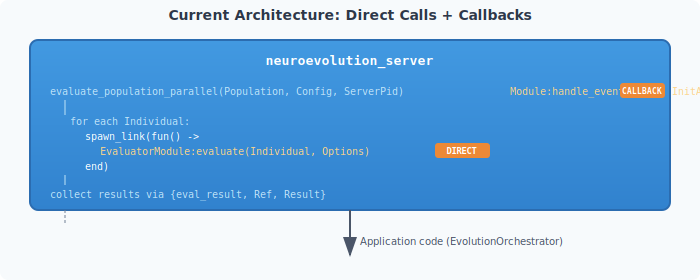
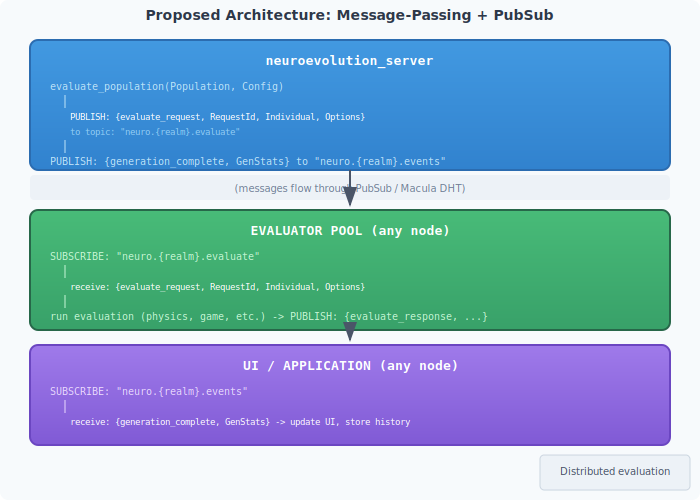
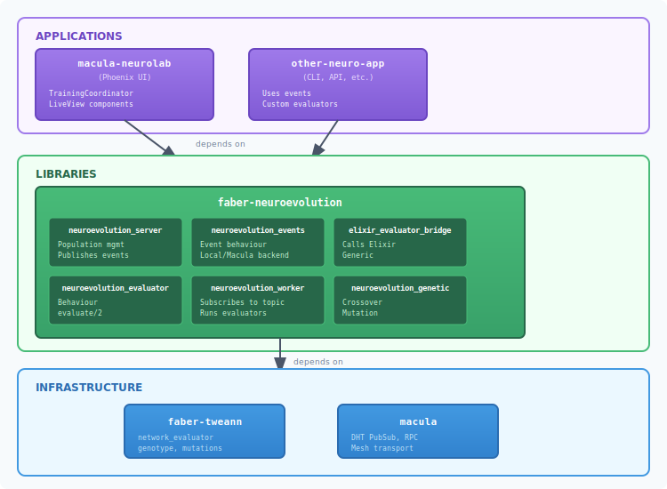

# Event-Driven Architecture for Neuroevolution

**Date:** 2025-12-06
**Status:** Design Proposal

---

## Motivation

The current architecture has several coupling issues:

1. **Direct function calls** for evaluation (`EvaluatorModule:evaluate/2`)
2. **Callback-based events** (`event_handler => {Module, Arg}`)
3. **Synchronous communication** - neuroevolution_server waits for evaluations

For Macula mesh integration, we need:

1. **Message-passing** - evaluate requests sent as messages
2. **Event publishing** - events published to topics (PubSub/DHT)
3. **Async communication** - distributed evaluation across nodes

---

## Current vs Proposed Architecture

### Current: Direct Calls + Callbacks



### Proposed: Message-Passing + PubSub



---

## Event Types

### Commands (Requests)

Commands are requests for work. They flow TO workers.

```erlang
%% Request evaluation of an individual
{evaluate_request, #{
    request_id => RequestId,       % Unique correlation ID
    realm => Realm,                % Multi-tenancy isolation
    individual_id => IndividualId,
    network => Network,            % The neural network to evaluate
    options => Options             % Domain-specific options
}}

%% Request batch evaluation (optimization)
{evaluate_batch_request, #{
    request_id => RequestId,
    realm => Realm,
    individuals => [#{id => Id, network => Network}, ...],
    options => Options
}}
```

### Events (Facts)

Events are facts that happened. They flow FROM the system.

```erlang
%% Evaluation completed (worker → server)
{evaluated, #{
    request_id => RequestId,       % Correlation ID
    individual_id => IndividualId,
    metrics => Metrics,            % #{fitness => F, ...}
    evaluator_node => Node         % Which node did the work
}}

%% Generation started
{generation_started, #{
    realm => Realm,
    generation => Generation,
    population_size => Size,
    timestamp => Timestamp
}}

%% Generation completed
{generation_completed, #{
    realm => Realm,
    generation => Generation,
    best_fitness => BestFitness,
    avg_fitness => AvgFitness,
    worst_fitness => WorstFitness,
    survivors => [IndividualSummary, ...],
    timestamp => Timestamp
}}

%% Training started/stopped
{training_started, #{realm => Realm, config => Config}}
{training_stopped, #{realm => Realm, generation => Generation, reason => Reason}}

%% Species events (if speciation enabled)
{species_created, #{realm => Realm, species_id => Id, representative => IndId}}
{species_extinct, #{realm => Realm, species_id => Id, generation => Gen}}
```

---

## Topic Design

Following Macula's topic design principles (IDs in payloads, not topics):

```
neuro.evaluate              # Evaluation requests (commands)
neuro.evaluated             # Evaluation results (events)
neuro.events                # Training lifecycle events
neuro.metrics               # Real-time metrics stream

# With realm isolation (multi-tenancy):
neuro.{realm}.evaluate      # Scoped to realm
neuro.{realm}.evaluated
neuro.{realm}.events
neuro.{realm}.metrics
```

**Note:** The realm is in the topic for routing efficiency, but the full realm ID is also in the payload for verification.

---

## Sequence Diagrams

### Evaluation Flow (Distributed)

```
┌──────────┐     ┌─────────────┐     ┌─────────────┐     ┌──────────────┐
│ neuroevol│     │ Macula DHT  │     │ Evaluator   │     │ Evaluator    │
│ _server  │     │ (PubSub)    │     │ Node A      │     │ Node B       │
└────┬─────┘     └──────┬──────┘     └──────┬──────┘     └──────┬───────┘
     │                  │                   │                   │
     │ SUBSCRIBE        │                   │                   │
     │ neuro.R.evaluated│                   │                   │
     │─────────────────>│                   │                   │
     │                  │                   │                   │
     │                  │ SUBSCRIBE         │                   │
     │                  │ neuro.R.evaluate  │                   │
     │                  │<──────────────────│                   │
     │                  │                   │                   │
     │                  │ SUBSCRIBE         │                   │
     │                  │ neuro.R.evaluate  │                   │
     │                  │<──────────────────┼───────────────────│
     │                  │                   │                   │
     │                  │                   │                   │
     │ ══════════════ START GENERATION ═══════════════════════ │
     │                  │                   │                   │
     │ PUBLISH          │                   │                   │
     │ {evaluate_request, Ind1}             │                   │
     │─────────────────>│                   │                   │
     │                  │ deliver           │                   │
     │                  │──────────────────>│                   │
     │                  │                   │                   │
     │ PUBLISH          │                   │                   │
     │ {evaluate_request, Ind2}             │                   │
     │─────────────────>│                   │                   │
     │                  │ deliver           │                   │
     │                  │──────────────────>│                   │
     │                  │                   │                   │
     │ PUBLISH          │                   │                   │
     │ {evaluate_request, Ind3}             │                   │
     │─────────────────>│                   │                   │
     │                  │ deliver           │                   │
     │                  │──────────────────────────────────────>│
     │                  │                   │                   │
     │                  │                   │────┐              │
     │                  │                   │    │ evaluate     │
     │                  │                   │<───┘ Ind1         │
     │                  │                   │                   │
     │                  │ PUBLISH           │                   │
     │                  │ {evaluated, Ind1} │                   │
     │                  │<──────────────────│                   │
     │                  │                   │                   │
     │ deliver          │                   │                   │────┐
     │<─────────────────│                   │                   │    │ evaluate
     │                  │                   │                   │<───┘ Ind3
     │                  │ PUBLISH           │                   │
     │                  │ {evaluated, Ind3} │                   │
     │                  │<──────────────────────────────────────│
     │                  │                   │                   │
     │ deliver          │                   │────┐              │
     │<─────────────────│                   │    │ evaluate     │
     │                  │                   │<───┘ Ind2         │
     │                  │                   │                   │
     │                  │ PUBLISH           │                   │
     │                  │ {evaluated, Ind2} │                   │
     │                  │<──────────────────│                   │
     │                  │                   │                   │
     │ deliver          │                   │                   │
     │<─────────────────│                   │                   │
     │                  │                   │                   │
     │ ══════════════ ALL EVALUATED ══════════════════════════ │
     │                  │                   │                   │
     │ PUBLISH          │                   │                   │
     │ {generation_completed, Stats}        │                   │
     │─────────────────>│                   │                   │
     │                  │                   │                   │
```

### UI Update Flow

```
┌──────────┐     ┌─────────────┐     ┌──────────────────┐     ┌──────────┐
│ neuroevol│     │ Macula DHT  │     │EvolutionOrchest- │     │ Phoenix  │
│ _server  │     │ (PubSub)    │     │rator (Elixir)    │     │ LiveView │
└────┬─────┘     └──────┬──────┘     └────────┬─────────┘     └────┬─────┘
     │                  │                     │                    │
     │                  │ SUBSCRIBE           │                    │
     │                  │ neuro.R.events      │                    │
     │                  │<────────────────────│                    │
     │                  │                     │                    │
     │                  │                     │ PubSub.subscribe   │
     │                  │                     │ "evolution:R"      │
     │                  │                     │<───────────────────│
     │                  │                     │                    │
     │ PUBLISH          │                     │                    │
     │ {generation_completed, Stats}          │                    │
     │─────────────────>│                     │                    │
     │                  │                     │                    │
     │                  │ deliver             │                    │
     │                  │────────────────────>│                    │
     │                  │                     │                    │
     │                  │                     │ convert to Elixir  │
     │                  │                     │ map, update state  │
     │                  │                     │                    │
     │                  │                     │ PubSub.broadcast   │
     │                  │                     │ {:generation_complete, stats}
     │                  │                     │────────────────────>│
     │                  │                     │                    │
     │                  │                     │                    │ update
     │                  │                     │                    │ assigns
     │                  │                     │                    │
```

---

## Component Responsibilities

### neuroevolution_server (Erlang)

**Produces:**
- `{evaluate_request, ...}` - for each individual
- `{generation_started, ...}`
- `{generation_completed, ...}`
- `{training_started, ...}`
- `{training_stopped, ...}`

**Consumes:**
- `{evaluated, ...}` - results from evaluators

**Does NOT:**
- Know about Phoenix
- Know about Elixir modules
- Call evaluators directly

### Evaluator Workers (Erlang or Elixir)

**Consumes:**
- `{evaluate_request, ...}`

**Produces:**
- `{evaluated, ...}`

**Responsibilities:**
- Subscribe to evaluation topic for their realm
- Run domain-specific evaluation (physics, games, etc.)
- Publish results
- Handle timeouts gracefully

### EvolutionOrchestrator (Elixir) - Renamed to TrainingCoordinator?

**Consumes:**
- `{generation_completed, ...}` (from Macula PubSub)
- `{training_started, ...}`
- `{training_stopped, ...}`

**Produces:**
- Phoenix PubSub events for LiveView

**Responsibilities:**
- Bridge Macula events → Phoenix PubSub
- Maintain UI-friendly state (history, etc.)
- Session management

### Phoenix LiveView

**Consumes:**
- Phoenix PubSub events

**Responsibilities:**
- Render UI
- Handle user interactions
- Display real-time updates

---

## Implementation Plan

### Phase 1: Abstract Event Publishing (faber-neuroevolution)

Create an event publisher behaviour:

```erlang
%% neuroevolution_events.erl
-module(neuroevolution_events).

-callback publish(Topic :: binary(), Event :: map()) -> ok.
-callback subscribe(Topic :: binary()) -> ok.

%% Default implementation: local (process dictionary or ETS)
-export([publish/2, subscribe/2, set_backend/1]).

publish(Topic, Event) ->
    Backend = get_backend(),
    Backend:publish(Topic, Event).

subscribe(Topic) ->
    Backend = get_backend(),
    Backend:subscribe(Topic).

set_backend(Module) ->
    persistent_term:put(?MODULE, Module).

get_backend() ->
    persistent_term:get(?MODULE, neuroevolution_events_local).
```

### Phase 2: Local Backend (Testing/Single-Node)

```erlang
%% neuroevolution_events_local.erl
-module(neuroevolution_events_local).
-behaviour(neuroevolution_events).

%% Simple pg-based pubsub for local development
-export([publish/2, subscribe/2]).

publish(Topic, Event) ->
    Members = pg:get_members(neuro_events, Topic),
    [Pid ! {neuro_event, Topic, Event} || Pid <- Members],
    ok.

subscribe(Topic) ->
    pg:join(neuro_events, Topic, self()),
    ok.
```

### Phase 3: Macula Backend (Distributed)

```erlang
%% neuroevolution_events_macula.erl
-module(neuroevolution_events_macula).
-behaviour(neuroevolution_events).

%% Uses Macula DHT PubSub for distributed events
-export([publish/2, subscribe/2]).

publish(Topic, Event) ->
    macula_pubsub:publish(Topic, Event).

subscribe(Topic) ->
    macula_pubsub:subscribe(Topic, self()).
```

### Phase 4: Update neuroevolution_server

Replace direct evaluator calls with event publishing:

```erlang
%% In neuroevolution_server.erl

%% Instead of:
%% spawn_link(fun() ->
%%     Result = neuroevolution_evaluator:evaluate_individual(Individual, EvaluatorModule, Options),
%%     ParentPid ! {eval_result, Ref, Result}
%% end)

%% Use:
publish_evaluate_request(Individual, Options, State) ->
    RequestId = make_ref(),
    Realm = State#neuro_state.realm,
    Topic = <<"neuro.", Realm/binary, ".evaluate">>,

    Event = #{
        request_id => RequestId,
        realm => Realm,
        individual_id => Individual#individual.id,
        network => Individual#individual.network,
        options => Options
    },

    neuroevolution_events:publish(Topic, {evaluate_request, Event}),
    RequestId.
```

### Phase 5: Create Evaluator Worker

```erlang
%% neuroevolution_evaluator_worker.erl
-module(neuroevolution_evaluator_worker).
-behaviour(gen_server).

%% Subscribes to evaluate requests, runs evaluations, publishes results

init([Realm, EvaluatorModule]) ->
    Topic = <<"neuro.", Realm/binary, ".evaluate">>,
    neuroevolution_events:subscribe(Topic),
    {ok, #{realm => Realm, evaluator => EvaluatorModule}}.

handle_info({neuro_event, _Topic, {evaluate_request, Request}}, State) ->
    spawn_link(fun() -> handle_evaluation(Request, State) end),
    {noreply, State}.

handle_evaluation(#{request_id := ReqId, individual_id := IndId,
                    network := Network, options := Options, realm := Realm},
                  #{evaluator := EvaluatorModule}) ->
    %% Build individual record for evaluator
    Individual = #individual{id = IndId, network = Network},

    %% Run evaluation
    Result = case EvaluatorModule:evaluate(Individual, Options) of
        {ok, EvaluatedInd} ->
            #{
                request_id => ReqId,
                individual_id => IndId,
                metrics => EvaluatedInd#individual.metrics
            };
        {error, Reason} ->
            #{
                request_id => ReqId,
                individual_id => IndId,
                metrics => #{error => Reason, fitness => 0.0}
            }
    end,

    %% Publish result
    ResultTopic = <<"neuro.", Realm/binary, ".evaluated">>,
    neuroevolution_events:publish(ResultTopic, {evaluated, Result}).
```

### Phase 6: Move Bridge to faber-neuroevolution

The `elixir_evaluator_bridge` becomes just another evaluator module that can be used with the worker:

```erlang
%% In faber-neuroevolution/src/elixir_evaluator_bridge.erl
-module(elixir_evaluator_bridge).
-behaviour(neuroevolution_evaluator).

evaluate(Individual, Options) ->
    ElixirModule = maps:get(elixir_module, Options),
    ElixirOptions = maps:get(elixir_options, Options, #{}),

    IndMap = #{
        id => Individual#individual.id,
        network => Individual#individual.network
    },

    case ElixirModule:evaluate(IndMap, ElixirOptions) of
        {ok, Metrics} ->
            {ok, Individual#individual{metrics = Metrics}};
        Error ->
            Error
    end.
```

---

## Dependency Diagram (Proposed)



---

## Migration Path

### Step 1: Add event abstraction (non-breaking) ✅ DONE

Add `neuroevolution_events` module with local backend as default.
Existing code continues to work.

**Implemented:**
- `neuroevolution_events.erl` - behaviour with pluggable backends
- `neuroevolution_events_local.erl` - pg-based local backend

### Step 2: Move elixir bridge (non-breaking) ✅ DONE

Move `neurolab_evaluator_bridge.erl` to faber-neuroevolution.
Update neurolab to use new module path.

**Implemented:**
- `elixir_evaluator_bridge.erl` in faber-neuroevolution
- `MaculaNeurolab.Evaluators.Dispatcher` in macula-neurolab

### Step 3: Add event publishing alongside callbacks ✅ DONE

Publish events AND call callbacks (dual-write).
Consumers can migrate gradually.

**Implemented:**
- `neuro_config` has `realm` and `publish_events` fields
- `neuroevolution_server` publishes to `neuro.<realm>.events` when enabled
- Legacy callback system still works alongside events

### Step 4: Add evaluator worker ✅ DONE

Create `neuroevolution_evaluator_worker` that uses events.
Deploy alongside direct evaluation.

**Implemented:**
- `neuroevolution_evaluator_worker.erl` - gen_server that subscribes to
  evaluation requests and publishes results
- Tests in `neuroevolution_events_tests.erl`

### Step 5: Switch to event-based evaluation ✅ DONE

Configure neuroevolution_server to use event-based evaluation.
Remove direct evaluator calls.

**Implemented:**
- `neuro_config` has `evaluation_mode` field (`direct` | `distributed`)
- `neuro_config` has `evaluation_timeout` field (milliseconds)
- `start_distributed_evaluation/2` - publishes `evaluate_request` events
- `handle_distributed_eval_result/2` - processes incoming `evaluated` events
- `handle_evaluation_timeout/1` - graceful timeout handling
- Tests in `neuroevolution_events_tests.erl`:
  - `distributed_evaluation_test` - end-to-end distributed evaluation
  - `distributed_evaluation_timeout_test` - graceful timeout behavior

### Step 6: Remove callback system 🔲 TODO (Future)

Once all consumers use events, remove callback mechanism.

**Status:** The legacy callback system is still in place for backward compatibility.
Applications can migrate to events at their own pace.

---

## Configuration

```erlang
%% In neuro_config
-record(neuro_config, {
    %% ... existing fields ...

    %% Event configuration (new)
    event_backend = neuroevolution_events_local :: module(),
    realm = <<"default">> :: binary(),

    %% Evaluation mode (new)
    evaluation_mode = direct :: direct | distributed,

    %% Deprecated (to be removed)
    event_handler = undefined :: {module(), term()} | undefined
}).
```

---

## Benefits

1. **True decoupling** - Components communicate via events only
2. **Mesh-ready** - Swap local backend for Macula backend
3. **Scalable** - Add evaluator workers on any node
4. **Testable** - Mock event backend for testing
5. **Language-agnostic** - Events are just data (maps)
6. **Observable** - Easy to log/trace all events
7. **Replayable** - Store events for debugging/analysis

---

## Open Questions

1. **Backpressure** - How do we handle slow evaluators?
   - Option A: Bounded queue per worker
   - Option B: Work stealing
   - Option C: Let Macula mesh handle it

2. **Ordering** - Does generation order matter?
   - For speciation: yes (need all results before breeding)
   - Solution: Barrier synchronization via request IDs

3. **Failure handling** - What if an evaluator dies?
   - Timeout + retry?
   - Reassign to another worker?
   - Accept partial results?

4. **Network representation** - How to serialize networks efficiently?
   - Current: Erlang term format
   - Option: Protobuf/MessagePack for cross-language

---

## Summary

The event-driven architecture transforms neuroevolution from a monolithic system into a distributed, composable platform:

| Aspect | Current | Proposed |
|--------|---------|----------|
| Evaluation | Direct function call | Message passing |
| Events | Callbacks | PubSub topics |
| Distribution | Single node | Any node on mesh |
| Coupling | Tight | Loose |
| Scalability | Limited | Horizontal |
| Testing | Requires full stack | Mock backends |

The key insight is that **the bridge problem goes away** when we use events:
- neuroevolution_server publishes `{evaluate_request, ...}`
- Any evaluator (Erlang or Elixir) subscribes and responds
- No bridge needed - just message format agreement
