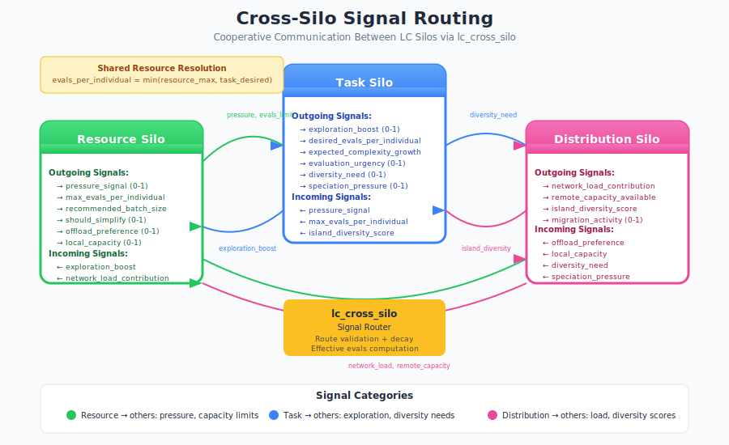

# Cooperative Silos: Cross-Silo Communication in LC v2

This guide explains how the three silos in the Liquid Conglomerate v2 architecture cooperate through signal routing, shared resources, and cooperative reward signals.

## The Core Goal: Optimal Training with Resource Stability

The fundamental purpose of LC v2 is to **train Task TWEANNs as fast as possible** while **keeping the system stable**. This is achieved through a feedback loop between the Resource Silo (the governor) and the Task Silo (the training engine):


**Key insight**: Resource Silo acts as a *feedback controller* that modulates Task Silo's aggressiveness based on system health. When resources are stressed, Task Silo backs off; when resources are healthy, Task Silo can explore more aggressively.

## Overview

The LC v2 architecture separates concerns into three specialized silos, each with its own hierarchical L0/L1/L2 controller:


Each silo optimizes a different aspect of the system:

| Silo | Focus | Time Scale | Optimization Target |
|------|-------|------------|---------------------|
| **Resource** | System stability | Fast (ms) | Maximize throughput, minimize GC |
| **Task** | Evolution quality | Medium (evals) | Maximize fitness improvement |
| **Distribution** | Network efficiency | Variable | Balance load, maintain diversity |

## L0 TWEANN Sensors and Actuators

Each silo's L0 controller is a TWEANN that maps environment sensors to control actuators:


**Sensor/Actuator Summary:**

| Silo | Sensors | Actuators | Total I/O |
|------|---------|-----------|-----------|
| Resource | 13 | 8 | 21 |
| Task | 16 | 12 | 28 |
| Distribution | 14 | 10 | 24 |
| **Total** | **43** | **30** | **73** |

## Hierarchical Learning

Each silo implements a 3-level hierarchical controller:


### L0: Reactive Layer

- **Always active**, cannot be disabled
- Responds immediately to current sensor readings
- TWEANN that maps sensors to actuators
- Time constant: 5s (Resource), 1K evals (Task), 1s (Distribution)

### L1: Tactical Layer

- Observes L0 performance over a sliding window
- Adjusts L0's hyperparameters based on performance trends
- Time constant: 30s (Resource), 5K evals (Task), 10s (Distribution)

### L2: Strategic Layer

- Observes L1 performance over a long-term window
- Adjusts L1's hyperparameters through slow exploration
- Time constant: 5min (Resource), 10K evals (Task), 1min (Distribution)

## Cross-Silo Signal Routing

The silos communicate through `lc_cross_silo`, which routes signals between silos with validation and decay:



### Detailed Interaction Flow

Each pair of silos exchanges specific signals that enable cooperative optimization:


### Signal Types

```erlang
%% Resource Silo → Others
#{
    pressure_signal => 0.0-1.0,          % 0=healthy, 1=critical
    max_evals_per_individual => 1-20,    % Resource-constrained max
    recommended_batch_size => 1-50,      % Suggested batch size
    should_simplify => 0.0-1.0,          % Hint to reduce complexity
    offload_preference => 0.0-1.0,       % How much to prefer remote
    local_capacity => 0.0-1.0            % Available local resources
}

%% Task Silo → Others
#{
    exploration_boost => 0.0-1.0,        % How aggressively exploring
    desired_evals_per_individual => 1-50,% Fitness-based request
    expected_complexity_growth => 0.0-1.0,% Anticipated memory needs
    evaluation_urgency => 0.0-1.0,       % How important speed is
    diversity_need => 0.0-1.0,           % How much migration helps
    speciation_pressure => 0.0-1.0       % Species splitting tendency
}

%% Distribution Silo → Others
#{
    network_load_contribution => 0.0-1.0,% Load from distribution
    remote_capacity_available => 0.0-1.0,% Peers can help
    island_diversity_score => 0.0-1.0,   % How diverse across islands
    migration_activity => 0.0-1.0        % Recent migration level
}
```

### Signal Routing Example

```erlang
%% Send a signal from Resource to Task silo
ok = lc_cross_silo:send_signal(
    resource,  % Source silo
    task,      % Destination silo
    #{pressure_signal => 0.8, max_evals_per_individual => 5}
),

%% Task silo receives the signal
{ok, Signals} = lc_cross_silo:get_signals(task),
%% Signals = #{pressure_signal => 0.8, max_evals_per_individual => 5}

%% Signals decay over time if not refreshed
timer:sleep(60000),
{ok, DecayedSignals} = lc_cross_silo:get_signals(task),
%% DecayedSignals values are lower due to decay
```

### Signal Decay

Cross-silo signals decay over time to prevent stale information from affecting decisions. The decay rate is configurable per signal route:

```erlang
%% Default decay configuration
decay_config() ->
    #{
        {resource, task} => #{decay_rate => 0.1, decay_interval => 5000},
        {task, resource} => #{decay_rate => 0.1, decay_interval => 5000},
        {resource, distribution} => #{decay_rate => 0.2, decay_interval => 10000},
        {distribution, resource} => #{decay_rate => 0.2, decay_interval => 10000},
        {task, distribution} => #{decay_rate => 0.15, decay_interval => 8000},
        {distribution, task} => #{decay_rate => 0.15, decay_interval => 8000}
    }.
```

## Shared Resource Resolution

Some resources are contested between silos. The `lc_cross_silo` module provides resolution functions:

### Evaluations Per Individual

Both Resource and Task silos have opinions on `evaluations_per_individual`:

- **Resource** sets `max_evals_per_individual` based on memory/CPU pressure
- **Task** requests `desired_evals_per_individual` based on fitness variance

```erlang
%% Resource silo signals its constraint
ResourceSignals = #{max_evals_per_individual => 5},

%% Task silo signals its preference
TaskSignals = #{desired_evals_per_individual => 20},

%% Effective value is the minimum
EffectiveEvals = lc_cross_silo:compute_effective_evals(ResourceSignals, TaskSignals),
%% EffectiveEvals = 5 (resource-constrained)
```

This ensures Resource constraints are always respected while allowing Task to optimize within those constraints.

## Cooperative Reward Signals

Each silo's L0 controller receives a reward signal that includes both local objectives and cross-silo cooperation penalties.

### Resource Silo Reward

```erlang
%% From lc_reward.erl
resource_reward(Metrics) ->
    Throughput = throughput_score(Metrics),
    Stability = stability_score(Metrics),
    Efficiency = efficiency_score(Metrics),
    TaskBlocked = task_blocked_penalty(Metrics),
    DistBlocked = distribution_blocked_penalty(Metrics),

    0.35 * Throughput +
    0.25 * Stability +
    0.15 * Efficiency -
    0.15 * TaskBlocked -
    0.10 * DistBlocked.
```

### Task Silo Reward

```erlang
task_reward(Metrics) ->
    Improvement = improvement_velocity(Metrics),
    Diversity = diversity_maintenance(Metrics),
    Complexity = complexity_growth_penalty(Metrics),
    ResourcePressure = resource_pressure_caused(Metrics),
    DistBonus = distribution_diversity_bonus(Metrics),

    0.40 * Improvement +
    0.20 * Diversity -
    0.15 * Complexity -
    0.15 * ResourcePressure +
    0.10 * DistBonus.
```

### Distribution Silo Reward

```erlang
distribution_reward(Metrics) ->
    LoadBalance = load_balance_score(Metrics),
    Migration = migration_effectiveness(Metrics),
    NetworkEff = network_efficiency(Metrics),
    ResourcePressure = resource_pressure_caused(Metrics),
    TaskDiversity = task_diversity_contribution(Metrics),

    0.30 * LoadBalance +
    0.25 * Migration +
    0.20 * NetworkEff -
    0.15 * ResourcePressure +
    0.10 * TaskDiversity.
```

### Global Cooperation Metric

In addition to individual rewards, each silo receives a bonus based on global system health:

```erlang
global_health(Metrics) ->
    ResourceHealth = maps:get(resource_throughput, Metrics, 0.5),
    TaskHealth = maps:get(task_improvement, Metrics, 0.5),
    DistHealth = maps:get(distribution_efficiency, Metrics, 0.5),
    AnyBlocked = maps:get(any_silo_blocked, Metrics, 0),

    (0.4 * ResourceHealth + 0.4 * TaskHealth + 0.2 * DistHealth) -
    (0.5 * AnyBlocked).

cooperation_bonus(Metrics) ->
    HealthImprovement = global_health(Metrics) - previous_global_health(),
    max(0.0, 0.1 * HealthImprovement).
```

## Usage Example

### Starting the LC Supervisor

```erlang
%% Full LC v2 configuration
Config = #{
    %% Resource silo config
    resource_config => #{
        morphology_module => resource_l0_morphology,
        tau_l0 => 5000,    % 5 second L0 cycle
        tau_l1 => 30000,   % 30 second L1 cycle
        tau_l2 => 300000   % 5 minute L2 cycle
    },

    %% Task silo config
    task_config => #{
        morphology_module => task_l0_morphology,
        tau_l0 => 1000,    % 1K evaluations for L0
        tau_l1 => 5000,    % 5K evaluations for L1
        tau_l2 => 10000    % 10K evaluations for L2
    },

    %% Distribution silo config
    distribution_config => #{
        morphology_module => distribution_l0_morphology,
        tau_l0 => 1000,    % 1 second L0 cycle
        tau_l1 => 10000,   % 10 second L1 cycle
        tau_l2 => 60000    % 1 minute L2 cycle
    },

    %% Cross-silo config
    cross_silo_config => #{
        enable_decay => true,
        log_signals => false
    }
},

{ok, SupPid} = lc_supervisor:start_link(Config).
```

### Querying Silo State

```erlang
%% Get L1 hyperparameters from each silo
{ok, ResourceL1} = lc_l1_controller:get_current_hyperparameters(ResourceL1Pid),
{ok, TaskL1} = lc_l1_controller:get_current_hyperparameters(TaskL1Pid),

%% Get L2 performance summary
{ok, L2Summary} = lc_l2_controller:get_performance_summary(L2Pid),
%% #{
%%     silo_type => resource,
%%     cycles_observed => 42,
%%     current_hyperparameters => #{...},
%%     best_hyperparameters => #{...},
%%     best_cumulative_reward => 0.85,
%%     exploration_rate => 0.1
%% }
```

### Monitoring Cross-Silo Communication

```erlang
%% Get all pending signals for a silo
{ok, Signals} = lc_cross_silo:get_signals(task),

%% Get signal history
{ok, History} = lc_cross_silo:get_signal_history(task, 10),
%% Returns last 10 signal updates
```

## Module Reference

### Core Modules

| Module | Purpose |
|--------|---------|
| `lc_supervisor.erl` | Supervises all LC v2 child processes |
| `lc_cross_silo.erl` | Signal routing between silos |
| `lc_reward.erl` | Cooperative reward computation |
| `lc_l1_controller.erl` | Generic L1 hyperparameter tuning |
| `lc_l2_controller.erl` | Strategic meta-tuning |
| `lc_chain.erl` | Cascades L2→L1→L0 hyperparameters |

### Silo-Specific Modules

| Module | Purpose |
|--------|---------|
| `resource_l0_morphology.erl` | Resource silo TWEANN morphology (13→8) |
| `resource_l0_sensors.erl` | Resource sensor data collection |
| `resource_l0_actuators.erl` | Resource actuator application |
| `task_l0_morphology.erl` | Task silo TWEANN morphology (16→12) |
| `task_l0_sensors.erl` | Task sensor data collection |
| `task_l0_actuators.erl` | Task actuator application |
| `distribution_l0_morphology.erl` | Distribution silo TWEANN morphology (14→10) |
| `distribution_l0_sensors.erl` | Distribution sensor data collection |
| `distribution_l0_actuators.erl` | Distribution actuator application |

## Design Principles

### Separation of Concerns

Each silo focuses on one optimization objective:
- Resource: System stability
- Task: Evolution quality
- Distribution: Network efficiency

This separation allows independent tuning and debugging.

### Graceful Degradation

If L2 fails or produces bad outputs:
- L1 provides reasonable reactive behavior
- L0 guarantees safe operation through hard limits

Each level provides a safety net for the level above.

### Time Scale Separation

The silos operate at different time scales to prevent oscillation:
- Fast silos (Resource, Distribution) respond to immediate conditions
- Slow silos (Task) learn stable evolutionary strategies
- Cross-silo signals bridge the time scales with appropriate decay

### Cooperative Optimization

Silos are not purely selfish - their reward signals include:
- Penalties for blocking other silos
- Bonuses for contributing to global health
- Shared resource resolution mechanisms

## Related Guides

- [LTC Meta-Controller](meta-controller.md) - Detailed LC v2 architecture
- [The Liquid Conglomerate](liquid-conglomerate.md) - Theory and rationale
- [Evolution Strategies](evolution-strategies.md) - Pluggable evolution algorithms

## References

### Hierarchical Control

- Sutton, R. S., Precup, D., Singh, S. (1999). "Between MDPs and semi-MDPs: A framework for temporal abstraction."
- Barto, A. G., Mahadevan, S. (2003). "Recent advances in hierarchical reinforcement learning."

### Multi-Agent Cooperation

- Tan, M. (1993). "Multi-Agent Reinforcement Learning: Independent vs. Cooperative Agents."
- Lowe, R. et al. (2017). "Multi-Agent Actor-Critic for Mixed Cooperative-Competitive Environments."
