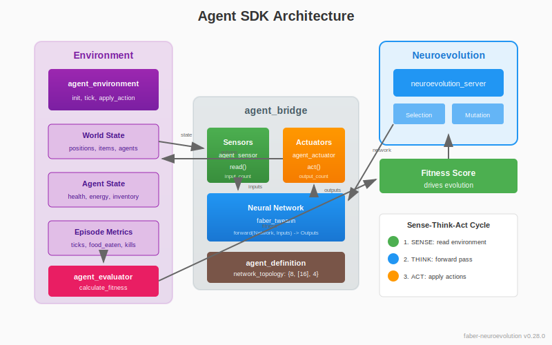

# Domain SDK Guide

Build neuroevolution domains by implementing behaviour callbacks. The Domain SDK provides a clean abstraction between your domain logic and the neural network evolution engine.

A **domain** is the complete definition of:
- **Agents** - what the neural network controls (sensors, actuators)
- **Environments** - where agents are evaluated
- **Evaluators** - how performance becomes fitness

## Overview

The Domain SDK consists of 8 modules:

| Module | Purpose | Type |
|--------|---------|------|
| `agent_definition` | Agent identity and network topology | Behaviour |
| `agent_sensor` | Read environment state | Behaviour |
| `agent_actuator` | Apply actions to environment | Behaviour |
| `agent_environment` | Episode lifecycle management | Behaviour |
| `agent_evaluator` | Calculate fitness from metrics | Behaviour |
| `agent_bridge` | Orchestrate sense-think-act cycle | API Module |
| `agent_trainer` | Train agents via neuroevolution | API Module |
| `bridge_evaluator` | Adapter for neuroevolution_server | Internal |



## Quick Start

### 1. Define Your Agent

```erlang
-module(my_agent).
-behaviour(agent_definition).

-export([name/0, version/0, network_topology/0]).

name() -> <<"my_game_agent">>.
version() -> {1, 0, 0}.

%% {Inputs, HiddenLayers, Outputs}
%% 8 sensors, two hidden layers (16, 8 neurons), 4 actions
network_topology() -> {8, [16, 8], 4}.
```

### 2. Implement Sensors

Sensors read environment state and produce neural network inputs.

```erlang
-module(my_sensor).
-behaviour(agent_sensor).

-export([name/0, input_count/0, read/2]).

name() -> <<"game_state_sensor">>.

%% Number of values this sensor produces (NN inputs)
input_count() -> 8.

%% Read environment state, return normalized values [0.0-1.0]
read(EnvState, _AgentState) ->
    #{
        position := {X, Y},
        health := Health,
        energy := Energy,
        nearby_enemies := Enemies,
        nearby_food := Food
    } = EnvState,

    %% Normalize all values to [0.0, 1.0]
    {ok, [
        X / 100.0,              %% X position (0-100 grid)
        Y / 100.0,              %% Y position
        Health / 100.0,         %% Health percentage
        Energy / 100.0,         %% Energy percentage
        length(Enemies) / 10.0, %% Enemy count (max 10)
        closest_distance(Enemies) / 50.0,
        length(Food) / 10.0,    %% Food count
        closest_distance(Food) / 50.0
    ]}.

closest_distance([]) -> 50.0;  %% Max distance if none
closest_distance(Items) ->
    lists:min([distance(I) || I <- Items]).
```

### 3. Implement Actuators

Actuators receive neural network outputs and apply actions to the environment.

```erlang
-module(my_actuator).
-behaviour(agent_actuator).

-export([name/0, output_count/0, act/3]).

name() -> <<"movement_actuator">>.

%% Number of NN outputs this actuator consumes
output_count() -> 4.

%% Convert NN outputs to environment actions
act(Outputs, EnvState, AgentState) ->
    [MoveX, MoveY, Attack, Eat] = Outputs,

    %% Interpret outputs as action probabilities
    Action = case max_index([MoveX, MoveY, Attack, Eat]) of
        0 -> {move, sign(MoveX - 0.5), 0};
        1 -> {move, 0, sign(MoveY - 0.5)};
        2 -> attack;
        3 -> eat
    end,

    {ok, Action, AgentState}.

max_index(List) ->
    {_, Index} = lists:max([{V, I} || {V, I} <- lists:zip(List, lists:seq(0, length(List)-1))]),
    Index.

sign(V) when V > 0 -> 1;
sign(V) when V < 0 -> -1;
sign(_) -> 0.
```

### 4. Implement Environment

The environment manages world state and episode lifecycle.

```erlang
-module(my_environment).
-behaviour(agent_environment).

-export([name/0, init/1, spawn_agent/2, tick/2,
         apply_action/3, is_terminal/2, extract_metrics/2]).

name() -> <<"arena_environment">>.

%% Initialize world state
init(Config) ->
    Width = maps:get(width, Config, 100),
    Height = maps:get(height, Config, 100),
    MaxTicks = maps:get(max_ticks, Config, 1000),

    {ok, #{
        width => Width,
        height => Height,
        max_ticks => MaxTicks,
        tick => 0,
        food => spawn_food(10, Width, Height),
        enemies => spawn_enemies(3, Width, Height)
    }}.

%% Add an agent to the world
spawn_agent(AgentId, EnvState) ->
    #{width := W, height := H} = EnvState,
    AgentState = #{
        id => AgentId,
        position => {rand:uniform(W), rand:uniform(H)},
        health => 100.0,
        energy => 100.0,
        food_eaten => 0,
        kills => 0
    },
    {ok, AgentState, EnvState}.

%% Advance world by one timestep
tick(EnvState, _Agents) ->
    #{tick := T} = EnvState,
    %% Move enemies, respawn food, etc.
    NewEnvState = EnvState#{tick => T + 1},
    {ok, NewEnvState}.

%% Apply agent action to world
apply_action(Action, AgentState, EnvState) ->
    case Action of
        {move, DX, DY} ->
            #{position := {X, Y}} = AgentState,
            NewPos = {clamp(X + DX, 0, 100), clamp(Y + DY, 0, 100)},
            {ok, AgentState#{position => NewPos}, EnvState};
        eat ->
            %% Try to eat nearby food
            try_eat(AgentState, EnvState);
        attack ->
            %% Try to attack nearby enemy
            try_attack(AgentState, EnvState)
    end.

%% Check if episode should end
is_terminal(AgentState, EnvState) ->
    #{health := Health} = AgentState,
    #{tick := Tick, max_ticks := MaxTicks} = EnvState,
    Health =< 0 orelse Tick >= MaxTicks.

%% Extract metrics for fitness calculation
extract_metrics(AgentState, EnvState) ->
    #{tick := Ticks} = EnvState,
    #{food_eaten := Food, kills := Kills, health := Health} = AgentState,

    #{
        ticks_survived => Ticks,
        food_eaten => Food,
        kills => Kills,
        final_health => Health
    }.

%% Helper functions
clamp(V, Min, Max) -> max(Min, min(Max, V)).
spawn_food(N, W, H) -> [{rand:uniform(W), rand:uniform(H)} || _ <- lists:seq(1, N)].
spawn_enemies(N, W, H) -> [{rand:uniform(W), rand:uniform(H)} || _ <- lists:seq(1, N)].
try_eat(AgentState, EnvState) -> {ok, AgentState, EnvState}.  %% Simplified
try_attack(AgentState, EnvState) -> {ok, AgentState, EnvState}.  %% Simplified
```

### 5. Implement Evaluator

The evaluator calculates fitness from episode metrics.

```erlang
-module(my_evaluator).
-behaviour(agent_evaluator).

-export([name/0, calculate_fitness/1, fitness_components/1]).

name() -> <<"survival_fitness">>.

calculate_fitness(Metrics) ->
    #{
        ticks_survived := Ticks,
        food_eaten := Food,
        kills := Kills,
        final_health := Health
    } = Metrics,

    %% Weighted fitness formula
    Ticks * 0.1 +          %% Survival bonus
    Food * 150.0 +         %% Food reward
    Kills * 100.0 +        %% Combat reward
    Health * 0.5.          %% Health bonus

%% Optional: breakdown for analysis
fitness_components(Metrics) ->
    #{
        ticks_survived := Ticks,
        food_eaten := Food,
        kills := Kills,
        final_health := Health
    } = Metrics,

    #{
        survival => Ticks * 0.1,
        foraging => Food * 150.0,
        combat => Kills * 100.0,
        health => Health * 0.5
    }.
```

### 6. Wire Everything Together

Use `agent_bridge` to orchestrate the components:

```erlang
%% Create bridge configuration
Config = #{
    definition => my_agent,
    sensors => [my_sensor],
    actuators => [my_actuator],
    environment => my_environment,
    evaluator => my_evaluator
},

%% Validate configuration
{ok, Bridge} = agent_bridge:new(Config),

%% Run a single episode
EnvConfig = #{width => 100, height => 100, max_ticks => 500},
Network = get_network_from_population(),  %% Your network

{ok, Fitness, Metrics} = agent_bridge:run_episode(Bridge, Network, EnvConfig).
```

## Key Concepts

### Neural Network Perspective

The naming follows the neural network's perspective:

- **Sensors produce inputs TO the network** - `input_count/0` is how many values flow into the NN
- **Actuators consume outputs FROM the network** - `output_count/0` is how many values the NN produces

```
Environment → [Sensor] → NN Inputs → [Neural Network] → NN Outputs → [Actuator] → Environment
                 ↑                                                        ↑
           input_count/0                                            output_count/0
```

### Topology Validation

The bridge validates that your configuration matches:

```erlang
%% If your definition says:
network_topology() -> {8, [16, 8], 4}.
                       ↑           ↑
                    8 inputs    4 outputs

%% Then your sensors must produce exactly 8 values total:
%% sensor1:input_count() + sensor2:input_count() + ... = 8

%% And your actuators must consume exactly 4 values total:
%% actuator1:output_count() + actuator2:output_count() + ... = 4
```

### Multiple Sensors/Actuators

You can compose multiple sensors and actuators:

```erlang
Config = #{
    definition => my_agent,
    sensors => [
        vision_sensor,      %% input_count() -> 5
        audio_sensor,       %% input_count() -> 2
        proprioception      %% input_count() -> 1
    ],                      %% Total: 8 inputs
    actuators => [
        movement_actuator,  %% output_count() -> 2
        attack_actuator     %% output_count() -> 2
    ],                      %% Total: 4 outputs
    environment => arena,
    evaluator => survival_evaluator
}.
```

The bridge automatically slices inputs/outputs to the correct ranges for each sensor/actuator.

### The Sense-Think-Act Cycle

Each tick of an episode follows this cycle:

```erlang
%% 1. SENSE: Read environment through all sensors
{ok, Inputs} = agent_bridge:sense(Bridge, EnvState, AgentState),
%% Inputs = [0.5, 0.3, 0.8, 0.1, 0.9, 0.2, 0.7, 0.4]  (8 values)

%% 2. THINK: Feed inputs through neural network
Outputs = nn:forward(Network, Inputs),
%% Outputs = [0.2, 0.8, 0.1, 0.6]  (4 values)

%% 3. ACT: Apply outputs through all actuators
{ok, Actions, NewAgentState} = agent_bridge:act(Bridge, Outputs, EnvState, AgentState),
%% Actions = [{move, 0, 1}, attack]

%% Or do all three in one call:
{ok, Actions, NewAgentState} = agent_bridge:sense_think_act(
    Bridge, Network, EnvState, AgentState
).
```

## Integration with Neuroevolution

### Simple Training with agent_trainer

The `agent_trainer` module provides the simplest way to train agents:

```erlang
%% 1. Create bridge with all components (evaluator required for training!)
{ok, Bridge} = agent_bridge:new(#{
    definition => my_agent,
    sensors => [my_sensor],
    actuators => [my_actuator],
    environment => my_environment,
    evaluator => my_evaluator
}),

%% 2. Train! Returns best network and stats
{ok, BestNetwork, Stats} = agent_trainer:train(Bridge, #{
    generations => 100,
    population_size => 50,
    env_config => #{max_ticks => 500}
}).
```

### Training Options

```erlang
Options = #{
    generations => 100,           %% Number of generations (default: 100)
    population_size => 50,        %% Population size (default: 100)
    env_config => #{},            %% Environment configuration
    episodes_per_eval => 3        %% Average over N episodes (default: 1)
}.
```

### Evaluating a Trained Network

```erlang
%% Run single episode
{ok, Fitness, Metrics} = agent_trainer:evaluate(Bridge, BestNetwork, EnvConfig).

%% Average over multiple episodes (for stochastic environments)
{ok, AvgFitness, AllMetrics} = agent_trainer:evaluate_many(Bridge, BestNetwork, EnvConfig, 10).
```

### Advanced: Manual Configuration

For more control, create the neuro_config directly:

```erlang
%% Create neuro_config from bridge
{ok, Config} = agent_trainer:to_neuro_config(Bridge, EnvConfig, #{
    population_size => 100,
    max_generations => 500
}),

%% Start and control evolution manually
{ok, Pid} = neuroevolution_server:start_link(Config),
neuroevolution_server:evolve(Pid, 100),
Stats = neuroevolution_server:get_stats(Pid),
Best = neuroevolution_server:get_best(Pid),
neuroevolution_server:stop(Pid).
```

### Using Domain Signals

Your environment can emit signals to influence the Liquid Conglomerate silos:

```erlang
%% In your environment's tick/2 or apply_action/3:
tick(EnvState, Agents) ->
    %% Emit ecological signals based on environment state
    FoodScarcity = calculate_food_scarcity(EnvState),
    signal_router:emit_from_domain(my_domain, [
        {ecological, resource_scarcity, FoodScarcity}
    ]),

    {ok, EnvState}.
```

See [Domain Signals Guide](domain-signals.md) for details.

## Best Practices

### Sensor Design

1. **Normalize all values to [0.0, 1.0]** - Neural networks work best with normalized inputs
2. **Keep sensors focused** - One sensor per conceptual input type (vision, audio, etc.)
3. **Consider relative vs absolute** - Relative positions to agent often work better than absolute coordinates

### Actuator Design

1. **Match output interpretation to activation** - If using tanh (-1 to 1), interpret accordingly
2. **Consider discrete vs continuous** - Use argmax for discrete actions, raw values for continuous
3. **Handle invalid actions gracefully** - Clamp or ignore out-of-bounds actions

### Environment Design

1. **Keep state minimal** - Only track what's needed for decisions
2. **Make episodes finite** - Always have terminal conditions (time limit, death, goal reached)
3. **Extract meaningful metrics** - Metrics drive fitness, so capture what matters

### Evaluator Design

1. **Reward intermediate progress** - Don't only reward final goals
2. **Balance multiple objectives** - Use weights to tune exploration vs exploitation
3. **Use fitness_components/1** - Helps debug and understand agent behavior

## Example: XOR Problem

A minimal example showing all components:

```erlang
%% xor_definition.erl
-module(xor_definition).
-behaviour(agent_definition).
-export([name/0, version/0, network_topology/0]).

name() -> <<"xor_solver">>.
version() -> {1, 0, 0}.
network_topology() -> {2, [4], 1}.  %% 2 inputs, 4 hidden, 1 output

%% xor_sensor.erl
-module(xor_sensor).
-behaviour(agent_sensor).
-export([name/0, input_count/0, read/2]).

name() -> <<"xor_inputs">>.
input_count() -> 2.
read(#{inputs := {A, B}}, _) -> {ok, [float(A), float(B)]}.

%% xor_actuator.erl
-module(xor_actuator).
-behaviour(agent_actuator).
-export([name/0, output_count/0, act/3]).

name() -> <<"xor_output">>.
output_count() -> 1.
act([Output], Env, Agent) ->
    Prediction = if Output > 0.5 -> 1; true -> 0 end,
    {ok, Prediction, Agent#{prediction => Prediction}}.

%% xor_environment.erl
-module(xor_environment).
-behaviour(agent_environment).
-export([name/0, init/1, spawn_agent/2, tick/2,
         apply_action/3, is_terminal/2, extract_metrics/2]).

name() -> <<"xor_test">>.

init(_) ->
    Cases = [{0,0,0}, {0,1,1}, {1,0,1}, {1,1,0}],
    {ok, #{cases => Cases, current => 0, correct => 0}}.

spawn_agent(Id, Env) ->
    {ok, #{id => Id, prediction => 0}, Env}.

tick(#{cases := Cases, current := I} = Env, _) ->
    {A, B, _} = lists:nth(I + 1, Cases),
    {ok, Env#{inputs => {A, B}}}.

apply_action(Prediction, Agent, #{cases := Cases, current := I, correct := C} = Env) ->
    {_, _, Expected} = lists:nth(I + 1, Cases),
    NewCorrect = if Prediction == Expected -> C + 1; true -> C end,
    {ok, Agent, Env#{current => I + 1, correct => NewCorrect}}.

is_terminal(_, #{cases := Cases, current := I}) ->
    I >= length(Cases).

extract_metrics(_, #{correct := C, cases := Cases}) ->
    #{correct => C, total => length(Cases)}.

%% xor_evaluator.erl
-module(xor_evaluator).
-behaviour(agent_evaluator).
-export([name/0, calculate_fitness/1]).

name() -> <<"xor_fitness">>.
calculate_fitness(#{correct := C, total := T}) ->
    C / T * 100.0.  %% 0-100 fitness
```

## See Also

- [Getting Started](getting-started.md) - Basic neuroevolution concepts
- [Evolution Strategies](evolution-strategies.md) - Different evolution approaches
- [Domain Signals](domain-signals.md) - Influencing silos from your domain
- [Liquid Conglomerate](liquid-conglomerate.md) - Self-tuning architecture
