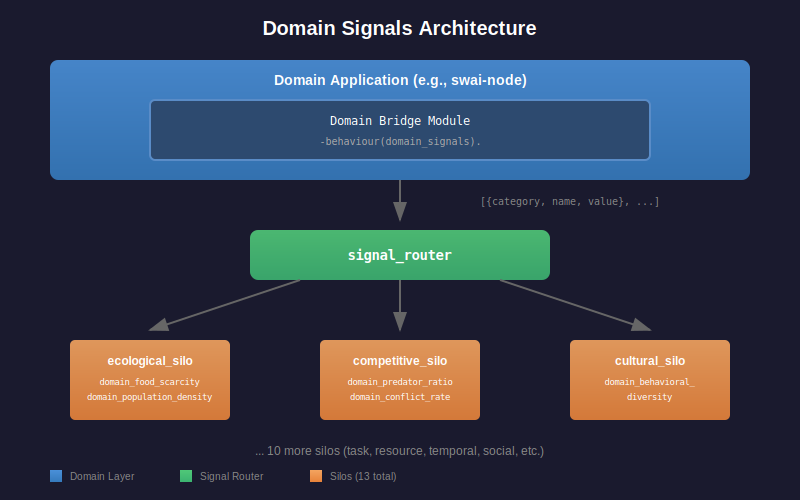

# Domain Signals Guide

Domain signals enable external applications to inform silo decision-making
by providing meta-level observations from the domain environment.

## Architecture Overview



## Domain vs Sensor Signals

| Aspect | Domain Sensors | Domain Signals |
|--------|----------------|----------------|
| **Target** | L0 networks (agents) | Silos (meta-controllers) |
| **Purpose** | Agent perception | Evolution tuning |
| **Example** | "I see food at 45 degrees" | "Food is scarce in the world" |
| **Level** | Individual agent | Population/environment |
| **Callback** | `read_sensors/1` | `emit_signals/2` |

## Signal Categories

Each category maps to a silo that handles that type of meta-information:

| Category | Silo | Example Signals |
|----------|------|-----------------|
| `ecological` | ecological_silo | food_scarcity, population_density, carrying_capacity |
| `competitive` | competitive_silo | predator_ratio, conflict_rate, dominance_hierarchy |
| `cultural` | cultural_silo | behavioral_diversity, meme_spread, innovation_rate |
| `social` | social_silo | group_cohesion, cooperation_level, trust_network |
| `temporal` | temporal_silo | seasonal_phase, time_pressure, episode_length |
| `task` | task_silo | task_difficulty, learning_progress, stagnation_risk |
| `resource` | resource_silo | compute_usage, memory_pressure, energy_cost |
| `distribution` | distribution_silo | node_load, network_latency, migration_rate |
| `morphological` | morphological_silo | topology_complexity, connection_density |
| `developmental` | developmental_silo | maturation_stage, growth_rate |
| `regulatory` | regulatory_silo | homeostatic_deviation, threshold_violations |
| `economic` | economic_silo | resource_trading, market_conditions |
| `communication` | communication_silo | signal_quality, message_rate |

## Implementing Domain Signals

### 1. Define Signal Spec

```erlang
-module(my_domain_bridge).
-behaviour(domain_signals).

-export([signal_spec/0, emit_signals/2]).

signal_spec() ->
    [#{name => food_scarcity,
       category => ecological,
       level => l0,
       range => {0.0, 1.0},
       description => "Food availability (0=abundant, 1=scarce)"},

     #{name => predator_ratio,
       category => competitive,
       level => l0,
       range => {0.0, 1.0},
       description => "Predator to prey ratio"},

     #{name => behavioral_diversity,
       category => cultural,
       level => l0,
       range => {0.0, 1.0},
       description => "Diversity of behavioral strategies"}].
```

### 2. Emit Signals

```erlang
emit_signals(DomainState, Metrics) ->
    %% Calculate food scarcity
    FoodCount = maps:get(food_count, DomainState, 0),
    MaxFood = maps:get(max_food, DomainState, 100),
    Scarcity = 1.0 - (FoodCount / max(1, MaxFood)),

    %% Calculate predator ratio
    Predators = maps:get(predator_count, Metrics, 0),
    Prey = maps:get(prey_count, Metrics, 1),
    Ratio = min(1.0, Predators / max(1, Prey)),

    %% Calculate behavioral diversity
    Behaviors = maps:get(unique_behaviors, Metrics, 1),
    PopSize = maps:get(population_size, Metrics, 1),
    Diversity = min(1.0, Behaviors / max(1, PopSize)),

    [{ecological, food_scarcity, Scarcity},
     {competitive, predator_ratio, Ratio},
     {cultural, behavioral_diversity, Diversity}].
```

### 3. Route Signals

Call from your evaluation loop:

```erlang
%% After evaluation completes
Signals = my_domain_bridge:emit_signals(DomainState, Metrics),
signal_router:route(Signals).
```

Or register the module and use convenience function:

```erlang
%% During application startup
signal_router:register_domain_module(my_domain_bridge).

%% During evaluation
signal_router:emit_from_domain(DomainState, Metrics).
```

## Signal Levels

Signals can target different levels of the meta-hierarchy:

- **L0**: Individual agent level signals (most signals)
- **L1**: Population level signals (aggregates)
- **L2**: Meta-learning level signals (long-term trends)

The level field in signal_spec helps document intended granularity,
though currently all signals route to the same silo infrastructure.

## How Silos Use Domain Signals

Domain signals arrive at silos with a `domain_` prefix:

```erlang
%% In ecological_silo
handle_cross_silo_signals(Signals, State) ->
    %% Domain signals appear as domain_food_scarcity, etc.
    FoodScarcity = maps:get(domain_food_scarcity, Signals, 0.5),

    %% Adjust carrying capacity based on food availability
    NewCarryingCapacity = case FoodScarcity > 0.7 of
        true -> reduce_carrying_capacity(State);
        false -> State
    end,

    {ok, NewCarryingCapacity}.
```

## Best Practices

1. **Normalize values to [0.0, 1.0]** - Silos expect normalized signals

2. **Use meaningful categories** - Route to the silo best equipped to act on the signal

3. **Emit signals after each evaluation** - Silos need fresh data to adapt

4. **Document signal semantics** - Use the description field to explain what values mean

5. **Start simple** - Begin with 2-3 key signals, add more as needed

## Example: 2D World Domain (swai-node)

```erlang
-module(swai_domain_bridge).
-behaviour(domain_signals).

signal_spec() ->
    [%% Ecological signals
     #{name => food_scarcity, category => ecological, level => l0,
       range => {0.0, 1.0}, description => "Food availability"},
     #{name => population_density, category => ecological, level => l0,
       range => {0.0, 1.0}, description => "Agents per unit area"},

     %% Competitive signals
     #{name => predator_ratio, category => competitive, level => l0,
       range => {0.0, 1.0}, description => "Predators vs prey"},
     #{name => conflict_rate, category => competitive, level => l0,
       range => {0.0, 1.0}, description => "Attack frequency"},

     %% Cultural signals (behavioral diversity)
     #{name => strategy_diversity, category => cultural, level => l0,
       range => {0.0, 1.0}, description => "Unique behavioral strategies"}].

emit_signals(WorldState, Metrics) ->
    %% Extract world data
    FoodCount = length(maps:get(food, WorldState, [])),
    MaxFood = maps:get(max_food, WorldState, 100),
    Agents = maps:get(agents, WorldState, []),
    WorldSize = maps:get(world_size, WorldState, {800, 600}),

    %% Calculate signals
    Scarcity = 1.0 - (FoodCount / max(1, MaxFood)),
    Density = length(Agents) / (element(1, WorldSize) * element(2, WorldSize) / 10000),
    PredRatio = calculate_predator_ratio(Agents),
    ConflictRate = maps:get(attacks_per_tick, Metrics, 0) / max(1, length(Agents)),
    StratDiv = calculate_strategy_diversity(Agents),

    [{ecological, food_scarcity, min(1.0, Scarcity)},
     {ecological, population_density, min(1.0, Density)},
     {competitive, predator_ratio, min(1.0, PredRatio)},
     {competitive, conflict_rate, min(1.0, ConflictRate)},
     {cultural, strategy_diversity, min(1.0, StratDiv)}].
```

## See Also

- [Domain SDK](domain-sdk.md) - Building neuroevolution domains
- [Silo Overview](silos/lc-overview.md) - Understanding silos
