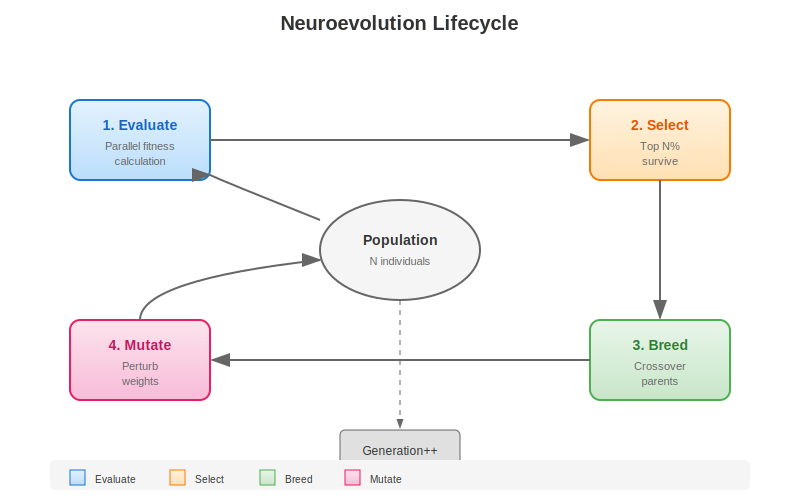
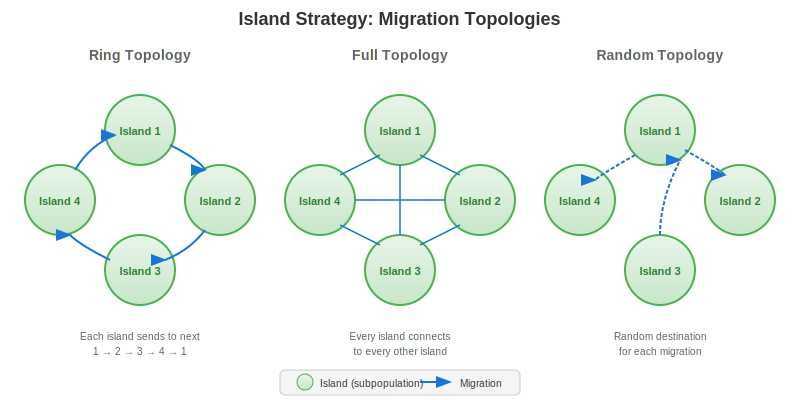
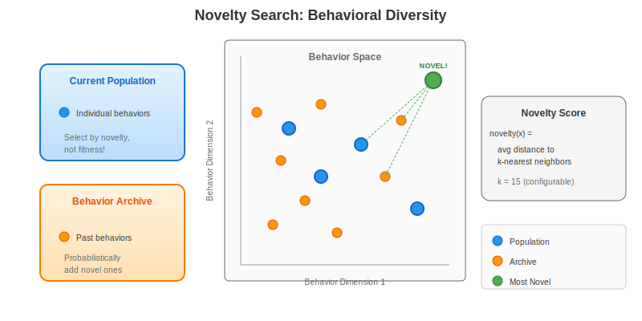
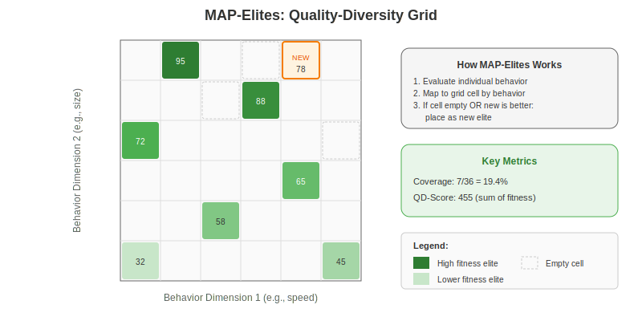

# Evolution Strategies Guide

This guide explains the pluggable evolution strategy system in `faber_neuroevolution`. The system supports multiple evolution algorithms through a common behaviour interface, allowing you to choose the best approach for your problem.

## Overview

Evolution strategies determine **how** the population evolves over time. Different strategies have different characteristics:



| Strategy | Description | Best For |
|----------|-------------|----------|
| `generational_strategy` | Classic generational GA | Simple problems, benchmarking |
| `steady_state_strategy` | Continuous replacement | Real-time adaptation, online learning |
| `island_strategy` | Parallel subpopulations | Complex fitness landscapes, diversity preservation |
| `novelty_strategy` | Novelty search | Deceptive problems, exploration |
| `map_elites_strategy` | MAP-Elites quality-diversity | Diverse solution discovery, coverage |

## Quick Start

### Using Generational Strategy (Default)

```erlang
Config = #neuro_config{
    population_size = 50,
    evaluations_per_individual = 10,
    selection_ratio = 0.20,
    mutation_rate = 0.10,
    mutation_strength = 0.3,
    network_topology = {42, [16, 8], 6},
    evaluator_module = my_evaluator
    %% No strategy_config = uses generational_strategy by default
}.

{ok, Server} = neuroevolution_server:start_link(Config).
```

### Using Steady-State Strategy

```erlang
Config = #neuro_config{
    population_size = 50,
    network_topology = {42, [16, 8], 6},
    evaluator_module = my_evaluator,
    strategy_config = #strategy_config{
        strategy_module = steady_state_strategy,
        strategy_params = #{
            replacement_count => 2,      %% Replace 2 individuals per cycle
            victim_selection => worst,   %% Remove lowest fitness
            max_age => 100               %% Force replacement after 100 evals
        }
    }
}.
```

### Using Island Strategy

```erlang
Config = #neuro_config{
    population_size = 100,  %% Overridden by island settings
    network_topology = {42, [16, 8], 6},
    evaluator_module = my_evaluator,
    strategy_config = #strategy_config{
        strategy_module = island_strategy,
        strategy_params = #{
            island_count => 4,
            population_per_island => 25,
            migration_interval => 50,
            migration_count => 2,
            migration_selection => best,
            topology => ring,
            island_strategy => generational_strategy,
            island_strategy_params => #{
                selection_ratio => 0.3
            }
        }
    }
}.
```

### Using Novelty Strategy

```erlang
Config = #neuro_config{
    population_size = 50,
    network_topology = {42, [16, 8], 6},
    evaluator_module = my_evaluator,  %% Must return behavior descriptors
    strategy_config = #strategy_config{
        strategy_module = novelty_strategy,
        strategy_params = #{
            archive_size => 1000,        %% Max archive size
            archive_probability => 0.10, %% Chance to add to archive
            k_nearest => 15,             %% Neighbors for novelty calc
            include_fitness => false,    %% Pure novelty (no fitness)
            fitness_weight => 0.0        %% Ignored if include_fitness=false
        }
    }
}.
```

### Using MAP-Elites Strategy

```erlang
Config = #neuro_config{
    population_size = 100,  %% Not used - batch_size controls evaluation
    network_topology = {42, [16, 8], 6},
    evaluator_module = my_evaluator,  %% Must return behavior descriptors
    strategy_config = #strategy_config{
        strategy_module = map_elites_strategy,
        strategy_params = #{
            behavior_dimensions => 2,           %% 2D behavior space
            bins_per_dimension => 20,           %% 20x20 = 400 cells
            behavior_bounds => [{0.0, 1.0}, {0.0, 1.0}],
            batch_size => 10,                   %% Evaluations per iteration
            random_probability => 0.10,         %% 10% random, 90% from elites
            mutation_strength => 0.3
        }
    }
}.
```

## Strategy Details

### Generational Strategy

The classic genetic algorithm approach where the entire population is evaluated, then selection and breeding produce a new generation.


**Parameters** (via `#generational_params{}` or map):

| Parameter | Default | Description |
|-----------|---------|-------------|
| `selection_method` | `top_n` | `top_n`, `tournament`, or `roulette` |
| `selection_ratio` | 0.20 | Fraction that survives (for top_n) |
| `tournament_size` | 3 | Size for tournament selection |
| `mutation_rate` | 0.10 | Probability of mutating each weight |
| `mutation_strength` | 0.3 | Magnitude of weight perturbation |
| `crossover_rate` | 0.75 | Probability of crossover vs mutation-only |
| `elitism` | true | Preserve best individual unchanged |
| `elite_count` | 1 | Number of elites to preserve |

**Lifecycle Events**:
- `individual_born` - When offspring are created
- `individual_died` - When individuals are eliminated
- `individual_evaluated` - After each fitness evaluation
- `cohort_evaluated` - When all individuals in generation are evaluated
- `breeding_complete` - After selection and breeding

**Best Practices**:
- Use for problems where you can evaluate all individuals in parallel
- Good baseline for comparing other strategies
- Elitism prevents losing the best solution

### Steady-State Strategy

Continuous evolution where only 1-N individuals are replaced per cycle. No distinct generations - evolution is ongoing.


**Parameters** (via `#steady_state_params{}` or map):

| Parameter | Default | Description |
|-----------|---------|-------------|
| `replacement_count` | 1 | Individuals replaced per cycle |
| `parent_selection` | `tournament` | `tournament`, `fitness_proportional`, `random` |
| `victim_selection` | `worst` | `worst`, `oldest`, `random`, `tournament` |
| `tournament_size` | 3 | Size for tournament selection |
| `mutation_rate` | 0.10 | Probability of mutating each weight |
| `mutation_strength` | 0.3 | Magnitude of weight perturbation |
| `max_age` | 0 | Force replacement after N evals (0 = disabled) |

**Lifecycle Events**:
- `individual_born` - When offspring are created
- `individual_died` - When victims are replaced
- `individual_evaluated` - After each fitness evaluation
- `steady_state_replacement` - When replacement cycle occurs

**Best Practices**:
- Use for real-time or online learning scenarios
- Good when evaluations are expensive (don't wait for whole generation)
- `max_age` prevents stagnation from old individuals

### Island Strategy

Meta-strategy that runs multiple isolated subpopulations with periodic migration. Maintains diversity and explores multiple fitness peaks.



**Parameters** (via `#island_params{}` or map):

| Parameter | Default | Description |
|-----------|---------|-------------|
| `island_count` | 4 | Number of islands |
| `population_per_island` | 25 | Individuals per island |
| `migration_interval` | 50 | Evaluations between migrations |
| `migration_count` | 2 | Migrants per event |
| `migration_selection` | `best` | `best`, `random`, `diverse` |
| `topology` | `ring` | `ring`, `full`, `random`, `custom` |
| `custom_connections` | [] | For custom topology |
| `island_strategy` | `generational_strategy` | Sub-strategy module |
| `island_strategy_params` | #{} | Sub-strategy parameters |

**Migration Topologies**:
- `ring` - Each island sends to next (1→2→3→4→1)
- `full` - Every island can send to every other
- `random` - Random destination for each migration
- `custom` - User-specified connections

**Lifecycle Events**:
- All sub-strategy events (tagged with `island_id` in metadata)
- `island_migration` - When individuals migrate

**Best Practices**:
- Use for complex problems with multiple local optima
- Different islands can explore different regions of the fitness landscape
- Migration spreads good solutions while maintaining diversity

### Novelty Strategy

Novelty Search replaces fitness-based selection with novelty-based selection. Instead of selecting the fittest individuals, it selects those with the most novel behaviors - behaviors different from the current population and an archive of past behaviors.



**Parameters** (via `#novelty_params{}` or map):

| Parameter | Default | Description |
|-----------|---------|-------------|
| `archive_size` | 1000 | Maximum archive size |
| `archive_probability` | 0.10 | Probability of adding to archive |
| `k_nearest` | 15 | Neighbors for novelty calculation |
| `include_fitness` | false | Enable hybrid mode |
| `fitness_weight` | 0.0 | Fitness weight in hybrid mode (0-1) |
| `novelty_threshold` | 0.0 | Minimum novelty for archive |
| `behavior_dimensions` | undefined | Expected behavior vector size |

**Behavior Descriptors**:

The evaluator must return a behavior descriptor in the metrics:
```erlang
#{fitness => 100.0, metrics => #{behavior => [1.0, 2.5, 3.7]}}
```

The behavior vector characterizes what the individual *did*, not how well it did:
- For a maze robot: final (x, y) position
- For a game AI: action frequencies, states visited
- For neural networks: activation patterns

**Lifecycle Events**:
- `individual_born` - When offspring are created
- `individual_died` - When individuals are eliminated
- `individual_evaluated` - After each evaluation (includes novelty score)
- `cohort_evaluated` - When all individuals evaluated

**Best Practices**:
- Use for deceptive problems where fitness gradients lead to local optima
- Behavior descriptors should capture meaningful behavioral differences
- Archive preserves behavioral diversity over time
- Hybrid mode (fitness_weight > 0) balances novelty and performance

### MAP-Elites Strategy

MAP-Elites is a quality-diversity algorithm that maintains a grid of elite solutions. Each cell corresponds to a region of behavior space and contains the highest-fitness individual whose behavior maps to that region.



**Parameters** (via `#map_elites_params{}` or map):

| Parameter | Default | Description |
|-----------|---------|-------------|
| `behavior_dimensions` | 2 | Number of behavior dimensions |
| `bins_per_dimension` | 10 | Discretization resolution |
| `behavior_bounds` | [] | Min/max for each dimension |
| `batch_size` | 10 | Evaluations per iteration |
| `random_probability` | 0.10 | Chance of random vs elite mutation |
| `mutation_rate` | 0.10 | Probability of weight mutation |
| `mutation_strength` | 0.3 | Magnitude of weight perturbation |

**Behavior Space**:

The grid divides behavior space into discrete cells:
- `behavior_dimensions = 2` with `bins_per_dimension = 10` creates 100 cells
- Each cell can hold one elite (the best individual for that behavior)
- Cells compete within their region, not globally

**Key Metrics**:
- **Coverage**: Fraction of cells occupied (diversity measure)
- **QD-Score**: Sum of all elite fitnesses (quality × diversity)

**Lifecycle Events**:
- `individual_born` - When new individuals are generated or elites placed
- `individual_died` - When individuals are rejected or replaced
- `individual_evaluated` - After each evaluation

**Best Practices**:
- Use when you want diverse, high-quality solutions
- Behavior bounds should be set based on expected behavioral range
- Higher bins = finer granularity but slower coverage
- Random probability helps escape local behavioral patterns

## Lifecycle Events

All strategies emit lifecycle events that can be subscribed to via `neuroevolution_events`:

```erlang
%% Subscribe to events
Realm = <<"my-realm">>,
Topic = neuroevolution_events:events_topic(Realm),
ok = neuroevolution_events:subscribe(Topic),

%% Receive events
receive
    {neuro_event, Topic, Event} ->
        handle_event(Event)
end.
```

### Universal Events (all strategies)

```erlang
#individual_born{
    id :: individual_id(),
    parent_ids :: [individual_id()],
    origin :: initial | crossover | mutation | migration,
    timestamp :: timestamp(),
    metadata :: map()  %% May include island_id, generation, etc.
}.

#individual_died{
    id :: individual_id(),
    reason :: selection_pressure | age_limit | replacement | ...,
    final_fitness :: float(),
    timestamp :: timestamp(),
    metadata :: map()
}.

#individual_evaluated{
    id :: individual_id(),
    fitness :: float(),
    metrics :: map(),
    timestamp :: timestamp(),
    metadata :: map()
}.
```

### Strategy-Specific Events

```erlang
%% Generational
#cohort_evaluated{generation, best_fitness, avg_fitness, ...}.
#breeding_complete{generation, survivor_count, offspring_count, ...}.

%% Steady-State
#steady_state_replacement{replaced_ids, offspring_ids, best_fitness, ...}.

%% Island
#island_migration{individual_id, from_island, to_island, fitness, ...}.
```

## Meta-Controller Integration

All strategies support the meta-controller interface for adaptive hyperparameter tuning:

```erlang
%% Get normalized inputs (0-1 range) for meta-controller
Inputs = evolution_strategy:get_meta_inputs(Module, State).
%% Returns: [diversity, improvement_gap, mutation_rate, ...]

%% Apply parameter adjustments
NewState = evolution_strategy:apply_meta_params(Module, #{
    mutation_rate => 0.15,
    mutation_strength => 0.25
}, State).
```

## Creating Custom Strategies

Implement the `evolution_strategy` behaviour:

```erlang
-module(my_strategy).
-behaviour(evolution_strategy).

-export([
    init/1,
    handle_evaluation_result/3,
    tick/1,
    get_population_snapshot/1,
    get_meta_inputs/1,
    apply_meta_params/2,
    terminate/2
]).

init(Config) ->
    %% Initialize population and state
    %% Returns: {ok, State, [lifecycle_event()]}
    ...

handle_evaluation_result(IndividualId, FitnessResult, State) ->
    %% Process evaluation, update state, maybe breed
    %% Returns: {[action()], [event()], NewState}
    ...

tick(State) ->
    %% Periodic maintenance (age culling, etc.)
    %% Returns: {[action()], [event()], NewState}
    ...

get_population_snapshot(State) ->
    %% Return population_snapshot() map
    ...

get_meta_inputs(State) ->
    %% Return [float()] normalized inputs for meta-controller
    ...

apply_meta_params(MetaParams, State) ->
    %% Apply parameter updates, return new state
    ...

terminate(Reason, State) ->
    %% Cleanup
    ok.
```

## Testing with Mock Networks

For unit testing without the full `faber_tweann` dependency, use `mock_network_factory`:

```erlang
TestConfig = #{
    neuro_config => #neuro_config{...},
    strategy_params => #{...},
    network_factory => mock_network_factory  %% Use mock for testing
}.

{ok, State, Events} = generational_strategy:init(TestConfig).
```

The `network_factory` interface provides:
- `create_feedforward/1` - Create new network
- `mutate/2` - Mutate network weights
- `crossover/2` - Crossover two networks

## Performance Considerations

1. **Generational Strategy**: Best when you can parallelize all evaluations
2. **Steady-State Strategy**: Lower memory, better for expensive evaluations
3. **Island Strategy**: Overhead from managing multiple sub-strategies, but better exploration
4. **Novelty Strategy**: Archive operations add O(k*n) overhead per evaluation; good for exploration
5. **MAP-Elites Strategy**: Memory scales with grid size (bins^dimensions); best for behavior space coverage

## Further Reading

- `guides/meta-controller.md` - Adaptive hyperparameter tuning
- `guides/custom-evaluator.md` - Creating fitness evaluators
- `include/evolution_strategy.hrl` - Type definitions and parameter records
- `include/lifecycle_events.hrl` - Event record definitions
