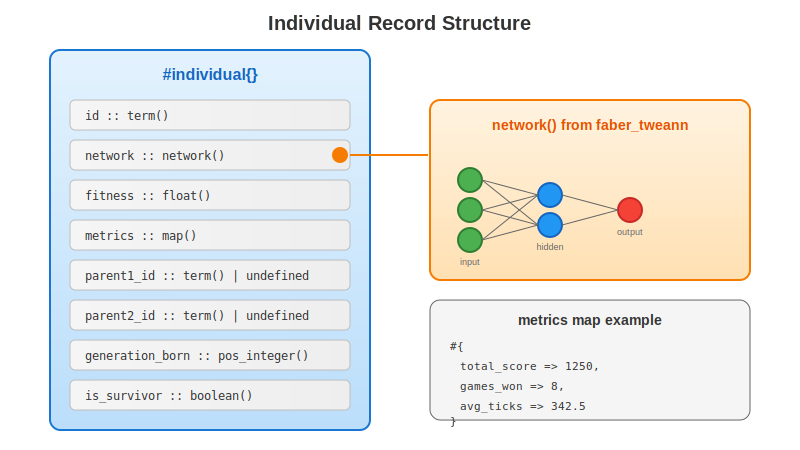

# Getting Started

This guide will help you set up `faber_neuroevolution` and run your first evolutionary training session.

## Installation

Add to your `rebar.config`:

```erlang
{deps, [
    {faber_neuroevolution, "~> 0.12.0"}
]}.
```

Then fetch dependencies:

```bash
rebar3 get-deps
rebar3 compile
```

## Quick Start

### 1. Define Your Evaluator

Create a module implementing the `neuroevolution_evaluator` behaviour. Each individual in the population has the following structure:



```erlang
-module(my_evaluator).
-behaviour(neuroevolution_evaluator).

-include_lib("faber_neuroevolution/include/neuroevolution.hrl").

-export([evaluate/2, calculate_fitness/1]).

%% Required: Evaluate an individual
evaluate(Individual, _Options) ->
    Network = Individual#individual.network,

    %% Run your domain-specific evaluation
    %% This is where you test the network on your task
    Score = run_my_task(Network),

    %% Return updated individual with metrics
    UpdatedIndividual = Individual#individual{
        metrics = #{score => Score}
    },
    {ok, UpdatedIndividual}.

%% Required: Calculate fitness from metrics
calculate_fitness(Metrics) ->
    maps:get(score, Metrics, 0.0).

%% Your domain logic
run_my_task(Network) ->
    %% Example: Test network on 10 random inputs
    Inputs = [[rand:uniform() || _ <- lists:seq(1, 42)] || _ <- lists:seq(1, 10)],
    Outputs = [network_evaluator:propagate(Network, I) || I <- Inputs],

    %% Calculate a score based on outputs
    %% (Replace with your actual task evaluation)
    lists:sum([lists:sum(O) || O <- Outputs]).
```

### 2. Configure and Start Training

```erlang
%% Include the records
-include_lib("faber_neuroevolution/include/neuroevolution.hrl").

%% Create configuration
Config = #neuro_config{
    population_size = 50,
    selection_ratio = 0.20,
    mutation_rate = 0.10,
    mutation_strength = 0.3,
    network_topology = {42, [16, 8], 6},  % 42 inputs, 2 hidden layers, 6 outputs
    evaluator_module = my_evaluator,
    evaluator_options = #{}
},

%% Start the server
{ok, Pid} = neuroevolution_server:start_link(Config),

%% Begin training
{ok, started} = neuroevolution_server:start_training(Pid).
```

### 3. Monitor Progress

```erlang
%% Get current statistics
{ok, Stats} = neuroevolution_server:get_stats(Pid),
io:format("Generation: ~p, Best: ~.2f, Avg: ~.2f~n", [
    maps:get(generation, Stats),
    maps:get(best_fitness, Stats),
    maps:get(avg_fitness, Stats)
]).

%% Get current population
{ok, Population} = neuroevolution_server:get_population(Pid),
BestIndividual = hd(lists:sort(
    fun(A, B) -> A#individual.fitness >= B#individual.fitness end,
    Population
)).
```

### 4. Stop Training

```erlang
%% Stop training (keeps population)
ok = neuroevolution_server:stop_training(Pid),

%% Or stop the server entirely
gen_server:stop(Pid).
```

## Using the Supervisor

For production use, start servers through the supervisor:

```erlang
%% Ensure the application is started
application:ensure_all_started(faber_neuroevolution),

%% Start a server through the supervisor
{ok, Pid} = faber_neuroevolution_sup:start_server(Config),

%% Stop through supervisor
ok = faber_neuroevolution_sup:stop_server(Pid).
```

## Event Handling

Subscribe to training events for real-time updates:

```erlang
-module(my_event_handler).
-export([handle_event/2]).

handle_event({generation_started, Gen}, State) ->
    io:format("Generation ~p started~n", [Gen]),
    State;
handle_event({generation_complete, Stats}, State) ->
    io:format("Gen ~p: Best=~.2f, Avg=~.2f~n", [
        Stats#generation_stats.generation,
        Stats#generation_stats.best_fitness,
        Stats#generation_stats.avg_fitness
    ]),
    State;
handle_event({training_started, _Config}, State) ->
    io:format("Training started!~n"),
    State;
handle_event({training_stopped, Gen}, State) ->
    io:format("Training stopped at generation ~p~n", [Gen]),
    State;
handle_event(_Event, State) ->
    State.
```

Configure with:

```erlang
Config = #neuro_config{
    %% ... other options ...
    event_handler = {my_event_handler, initial_state}
}.
```

## Configuration Reference

| Parameter | Default | Description |
|-----------|---------|-------------|
| `population_size` | 50 | Number of individuals in population |
| `evaluations_per_individual` | 10 | Evaluations per individual per generation |
| `selection_ratio` | 0.20 | Fraction surviving selection (top 20%) |
| `mutation_rate` | 0.10 | Probability of mutating each weight |
| `mutation_strength` | 0.3 | Magnitude of weight perturbation |
| `max_generations` | infinity | Maximum generations to run |
| `network_topology` | - | `{InputSize, HiddenLayers, OutputSize}` |
| `evaluator_module` | - | Module implementing `neuroevolution_evaluator` |
| `evaluator_options` | `#{}` | Options passed to evaluator |
| `event_handler` | `undefined` | `{Module, InitArg}` for event callbacks |

## Next Steps

- See [Custom Evaluators](custom-evaluator.md) for detailed evaluator implementation
- Check module documentation for API details
- Review `neuroevolution_genetic` for crossover/mutation algorithms
- Review `neuroevolution_selection` for selection strategies
