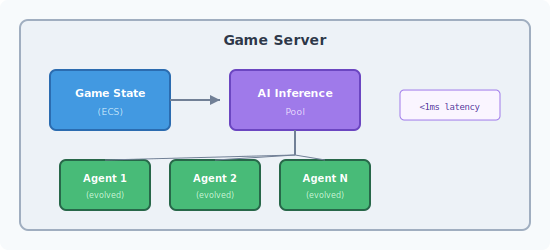
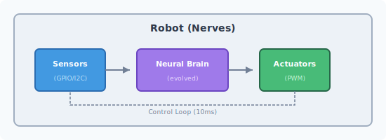
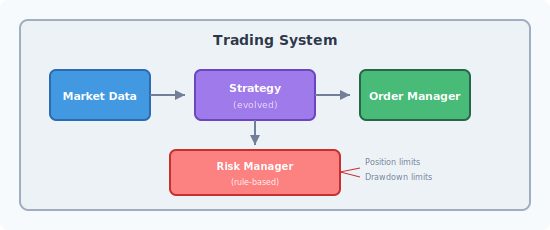
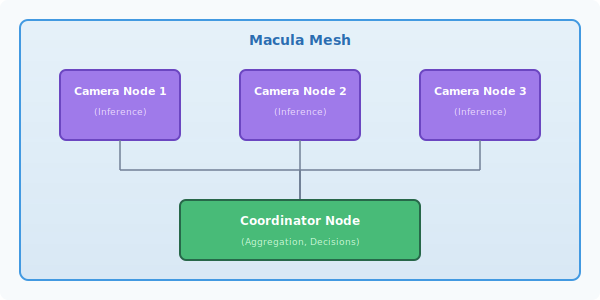

# Inference Scenarios

This guide covers production deployment patterns for evolved neural networks, from simple single-node inference to complex distributed systems.

## Scenario 1: Real-Time Game AI

Deploy evolved agents for real-time game decisions.

### Architecture



### Implementation

```erlang
-module(game_ai_pool).
-behaviour(gen_server).

-export([start_link/1, get_action/2]).

-record(state, {
    networks :: #{agent_id() => network()},
    config :: map()
}).

start_link(Config) ->
    gen_server:start_link({local, ?MODULE}, ?MODULE, Config, []).

init(Config) ->
    Networks = load_evolved_networks(Config),
    {ok, #state{networks = Networks, config = Config}}.

%% Called every game tick for each AI agent
get_action(AgentId, GameState) ->
    gen_server:call(?MODULE, {get_action, AgentId, GameState}).

handle_call({get_action, AgentId, GameState}, _From, State) ->
    Network = maps:get(AgentId, State#state.networks),
    Inputs = game_state_to_inputs(GameState),

    %% Neural network inference
    Outputs = network_evaluator:evaluate(Network, Inputs),
    Action = outputs_to_action(Outputs),

    {reply, Action, State}.

%% Convert game state to network inputs
game_state_to_inputs(GameState) ->
    [
        GameState#game_state.player_x / 800.0,      % Normalized position
        GameState#game_state.player_y / 600.0,
        GameState#game_state.velocity_x / 100.0,
        GameState#game_state.velocity_y / 100.0,
        % ... more sensor inputs
    ].

%% Convert network outputs to game action
outputs_to_action(Outputs) ->
    [MoveX, MoveY, Action1, Action2, Jump, Attack] = Outputs,
    #{
        move => {MoveX, MoveY},
        jump => Jump > 0.5,
        attack => Attack > 0.5,
        action => select_action(Action1, Action2)
    }.
```

### Optimization Tips

1. **Batch inference**: Process multiple agents together
2. **Network caching**: Keep hot networks in ETS
3. **Async updates**: Update networks without blocking inference

```erlang
%% Batch inference for multiple agents
batch_get_actions(AgentStates) ->
    Inputs = [game_state_to_inputs(S) || S <- AgentStates],
    %% Process all networks in parallel
    Outputs = pmap(fun({Id, Input}) ->
        Network = get_network(Id),
        network_evaluator:evaluate(Network, Input)
    end, lists:zip(AgentIds, Inputs)),
    lists:map(fun outputs_to_action/1, Outputs).
```

## Scenario 2: Autonomous Robot Control

Deploy evolved controllers to physical robots.

### Architecture



### Implementation (Elixir/Nerves)

```elixir
defmodule Robot.Brain do
  use GenServer
  require Logger

  @control_loop_ms 10  # 100Hz control loop
  @network_path "/data/evolved_controller.etf"

  def start_link(opts) do
    GenServer.start_link(__MODULE__, opts, name: __MODULE__)
  end

  def init(_opts) do
    network = load_network(@network_path)

    # Start the control loop
    schedule_tick()

    {:ok, %{
      network: network,
      last_outputs: [0.0, 0.0, 0.0, 0.0],  # Initial motor values
      sensor_history: []
    }}
  end

  def handle_info(:tick, state) do
    # 1. Read sensors
    sensors = read_all_sensors()

    # 2. Preprocess inputs (normalize, add history)
    inputs = preprocess_inputs(sensors, state.sensor_history)

    # 3. Neural network inference
    outputs = :network_evaluator.evaluate(state.network, inputs)

    # 4. Apply outputs to actuators (with safety limits)
    safe_outputs = apply_safety_limits(outputs)
    apply_to_actuators(safe_outputs)

    # 5. Schedule next tick
    schedule_tick()

    {:noreply, %{state |
      last_outputs: safe_outputs,
      sensor_history: update_history(state.sensor_history, sensors)
    }}
  end

  defp schedule_tick do
    Process.send_after(self(), :tick, @control_loop_ms)
  end

  defp read_all_sensors do
    %{
      imu: IMU.read_accel_gyro(),
      distance: [
        DistanceSensor.read(:front),
        DistanceSensor.read(:left),
        DistanceSensor.read(:right)
      ],
      encoders: [
        Encoder.read(:left_wheel),
        Encoder.read(:right_wheel)
      ]
    }
  end

  defp preprocess_inputs(sensors, history) do
    # Combine current readings with recent history for temporal context
    current = [
      # IMU (6 values)
      sensors.imu.accel_x / 16.0,
      sensors.imu.accel_y / 16.0,
      sensors.imu.accel_z / 16.0,
      sensors.imu.gyro_x / 2000.0,
      sensors.imu.gyro_y / 2000.0,
      sensors.imu.gyro_z / 2000.0,
      # Distance sensors (3 values)
      min(sensors.distance.front / 200.0, 1.0),
      min(sensors.distance.left / 200.0, 1.0),
      min(sensors.distance.right / 200.0, 1.0),
      # Wheel encoders (2 values)
      sensors.encoders.left / 1000.0,
      sensors.encoders.right / 1000.0
    ]

    # Add temporal context from history
    history_inputs = flatten_history(history, 3)  # Last 3 readings

    current ++ history_inputs
  end

  defp apply_safety_limits(outputs) do
    [left_motor, right_motor, arm_angle, gripper] = outputs

    [
      clamp(left_motor, -1.0, 1.0),
      clamp(right_motor, -1.0, 1.0),
      clamp(arm_angle, 0.0, 1.0),
      if(gripper > 0.5, do: 1.0, else: 0.0)  # Binary gripper
    ]
  end

  defp apply_to_actuators([left, right, arm, gripper]) do
    Motor.set_speed(:left, left)
    Motor.set_speed(:right, right)
    Servo.set_angle(:arm, arm * 180.0)
    Gripper.set(if gripper > 0.5, do: :closed, else: :open)
  end
end
```

### Hot-Loading Updated Networks

```elixir
defmodule Robot.NetworkUpdater do
  use GenServer

  def start_link(opts) do
    GenServer.start_link(__MODULE__, opts, name: __MODULE__)
  end

  # Called when a new trained network is available
  def update_network(network_binary) do
    GenServer.cast(__MODULE__, {:update, network_binary})
  end

  def handle_cast({:update, binary}, state) do
    # Validate new network first
    network = :erlang.binary_to_term(binary)

    case validate_network(network) do
      :ok ->
        # Atomically swap the network
        Robot.Brain.swap_network(network)
        Logger.info("Network updated successfully")
        {:noreply, state}

      {:error, reason} ->
        Logger.warning("Network validation failed: #{reason}")
        {:noreply, state}
    end
  end

  defp validate_network(network) do
    # Check topology matches expected
    # Run test inputs and verify reasonable outputs
    # etc.
  end
end
```

## Scenario 3: Trading Strategy Execution

Deploy evolved trading strategies with risk management.

### Architecture



### Implementation

```erlang
-module(trading_strategy).
-behaviour(gen_server).

-record(state, {
    network :: network(),
    position :: float(),
    equity :: float(),
    max_drawdown :: float(),
    trade_history :: [trade()]
}).

start_link(Config) ->
    gen_server:start_link({local, ?MODULE}, ?MODULE, Config, []).

init(Config) ->
    Network = load_evolved_strategy(Config),
    {ok, #state{
        network = Network,
        position = 0.0,
        equity = maps:get(initial_equity, Config, 100000.0),
        max_drawdown = maps:get(max_drawdown, Config, 0.10)
    }}.

%% Called on each market tick
handle_info({market_tick, MarketData}, State) ->
    %% 1. Prepare network inputs from market data
    Inputs = market_data_to_inputs(MarketData, State),

    %% 2. Get trading signal from evolved network
    Outputs = network_evaluator:evaluate(State#state.network, Inputs),
    Signal = interpret_trading_signal(Outputs),

    %% 3. Apply risk management (CRITICAL - never skip!)
    SafeSignal = apply_risk_limits(Signal, State),

    %% 4. Execute trade if needed
    NewState = maybe_execute_trade(SafeSignal, MarketData, State),

    {noreply, NewState};

%% Emergency stop - close all positions
handle_cast(emergency_stop, State) ->
    close_all_positions(State),
    {noreply, State#state{position = 0.0}}.

market_data_to_inputs(MarketData, State) ->
    #market_data{
        price = Price,
        volume = Volume,
        bid_ask_spread = Spread,
        returns = Returns,          % Last N returns
        volatility = Volatility
    } = MarketData,

    [
        %% Price features
        normalize_price(Price),
        normalize_volume(Volume),
        Spread / Price,

        %% Technical indicators (pre-computed)
        lists:nth(1, Returns),      % Return t-1
        lists:nth(2, Returns),      % Return t-2
        lists:nth(3, Returns),      % Return t-3
        Volatility,

        %% Position context
        State#state.position / max_position(),
        (State#state.equity - initial_equity()) / initial_equity()
    ].

interpret_trading_signal([PositionTarget, Confidence]) ->
    #{
        target_position => (PositionTarget * 2.0) - 1.0,  % Map [0,1] to [-1,1]
        confidence => Confidence
    }.

%% CRITICAL: Risk management rules (never evolved, always enforced)
apply_risk_limits(Signal, State) ->
    #{target_position := Target, confidence := Conf} = Signal,

    %% Rule 1: Max position size
    LimitedTarget = max(-1.0, min(1.0, Target)),

    %% Rule 2: Drawdown limit
    CurrentDrawdown = calculate_drawdown(State),
    case CurrentDrawdown > State#state.max_drawdown of
        true ->
            %% Reduce position proportionally
            Reduction = 1.0 - (CurrentDrawdown / State#state.max_drawdown),
            Signal#{target_position := LimitedTarget * Reduction};
        false ->
            Signal#{target_position := LimitedTarget}
    end;

    %% Rule 3: Minimum confidence threshold
    case Conf < 0.3 of
        true -> Signal#{target_position := State#state.position};  % No change
        false -> Signal
    end.
```

## Scenario 4: Edge AI with Macula Mesh

Distribute inference across a mesh of edge devices.

### Architecture



### Implementation

```erlang
-module(edge_inference_node).
-behaviour(gen_server).

%% Subscribe to inference requests, publish results
-define(INFERENCE_TOPIC, <<"ai.inference.requests">>).
-define(RESULTS_TOPIC, <<"ai.inference.results">>).

start_link(Config) ->
    gen_server:start_link({local, ?MODULE}, ?MODULE, Config, []).

init(Config) ->
    %% Load evolved network
    Network = load_network(Config),

    %% Subscribe to inference requests via Macula PubSub
    macula_pubsub:subscribe(?INFERENCE_TOPIC),

    %% Register as inference provider
    macula_dht:register_service(#{
        type => <<"inference">>,
        model => maps:get(model_name, Config),
        node => node()
    }),

    {ok, #{network => Network, stats => #{inferences => 0}}}.

%% Handle inference request from mesh
handle_info({macula_event, ?INFERENCE_TOPIC, Request}, State) ->
    #{
        request_id := RequestId,
        inputs := Inputs,
        reply_to := ReplyNode
    } = Request,

    %% Run inference
    StartTime = erlang:monotonic_time(microsecond),
    Outputs = network_evaluator:evaluate(maps:get(network, State), Inputs),
    InferenceTime = erlang:monotonic_time(microsecond) - StartTime,

    %% Publish result
    Result = #{
        request_id => RequestId,
        outputs => Outputs,
        inference_time_us => InferenceTime,
        node => node()
    },

    case ReplyNode of
        broadcast ->
            macula_pubsub:publish(?RESULTS_TOPIC, Result);
        Node ->
            macula_rpc:call(Node, <<"inference.result">>, Result)
    end,

    %% Update stats
    NewStats = increment_stat(inferences, maps:get(stats, State)),
    {noreply, State#{stats := NewStats}};

%% Handle network update pushed from training cluster
handle_info({network_update, NewNetwork}, State) ->
    %% Validate before accepting
    case validate_network(NewNetwork) of
        ok ->
            {noreply, State#{network := NewNetwork}};
        {error, _Reason} ->
            {noreply, State}
    end.

%% Coordinator: distribute inference across nodes
-module(inference_coordinator).

distribute_inference(Inputs, Opts) ->
    %% Find available inference nodes
    Nodes = macula_dht:find_services(#{type => <<"inference">>}),

    %% Select best node (lowest latency, lowest load)
    BestNode = select_best_node(Nodes),

    %% Send request
    RequestId = make_ref(),
    macula_rpc:call(BestNode, <<"inference.run">>, #{
        request_id => RequestId,
        inputs => Inputs
    }),

    %% Wait for result with timeout
    receive
        {inference_result, RequestId, Result} ->
            {ok, Result}
    after maps:get(timeout, Opts, 1000) ->
        {error, timeout}
    end.

%% Load balancing: round-robin with health checks
select_best_node(Nodes) ->
    HealthyNodes = [N || N <- Nodes, is_healthy(N)],
    case HealthyNodes of
        [] -> error(no_healthy_nodes);
        _ -> lists:nth(rand:uniform(length(HealthyNodes)), HealthyNodes)
    end.
```

## Scenario 5: Multi-Model Ensemble

Combine multiple evolved networks for robust decisions.

```erlang
-module(ensemble_inference).

%% Run multiple evolved networks and combine results
ensemble_predict(Inputs, Networks, CombineStrategy) ->
    %% Run all networks in parallel
    Predictions = pmap(fun(Network) ->
        network_evaluator:evaluate(Network, Inputs)
    end, Networks),

    %% Combine predictions
    case CombineStrategy of
        average ->
            average_predictions(Predictions);
        voting ->
            majority_vote(Predictions);
        weighted ->
            weighted_average(Predictions, get_weights(Networks));
        stacking ->
            %% Meta-network combines predictions
            MetaInputs = lists:flatten(Predictions),
            MetaNetwork = get_meta_network(),
            network_evaluator:evaluate(MetaNetwork, MetaInputs)
    end.

average_predictions(Predictions) ->
    NumPreds = length(Predictions),
    NumOutputs = length(hd(Predictions)),

    [lists:sum([lists:nth(I, P) || P <- Predictions]) / NumPreds
     || I <- lists:seq(1, NumOutputs)].

majority_vote(Predictions) ->
    %% For classification: each network votes for a class
    Votes = [argmax(P) || P <- Predictions],
    Counts = count_votes(Votes),
    argmax_map(Counts).
```

## Performance Optimization

### Inference Latency Targets

| Scenario | Target Latency | Strategy |
|----------|---------------|----------|
| Game AI | < 1ms | Pre-compiled, batched |
| Robot Control | < 10ms | Native code, no GC |
| Trading | < 100us | FPGA/GPU, co-location |
| Edge IoT | < 50ms | Quantized, edge TPU |

### Tips

1. **Profile first**: Use `fprof` or `eflame` to find bottlenecks
2. **Avoid allocations**: Reuse buffers in hot paths
3. **Batch when possible**: Amortize overhead across multiple inferences
4. **Consider NIFs**: For ultra-low-latency, use Rust NIFs
5. **Quantize**: Use INT8 weights for embedded deployment

## Related Guides

- [Interoperability](interoperability.md) - Export formats and cross-language deployment
- [Swarm Robotics](swarm-robotics.md) - Coordinated autonomous systems
- [LTC Meta-Controller](meta-controller.md) - Adaptive training
