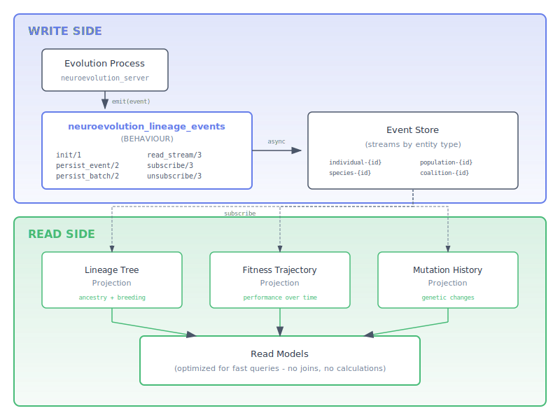

# Lineage Tracking

This guide explains the lineage event system for persistent genealogy tracking in neuroevolution.

## Overview

Lineage tracking captures the complete evolutionary history of individuals, species, and populations. It enables:

- **Ancestry Analysis**: Trace any individual back through generations
- **Breeding Trees**: Visualize parent-offspring relationships
- **Mutation History**: Track all genetic modifications over time
- **Fitness Trajectories**: Analyze performance evolution
- **Knowledge Transfer**: Record learning and mentorship events


## Architecture

Lineage tracking follows CQRS (Command Query Responsibility Segregation) principles:



### Key Principles

1. **Event Store = Write Only**: The `neuroevolution_lineage_events` behaviour handles persisting events and reading raw event streams
2. **Projections = Read Models**: Breeding trees, fitness trajectories, and mutation histories are built by projection modules
3. **Subscriptions for Real-time**: Projections subscribe to event streams to update read models in real-time
4. **No Derived Queries in Store**: The event store never joins, calculates, or aggregates - it only stores and retrieves raw events

### Behaviour Definition

The `neuroevolution_lineage_events` behaviour defines a minimal, performance-focused API:

```erlang
-module(neuroevolution_lineage_events).

-callback init(Config :: map()) ->
    {ok, State :: term()} | {error, Reason :: term()}.

%% Fire-and-forget: MUST return immediately, use async I/O internally
-callback persist_event(Event :: event(), State :: term()) -> ok.

%% Fire-and-forget: MUST return immediately, use async I/O internally
-callback persist_batch(Events :: [event()], State :: term()) -> ok.

%% May block - only use for recovery/replay, not during evolution
-callback read_stream(StreamId :: stream_id(), Opts :: read_opts(), State :: term()) ->
    {ok, Events :: [event()]} | {error, Reason :: term()}.

-callback subscribe(StreamId :: stream_id(), Pid :: pid(), State :: term()) ->
    ok | {error, Reason :: term()}.

-callback unsubscribe(StreamId :: stream_id(), Pid :: pid(), State :: term()) ->
    ok | {error, Reason :: term()}.
```

**Performance Design**: Lineage tracking MUST NEVER block the evolution loop:
- `persist_event/2` and `persist_batch/2` return `ok` immediately
- I/O happens asynchronously in spawned processes
- Errors are logged, not propagated (fire-and-forget)
- Under extreme load, events may be lost (acceptable trade-off)

**Architecture Note**: The behaviour handles raw event store operations only. Derived queries (breeding trees, fitness trajectories, mutation history) should be implemented as projections that subscribe to event streams and maintain their own read models.

### Stream Design

Events are routed to streams based on entity type:

| Stream Pattern | Events |
|----------------|--------|
| `individual-{id}` | Birth, death, fitness, mutations, knowledge transfer |
| `species-{id}` | Speciation, lineage divergence/merge |
| `population-{id}` | Generation, capacity, catastrophe |
| `coalition-{id}` | Coalition lifecycle |

## Event Categories

### Birth Events

Record how individuals come into existence:

```erlang
-include_lib("faber_neuroevolution/include/lineage_events.hrl").

%% Sexual reproduction
BirthEvent = #offspring_born{
    individual_id = <<"ind-001">>,
    parent_ids = [<<"parent-1">>, <<"parent-2">>],
    species_id = <<"species-alpha">>,
    generation = 42,
    inherited_marks = [<<"stress_adaptation">>]
}.

%% First generation
PioneerEvent = #pioneer_spawned{
    individual_id = <<"ind-pioneer">>,
    species_id = <<"species-alpha">>,
    generation = 0
}.

%% Asexual reproduction
CloneEvent = #clone_produced{
    individual_id = <<"ind-clone">>,
    parent_id = <<"ind-001">>,
    mutation_applied = true
}.
```

### Death Events

Track how individuals exit the population:

```erlang
%% Selection pressure
CulledEvent = #individual_culled{
    individual_id = <<"ind-weak">>,
    final_fitness = 0.23,
    culling_reason = selection,
    age_at_death = 15
}.

%% Natural lifespan
ExpiredEvent = #lifespan_expired{
    individual_id = <<"ind-elder">>,
    final_age = 100,
    max_lifespan = 100,
    offspring_produced = 12
}.
```

### Fitness Events

Record fitness evaluations and changes:

```erlang
%% Evaluation result
FitnessEvent = #fitness_evaluated{
    individual_id = <<"ind-001">>,
    fitness = 0.847,
    evaluation_count = 5,
    metrics = #{accuracy => 0.92, speed => 0.78}
}.

%% Improvement
ImprovedEvent = #fitness_improved{
    individual_id = <<"ind-001">>,
    previous_fitness = 0.75,
    new_fitness = 0.847,
    improvement = 0.097
}.
```

### Mutation Events

Track structural and weight modifications:

```erlang
%% General mutation
MutationEvent = #mutation_applied{
    individual_id = <<"ind-001">>,
    mutation_type = add_neuron,
    mutation_details = #{layer => 2, neuron_id => <<"n-42">>}
}.

%% Topology change
NeuronAddedEvent = #neuron_added{
    individual_id = <<"ind-001">>,
    neuron_id = <<"n-42">>,
    neuron_type = ltc,
    layer = 2
}.

%% Weight perturbation
WeightEvent = #weight_perturbed{
    individual_id = <<"ind-001">>,
    from_neuron = <<"n-10">>,
    to_neuron = <<"n-42">>,
    old_weight = 0.5,
    new_weight = 0.62,
    delta = 0.12
}.
```

### Species Events

Track speciation and lineage divergence:

```erlang
%% New species emerged
SpeciesEvent = #species_emerged{
    species_id = <<"species-beta">>,
    founder_individual_id = <<"ind-divergent">>,
    initial_size = 1
}.

%% Lineage split
DivergenceEvent = #lineage_diverged{
    parent_species_id = <<"species-alpha">>,
    new_species_id = <<"species-beta">>,
    founder_individual_id = <<"ind-divergent">>,
    genetic_distance = 0.35
}.

%% Extinction
ExtinctionEvent = #lineage_ended{
    species_id = <<"species-gamma">>,
    extinction_reason = stagnation,
    lifespan_generations = 50
}.
```

### Knowledge Transfer Events

Record learning and mentorship:

```erlang
%% Knowledge transfer
TransferEvent = #knowledge_transferred{
    student_id = <<"ind-student">>,
    mentor_id = <<"ind-mentor">>,
    transfer_type = weight_grafting,
    transfer_fidelity = 0.85
}.

%% Mentorship
MentorshipEvent = #mentor_assigned{
    student_id = <<"ind-student">>,
    mentor_id = <<"ind-mentor">>,
    mentorship_type = active,
    expected_duration = 10
}.
```

## Implementing a Backend

To persist lineage events, implement the `neuroevolution_lineage_events` behaviour:

```erlang
-module(my_lineage_backend).
-behaviour(neuroevolution_lineage_events).

-export([init/1, persist_event/2, persist_batch/2,
         read_stream/3, subscribe/3, unsubscribe/3]).

init(Config) ->
    %% Initialize your storage (database, event store, etc.)
    {ok, #state{connection = connect(Config)}}.

persist_event(Event, State) ->
    StreamId = route_event(Event),
    %% Store event with metadata
    EventWithMeta = Event#{
        stream_id => StreamId,
        position => get_next_position(StreamId),
        stored_at => erlang:system_time(millisecond)
    },
    store_event(StreamId, EventWithMeta, State),
    notify_subscribers(StreamId, EventWithMeta, State),
    ok.

persist_batch(Events, State) ->
    lists:foreach(fun(E) -> persist_event(E, State) end, Events),
    ok.

read_stream(StreamId, Opts, State) ->
    FromPos = maps:get(from, Opts, 0),
    Limit = maps:get(limit, Opts, 10000),
    Direction = maps:get(direction, Opts, forward),
    %% Read events from storage
    Events = fetch_events(StreamId, FromPos, Limit, Direction, State),
    {ok, Events}.

subscribe(StreamId, Pid, State) ->
    %% Register subscriber for real-time events
    register_subscriber(StreamId, Pid, State),
    ok.

unsubscribe(StreamId, Pid, State) ->
    %% Remove subscriber
    remove_subscriber(StreamId, Pid, State),
    ok.
```

### Using erl-esdb-gater via faber-neuroevolution-esdb

For production use, the `faber-neuroevolution-esdb` bridge library provides:

1. **Event Store Backend**: Implements `neuroevolution_lineage_events` using erl-esdb-gater
2. **Fire-and-Forget Persistence**: Non-blocking async writes via spawned processes
3. **Stream Routing**: Automatic routing to entity-based streams

```erlang
%% In your rebar.config
{deps, [
    {faber_neuroevolution_esdb, "~> 0.1.0"}
]}.

%% Initialize the backend
Config = #{store_id => my_lineage_store},
{ok, State} = esdb_lineage_backend:init(Config).

%% Persist events (returns immediately)
Event = #{event_type => offspring_born, individual_id => <<"ind-001">>},
ok = esdb_lineage_backend:persist_event(Event, State).
```

## Projections (Read Models)

Projections subscribe to event streams and build optimized read models. They are implemented in the bridge library, NOT in the event store.

### Lineage Tree Projection

Builds ancestry trees from birth events:

```erlang
-module(lineage_tree_projection).

%% Subscribe to individual streams
handle_event(#{event_type := offspring_born} = Event, State) ->
    IndividualId = maps:get(individual_id, Event),
    ParentIds = maps:get(parent_ids, Event),
    %% Update the lineage tree read model
    update_tree(IndividualId, ParentIds, State);

handle_event(#{event_type := pioneer_spawned} = Event, State) ->
    IndividualId = maps:get(individual_id, Event),
    %% Create root node in tree
    create_root(IndividualId, State).
```

### Fitness Trajectory Projection

Tracks fitness over time:

```erlang
-module(fitness_trajectory_projection).

handle_event(#{event_type := fitness_evaluated} = Event, State) ->
    IndividualId = maps:get(individual_id, Event),
    Fitness = maps:get(fitness, Event),
    Timestamp = maps:get(stored_at, Event),
    %% Append to trajectory read model
    append_trajectory(IndividualId, {Timestamp, Fitness}, State).
```

### Mutation History Projection

Aggregates mutations per individual:

```erlang
-module(mutation_history_projection).

handle_event(#{event_type := Type} = Event, State) when
        Type =:= mutation_applied;
        Type =:= neuron_added;
        Type =:= neuron_removed;
        Type =:= connection_added;
        Type =:= connection_removed;
        Type =:= weight_perturbed ->
    IndividualId = maps:get(individual_id, Event),
    %% Append to mutation history read model
    append_mutation(IndividualId, Event, State).
```

## Querying Lineage Data

Query lineage data through projections, not the event store backend directly. Projections maintain optimized read models:

```erlang
%% Query the lineage tree projection
{ok, Tree} = lineage_tree_projection:get_ancestors(<<"ind-001">>, 5).
%% Tree = #{
%%   individual_id => <<"ind-001">>,
%%   parents => [#{individual_id => <<"parent-1">>, ...}, ...],
%%   birth_event => #{event_type => offspring_born, ...}
%% }

%% Query fitness trajectory from projection
{ok, Trajectory} = fitness_trajectory_projection:get_trajectory(<<"ind-001">>).
%% Trajectory = [{Timestamp1, 0.5}, {Timestamp2, 0.6}, {Timestamp3, 0.75}]

%% Query mutation history from projection
{ok, Mutations} = mutation_history_projection:get_history(<<"ind-001">>).
%% Returns list of mutation events in chronological order

%% Read raw events from stream (for recovery/replay only)
StreamId = <<"individual-ind-001">>,
{ok, Events} = esdb_lineage_backend:read_stream(StreamId, #{from => 0}, State).
```

**Important**: The event store backend (`read_stream/3`) returns raw events and may block. Use projections for application queries - they maintain pre-computed read models for fast access.

## Event Metadata

All events include metadata for traceability:

```erlang
Metadata = #{
    causation_id => <<"eval-batch-123">>,    % What caused this event
    correlation_id => <<"training-session">>, % Related events group
    timestamp => erlang:system_time(millisecond),
    source_node => node()
}.

Event = #{
    event_type => fitness_evaluated,
    individual_id => <<"ind-001">>,
    fitness => 0.85,
    metadata => Metadata
}.
```

## Best Practices

1. **Batch Events**: Use `persist_batch/2` for multiple events to reduce I/O
2. **Include Causation**: Always set `causation_id` for event correlation
3. **Use Records**: Include `lineage_events.hrl` for type safety
4. **Projections for Queries**: Never query the event store for derived data
5. **Stream Routing**: Ensure events route to correct streams for efficient replay
6. **Subscribe Early**: Start projections before evolution to catch all events

## Related Documentation

- [erl-esdb Documentation](https://hexdocs.pm/erl_esdb/readme.html) - Event store core
- [erl-esdb-gater Documentation](https://hexdocs.pm/erl_esdb_gater/readme.html) - Gateway and channels
- [faber-neuroevolution-esdb](https://hexdocs.pm/faber_neuroevolution_esdb/readme.html) - Bridge library
