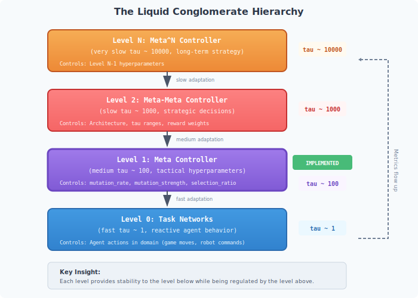
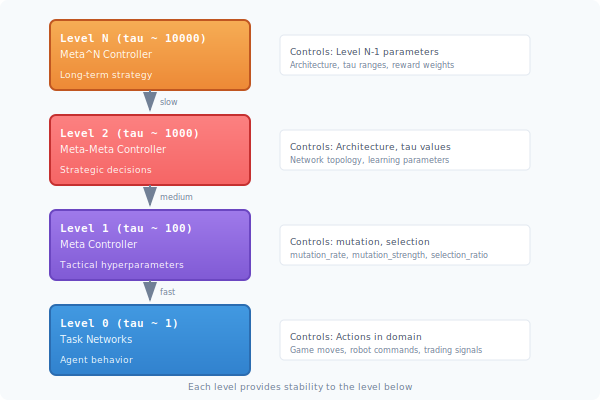
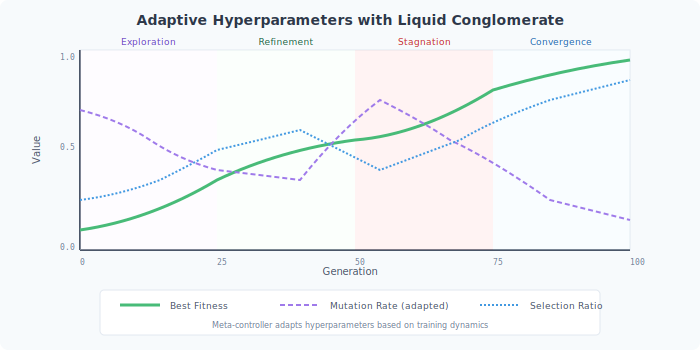
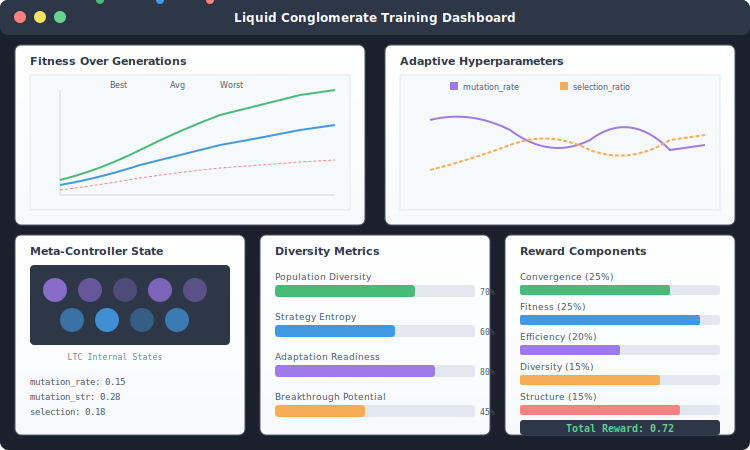

# The Liquid Conglomerate: Hierarchical Meta-Learning

## Introduction

The **Liquid Conglomerate** is a novel architecture for adaptive neuroevolution that uses hierarchical Liquid Time-Constant (LTC) neural networks to create a self-optimizing training system. Instead of manually tuning hyperparameters, the system learns *how to learn* at multiple timescales.

This guide explains:
- What the Liquid Conglomerate is and why it matters
- How LTC dynamics enable multi-timescale learning
- The effects on neuroevolution training
- How to implement and use this architecture

## The Problem: Hyperparameter Sensitivity

Neuroevolution is notoriously sensitive to hyperparameters:

| Hyperparameter | Too Low | Too High |
|----------------|---------|----------|
| **Mutation rate** | Premature convergence | Genetic chaos |
| **Mutation strength** | Slow exploration | Destructive changes |
| **Selection pressure** | No progress | Loss of diversity |
| **Population size** | Limited diversity | Wasted computation |

Traditional solutions:

1. **Manual tuning** - Time-consuming, domain-specific, often suboptimal
2. **Grid search** - Exponentially expensive, static throughout training
3. **Bayesian optimization** - Good but doesn't adapt during training
4. **Schedules** - Pre-defined, can't respond to training dynamics

The Liquid Conglomerate offers a fourth way: **learned, adaptive control**.

## The Liquid Conglomerate Vision



The architecture consists of hierarchical LTC networks, each operating at a different timescale:



**Each level provides stability to the level below while being regulated by the level above.**

## Why "Liquid"?

The name comes from **Liquid Time-Constant (LTC)** neurons, which have a key property: their time constant **adapts to input magnitude**.

### Standard Neuron
```
output = activation(weights · inputs + bias)
```
No temporal memory - responds instantly to inputs.

### LTC Neuron
```
dx/dt = -[1/tau + f(x,I)] · x + f(x,I) · A
output = g(x)
```

Where:
- `x` is internal state that persists across time
- `tau` is the base time constant
- `f(x,I)` modulates the effective time constant based on inputs
- `A` bounds the state

**Key insight**: When inputs are strong (rapid training progress), the effective tau decreases - the neuron responds quickly. When inputs are weak (stagnation), tau increases - the neuron is cautious.

This is **exactly** what you want for hyperparameter control.

## Why "Conglomerate"?

The system is a conglomerate of interacting controllers at different timescales:

- **Fast (tau ~ 1)**: Task networks react to immediate game/robot state
- **Medium (tau ~ 100)**: Meta-controller adapts hyperparameters per generation
- **Slow (tau ~ 1000)**: Meta-meta-controller adjusts the meta-controller itself
- **Glacial (tau ~ 10000+)**: Highest levels learn meta-strategies across experiments

Like a biological organism with nervous system, endocrine system, and genetic adaptation - each operating at different speeds but forming a coherent whole.

## Effects on Neuroevolution Training

### 1. Self-Tuning Hyperparameters

Without Liquid Conglomerate:
```
Generation 1-100:   mutation_rate = 0.1    (too high? too low? who knows)
Generation 101-200: mutation_rate = 0.1    (still the same)
Generation 201+:    mutation_rate = 0.1    (forever the same)
```

With Liquid Conglomerate:
```
Generation 1-10:    mutation_rate adapts 0.3→0.15  (exploring)
Generation 11-50:   mutation_rate adapts 0.15→0.08 (found promising region)
Generation 51-80:   mutation_rate adapts 0.08→0.20 (stuck, increase exploration)
Generation 81-100:  mutation_rate adapts 0.20→0.05 (converging on solution)
```



### 2. Automatic Stagnation Recovery

When training stagnates, the meta-controller detects this through:
- Fitness plateau (low improvement rate)
- Decreasing population diversity
- High fitness variance with no progress

And responds by:
- Increasing mutation rate
- Reducing selection pressure
- Potentially changing network topology

```erlang
%% Meta-controller observation
Inputs = [
    FitnessDelta / HistoricalAvg,     % Is improvement slowing?
    PopulationDiversity / Threshold,  % Is population homogeneous?
    StagnationCount / MaxStagnation,  % How long stuck?
    GenerationProgress / TotalGen     % Where in training?
],

%% Meta-controller outputs adaptive response
[MutationRate, MutationStrength, SelectionRatio] =
    meta_controller:get_params(MetaNetwork, Inputs),

%% When stagnating: MutationRate increases, SelectionRatio decreases
```

### 3. Phase-Appropriate Strategies

Different phases of training need different strategies:

| Phase | Strategy | Meta-Controller Learns |
|-------|----------|------------------------|
| **Early** | High exploration | Large mutation, low selection pressure |
| **Middle** | Balanced | Moderate parameters, diversity maintenance |
| **Late** | Exploitation | Low mutation, high selection pressure |
| **Stuck** | Shock therapy | Sudden parameter changes to escape |

The Liquid Conglomerate learns these phase transitions from training dynamics.

### 4. Transfer Learning of Training Strategies

A meta-controller trained on one domain carries learned "how to train" knowledge:

```erlang
%% Train meta-controller on CartPole
{ok, MetaNetwork1} = train_meta_controller(cartpole_experiments),

%% Apply to new domain - starts much better than random
{ok, MetaNetwork2} = fine_tune_meta_controller(MetaNetwork1, new_domain_experiments).
```

The meta-controller has learned patterns like:
- "When diversity drops below X, increase mutation"
- "When improvement accelerates, reduce exploration"
- "Different network topologies need different mutation strengths"

These patterns often transfer across domains.

### 5. Emergent Training Behaviors

With sufficient training, meta-controllers can exhibit sophisticated emergent behaviors:

1. **Punctuated equilibrium**: Long periods of stability interrupted by rapid adaptation
2. **Diversity cycling**: Periodic expansion and contraction of population diversity
3. **Anticipatory adjustment**: Changing parameters *before* stagnation based on learned patterns
4. **Coordinated control**: Adjusting multiple parameters together (not independently)

## Silo Training Velocity & Inference Impact

The Liquid Conglomerate can incorporate multiple specialized **silos** - each managing a distinct aspect of evolution. Understanding their performance impact helps decide which to enable:

| Silo | Training Velocity | Inference Overhead | Key Trade-off |
|------|-------------------|-------------------|---------------|
| **Task** | Baseline (1.0x) | Minimal | Core fitness evaluation |
| **Resource** | +20-40% faster | +1-2ms | Prevents wasted compute |
| **Distribution** | Neutral | +2-5ms | Population structure control |
| **Temporal** | **+++** (2-4x faster) | Minimal | Eliminates wasted evaluation time |
| **Economic** | **++** (1.5-2x faster) | +5-10ms | Budget constraints force efficiency |
| **Cultural** | **+** (1.2-1.5x faster) | +1-3ms | Cultural ratchet accelerates learning |
| **Morphological** | Neutral (0.9-1.0x) | Reduced (smaller networks) | Size constraints → faster inference |
| **Regulatory** | **+** (1.1-1.2x) | +2-5ms | Context switching enables multi-task |
| **Social** | Neutral (0.9-1.0x) | +2-5ms | Better selection targets offset overhead |
| **Ecological** | Variable (0.7-1.3x) | +3-8ms | Dynamic pressure → robust solutions |
| **Competitive** | Neutral | +10-20ms (matchmaking) | Arms race maintains pressure |
| **Developmental** | **−** (0.8-0.9x) | +5-10ms | Lifetime learning adds evaluation time |
| **Communication** | Slight overhead (0.85-0.95x) | +5-15ms | Language evolution overhead |

### Recommended Enablement Order

Based on training velocity impact:

1. **Fastest to enable:** Temporal, Economic, Cultural (immediate velocity gains)
2. **Neutral to enable:** Morphological, Social, Competitive, Regulatory, Task, Resource
3. **Slower but more robust:** Ecological (variable), Developmental, Communication

### Silo Selection Strategy

```erlang
%% Example: Configure LC with velocity-optimized silo selection
SiloConfig = #{
    %% Always enable (core functionality)
    task => enabled,
    resource => enabled,

    %% Enable for training velocity
    temporal => enabled,      % +++ velocity
    economic => enabled,      % ++ velocity
    cultural => enabled,      % + velocity

    %% Enable based on domain requirements
    competitive => case Domain of
        adversarial -> enabled;
        _ -> disabled
    end,

    communication => case Domain of
        multi_agent -> enabled;
        _ -> disabled
    end,

    %% Enable for robustness (accept slower training)
    ecological => case Priority of
        robustness -> enabled;
        speed -> disabled
    end
}.
```

For detailed information on each silo, see the individual silo guides:

- [Task Silo Guide](silos/task-silo.md) - Core fitness evaluation and learning
- [Resource Silo Guide](silos/resource-silo.md) - Computational resource management
- [Temporal Silo Guide](silos/temporal-silo.md) - Time and episode management
- [Competitive Silo Guide](silos/competitive-silo.md) - Adversarial dynamics
- [Cultural Silo Guide](silos/cultural-silo.md) - Knowledge transfer and traditions
- [Social Silo Guide](silos/social-silo.md) - Reputation and cooperation
- [Ecological Silo Guide](silos/ecological-silo.md) - Environmental pressures
- [Morphological Silo Guide](silos/morphological-silo.md) - Network structure control
- [Developmental Silo Guide](silos/developmental-silo.md) - Lifetime learning
- [Regulatory Silo Guide](silos/regulatory-silo.md) - Gene expression control
- [Economic Silo Guide](silos/economic-silo.md) - Resource economics
- [Communication Silo Guide](silos/communication-silo.md) - Signal evolution

## Implementation

### Level 1: Meta-Controller (Current)

```erlang
%% Start meta-controller
MetaConfig = #meta_config{
    network_topology = {8, [16, 8], 4},
    time_constant = 50.0,              % Medium tau for generation-scale adaptation
    learning_rate = 0.001,
    reward_weights = #{
        convergence => 0.25,
        fitness => 0.25,
        efficiency => 0.20,
        diversity => 0.15,
        structure => 0.15
    }
},

{ok, MetaPid} = meta_controller:start_link(MetaConfig).

%% In evolution loop, after each generation:
handle_generation_complete(Stats, State) ->
    %% Get adapted hyperparameters
    NewParams = meta_controller:update(MetaPid, Stats),

    %% Apply to next generation
    NewConfig = State#state.config#neuro_config{
        mutation_rate = maps:get(mutation_rate, NewParams),
        mutation_strength = maps:get(mutation_strength, NewParams),
        selection_ratio = maps:get(selection_ratio, NewParams)
    },

    State#state{config = NewConfig}.
```

### Reward Signal Design

The meta-controller's reward balances multiple objectives:

```erlang
%% meta_reward.erl computes:
Reward = #{
    %% Did training improve?
    convergence_speed => FitnessDelta / TimeTaken,

    %% How good is the result?
    final_fitness => BestFitness / HistoricalBest,

    %% Was computation efficient?
    efficiency_ratio => FitnessGain / ComputeCost,

    %% Is population healthy?
    diversity_aware => DiversityScore * EntropyScore,

    %% Can population still adapt?
    normative_structure => AdaptationReadiness * BreakthroughPotential
}.

TotalReward = weighted_sum(Reward, Config#meta_config.reward_weights).
```

### The "Normative Structure" Component

A novel reward component that rewards the meta-controller for maintaining **capacity to improve**, not just current performance:

```erlang
%% Measures population's potential, not just current fitness
normative_structure_score(Population, History) ->
    #{
        %% Are there distinct strategy clusters?
        diversity_corridors => count_strategy_clusters(Population),

        %% Is there variance in fitness-adjacent traits?
        adaptation_readiness => measure_trait_variance(Population),

        %% How far from explored fitness regions?
        breakthrough_potential => distance_to_frontier(Population, History),

        %% Information content of population strategies
        strategy_entropy => calculate_entropy(Population)
    }.
```

This prevents the meta-controller from "squeezing" the population too aggressively.

## Visualization

### Training Dashboard



A typical Liquid Conglomerate training dashboard shows:

1. **Fitness curves** - Best, average, worst fitness over generations
2. **Hyperparameter trajectories** - How mutation rate, selection ratio evolve
3. **Meta-controller state** - Internal LTC neuron states
4. **Diversity metrics** - Population health indicators
5. **Reward components** - What the meta-controller is optimizing

### Meta-Controller Internals

```erlang
%% Get meta-controller state for visualization
{ok, MetaState} = meta_controller:get_state(MetaPid),

%% MetaState contains:
#{
    inputs => [...],           % Current observations
    internal_state => [...],   % LTC neuron states (temporal memory)
    outputs => [...],          % Current hyperparameter values
    reward_history => [...],   % Recent rewards
    generation => N
}.
```

## Theoretical Foundation

### Multi-Timescale Learning

The Liquid Conglomerate exploits **separation of timescales**:

```
Fast dynamics:    Agent actions        (milliseconds)
                        ↑ controlled by
Medium dynamics:  Hyperparameters      (per generation)
                        ↑ controlled by
Slow dynamics:    Meta-strategies      (across experiments)
                        ↑ controlled by
Glacial dynamics: Fundamental patterns (across domains)
```

Each level operates independently but couples to adjacent levels through:
- Upward: Performance metrics (feedback)
- Downward: Parameter settings (control)

### Self-Organizing Criticality

With LTC meta-control, the system naturally finds the "edge of chaos":

- **Too much exploitation** (low mutation) → Stagnation → Meta-controller increases mutation
- **Too much exploration** (high mutation) → Chaos → Meta-controller decreases mutation

The liquid dynamics provide **smooth transitions**, preventing oscillation.

### Temporal Cognition

The system develops an intuition about *when* to change parameters:

- LTC's adaptive tau means timescales **self-organize** based on signal dynamics
- A meta-controller facing rapid improvement speeds up (lower effective tau)
- A meta-controller facing stagnation slows down (higher effective tau)

This is not just optimization - it's a form of **temporal cognition**.

## Comparison to Other Approaches

| Approach | Adapts During Training | Learns Meta-Knowledge | Multi-Timescale |
|----------|------------------------|----------------------|-----------------|
| Manual tuning | No | No | No |
| Grid search | No | No | No |
| Random search | No | No | No |
| Bayesian optimization | Limited | No | No |
| Population-based training | Yes | Limited | No |
| **Liquid Conglomerate** | Yes | Yes | Yes |

## Future Directions

### Topology Evolution Integration

The current implementation controls weight evolution parameters. A natural extension is controlling **topology evolution** - structural changes to the neural networks themselves.

The `faber_tweann` library already provides topology mutation operators:
- `add_neuron/1` - Insert neurons into existing connections
- `add_outlink/1`, `add_inlink/1` - Add connections between neurons
- `outsplice/1` - Split connections with new neurons

The meta-controller could extend to control:

| New Output | Effect on Evolution |
|------------|---------------------|
| `topology_mutation_rate` | How often structural changes occur |
| `add_neuron_rate` | Bias toward growing complexity |
| `add_connection_rate` | Network density control |
| `complexity_penalty` | Fitness penalty per structural element |

This enables the Liquid Conglomerate to learn **when** to complexify networks, not just how to tune weights. Early in training, it might encourage exploration of different topologies. Later, it might focus on weight optimization of proven structures.

See [Topology Evolution Roadmap](topology-evolution.md) for detailed integration plans.

### Level 2+: Recursive Hierarchy

The current implementation is Level 1. Future work includes:

```
Level 2 meta-meta-controller could control:
- Level 1's tau values
- Level 1's network topology
- Level 1's reward weights
- When to reset Level 1

Level 3 could control:
- Problem decomposition strategies
- Domain transfer decisions
- Architecture search
```

### Distributed Liquid Conglomerate

With Macula mesh, different levels can run on different nodes:


### Co-Evolution

Co-evolving meta-controllers alongside task networks could discover novel training strategies that human researchers haven't conceived.

## Summary

The Liquid Conglomerate is:

1. **A hierarchical architecture** of LTC neural networks at different timescales
2. **Self-tuning** - learns optimal hyperparameters from training dynamics
3. **Adaptive** - responds to stagnation, diversity loss, and phase changes
4. **Transferable** - meta-knowledge can transfer across domains
5. **Emergent** - develops sophisticated training strategies through learning

By embedding "how to train" knowledge into LTC networks, we move from **static optimization** to **dynamic meta-optimization** - systems that learn how to learn.

## Related Guides

- [LTC Meta-Controller](meta-controller.md) - Implementation details
- [Overview](overview.md) - Neuroevolution fundamentals
- [Custom Evaluators](custom-evaluator.md) - Domain-specific training
- [Inference Scenarios](inference-scenarios.md) - Deploying evolved networks

## References

### LTC Networks

- Hasani, R., Lechner, M., et al. (2021). "Liquid Time-constant Networks." *AAAI 2021*.
- Hasani, R., Lechner, M., et al. (2022). "Closed-form Continuous-time Neural Networks." *Nature Machine Intelligence*.

### Meta-Learning

- Finn, C., Abbeel, P., Levine, S. (2017). "Model-Agnostic Meta-Learning for Fast Adaptation of Deep Networks." *ICML*.
- Xu, Z., et al. (2018). "Meta-Gradient Reinforcement Learning." *NeurIPS*.

### Evolved Plasticity

- Soltoggio, A., et al. (2008). "Evolutionary advantages of neuromodulated plasticity."
- Clune, J., et al. (2013). "The evolutionary origins of modularity."

### Multi-Timescale Systems

- Hopfield, J.J. (1982). "Neural networks and physical systems with emergent collective computational abilities."
- Izhikevich, E.M. (2007). "Dynamical Systems in Neuroscience: The Geometry of Excitability and Bursting."
