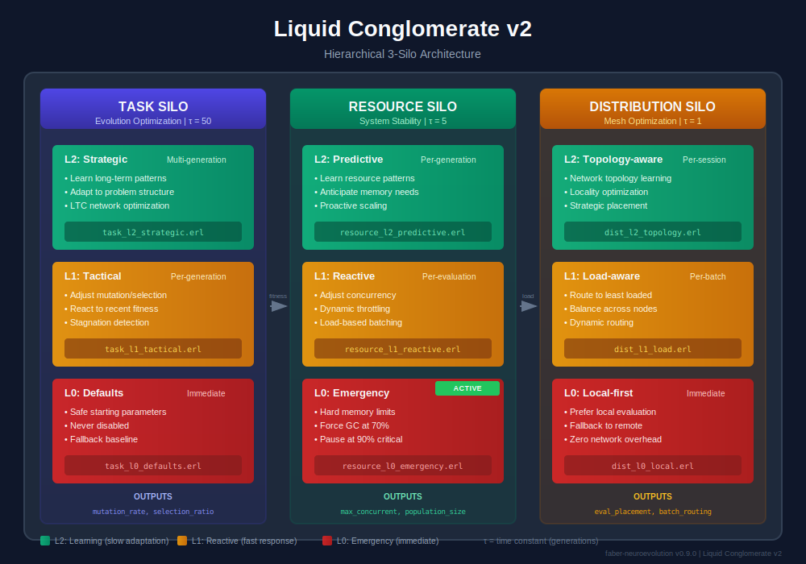

# LTC Meta-Controller: Adaptive Hyperparameter Optimization

This guide explains the **meta-controller** system - LTC neural networks that dynamically control neuroevolution hyperparameters based on training dynamics, system resources, and mesh topology.

## Liquid Conglomerate v2

The Liquid Conglomerate v2 architecture replaces the monolithic meta-controller with **3 specialized hierarchical silos**, each focused on a single optimization objective:



### Why 3 Silos?

1. **Separation of Concerns** - Each silo optimizes one aspect of the system
2. **Different Time Constants** - Resource reacts fast (τ=5), Task learns slow (τ=50)
3. **Graceful Degradation** - L0 always works, even if L1/L2 fail
4. **Independent Tuning** - Can enable/disable levels per silo
5. **Clearer Rewards** - Task→fitness, Resource→stability, Distribution→throughput

### The Three Silos

| Silo | Purpose | Time Constant (τ) | Optimization Target |
|------|---------|-------------------|---------------------|
| **Task** | Evolution optimization | 50 | Maximize fitness |
| **Resource** | System stability | 5 | Maintain stability |
| **Distribution** | Mesh optimization | 1 | Maximize throughput |

## Hierarchical Levels

Each silo operates with 3 hierarchical levels (L0 → L1 → L2):


### L0: Emergency/Immediate Response
- **Always active**, cannot be disabled
- Provides safe defaults and hard limits
- Responds immediately to critical conditions
- Zero learning, pure reactive logic

### L1: Reactive Control
- Responds to recent observations
- Per-evaluation (Resource) or per-generation (Task) adjustments
- Fast feedback loop with simple heuristics
- Can be disabled for baseline operation

### L2: Predictive/Strategic Learning
- LTC neural network for pattern learning
- Multi-generation or session-scale optimization
- Learns problem-specific strategies
- Optional, requires training data

## Task Silo (Evolution Optimization)

**Time Constant:** τ = 50 (slow adaptation)

**Purpose:** Optimize neuroevolution hyperparameters for maximum fitness improvement.

| Level | Name | Response Time | Function |
|-------|------|---------------|----------|
| L0 | Defaults | Immediate | Safe starting params, never disabled |
| L1 | Tactical | Per-generation | Adjust mutation/selection based on recent fitness |
| L2 | Strategic | Multi-generation | Learn long-term patterns, adapt to problem structure |

### Inputs
```erlang
%% Task silo input features
-type task_input() :: #{
    best_fitness := float(),           % Current best fitness
    mean_fitness := float(),           % Population mean
    fitness_variance := float(),       % Population variance
    improvement_rate := float(),       % Fitness improvement rate
    stagnation_counter := integer(),   % Generations without improvement
    diversity_index := float(),        % Population diversity (0.0-1.0)
    entropy := float(),                % Population entropy
    generation_progress := float()     % Progress toward max_generations
}.
```

### Outputs
```erlang
%% Task silo controlled parameters
-type task_output() :: #{
    mutation_rate := float(),          % 0.01 - 0.5
    mutation_strength := float(),      % 0.05 - 1.0
    selection_ratio := float(),        % 0.10 - 0.50
    add_node_rate := float(),          % 0.0 - 0.10 (if topology control enabled)
    add_connection_rate := float()     % 0.0 - 0.20 (if topology control enabled)
}.
```

### Files
- `task_silo.erl` - Task silo gen_server
- `task_l0_defaults.erl` - Safe defaults
- `task_l1_tactical.erl` - Per-generation tuning
- `task_l2_strategic.erl` - Long-term learning (LTC network)

## Resource Silo (System Stability)

**Time Constant:** τ = 5 (fast adaptation)

**Purpose:** Maintain system stability by controlling resource usage.

| Level | Name | Response Time | Function |
|-------|------|---------------|----------|
| L0 | Emergency | Immediate | Hard limits, GC triggers, pause if critical |
| L1 | Reactive | Per-evaluation | Adjust concurrency based on current pressure |
| L2 | Predictive | Per-generation | Learn resource patterns, anticipate needs |

### Implementation Status

**L0: Emergency (IMPLEMENTED)** - Active in `neuroevolution_server.erl`:
```erlang
%% Emergency memory protection
check_memory_pressure() ->
    case resource_monitor:get_normalized_metrics() of
        #{memory_pressure := Pressure} when Pressure > 0.9 -> critical;
        #{memory_pressure := Pressure} when Pressure > 0.7 -> high;
        _ -> normal
    end.

handle_info(evaluate_generation, State) ->
    case check_memory_pressure() of
        critical ->
            %% CRITICAL: Pause evolution, force GC
            erlang:garbage_collect(),
            erlang:send_after(5000, self(), evaluate_generation),
            {noreply, State};
        high ->
            %% HIGH: Force GC, continue with reduced load
            erlang:garbage_collect(),
            do_evaluate_generation(State);
        normal ->
            do_evaluate_generation(State)
    end.
```

### Inputs
```erlang
%% Resource silo input features (from resource_monitor.erl)
-type resource_input() :: #{
    memory_pressure := float(),        % 0.0 - 1.0 (% of system memory)
    cpu_pressure := float(),           % 0.0 - 1.0 (scheduler utilization)
    process_pressure := float(),       % 0.0 - 1.0 (% of max processes)
    message_queue_pressure := float(), % 0.0 - 1.0 (queue length ratio)
    binary_memory := integer(),        % Binary heap size (often the culprit)
    gc_count := integer()              % Recent GC operations
}.
```

### Outputs
```erlang
%% Resource silo controlled parameters
-type resource_output() :: #{
    evaluations_per_individual := pos_integer(),   % 1 - 20
    max_concurrent_evaluations := pos_integer(),   % 1 - 50
    population_size := pos_integer()               % 10 - 200 (if enabled)
}.
```

### Files
- `resource_silo.erl` - Resource silo gen_server
- `resource_l0_emergency.erl` - Hard limits, GC triggers (IMPLEMENTED)
- `resource_l1_reactive.erl` - Reactive concurrency control
- `resource_l2_predictive.erl` - Pattern learning (LTC network)

## Distribution Silo (Mesh Optimization)

**Time Constant:** τ = 1 (instant adaptation)

**Purpose:** Optimize evaluation placement across the Macula mesh.

| Level | Name | Response Time | Function |
|-------|------|---------------|----------|
| L0 | Local-first | Immediate | Prefer local evaluation, fallback only |
| L1 | Load-aware | Per-batch | Route to least loaded available nodes |
| L2 | Topology-aware | Per-session | Optimize for network topology, locality |

### Inputs
```erlang
%% Distribution silo input features
-type dist_input() :: #{
    node_count := integer(),           % Available mesh nodes
    node_latencies := [float()],       % RTT to each node (ms)
    node_loads := [float()],           % Load per node (0.0-1.0)
    network_health := float(),         % Overall mesh health
    evaluation_sizes := [integer()],   % Batch sizes pending
    local_queue_depth := integer()     % Local evaluation queue
}.
```

### Outputs
```erlang
%% Distribution silo controlled parameters
-type dist_output() :: #{
    evaluation_placement := local | distributed | hybrid,
    batch_routing := [{node_id(), weight()}],
    replication_factor := pos_integer()
}.
```

### Files
- `distribution_silo.erl` - Distribution silo gen_server
- `dist_l0_local.erl` - Local-first evaluation
- `dist_l1_load.erl` - Load-balanced routing
- `dist_l2_topology.erl` - Topology-aware optimization

## Why LTC for Meta-Learning?

LTC neurons are uniquely suited for hierarchical control:

### Temporal Memory Without Recurrence

LTC neurons maintain internal state `x(t)` that evolves continuously:

```
dx/dt = -[1/tau + f(x,I)] * x + f(x,I) * A
```

This enables them to "remember" recent dynamics without explicit recurrence.

### Adaptive Response Speed

The liquid time constant tau adapts to input magnitude:
- When system is **stable** (low signal), tau effectively increases -> cautious changes
- When system is **changing rapidly** (high signal), tau decreases -> fast adaptation

### Smooth Transitions

Unlike discrete schedulers, LTC provides smooth, continuous parameter updates that prevent oscillation and instability.

## File Structure

```
src/silos/
├── lc_supervisor.erl           # Supervises all 3 silos
├── task_silo/
│   ├── task_silo.erl           # Task silo gen_server
│   ├── task_l0_defaults.erl    # Safe defaults
│   ├── task_l1_tactical.erl    # Per-generation tuning
│   └── task_l2_strategic.erl   # Long-term learning (LTC network)
├── resource_silo/
│   ├── resource_silo.erl       # Resource silo gen_server
│   ├── resource_l0_emergency.erl  # Hard limits, GC (IMPLEMENTED)
│   ├── resource_l1_reactive.erl   # Reactive concurrency control
│   └── resource_l2_predictive.erl # Pattern learning (LTC network)
└── distribution_silo/
    ├── distribution_silo.erl   # Distribution silo gen_server
    ├── dist_l0_local.erl       # Local-first evaluation
    ├── dist_l1_load.erl        # Load-balanced routing
    └── dist_l2_topology.erl    # Topology-aware optimization
```

## Usage

### Basic Setup (Task Silo Only)

```erlang
%% Configure neuroevolution with meta-controller
Config = neuro_config:from_map(#{
    network_topology => {8, [16], 4},
    evaluator_module => my_evaluator,
    meta_controller_config => #{
        network_topology => {8, [16, 8], 5},
        time_constant => 50.0,
        learning_rate => 0.001,
        enabled_levels => [l0, l1, l2]  % Enable all task levels
    }
}),

{ok, Pid} = neuroevolution_server:start_link(Config).
```

### Resource-Aware Configuration

```erlang
%% Enable resource silo with emergency protection
Config = neuro_config:from_map(#{
    network_topology => {8, [16], 4},
    evaluator_module => my_evaluator,

    %% Resource silo configuration
    resource_silo_config => #{
        enabled_levels => [l0, l1],     % L0 + L1, no learning yet
        memory_critical_pct => 0.9,     % Pause at 90%
        memory_high_pct => 0.7,         % GC at 70%
        max_concurrent_default => 10    % Default concurrency
    }
}).
```

### Distributed Configuration

```erlang
%% Enable distribution silo for mesh evaluation
Config = neuro_config:from_map(#{
    network_topology => {8, [16], 4},
    evaluator_module => my_evaluator,
    evaluation_mode => distributed,

    %% Distribution silo configuration
    distribution_silo_config => #{
        enabled_levels => [l0, l1],     % Local-first + load-aware
        fallback_to_local => true,      % Use local if mesh unavailable
        batch_size => 10                % Evaluation batch size
    }
}).
```

## Reward Signals

Each silo has its own reward signal:

### Task Silo Reward
```erlang
%% Multi-objective fitness reward
task_reward(Stats) ->
    #{
        fitness_improvement => improvement_reward(Stats),
        convergence_speed => convergence_reward(Stats),
        diversity_maintenance => diversity_reward(Stats),
        efficiency => efficiency_reward(Stats)
    }.
```

### Resource Silo Reward
```erlang
%% Stability reward
resource_reward(Metrics) ->
    #{
        stability => 1.0 - variance(memory_history),
        throughput => evaluations_per_second,
        headroom => 1.0 - peak_memory_pressure
    }.
```

### Distribution Silo Reward
```erlang
%% Throughput reward
distribution_reward(Stats) ->
    #{
        throughput => total_evaluations / wall_clock_time,
        latency => 1.0 / mean_evaluation_latency,
        utilization => mean_node_utilization
    }.
```

## Migration from v1

If you're using the monolithic meta-controller, migration is straightforward:

### Before (v1)
```erlang
MetaConfig = #meta_config{
    network_topology = {8, [16, 8], 4},
    time_constant = 50.0,
    %% ... all parameters in one config
}.
```

### After (v2)
```erlang
Config = neuro_config:from_map(#{
    %% Task silo (replaces meta_controller_config)
    meta_controller_config => #{
        network_topology => {8, [16, 8], 5},
        time_constant => 50.0
    },

    %% NEW: Resource silo
    resource_silo_config => #{
        enabled_levels => [l0, l1]
    },

    %% NEW: Distribution silo (when using mesh)
    distribution_silo_config => #{
        enabled_levels => [l0]
    }
}).
```

## Theoretical Foundation

### Multi-Timescale Separation

The 3-silo architecture exploits **separation of timescales**:

1. **Distribution (τ=1)**: React instantly to network conditions
2. **Resource (τ=5)**: Adapt quickly to system pressure
3. **Task (τ=50)**: Learn slowly for stable evolution

Each silo provides stability to faster systems while being regulated by slower ones.

### Hierarchical Control Theory

The L0/L1/L2 hierarchy follows control theory principles:

- **L0 (Safety)**: Guaranteed bounds, no learning required
- **L1 (Feedback)**: Reactive control based on current state
- **L2 (Feedforward)**: Predictive control based on learned models

### Graceful Degradation

If L2 fails or produces bad outputs:
- L1 provides reasonable reactive behavior
- L0 guarantees safe operation

This is critical for production deployments.

## Academic References

### LTC Networks

- Hasani, R., Lechner, M., et al. (2021). "Liquid Time-constant Networks." AAAI 2021.
- Hasani, R., Lechner, M., et al. (2022). "Closed-form Continuous-time Neural Networks." Nature Machine Intelligence.

### Hierarchical Control

- Sutton, R. S., Precup, D., Singh, S. (1999). "Between MDPs and semi-MDPs: A framework for temporal abstraction."
- Barto, A. G., Mahadevan, S. (2003). "Recent advances in hierarchical reinforcement learning."

### Meta-Learning

- Finn, C., Abbeel, P., Levine, S. (2017). "Model-Agnostic Meta-Learning for Fast Adaptation." ICML.

## Related Modules

### Core
- `neuroevolution_server.erl` - Main evolution server
- `resource_monitor.erl` - System resource metrics
- `neuro_config.erl` - Configuration builder

### Task Silo
- `meta_controller.erl` - Legacy/L2 implementation
- `meta_trainer.erl` - Gradient-based training
- `meta_reward.erl` - Multi-objective reward

### Resource Silo
- `resource_monitor.erl` - Metrics collection
- `resource_l0_emergency.erl` - Emergency protection (inline in neuroevolution_server)

### Distribution Silo
- `neuroevolution_events.erl` - Event publishing for distributed evaluation
- `evaluator_worker.erl` - Distributed evaluation worker

## Implementation Roadmap

### Phase 1: Foundation (COMPLETE)
- [x] `neuro_config:from_map/1` for Elixir integration
- [x] `meta_config:from_map/1` for Elixir integration
- [x] `resource_monitor.erl` for system metrics
- [x] Nil→undefined conversion

### Phase 2: Resource Silo L0 (COMPLETE)
- [x] Emergency memory protection in neuroevolution_server
- [x] Memory pressure check before each generation
- [x] GC trigger at high pressure
- [x] Pause evolution at critical pressure

### Phase 3: LC v2 Morphology & Sensors (COMPLETE)
- [x] `resource_l0_morphology.erl` - 13 sensors, 8 actuators
- [x] `task_l0_morphology.erl` - 16 sensors, 12 actuators
- [x] `distribution_l0_morphology.erl` - 14 sensors, 10 actuators
- [x] Sensor/actuator implementation for all silos
- [x] L0/L1 hyperparameter defaults and bounds

### Phase 4: Cross-Silo Communication (COMPLETE)
- [x] `lc_cross_silo.erl` - Signal routing between silos
- [x] Signal validation and decay
- [x] Effective evals computation
- [x] `lc_reward.erl` - Cooperative reward signals

### Phase 5: L1/L2 Controllers (COMPLETE)
- [x] `lc_l1_controller.erl` - Generic L1 hyperparameter tuning
- [x] `lc_l2_controller.erl` - Strategic meta-tuning
- [x] `lc_supervisor.erl` - Supervises all LC v2 children
- [x] Performance observation and trend analysis

### Phase 6: Testing & Documentation (COMPLETE)
- [x] Unit tests for all morphology modules (43 tests)
- [x] Unit tests for reward computation (34 tests)
- [x] Unit tests for L1/L2 controllers (31 tests)
- [x] SVG architecture diagrams for hexdocs
- [x] Cooperative Silos guide

### Phase 7: L0 TWEANN Evolution (FUTURE)
- [ ] Wire L0 TWEANN evolution into neuroevolution_server
- [ ] Integrate L1/L2 controllers into supervisor tree
- [ ] Add integration tests for cross-silo communication
- [ ] Benchmark hierarchical control performance
