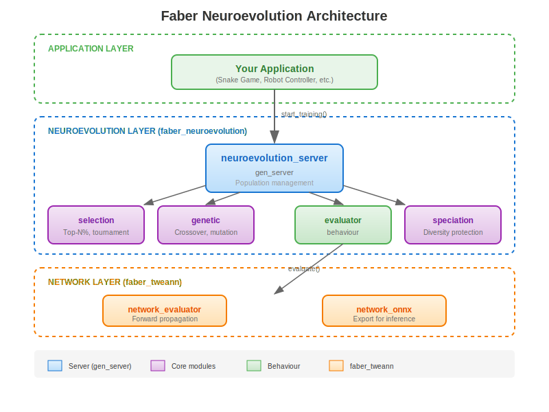

# Overview

`faber_neuroevolution` is an Erlang library that provides domain-agnostic population-based evolutionary training for neural networks. It works with [faber_tweann](https://hex.pm/packages/faber_tweann) to evolve network weights through selection, crossover, and mutation.

## What is Neuroevolution?

Neuroevolution is a machine learning technique that uses evolutionary algorithms to train neural networks. Instead of gradient-based optimization (like backpropagation), neuroevolution:

1. Maintains a **population** of neural networks
2. **Evaluates** each network's fitness on a task
3. **Selects** the best performers
4. Creates new networks through **crossover** (combining parents) and **mutation**
5. Repeats for many generations

This approach is particularly effective for:
- Reinforcement learning tasks where gradients are hard to compute
- Problems with sparse or delayed rewards
- Multi-objective optimization
- Evolving network topologies

## Weight Evolution vs Topology Evolution

`faber_neuroevolution` currently provides **weight evolution** with fixed network topologies, while `faber_tweann` provides the full TWEANN (Topology and Weight Evolving) capabilities.

| Capability | faber_tweann | faber_neuroevolution |
|------------|---------------|----------------------|
| Weight mutation | Yes | Yes |
| Weight crossover | Yes | Yes |
| Add neuron | Yes | Planned |
| Add/remove connections | Yes | Planned |
| Activation function mutation | Yes | Planned |
| LTC parameter evolution | Yes | Planned |

The topology evolution operators in `faber_tweann` include:
- `add_neuron/1` - Insert neuron into existing connection
- `add_outlink/1` - Add output connection from neuron
- `add_inlink/1` - Add input connection to neuron
- `outsplice/1` - Split output connection with new neuron
- `add_sensorlink/1`, `add_actuatorlink/1` - Modify I/O connections

These operators follow the NEAT (NeuroEvolution of Augmenting Topologies) approach where networks start minimal and grow complexity over generations. The Liquid Conglomerate meta-controller could naturally extend to control topology evolution rates alongside weight mutation parameters.

See [Topology Evolution Roadmap](topology-evolution.md) for future integration plans.

## Architecture



## Key Components

### Individual Record

Each individual in the population is represented by an `#individual{}` record:

```erlang
#individual{
    id :: term(),                    % Unique identifier
    network :: network(),            % Neural network from faber_tweann
    parent1_id :: term() | undefined,% Lineage tracking
    parent2_id :: term() | undefined,
    fitness :: float(),              % Calculated fitness
    metrics :: map(),                % Domain-specific metrics
    generation_born :: pos_integer(),
    is_survivor :: boolean(),        % Survived selection
    is_offspring :: boolean()        % Created through breeding
}
```

### Configuration

The `#neuro_config{}` record controls training behavior:

```erlang
#neuro_config{
    population_size = 50,           % Number of individuals
    evaluations_per_individual = 10,% Evaluations per generation
    selection_ratio = 0.20,         % Top 20% survive
    mutation_rate = 0.10,           % 10% of weights mutated
    mutation_strength = 0.3,        % Mutation magnitude
    max_generations = infinity,     % When to stop
    network_topology = {42, [16, 8], 6}, % Network structure
    evaluator_module = my_evaluator,% Your evaluator
    evaluator_options = #{},        % Options for evaluator
    event_handler = undefined       % Optional event callback
}
```

## Separation of Concerns

This library intentionally separates:

1. **Network operations** (`faber_tweann`) - Creating, evaluating, and modifying neural networks
2. **Training orchestration** (`faber_neuroevolution`) - Population management, selection, breeding
3. **Domain evaluation** (your code) - Game/task-specific fitness calculation

This separation allows you to use the same training infrastructure for different domains by simply implementing the `neuroevolution_evaluator` behaviour.

## Academic References

### Evolutionary Algorithms

- **Holland, J.H.** (1975). *Adaptation in Natural and Artificial Systems*. MIT Press.
  Foundational text on genetic algorithms.

- **Goldberg, D.E.** (1989). *Genetic Algorithms in Search, Optimization, and Machine Learning*. Addison-Wesley.
  Comprehensive coverage of genetic algorithm theory.

### Neuroevolution

- **Yao, X.** (1999). Evolving Artificial Neural Networks. *Proceedings of the IEEE*, 87(9), 1423-1447.
  Comprehensive survey of neuroevolution approaches.

- **Stanley, K.O. & Miikkulainen, R.** (2002). Evolving Neural Networks through Augmenting Topologies. *Evolutionary Computation*, 10(2).
  NEAT paper with speciation concepts applicable to weight evolution.

### Selection Methods

- **Miller, B.L. & Goldberg, D.E.** (1995). Genetic Algorithms, Tournament Selection, and the Effects of Noise. *Complex Systems*, 9(3), 193-212.
  Tournament selection analysis.

## Related Projects

### Macula Ecosystem

- **faber_tweann** - Neural network library with topology evolution, LTC neurons, ONNX export
- **macula** - HTTP/3 mesh networking for distributed neuroevolution

### External

- **DXNN2** - Gene Sher's original Erlang implementation
- **NEAT-Python** - Python NEAT implementation
- **OpenAI ES** - Evolution strategies for reinforcement learning
- **EvoTorch** - Modern PyTorch-based evolutionary algorithms

## The Liquid Conglomerate

This library includes an **LTC Meta-Controller** - part of a larger architecture called the **Liquid Conglomerate**. This hierarchical system of Liquid Time-Constant networks creates a self-optimizing training system that learns *how to learn*.

**Key benefits:**
- **Self-tuning hyperparameters** - No manual tuning required
- **Automatic stagnation recovery** - Escapes local optima automatically
- **Phase-appropriate strategies** - Adapts behavior throughout training
- **Transfer of meta-knowledge** - Training strategies can transfer across domains

The meta-controller observes training dynamics (fitness, diversity, improvement rate) and adapts hyperparameters (mutation rate, selection ratio) in real-time.

See [The Liquid Conglomerate](liquid-conglomerate.md) for a comprehensive explanation of the theory and effects, or [LTC Meta-Controller](meta-controller.md) for implementation details.

## Next Steps

- See [Getting Started](getting-started.md) for a quick setup guide
- Read [Custom Evaluators](custom-evaluator.md) to implement your own evaluator
- Explore [The Liquid Conglomerate](liquid-conglomerate.md) for the hierarchical meta-learning theory
- See [LTC Meta-Controller](meta-controller.md) for implementation details
- Check the module documentation for API details
