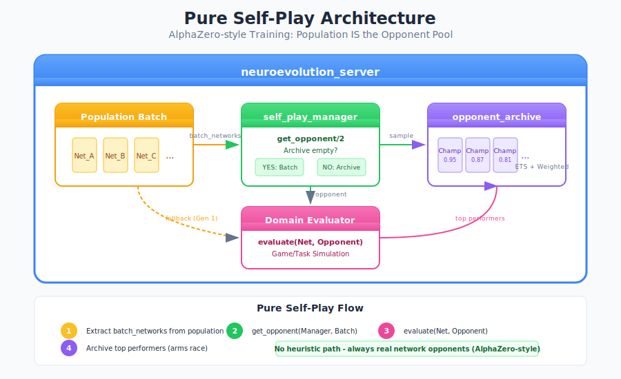

# Self-Play Training Mode

Self-play training enables neural networks to improve by competing against past versions of themselves, creating an "arms race" dynamic that drives continuous improvement without requiring hand-crafted opponents.

## Overview

This implementation uses **pure self-play** (AlphaZero-style):

- **No heuristic opponents** - networks always play against real networks
- **Population IS the opponent pool** - individuals compete against each other
- **Archive of champions** - successful networks become future opponents



## How It Works

### First Generation (Archive Empty)

When training begins, the archive is empty. Networks compete against each other through **intra-batch pairing**:


### Subsequent Generations (Archive Populated)

After the first generation, top performers are added to the archive. Future networks compete against archived champions:


## Configuration

Enable self-play in your training configuration:

```erlang
Config = #{
    evaluator_module => my_game_evaluator,
    self_play => #{
        enabled => true,
        archive_size => 50,          % Maximum champions to keep
        archive_threshold => auto,    % Fitness threshold for archive entry
        min_fitness_percentile => 0.5 % Top 50% can enter archive
    }
}.

{ok, Pid} = neuroevolution_server:start_link(Config).
```

### Configuration Options

| Option | Default | Description |
|--------|---------|-------------|
| `enabled` | `false` | Enable self-play mode |
| `archive_size` | `50` | Maximum opponents in archive |
| `archive_threshold` | `auto` | Fitness threshold (`auto` = 50% of average) |
| `min_fitness_percentile` | `0.5` | Minimum percentile to enter archive |

## Evaluator Integration

Your evaluator receives the opponent network in the options:

```erlang
-module(my_game_evaluator).
-behaviour(network_evaluator).

evaluate(Network, Individual, Options) ->
    %% Get opponent from options
    case maps:get(self_play_manager, Options, undefined) of
        undefined ->
            %% No self-play - evaluate against environment
            evaluate_solo(Network);
        ManagerPid ->
            %% Get opponent network
            BatchNetworks = maps:get(batch_networks, Options, []),
            {ok, OpponentNetwork} = self_play_manager:get_opponent(
                ManagerPid,
                BatchNetworks
            ),
            %% Evaluate head-to-head
            evaluate_vs_opponent(Network, OpponentNetwork)
    end.

evaluate_vs_opponent(Network, Opponent) ->
    %% Run game simulation
    GameResult = my_game:play(Network, Opponent),

    %% Return fitness based on result
    case GameResult of
        {win, Score} -> Score * 1.0;
        {draw, _}    -> 0.5;
        {loss, _}    -> 0.0
    end.
```

## Opponent Archive

The opponent archive stores successful networks with weighted sampling:

### Sampling Strategy

Champions are selected based on:
1. **Fitness** - Higher fitness = higher selection probability
2. **Recency** - Newer champions slightly preferred (age decay)

```erlang
%% Weight calculation
Weight = Fitness * exp(-Age / DecayMs)
```

### Archive Operations

```erlang
%% Get archive statistics
Stats = opponent_archive:stats(ArchiveId),
%% #{count => 42, max_size => 50, avg_fitness => 0.75, ...}

%% Manually add a champion (for importing)
Champion = #{
    network => NetworkMap,
    fitness => 0.95,
    generation => 100
},
opponent_archive:add(ArchiveId, Champion).

%% Prune to keep top N
opponent_archive:prune(ArchiveId, 25).
```

## Arms Race Dynamics

Self-play creates emergent training dynamics:

1. **Generation 1**: Random networks compete
2. **Best network archived**: Becomes benchmark opponent
3. **Generation 2**: New networks must beat Gen 1 champion
4. **Cycle continues**: Each generation faces stronger opponents

This is how systems like **AlphaZero** and **OpenAI Five** achieve superhuman performance without hand-crafted training data.

## Use Cases

### Competitive Games

- Chess, Go, strategy games
- Fighting games, racing games
- Any zero-sum competition

### Adversarial Training

- Predator-prey scenarios
- Security/intrusion detection
- Robustness testing

### Multi-Agent Systems

- Negotiation agents
- Trading bots
- Cooperative-competitive hybrid scenarios

## Future: Mesh-Native Distribution

The archive is designed for mesh-native distributed training:

| Phase | Status | Description |
|-------|--------|-------------|
| Phase 1 | Complete | Local ETS storage |
| Phase 2 | Planned | CRDT-based conflict resolution |
| Phase 3 | Planned | Macula PubSub for mesh sync |

In Phase 3, archives will automatically sync across mesh nodes, enabling distributed self-play training where champions from one node become opponents on other nodes.

## API Reference

### self_play_manager

```erlang
%% Get opponent for evaluation
-spec get_opponent(pid(), [map()]) -> {ok, map()}.
get_opponent(ManagerPid, BatchNetworks) -> {ok, Network}.

%% Report evaluation result (called automatically)
-spec report_result(pid(), map()) -> ok.
report_result(ManagerPid, #{
    individual => Individual,
    fitness => Fitness,
    generation => Gen
}).

%% Add champion directly
-spec add_champion(pid(), map()) -> ok | rejected.
add_champion(ManagerPid, Champion).

%% Get statistics
-spec get_stats(pid()) -> map().
get_stats(ManagerPid) -> #{
    total_evaluations => 1000,
    champions_added => 42,
    archive_size => 42,
    mode => pure_self_play
}.
```

### opponent_archive

```erlang
%% Sample opponent
-spec sample(archive_id()) -> {ok, opponent()} | empty.
sample(ArchiveId).

%% Add to archive
-spec add(archive_id(), opponent()) -> ok | rejected.
add(ArchiveId, Opponent).

%% Get statistics
-spec stats(archive_id()) -> map().
stats(ArchiveId) -> #{
    count => 42,
    max_size => 50,
    avg_fitness => 0.75,
    max_fitness => 0.95,
    min_fitness => 0.55
}.
```

## See Also

- [Evolution Strategies](evolution-strategies.md) - Different evolution approaches
- [Custom Evaluator](custom-evaluator.md) - Writing evaluator modules
- [Liquid Conglomerate](liquid-conglomerate.md) - Adaptive hyperparameter tuning
