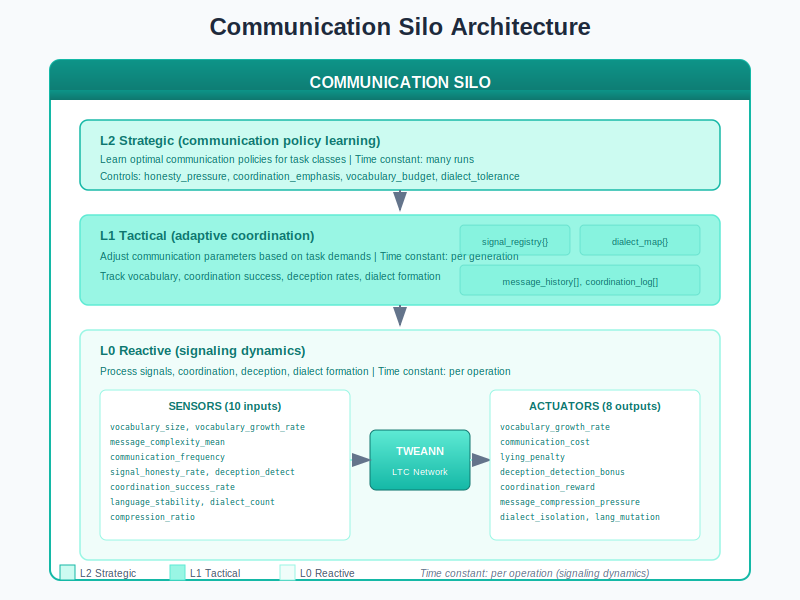
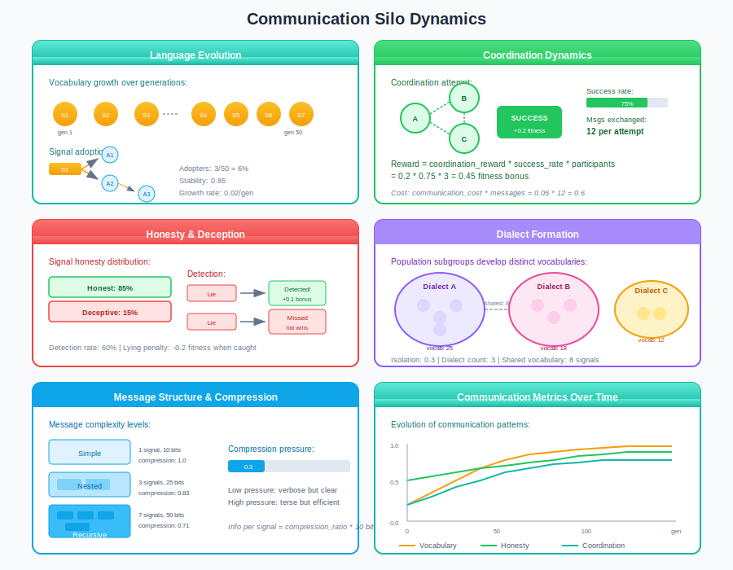
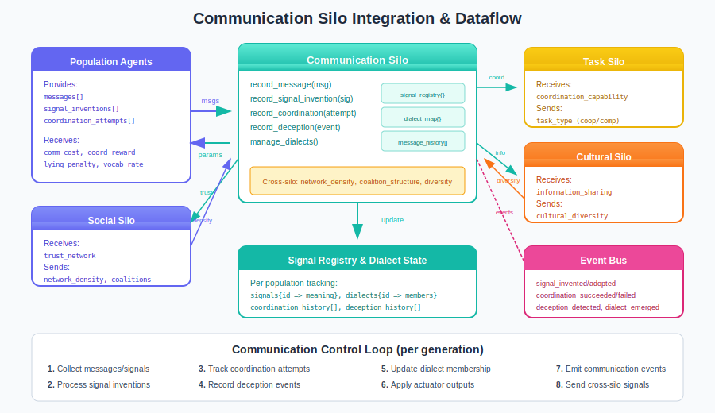

# Communication Silo Guide

The Communication Silo manages signaling and language evolution: signal repertoires, protocol evolution, coordination messages, and deception detection. Multi-agent systems need communication to coordinate, and evolved communication is more robust than hard-coded protocols.

## Overview

Traditional multi-agent systems use fixed communication protocols. The Communication Silo enables evolved communication:

- **Signal invention** - Agents create new signals with meanings
- **Signal adoption** - Successful signals spread through population
- **Coordination** - Agents coordinate through messaging
- **Honesty/deception** - Honest signaling evolves under pressure
- **Dialect formation** - Subgroups develop distinct languages



## Why Evolved Communication?

| Hard-coded Protocols | Evolved Communication |
|---------------------|----------------------|
| Fixed signal meanings | Adaptive semantics |
| No coordination discovery | Protocols emerge |
| Cannot handle novelty | Adapts to new situations |
| Opaque agent behavior | Interpretable signals |
| Single global language | Dialect specialization |

## Architecture

The Communication Silo uses TWEANN controllers at three levels:

| Level | Time Constant | Controls |
|-------|---------------|----------|
| **L2 Strategic** | Many runs | Optimal communication policies for task classes |
| **L1 Tactical** | Per generation | Adapt parameters based on coordination success |
| **L0 Reactive** | Per operation | Process signals, coordination, deception |

### Sensors (10 inputs)

The L0 controller receives 10 communication measurements:

| Sensor | Range | Description |
|--------|-------|-------------|
| `vocabulary_size` | [0.0, 1.0] | Distinct signals / max possible |
| `vocabulary_growth_rate` | [-1.0, 1.0] | Rate of new signal creation |
| `message_complexity_mean` | [0.0, 1.0] | Average message length/structure |
| `communication_frequency` | [0.0, 1.0] | Messages per interaction |
| `signal_honesty_rate` | [0.0, 1.0] | Proportion of honest signals |
| `deception_detection_rate` | [0.0, 1.0] | Success at detecting lies |
| `coordination_success_rate` | [0.0, 1.0] | Success of coordinated actions |
| `language_stability` | [0.0, 1.0] | How stable the language is |
| `dialect_count` | [0.0, 1.0] | Number of distinct dialects (normalized) |
| `compression_ratio` | [0.0, 1.0] | Information per signal unit |

### Actuators (8 outputs)

The controller adjusts 8 communication parameters:

| Actuator | Range | Default | Effect |
|----------|-------|---------|--------|
| `vocabulary_growth_rate` | [0.0, 0.1] | 0.02 | Speed of vocabulary expansion |
| `communication_cost` | [0.0, 0.2] | 0.05 | Energy cost per message |
| `lying_penalty` | [0.0, 0.5] | 0.2 | Fitness penalty for detected lies |
| `deception_detection_bonus` | [0.0, 0.3] | 0.1 | Bonus for catching liars |
| `coordination_reward` | [0.0, 0.5] | 0.2 | Bonus for successful coordination |
| `message_compression_pressure` | [0.0, 0.5] | 0.1 | Pressure to compress messages |
| `dialect_isolation` | [0.0, 1.0] | 0.3 | How isolated dialects become |
| `language_mutation_rate` | [0.0, 0.1] | 0.02 | Rate of signal meaning change |

## Communication Dynamics



### Signal Evolution

Signals evolve meanings through invention and adoption:

| Phase | Description | Example |
|-------|-------------|---------|
| **Invention** | Agent creates new signal | Agent A invents "food here" signal |
| **Use** | Inventor uses signal | A sends signal when finding food |
| **Adoption** | Others learn meaning | B, C observe and adopt |
| **Stabilization** | Signal becomes standard | Whole population uses signal |

**Vocabulary growth:**
```erlang
%% New signals created per generation
new_signals = vocabulary_growth_rate * population_size
%% Signal stabilizes when adopted by >50% of population
```

### Coordination

Agents coordinate through message exchange:

| Step | Action | Result |
|------|--------|--------|
| 1 | Agent A proposes action | Sends coordination message |
| 2 | Agents B, C respond | Agreement/disagreement signals |
| 3 | Action executed | All participants act together |
| 4 | Outcome recorded | Success/failure tracked |

**Coordination reward:**
```erlang
reward = coordination_reward * success_rate * num_participants
%% Cost of coordination:
cost = communication_cost * messages_exchanged
```

### Honesty and Deception

Evolutionary pressure shapes honest signaling:

| Behavior | Effect | Selection Pressure |
|----------|--------|-------------------|
| **Honest signaling** | Builds trust | Coordination benefits |
| **Deception** | Short-term gain | Lying penalty if caught |
| **Detection** | Catches liars | Detection bonus reward |

**Equilibrium:**
- High lying penalty + high detection = honest population
- Low lying penalty + low detection = deceptive population
- Balance emerges from evolutionary dynamics

### Dialect Formation

Subgroups develop distinct languages:

| Factor | Effect on Dialects |
|--------|-------------------|
| **Geographic isolation** | Groups drift apart linguistically |
| **Coalition structure** | Coalitions develop secret codes |
| **Specialization** | Task-specific vocabularies |
| **Cultural diversity** | Multiple communication styles |

**Dialect isolation:**
```erlang
%% Shared vocabulary between dialects
shared_vocab = total_vocab * (1 - dialect_isolation)
%% Higher isolation = more distinct dialects
```

## Integration with Other Silos



### Outgoing Signals

| Signal | To Silo | Trigger |
|--------|---------|---------|
| `coordination_capability` | Task | Based on coordination success rate |
| `information_sharing` | Cultural | Based on communication frequency |
| `trust_network` | Social | Based on signal honesty rate |
| `language_complexity` | Developmental | Based on message complexity |
| `trade_communication` | Economic | Coordination * frequency |

### Incoming Signals

| Signal | From Silo | Effect |
|--------|-----------|--------|
| `social_network_density` | Social | Dense networks = more communication |
| `coalition_structure` | Social | Coalitions develop shared signals |
| `cultural_diversity` | Cultural | Diversity creates dialects |
| `population_structure` | Distribution | Isolated groups form dialects |
| `stress_level` | Ecological | Stress may increase honest signaling |

### Signal Examples

```erlang
%% Receive social network density from social silo
handle_cast({cross_silo, social_network_density, Density}, State) ->
    %% Dense networks increase communication baseline
    NewFrequency = State#state.base_frequency * (1 + Density * 0.5),
    {noreply, State#state{communication_frequency = NewFrequency}};

%% Send coordination capability to task silo
send_cross_silo_signals(SensorValues, State) ->
    PopId = State#communication_state.population_id,
    CoordSuccess = maps:get(coordination_success_rate, SensorValues, 0.5),
    task_silo:receive_signal(PopId, coordination_capability, CoordSuccess).
```

## Events Emitted

| Event | Payload | Trigger |
|-------|---------|---------|
| `signal_invented` | `{inventor_id, signal, meaning}` | New signal created |
| `signal_adopted` | `{adopter_id, signal, source_id}` | Signal spread to another |
| `message_sent` | `{sender_id, receiver_ids, signal_count}` | Communication occurred |
| `deception_detected` | `{detector_id, liar_id, signal}` | Lie caught |
| `coordination_succeeded` | `{participant_ids, action, outcome}` | Team action worked |
| `coordination_failed` | `{participant_ids, action, reason}` | Team action failed |
| `dialect_emerged` | `{dialect_id, members, vocabulary}` | New dialect formed |
| `language_merged` | `{dialect_a, dialect_b, result}` | Dialects combined |

## Practical Examples

### Example 1: Cooperative Task

Configure for high coordination and honest signaling:

```erlang
Config = #{
    coordination_reward => 0.4,          % High coordination reward
    lying_penalty => 0.4,                % Strong penalty for deception
    deception_detection_bonus => 0.15,   % Reward catching liars
    communication_cost => 0.02,          % Low message cost
    dialect_isolation => 0.1             % Encourage shared language
}.
```

**Expected outcomes:**
- High coordination success rate
- Honest population
- Unified vocabulary
- Efficient team actions

### Example 2: Competitive Task

Configure for strategic signaling in competition:

```erlang
Config = #{
    coordination_reward => 0.1,          % Low coordination emphasis
    lying_penalty => 0.1,                % Allow strategic deception
    deception_detection_bonus => 0.2,    % Reward detecting enemy lies
    communication_cost => 0.05,          % Medium message cost
    dialect_isolation => 0.7             % Allow secret codes
}.
```

**Expected outcomes:**
- Strategic deception emerges
- Coalition-specific languages
- Arms race between lying and detection
- Information warfare dynamics

### Example 3: Mixed Environment

Configure for adaptive communication:

```erlang
Config = #{
    coordination_reward => 0.25,
    lying_penalty => 0.2,
    deception_detection_bonus => 0.1,
    communication_cost => 0.03,
    dialect_isolation => 0.4,
    vocabulary_growth_rate => 0.03,      % Moderate invention
    message_compression_pressure => 0.15 % Some efficiency pressure
}.
```

**Expected outcomes:**
- Context-dependent behavior
- Honest within groups, strategic across groups
- Moderate dialect formation
- Balanced vocabulary growth

## Tuning Guide

### Trade-offs

| Goal | Settings |
|------|----------|
| **High coordination** | High coordination_reward, low communication_cost |
| **Honest population** | High lying_penalty, high detection_bonus |
| **Rich vocabulary** | High vocabulary_growth_rate, low compression |
| **Efficient signals** | High compression_pressure, low growth rate |
| **Unified language** | Low dialect_isolation, high stability |

### Common Issues

| Problem | Likely Cause | Fix |
|---------|--------------|-----|
| No coordination | Low reward | Increase `coordination_reward` |
| Rampant lying | Low penalty | Increase `lying_penalty` |
| Vocabulary explosion | High growth | Decrease `vocabulary_growth_rate` |
| No dialects forming | Low isolation | Increase `dialect_isolation` |
| Too costly messaging | High cost | Decrease `communication_cost` |

### Recommended Starting Point

```erlang
DefaultConfig = #{
    vocabulary_growth_rate => 0.02,
    communication_cost => 0.05,
    lying_penalty => 0.2,
    deception_detection_bonus => 0.1,
    coordination_reward => 0.2,
    message_compression_pressure => 0.1,
    dialect_isolation => 0.3,
    language_mutation_rate => 0.02
}.
```

## Control Loop

The Communication Silo executes per generation:

1. **Collect messages/signals** - Gather communication data from agents
2. **Process signal inventions** - Add new signals to registry
3. **Track coordination attempts** - Record success/failure
4. **Record deception events** - Track lying and detection
5. **Update dialect membership** - Manage subgroup languages
6. **Apply actuator outputs** - Set communication parameters
7. **Emit communication events** - Notify listeners
8. **Send cross-silo signals** - Update dependent silos

## Configuration Reference

### Full Configuration Record

```erlang
-record(communication_config, {
    %% Enable/disable
    enabled = true :: boolean(),

    %% Vocabulary limits
    max_vocabulary_size = 1000 :: pos_integer(),
    max_message_complexity = 100 :: pos_integer(),

    %% Dialect limits
    max_dialects = 10 :: pos_integer(),

    %% Frequency tracking
    frequency_window_ms = 60000 :: pos_integer(),
    max_frequency = 100 :: pos_integer(),

    %% History limits
    history_limit = 1000 :: pos_integer(),

    %% L2 update interval
    l2_update_interval_ms = 30000 :: pos_integer()
}).
```

### API Functions

```erlang
%% Start the communication silo
communication_silo:start_link(Config)

%% Record a message
communication_silo:record_message(PopId, Message)

%% Record signal invention
communication_silo:record_signal_invention(PopId, Signal)

%% Record coordination attempt
communication_silo:record_coordination_attempt(PopId, Attempt)

%% Record deception event
communication_silo:record_deception_event(PopId, Event)

%% Get signal registry
Registry = communication_silo:get_signal_registry(PopId)

%% Get dialect info
Dialects = communication_silo:get_dialect_info(PopId)

%% Enable/disable silo
communication_silo:enable(PopId)
communication_silo:disable(PopId)
```

## Biological Inspiration

The Communication Silo mirrors biological communication:

| Biology | Communication Silo |
|---------|-------------------|
| Animal signals | Signal repertoire |
| Honest signaling theory | Lying penalty/detection |
| Language evolution | Vocabulary growth |
| Dialects/accents | Dialect formation |
| Cooperative communication | Coordination reward |
| Deceptive mimicry | Strategic deception |

## Source Code Reference

Core implementation files:

| File | Purpose |
|------|---------|
| `src/lc_silos/communication_silo.erl` | Main silo gen_server |
| `src/lc_silos/communication_silo_sensors.erl` | L0 sensor implementation |
| `src/lc_silos/communication_silo_actuators.erl` | L0 actuator implementation |
| `src/lc_silos/communication_silo.hrl` | Record definitions |

## References

- PLAN_COMMUNICATION_SILO.md - Full specification
- "The Evolution of Language" - Nowak & Krakauer
- "Signals: Evolution, Learning, and Information" - Skyrms
- "Modeling the Cultural Evolution of Language" - Steels

## See Also

- [Social Silo Guide](social-silo.md) - Social networks affect communication
- [Cultural Silo Guide](cultural-silo.md) - Cultural learning and transmission
- [Task Silo Guide](task-silo.md) - Coordination capability for tasks
- [Competitive Silo Guide](competitive-silo.md) - Strategic signaling in competition
