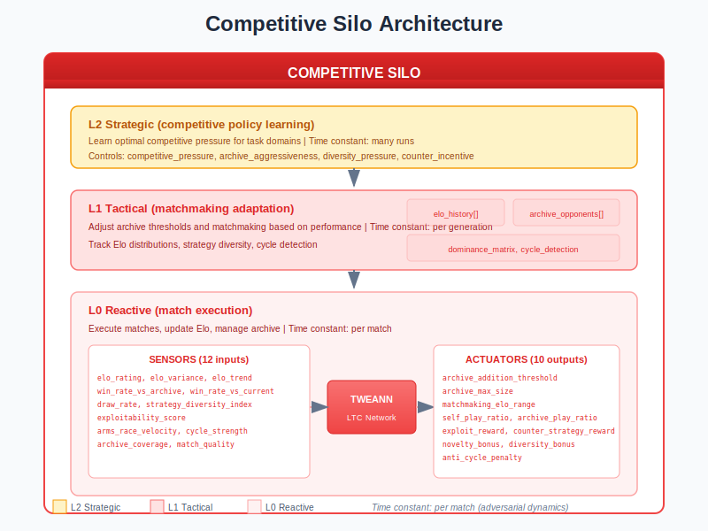
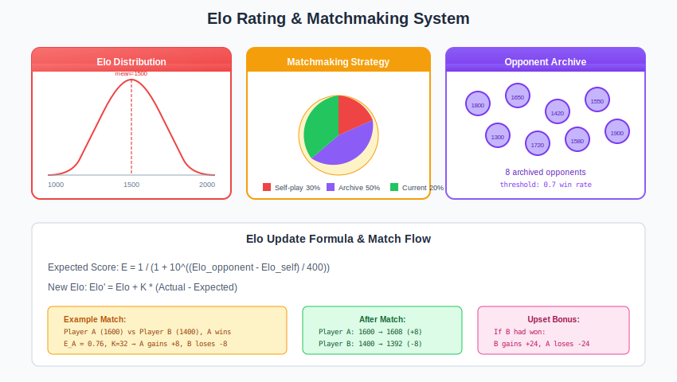
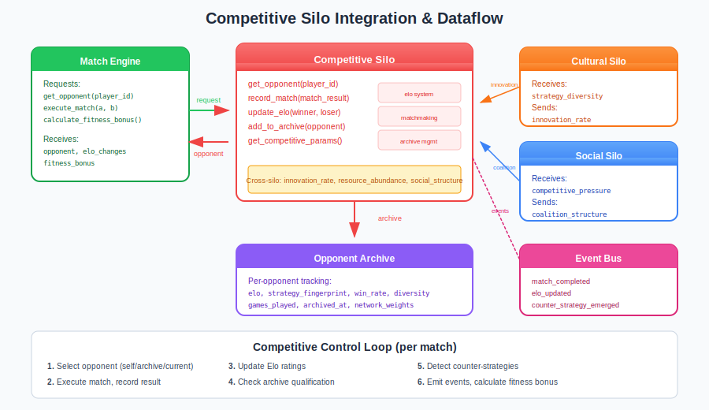

# Competitive Silo Guide

## What is the Competitive Silo?

The **Competitive Silo** is the adversarial dynamics controller in the Liquid Conglomerate architecture. It manages opponent archives, skill ratings (Elo), matchmaking, arms race detection, and strategic diversity. Without it, populations overfit to current opponents and fail against novel strategies.

Think of the Competitive Silo as a **tournament director for neural network evolution**. It maintains a hall of fame of past champions, rates skill levels, arranges fair matches, detects cycling meta-games, and rewards strategic innovation. This creates robust agents that succeed against diverse opponents.

The Competitive Silo solves several fundamental problems in adversarial neuroevolution:

1. **Overfitting**: Prevent specialization against only current opponents
2. **Skill Measurement**: Calibrated ratings for comparing agent capability
3. **Matchmaking**: Arrange informative matches that drive learning
4. **Arms Race Cycling**: Detect and break unproductive strategy cycles

## Architecture Overview



The Competitive Silo operates as a three-level hierarchical controller:

| Level | Name | Role | Time Constant |
|-------|------|------|---------------|
| **L0** | Reactive | Execute matches, update Elo, manage archive | Per match |
| **L1** | Tactical | Adjust matchmaking based on performance | Per generation |
| **L2** | Strategic | Learn optimal competitive pressure | Across runs |

### Key Principle: Diversity Through Competition

The Competitive Silo operates on the principle that strategic diversity matters:

- Archive preserves diverse historical strategies
- Matchmaking ensures skill-appropriate challenges
- Counter-strategy rewards drive innovation
- Cycle detection prevents unproductive arms races

## How It Works

### Sensors (Inputs)

The Competitive Silo observes 12 sensors describing adversarial dynamics:

| Sensor | Range | Description |
|--------|-------|-------------|
| `elo_rating` | [0, 1] | Population average Elo (normalized 0-3000) |
| `elo_variance` | [0, 1] | Variance in population Elo ratings |
| `elo_trend` | [-1, 1] | Direction of Elo change over generations |
| `win_rate_vs_archive` | [0, 1] | Win rate against archived opponents |
| `win_rate_vs_current` | [0, 1] | Win rate against current population |
| `draw_rate` | [0, 1] | Proportion of draws (stalemate indicator) |
| `strategy_diversity_index` | [0, 1] | Diversity of strategies in population |
| `exploitability_score` | [0, 1] | How exploitable by counter-strategies |
| `arms_race_velocity` | [0, 1] | Rate of counter-adaptation |
| `cycle_strength` | [0, 1] | Rock-paper-scissors cycling intensity |
| `archive_coverage` | [0, 1] | How well archive covers strategy space |
| `match_quality` | [0, 1] | Quality of recent matchups (close games) |

### Actuators (Outputs)

The Competitive Silo controls 10 parameters governing competitive dynamics:

| Actuator | Range | Default | Description |
|----------|-------|---------|-------------|
| `archive_addition_threshold` | [0.5, 0.95] | 0.7 | Win rate to qualify for archive |
| `archive_max_size` | [10, 1000] | 100 | Maximum archived opponents |
| `matchmaking_elo_range` | [50, 500] | 200 | Elo difference for fair matches |
| `self_play_ratio` | [0.0, 1.0] | 0.3 | Fraction of games vs self |
| `archive_play_ratio` | [0.0, 1.0] | 0.5 | Fraction of games vs archive |
| `exploit_reward` | [0.0, 1.0] | 0.1 | Fitness bonus for exploiting weakness |
| `counter_strategy_reward` | [0.0, 1.0] | 0.2 | Bonus for beating counters |
| `novelty_bonus` | [0.0, 0.5] | 0.1 | Bonus for novel strategies |
| `diversity_bonus` | [0.0, 0.5] | 0.1 | Bonus for diverse population |
| `anti_cycle_penalty` | [0.0, 0.3] | 0.05 | Penalty for cycling without progress |

### Elo Rating & Matchmaking



The Elo system provides calibrated skill measurement:

**1. Match Selection**
```erlang
%% Get opponent for an individual
{ok, Opponent} = competitive_silo:get_opponent(CompPid, PlayerId),
%% Opponent can be:
%%   self_play - play against self
%%   archived_opponent - from archive
%%   current_population - from active population
```

**2. Elo Update**
```erlang
%% After match completion
{DeltaWinner, DeltaLoser} = competitive_silo:update_elo(
    CompPid, WinnerId, LoserId, win),
%% Elo changes based on expected vs actual outcome
%% K-factor = 32 for standard play
```

**3. Archive Qualification**
```erlang
%% Check if agent qualifies for archive
case WinRateVsPopulation >= ArchiveThreshold of
    true ->
        competitive_silo:add_to_archive(CompPid, Opponent);
    false ->
        skip
end
```

### The Control Loop

1. **Per Match**: Select opponent, execute match, update Elo
2. **Per Generation**: Prune archive, detect cycles, adjust matchmaking
3. **Per Update Cycle**: Collect sensors, adjust actuators via TWEANN
4. **Emit Events**: Publish competitive events to event bus

## Integration with the Neuroevolution Engine



### Wiring Diagram

The Competitive Silo integrates with match execution and other silos:

**Data Sources:**
- `match_engine` - Match results, outcomes
- `strategy_analyzer` - Strategy fingerprints
- Elo rating system - Skill measurements

**Data Consumers:**
- `match_engine` - Opponent selection, fitness bonuses
- `selection` - Elo-based selection pressure
- `neuroevolution_events` - Event bus for monitoring

### Cross-Silo Interactions

The Competitive Silo exchanges signals with other silos:

**Signals Sent:**
| Signal | To | Description |
|--------|-----|-------------|
| `competitive_pressure` | Task | High pressure = faster adaptation needed |
| `strategy_diversity` | Cultural | Low diversity = encourage innovation |
| `arms_race_active` | Resource | Arms race = more compute needed |

**Signals Received:**
| Signal | From | Effect |
|--------|------|--------|
| `innovation_rate` | Cultural | High innovation = add to archive faster |
| `resource_abundance` | Ecological | Abundance = larger archive affordable |
| `social_structure` | Social | Coalitions may compete as groups |

### Engine Integration Points

```erlang
%% Start Competitive Silo
{ok, _} = competitive_silo:start_link(#competitive_config{
    enabled = true,
    initial_elo = 1500,
    k_factor = 32,
    max_archive_size = 100,
    emit_events = true
}),

%% Before match: select opponent
{ok, Opponent} = competitive_silo:get_opponent(CompPid, PlayerId),

%% After match: record result and get bonus
competitive_silo:record_match(CompPid, MatchResult),
Bonus = competitive_silo:calculate_fitness_bonus(CompPid, PlayerId, MatchResult),

%% Check for archive qualification
competitive_silo:add_to_archive(CompPid, WinningAgent).
```

## Training Velocity Impact

| Metric | Without Competitive Silo | With Competitive Silo |
|--------|-------------------------|----------------------|
| Strategy diversity | Low (convergent) | High (maintained) |
| Exploit vulnerability | High | Low |
| Match quality | Random | Skill-matched |
| Skill measurement | None | Calibrated Elo |
| Meta-game cycling | Undetected | Detected and penalized |

The Competitive Silo provides **significant robustness benefits** for adversarial domains.

## Practical Examples

### Example 1: Elo Update After Match

```erlang
%% Scenario: Player A (1600) beats Player B (1400)
%% Expected score for A: 1 / (1 + 10^((1400-1600)/400)) = 0.76

MatchResult = #match_result{
    player_a_id = <<"agent_a">>,
    player_b_id = <<"agent_b">>,
    player_a_elo = 1600,
    player_b_elo = 1400,
    outcome = win,
    winner_id = <<"agent_a">>
},

{DeltaA, DeltaB} = competitive_silo:update_elo(CompPid,
    <<"agent_a">>, <<"agent_b">>, win),
%% DeltaA = 32 * (1.0 - 0.76) = +8
%% DeltaB = 32 * (0.0 - 0.24) = -8

%% New Elos: A=1608, B=1392
```

### Example 2: Archive Qualification

```erlang
%% Scenario: Agent achieves 75% win rate vs population
%% archive_addition_threshold = 0.7

Agent = #archived_opponent{
    opponent_id = <<"champion_42">>,
    elo = 1850,
    strategy_fingerprint = [0.8, 0.2, 0.5, ...],
    win_rate_vs_population = 0.75,
    diversity_contribution = 0.6
},

ok = competitive_silo:add_to_archive(CompPid, Agent),

%% Event emitted:
{opponent_archived, #{
    opponent_id => <<"champion_42">>,
    elo => 1850,
    strategy_type => aggressive
}}
```

### Example 3: Counter-Strategy Detection

```erlang
%% Scenario: Agent B defeats Agent A who dominated for 5 generations

%% Event emitted:
{counter_strategy_emerged, #{
    counter_id => <<"agent_b">>,
    target_id => <<"agent_a">>,
    win_margin => 0.7,
    strategy_shift => [0.3, -0.5, 0.2, ...]
}}

%% Result: Agent B gets counter_strategy_reward bonus
%% Result: Arms race velocity sensor increases
```

## Tuning Guide

### Key Parameters

| Parameter | When to Increase | When to Decrease |
|-----------|------------------|------------------|
| `archive_addition_threshold` | Archive has low-quality opponents | Not enough diversity |
| `archive_max_size` | Need more strategy coverage | Memory constrained |
| `matchmaking_elo_range` | Matches too imbalanced | Not enough challenge |
| `self_play_ratio` | Want self-improvement focus | Overfit to self |
| `counter_strategy_reward` | Want more innovation | Unstable meta-game |
| `anti_cycle_penalty` | Strong cycling observed | Killing exploration |

### Common Pitfalls

1. **Empty archive**: No historical opponents to test against
   - Symptom: Agents specialize against current population only
   - Fix: Lower `archive_addition_threshold` to 0.6

2. **Elo convergence**: All agents at similar rating
   - Symptom: No skill differentiation
   - Fix: Increase `k_factor` to 48+

3. **Unproductive cycling**: Rock-paper-scissors without progress
   - Symptom: `cycle_strength` > 0.5, Elo not improving
   - Fix: Increase `anti_cycle_penalty` to 0.15+

4. **Stale archive**: Archive opponents outdated
   - Symptom: High `win_rate_vs_archive` but poor vs current
   - Fix: Enable archive pruning, lower `archive_max_size`

### Debugging Tips

```erlang
%% Get opponent Elo
Elo = competitive_silo:get_elo(CompPid, IndividualId),
io:format("Elo: ~p~n", [Elo]),

%% Get archive status
Archive = competitive_silo:get_archive(CompPid),
io:format("Archive size: ~p~n", [length(Archive)]),
io:format("Elo range: ~p to ~p~n", [
    lists:min([O#archived_opponent.elo || O <- Archive]),
    lists:max([O#archived_opponent.elo || O <- Archive])
]),

%% Check competitive pressure
Pressure = competitive_silo:signal_competitive_pressure(CompPid),
io:format("Competitive pressure: ~.2f~n", [Pressure]).
```

## Events Reference

The Competitive Silo emits events on significant actions:

| Event | Trigger | Key Payload |
|-------|---------|-------------|
| `opponent_archived` | Added to archive | `opponent_id`, `elo`, `strategy_type` |
| `opponent_retired` | Removed from archive | `opponent_id`, `reason` |
| `elo_updated` | Rating changed | `winner_id`, `loser_id`, `delta` |
| `match_completed` | Game finished | `players`, `outcome`, `elo_changes` |
| `counter_strategy_emerged` | Beat champion | `counter_id`, `target_id`, `win_margin` |
| `arms_race_detected` | Cycling strategies | `cycle_participants`, `cycle_length` |
| `exploitable_strategy_found` | Weakness discovered | `strategy_id`, `exploit_id` |

**Example Event Payload:**
```erlang
{match_completed, #{
    silo => competitive,
    timestamp => 1703318400000,
    generation => 42,
    payload => #{
        player_a => <<"agent_a">>,
        player_b => <<"agent_b">>,
        outcome => win,
        margin => 0.65,
        elo_change_a => 12,
        elo_change_b => -12
    }
}}
```

## L0 Hyperparameters (L1-Tuned)

| Parameter | Range | Default | Description |
|-----------|-------|---------|-------------|
| `initial_elo` | [1000, 2000] | 1500 | Starting Elo for new agents |
| `k_factor` | [16, 64] | 32 | Elo update magnitude |
| `min_archive_size` | [10, 50] | 10 | Minimum archived opponents |
| `max_archive_size` | [50, 1000] | 100 | Maximum archived opponents |
| `min_games_per_generation` | [3, 20] | 5 | Minimum matches per agent |

## L1 Hyperparameters (L2-Tuned)

| Parameter | Range | Default | Description |
|-----------|-------|---------|-------------|
| `competitive_pressure` | [0.0, 1.0] | 0.5 | How aggressive competition is |
| `archive_aggressiveness` | [0.0, 1.0] | 0.5 | Archive management strictness |
| `diversity_pressure` | [0.0, 1.0] | 0.5 | Pressure for strategic diversity |
| `counter_incentive` | [0.0, 1.0] | 0.5 | Counter-strategy reward level |

## Configuration Examples

### Tournament Mode
```erlang
#competitive_config{
    enabled = true,
    initial_elo = 1500,
    k_factor = 32,
    min_archive_size = 50,
    max_archive_size = 500,
    archive_diversity_weight = 0.3,
    min_games_per_generation = 20,
    emit_events = true
}.

%% Many games, large archive, standard K-factor
```

### Exploration Mode
```erlang
#competitive_config{
    enabled = true,
    initial_elo = 1500,
    k_factor = 16,                   % Slower Elo changes
    min_archive_size = 100,
    max_archive_size = 1000,
    archive_diversity_weight = 0.7,  % Prioritize diversity
    min_games_per_generation = 5,
    emit_events = true
}.

%% Large diverse archive, slow skill tracking
```

### Rapid Development
```erlang
#competitive_config{
    enabled = true,
    initial_elo = 1500,
    k_factor = 64,           % Fast Elo updates
    min_archive_size = 10,
    max_archive_size = 50,   % Small archive
    archive_diversity_weight = 0.5,
    min_games_per_generation = 3,
    emit_events = true
}.

%% Quick iteration, fast skill changes
```

## Source Code Reference

| Module | Purpose | Location |
|--------|---------|----------|
| `competitive_silo.erl` | Main gen_server | `src/silos/competitive_silo/` |
| `competitive_silo_sensors.erl` | Sensor collection (12) | Same |
| `competitive_silo_actuators.erl` | Actuator application (10) | Same |
| `competitive_silo.hrl` | Record definitions | Same |
| `competitive_elo.erl` | Elo rating system | Same |
| `competitive_archive.erl` | Archive management | Same |
| `competitive_matchmaking.erl` | Opponent selection | Same |
| `lc_cross_silo.erl` | Cross-silo signals | `src/silos/` |

## Further Reading

- [Liquid Conglomerate Overview](../liquid-conglomerate.md) - Full LC architecture
- [Cultural Silo](cultural-silo.md) - Innovation and meme propagation
- [Social Silo](social-silo.md) - Coalition and cooperation
- [Task Silo](task-silo.md) - Hyperparameter adaptation
- [Meta-Controller Guide](../meta-controller.md) - L2 strategic layer

## References

### Elo Rating System
- Elo, A.E. (1978). "The Rating of Chessplayers, Past and Present." Arco Publishing.
- Glickman, M.E. (1999). "Parameter Estimation in Large Dynamic Paired Comparison Experiments." Applied Statistics.

### Coevolutionary Dynamics
- Rosin, C.D. & Belew, R.K. (1997). "New Methods for Competitive Coevolution." Evolutionary Computation.
- Ficici, S.G. & Pollack, J.B. (2003). "A Game-Theoretic Approach to Coevolution." GECCO.

### Archive Methods
- De Jong, E.D. (2004). "The Incremental Pareto-Coevolution Archive." GECCO.
- Stanley, K.O. & Lehman, J. (2015). "Why Greatness Cannot Be Planned." Springer.
