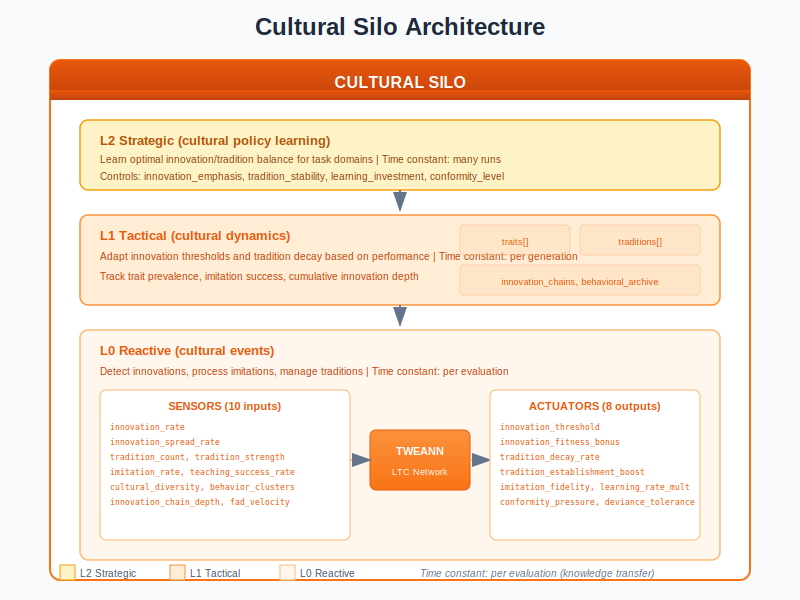
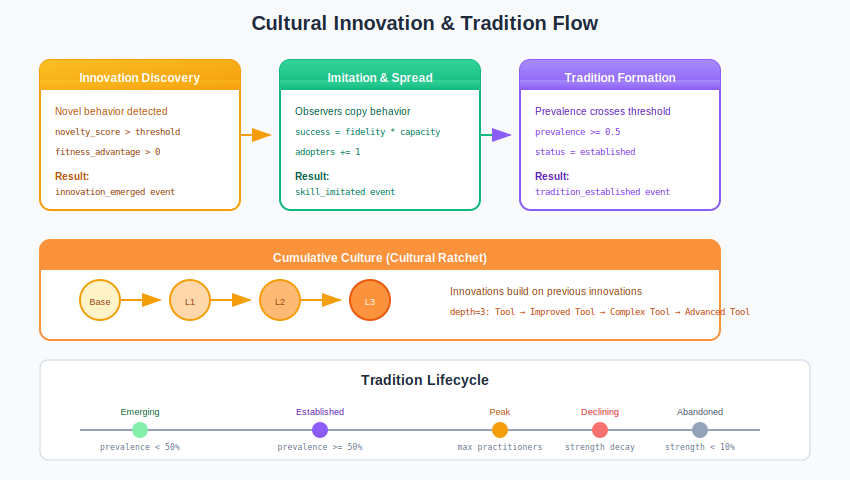
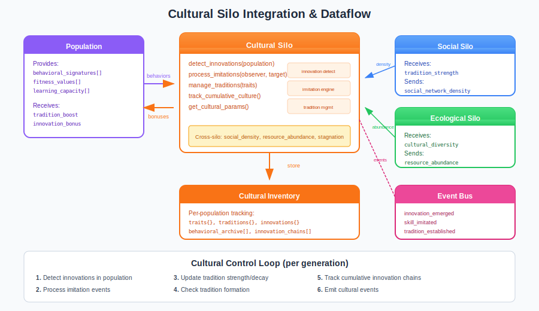

# Cultural Silo Guide

## What is the Cultural Silo?

The **Cultural Silo** is the knowledge transmission controller in the Liquid Conglomerate architecture. It manages innovation detection, imitation learning, tradition formation, and cumulative culture. Without it, populations can only evolve through slow genetic selection, missing the rapid adaptation enabled by cultural learning.

Think of the Cultural Silo as a **knowledge curator for neural network evolution**. It tracks novel behaviors, facilitates imitation between individuals, establishes traditions from successful patterns, and maintains chains of cumulative innovation. This creates populations that learn and adapt faster than genetics alone could achieve.

The Cultural Silo solves several fundamental problems in neuroevolution:

1. **Knowledge Loss**: Beneficial behaviors die with individuals
2. **Slow Adaptation**: Genetic evolution alone is too slow for changing environments
3. **Reinvention**: Populations repeatedly discover the same solutions
4. **Innovation Tracking**: No visibility into how behaviors emerge and spread

## Architecture Overview



The Cultural Silo operates as a three-level hierarchical controller:

| Level | Name | Role | Time Constant |
|-------|------|------|---------------|
| **L0** | Reactive | Detect innovations, process imitation, manage traditions | Per evaluation |
| **L1** | Tactical | Track trait prevalence, adjust thresholds | Per generation |
| **L2** | Strategic | Learn optimal innovation/tradition balance | Across runs |

### Key Principle: Cultural Ratchet

The Cultural Silo operates on the principle that **cumulative culture accelerates evolution**:

- Innovations build on previous innovations (ratchet effect)
- Horizontal transmission spreads knowledge quickly
- Traditions preserve successful patterns
- Imitation enables rapid skill acquisition

### Distinction from Genetic Evolution

| Aspect | Genetic | Cultural |
|--------|---------|----------|
| **Inheritance** | Parent → Offspring | Any → Any (horizontal) |
| **Timescale** | Generations | Within generations |
| **Mechanism** | DNA replication | Observation/teaching |
| **Fidelity** | High (mutations rare) | Variable (imperfect copying) |
| **Accumulation** | Slow | Rapid (ratchet effect) |

## How It Works

### Sensors (Inputs)

The Cultural Silo observes 10 sensors describing cultural dynamics:

| Sensor | Range | Description |
|--------|-------|-------------|
| `innovation_rate` | [0, 1] | Rate of new innovations per generation |
| `innovation_spread_rate` | [0, 1] | How fast innovations spread through population |
| `tradition_count` | [0, 1] | Number of active traditions (normalized) |
| `tradition_strength` | [0, 1] | Average strength of traditions |
| `imitation_rate` | [0, 1] | Rate of successful imitation events |
| `teaching_success_rate` | [0, 1] | Success rate of teaching attempts |
| `cultural_diversity` | [0, 1] | Diversity of behaviors in population |
| `behavior_cluster_count` | [0, 1] | Number of distinct behavioral clusters |
| `innovation_chain_depth` | [0, 1] | Max depth of cumulative innovation chains |
| `fad_velocity` | [0, 1] | Speed of fad rise and fall |

### Actuators (Outputs)

The Cultural Silo controls 8 parameters governing cultural dynamics:

| Actuator | Range | Default | Description |
|----------|-------|---------|-------------|
| `innovation_threshold` | [0.1, 0.9] | 0.5 | Novelty required to count as innovation |
| `innovation_fitness_bonus` | [0.0, 0.5] | 0.2 | Fitness bonus for innovators |
| `tradition_decay_rate` | [0.0, 0.3] | 0.05 | Rate at which traditions weaken |
| `tradition_establishment_boost` | [1.0, 2.0] | 1.2 | Fitness multiplier for practitioners |
| `imitation_fidelity` | [0.5, 1.0] | 0.8 | Accuracy of behavior copying |
| `learning_rate_multiplier` | [0.5, 2.0] | 1.0 | Speed of cultural learning |
| `conformity_pressure` | [0.0, 1.0] | 0.3 | Pressure to adopt common behaviors |
| `deviance_tolerance` | [0.0, 1.0] | 0.5 | Tolerance for non-conforming behaviors |

### Innovation & Tradition Flow



The cultural lifecycle follows three stages:

**1. Innovation Discovery**
```erlang
%% Novel behavior detected
case NoveltyScore >= Config#cultural_config.innovation_threshold of
    true when FitnessAdvantage > 0 ->
        %% Create innovation record
        {innovation, create_innovation(Individual, Behavior)};
    _ ->
        not_innovative
end
```

**2. Imitation & Spread**
```erlang
%% Behavior spreads through population
SuccessProbability = Fidelity * ObserverCapacity * TargetClarity,
case rand:uniform() < SuccessProbability of
    true ->
        %% Successful imitation, add to adopters
        {success, add_practitioner(TraitId, ObserverId)};
    false ->
        {failure, imitation_failed}
end
```

**3. Tradition Formation**
```erlang
%% High prevalence becomes tradition
case Trait#cultural_trait.current_prevalence >= 0.5 of
    true ->
        %% Trait becomes established tradition
        {tradition, create_tradition(Trait)};
    false ->
        not_yet
end
```

### The Control Loop

1. **Per Evaluation**: Detect innovations, process imitation events
2. **Per Generation**: Update tradition strength/decay, check formation
3. **Per Update Cycle**: Collect sensors, adjust actuators via TWEANN
4. **Emit Events**: Publish cultural events to event bus

## Integration with the Neuroevolution Engine



### Wiring Diagram

The Cultural Silo integrates with population and other silos:

**Data Sources:**
- `population` - Behavioral signatures, fitness values, learning capacity
- `behavioral_archive` - Historical behavior patterns
- Cross-silo signals from Social and Ecological silos

**Data Consumers:**
- `population` - Tradition boosts, innovation bonuses
- `selection` - Cultural fitness adjustments
- `neuroevolution_events` - Event bus for monitoring

### Cross-Silo Interactions

The Cultural Silo exchanges signals with other silos:

**Signals Sent:**
| Signal | To | Description |
|--------|-----|-------------|
| `innovation_rate` | Task | High innovation = try new strategies |
| `tradition_strength` | Social | Strong traditions = social stability |
| `cultural_diversity` | Ecological | Diverse cultures = adaptive capacity |

**Signals Received:**
| Signal | From | Effect |
|--------|------|--------|
| `social_network_density` | Social | Dense networks = faster spread |
| `resource_abundance` | Ecological | Abundance = more innovation time |
| `stagnation_severity` | Task | Stagnation = increase innovation bonus |

### Engine Integration Points

```erlang
%% Start Cultural Silo
{ok, _} = cultural_silo:start_link(#cultural_config{
    enabled = true,
    innovation_threshold = 0.5,
    imitation_fidelity = 0.8,
    tradition_decay_rate = 0.05,
    emit_events = true
}),

%% After fitness evaluation: detect innovations
Innovations = cultural_silo:detect_innovations(CultPid, Population),

%% Process imitation between individuals
cultural_silo:process_imitations(CultPid, ObserverTargetPairs),

%% Get cultural bonuses for selection
Bonuses = cultural_silo:get_cultural_bonuses(CultPid, PopulationIds).
```

## Training Velocity Impact

| Metric | Without Cultural Silo | With Cultural Silo |
|--------|----------------------|-------------------|
| Knowledge transfer | Genetic only (slow) | Horizontal + vertical (fast) |
| Training velocity | Baseline (1.0x) | Improved (1.2-1.5x) |
| Inference latency | No overhead | +1-3ms for tradition lookup |
| Convergence speed | Slow (genetic only) | Fast (cultural ratchet) |
| Innovation preservation | Lost on death | Persists in traditions |

The Cultural Silo provides **significant velocity benefits** through cumulative culture.

## Practical Examples

### Example 1: Innovation Detection

```erlang
%% Scenario: Individual discovers novel navigation behavior
%% novelty_score = 0.7, fitness_advantage = +0.15

Behavior = extract_behavioral_signature(Individual),
PopulationBehaviors = get_all_behaviors(Population),

case cultural_innovation:detect_innovation(
    Individual, Behavior, PopulationBehaviors, Config) of
    {innovation, Innovation} ->
        %% Innovation recorded
        io:format("Innovation ~p emerged from ~p~n",
            [Innovation#innovation.id, Individual#individual.id]),

        %% Event emitted:
        {innovation_emerged, #{
            innovator_id => <<"agent_42">>,
            novelty_score => 0.7,
            fitness_advantage => 0.15,
            innovation_type => navigation
        }};
    not_innovative ->
        %% Below threshold or no fitness advantage
        skip
end.
```

### Example 2: Imitation Success

```erlang
%% Scenario: Agent B observes and copies Agent A's foraging behavior

Observer = get_individual(<<"agent_b">>),
Target = get_individual(<<"agent_a">>),

%% Calculate success probability
%% fidelity=0.8, observer_capacity=0.9, target_clarity=0.85
%% success_prob = 0.8 * 0.9 * 0.85 = 0.612

case cultural_imitation:imitate(Observer, Target, Config) of
    {success, Trait} ->
        %% Event emitted:
        {skill_imitated, #{
            observer_id => <<"agent_b">>,
            target_id => <<"agent_a">>,
            trait_id => Trait#cultural_trait.id,
            fidelity => 0.612
        }};
    {failure, Reason} ->
        %% Imitation failed (probability check)
        {learning_failed, #{reason => Reason}}
end.
```

### Example 3: Tradition Formation

```erlang
%% Scenario: Tool-use behavior reaches 55% prevalence

Trait = get_cultural_trait(<<"tool_use_trait">>),
%% current_prevalence = 0.55, threshold = 0.50

case cultural_traditions:check_tradition_formation(Trait, Config) of
    {tradition, Tradition} ->
        %% New tradition established
        %% Event emitted:
        {tradition_established, #{
            tradition_id => Tradition#tradition.id,
            trait_id => <<"tool_use_trait">>,
            prevalence => 0.55,
            practitioner_count => 110
        }};
    not_yet ->
        %% Below threshold, keep tracking
        skip
end.
```

### Example 4: Cumulative Culture Chain

```erlang
%% Scenario: Innovation builds on two previous innovations
%% Base → Tool → Improved Tool → Complex Tool (depth=3)

NewInnovation = #innovation{
    id = <<"complex_tool">>,
    trait_id = <<"complex_tool_trait">>,
    novelty_score = 0.6
},

ParentInnovations = [
    get_innovation(<<"improved_tool">>),  % depth=2
    get_innovation(<<"basic_material">>)  % depth=1
],

cultural_innovation:register_innovation_dependency(
    NewInnovation, ParentInnovations),

%% Event emitted:
{cumulative_innovation, #{
    innovation_id => <<"complex_tool">>,
    parent_innovations => [<<"improved_tool">>, <<"basic_material">>],
    chain_depth => 3
}}.
```

## Tuning Guide

### Key Parameters

| Parameter | When to Increase | When to Decrease |
|-----------|------------------|------------------|
| `innovation_threshold` | Too many trivial innovations | Missing real innovations |
| `innovation_fitness_bonus` | Want more exploration | Over-rewarding novelty |
| `tradition_decay_rate` | Stale traditions persist | Traditions die too fast |
| `imitation_fidelity` | Behaviors not spreading | Want more variation |
| `conformity_pressure` | Population too scattered | Killing diversity |
| `deviance_tolerance` | Innovations suppressed | Too much noise |

### Common Pitfalls

1. **Innovation explosion**: Too many innovations tracked
   - Symptom: `innovation_rate` > 0.5, memory growing
   - Fix: Increase `innovation_threshold` to 0.6+

2. **Cultural stagnation**: No new innovations detected
   - Symptom: `innovation_rate` ≈ 0, traditions dominate
   - Fix: Decrease `innovation_threshold`, increase `deviance_tolerance`

3. **Failed imitation**: Low spread despite innovations
   - Symptom: `innovation_spread_rate` < 0.1
   - Fix: Increase `imitation_fidelity`, check `social_network_density`

4. **Tradition churn**: Traditions form and die rapidly
   - Symptom: High `tradition_count` variance, low stability
   - Fix: Decrease `tradition_decay_rate` to 0.02

### Debugging Tips

```erlang
%% Get current cultural state
State = cultural_silo:get_state(CultPid),
io:format("Innovation rate: ~.2f~n", [State#cultural_state.innovation_rate]),
io:format("Active traditions: ~p~n", [State#cultural_state.tradition_count]),
io:format("Max chain depth: ~p~n", [State#cultural_state.max_chain_depth]),

%% List active traditions
Traditions = cultural_silo:get_traditions(CultPid),
lists:foreach(fun(T) ->
    io:format("Tradition ~p: strength=~.2f, practitioners=~p~n",
        [T#tradition.id, T#tradition.strength, T#tradition.practitioner_count])
end, Traditions),

%% Check innovation chains
Innovations = cultural_silo:get_innovations(CultPid),
DeepInnovations = [I || I <- Innovations,
    get_trait(I#innovation.trait_id)#cultural_trait.innovation_depth > 2],
io:format("Deep innovations (depth>2): ~p~n", [length(DeepInnovations)]).
```

## Events Reference

The Cultural Silo emits events on significant actions:

| Event | Trigger | Key Payload |
|-------|---------|-------------|
| `innovation_emerged` | Novel beneficial behavior | `innovator_id`, `novelty_score`, `fitness_advantage` |
| `innovation_spread` | Adoption by others | `innovation_id`, `adopter_id`, `adopter_count` |
| `tradition_established` | Trait became tradition | `tradition_id`, `prevalence`, `practitioner_count` |
| `tradition_abandoned` | Tradition died out | `tradition_id`, `final_strength`, `lifespan` |
| `skill_imitated` | Successful imitation | `observer_id`, `target_id`, `fidelity` |
| `learning_failed` | Failed knowledge transfer | `observer_id`, `target_id`, `reason` |
| `cumulative_innovation` | Built on prior innovations | `innovation_id`, `parent_ids`, `chain_depth` |
| `cultural_drift` | Population behavior shift | `drift_magnitude`, `drift_direction` |

**Example Event Payload:**
```erlang
{innovation_emerged, #{
    silo => cultural,
    timestamp => 1703318400000,
    generation => 42,
    payload => #{
        innovator_id => <<"agent_42">>,
        innovation_id => <<"innov_abc123">>,
        innovation_type => navigation,
        novelty_score => 0.72,
        fitness_advantage => 0.15,
        emerged_at => 1703318400000
    }
}}
```

## L0 Hyperparameters (L1-Tuned)

| Parameter | Range | Default | Description |
|-----------|-------|---------|-------------|
| `innovation_threshold` | [0.1, 0.9] | 0.5 | Novelty to count as innovation |
| `tradition_establishment_threshold` | [0.3, 0.7] | 0.5 | Prevalence to form tradition |
| `max_traditions` | [5, 50] | 20 | Maximum tracked traditions |
| `max_innovations` | [10, 100] | 50 | Maximum tracked innovations |
| `behavioral_archive_size` | [50, 500] | 100 | Historical behavior storage |

## L1 Hyperparameters (L2-Tuned)

| Parameter | Range | Default | Description |
|-----------|-------|---------|-------------|
| `innovation_emphasis` | [0.0, 1.0] | 0.5 | How much to reward innovation |
| `tradition_stability` | [0.0, 1.0] | 0.5 | How stable traditions should be |
| `learning_investment` | [0.0, 1.0] | 0.5 | Resources for imitation |
| `conformity_level` | [0.0, 1.0] | 0.5 | Balance innovation vs conformity |

## Configuration Examples

### Innovation-Focused Mode
```erlang
#cultural_config{
    enabled = true,
    innovation_threshold = 0.4,        % Lower bar for innovations
    innovation_fitness_bonus = 0.3,    % Higher innovator reward
    tradition_decay_rate = 0.1,        % Traditions fade faster
    imitation_fidelity = 0.7,          % Some copying variation
    conformity_pressure = 0.2,         % Low conformity
    deviance_tolerance = 0.8,          % High tolerance for difference
    emit_events = true
}.

%% For exploration-heavy phases, early evolution
```

### Tradition-Focused Mode
```erlang
#cultural_config{
    enabled = true,
    innovation_threshold = 0.7,        % Higher bar for innovations
    innovation_fitness_bonus = 0.1,    % Lower innovator reward
    tradition_decay_rate = 0.02,       % Traditions persist longer
    tradition_establishment_boost = 1.5, % Strong tradition bonus
    imitation_fidelity = 0.95,         % High-fidelity copying
    conformity_pressure = 0.6,         % Higher conformity
    deviance_tolerance = 0.3,          % Less tolerance
    emit_events = true
}.

%% For exploitation phases, stable populations
```

### Balanced Mode
```erlang
#cultural_config{
    enabled = true,
    innovation_threshold = 0.5,
    innovation_fitness_bonus = 0.2,
    tradition_decay_rate = 0.05,
    tradition_establishment_boost = 1.2,
    imitation_fidelity = 0.8,
    learning_rate_multiplier = 1.0,
    conformity_pressure = 0.3,
    deviance_tolerance = 0.5,
    emit_events = true
}.

%% Default balanced configuration
```

## Source Code Reference

| Module | Purpose | Location |
|--------|---------|----------|
| `cultural_silo.erl` | Main gen_server | `src/silos/cultural_silo/` |
| `cultural_silo_sensors.erl` | Sensor collection (10) | Same |
| `cultural_silo_actuators.erl` | Actuator application (8) | Same |
| `cultural_silo.hrl` | Record definitions | Same |
| `cultural_innovation.erl` | Innovation detection | Same |
| `cultural_traditions.erl` | Tradition management | Same |
| `cultural_imitation.erl` | Imitation mechanics | Same |
| `cultural_drift.erl` | Population drift | Same |
| `lc_cross_silo.erl` | Cross-silo signals | `src/silos/` |

## Further Reading

- [Liquid Conglomerate Overview](../liquid-conglomerate.md) - Full LC architecture
- [Social Silo](social-silo.md) - Network structure and cooperation
- [Ecological Silo](ecological-silo.md) - Resource dynamics
- [Competitive Silo](competitive-silo.md) - Adversarial dynamics
- [Meta-Controller Guide](../meta-controller.md) - L2 strategic layer

## References

### Cultural Evolution
- Henrich, J. (2015). "The Secret of Our Success." Princeton University Press.
- Boyd, R. & Richerson, P.J. (1985). "Culture and the Evolutionary Process." University of Chicago Press.
- Mesoudi, A. (2011). "Cultural Evolution." University of Chicago Press.

### Cumulative Culture
- Tomasello, M. (1999). "The Cultural Origins of Human Cognition." Harvard University Press.
- Dean, L.G. et al. (2012). "Identification of the Social and Cognitive Processes Underlying Human Cumulative Culture." Science.

### Imitation & Learning
- Rendell, L. et al. (2010). "Why Copy Others? Insights from the Social Learning Strategies Tournament." Science.
- Laland, K.N. (2004). "Social Learning Strategies." Learning & Behavior.
