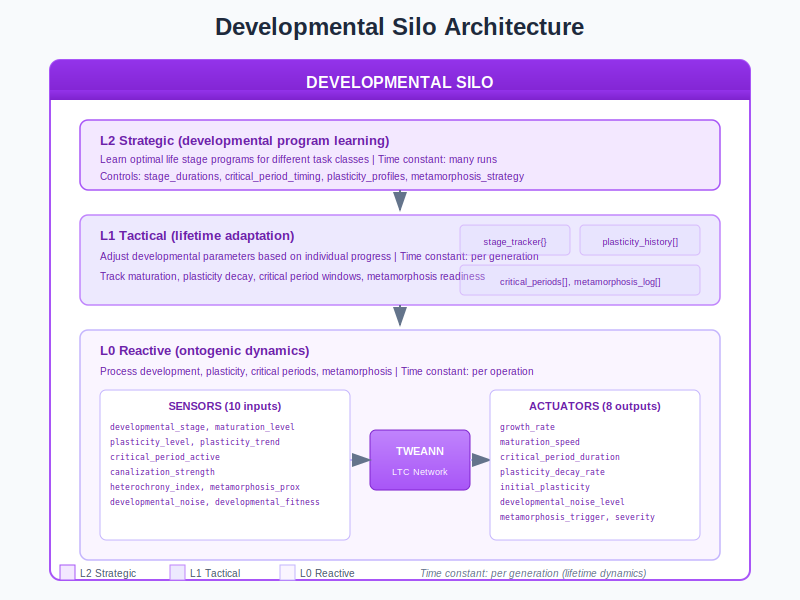
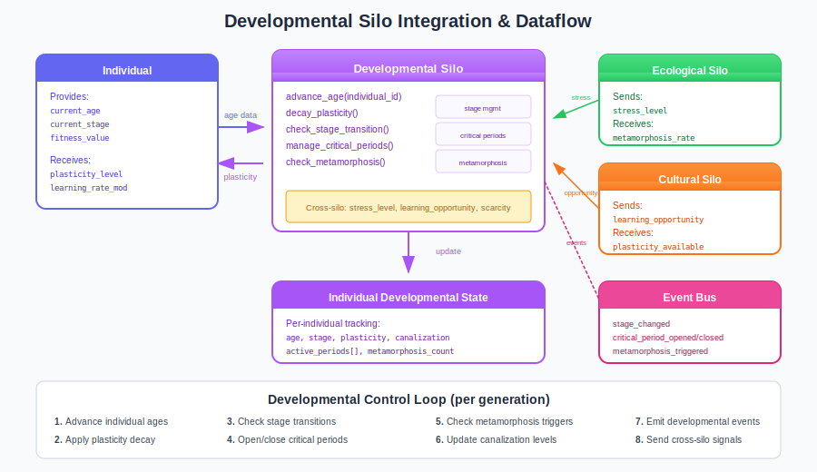

# Developmental Silo Guide

The Developmental Silo manages ontogeny - how individuals develop over their lifetime. Instead of networks being born fully formed, they grow through stages, experience critical periods, and can undergo metamorphosis. This mirrors biological development.

## Overview

Traditional neuroevolution treats networks as static entities. The Developmental Silo introduces lifetime dynamics:

- **Developmental stages** - Progress from embryonic to adult to senescent
- **Plasticity decay** - Learning capacity decreases with age
- **Critical periods** - Time-limited windows for specific learning
- **Metamorphosis** - Radical structural reorganization
- **Canalization** - Traits become increasingly stable



## Why Developmental Dynamics?

| Static Networks | Developmental Networks |
|-----------------|------------------------|
| Fixed at birth | Grow and mature |
| Uniform learning rate | Age-appropriate plasticity |
| No critical periods | Focused learning windows |
| Cannot radically adapt | Metamorphosis enables transformation |
| Brittle to deployment change | Lifetime adaptation |

## Architecture

The Developmental Silo uses TWEANN controllers at three levels:

| Level | Time Constant | Controls |
|-------|---------------|----------|
| **L2 Strategic** | Many runs | Optimal developmental programs for task classes |
| **L1 Tactical** | Per generation | Adapt parameters to individual progress |
| **L0 Reactive** | Per operation | Process aging, plasticity, stages |

### Sensors (10 inputs)

The L0 controller receives 10 developmental measurements:

| Sensor | Range | Description |
|--------|-------|-------------|
| `developmental_stage` | [0.0, 1.0] | Progress through development (0=birth, 1=mature) |
| `maturation_level` | [0.0, 1.0] | Physiological maturity |
| `plasticity_level` | [0.0, 1.0] | Current learning capacity |
| `plasticity_trend` | [-1.0, 1.0] | Direction of plasticity change |
| `critical_period_active` | [0.0, 1.0] | Intensity of active critical period |
| `canalization_strength` | [0.0, 1.0] | Resistance to perturbation |
| `heterochrony_index` | [0.0, 1.0] | Timing variation from population mean |
| `metamorphosis_proximity` | [0.0, 1.0] | Distance to metamorphosis threshold |
| `developmental_noise` | [0.0, 1.0] | Random variation in development |
| `developmental_fitness` | [0.0, 1.0] | Fitness relative to developmental stage |

### Actuators (8 outputs)

The controller adjusts 8 developmental parameters:

| Actuator | Range | Default | Effect |
|----------|-------|---------|--------|
| `growth_rate` | [0.0, 0.2] | 0.05 | Speed of structural growth |
| `maturation_speed` | [0.0, 0.1] | 0.02 | Speed of physiological maturation |
| `critical_period_duration` | [1, 20] | 5 | Generations critical period lasts |
| `plasticity_decay_rate` | [0.0, 0.2] | 0.05 | How fast plasticity decreases |
| `initial_plasticity` | [0.5, 1.0] | 0.9 | Plasticity at birth |
| `developmental_noise_level` | [0.0, 0.3] | 0.1 | Stochasticity in development |
| `metamorphosis_trigger` | [0.5, 0.95] | 0.8 | Threshold for metamorphosis |
| `metamorphosis_severity` | [0.0, 1.0] | 0.5 | How drastic metamorphosis is |

## Developmental Dynamics


### Developmental Stages

Individuals progress through five life stages:

| Stage | Duration | Plasticity | Characteristics |
|-------|----------|------------|-----------------|
| **Embryonic** | 5 gen | 0.9-1.0 | High growth, sensory critical periods |
| **Juvenile** | 15 gen | 0.7-0.9 | Sensory/motor critical periods |
| **Adolescent** | 20 gen | 0.4-0.7 | Cognitive/social critical periods |
| **Adult** | 40 gen | 0.2-0.4 | Stable, low plasticity |
| **Senescent** | 20 gen | 0.1-0.2 | Minimal plasticity, reduced mutation |

Each stage has:
- Different mutation rate modifiers
- Available critical period types
- Appropriate plasticity ranges

### Plasticity Decay

Plasticity decreases with age, following exponential decay:

```
plasticity(t+1) = plasticity(t) * (1 - decay_rate)
```

| Young Networks | Old Networks |
|----------------|--------------|
| High plasticity (0.9) | Low plasticity (0.1) |
| Fast learning | Slow learning |
| Unstable behavior | Stable behavior |
| High variability | Canalized traits |

The `min_plasticity` floor (typically 0.1) prevents complete rigidity.

### Critical Periods

Critical periods are time-limited windows where learning is enhanced:

| Period Type | Stage | Effect |
|-------------|-------|--------|
| **Sensory** | Embryonic, Juvenile | 2x learning rate for sensory processing |
| **Motor** | Juvenile | 2x learning rate for motor control |
| **Cognitive** | Adolescent | 2x learning rate for reasoning |
| **Social** | Adolescent | 2x learning rate for social behavior |

**During critical period:**
```erlang
effective_learning_rate = base_learning_rate * 2.0
```

Critical periods:
- Open automatically based on stage
- Close after `critical_period_duration` generations
- Cannot be reopened once closed
- Record what learning was acquired

### Metamorphosis

Metamorphosis allows radical transformation:

```erlang
%% Metamorphosis resets plasticity and reduces canalization
new_plasticity = initial_plasticity * severity + old_plasticity * (1 - severity)
new_canalization = old_canalization * (1 - severity)
```

| Before Metamorphosis | After Metamorphosis |
|---------------------|---------------------|
| Low plasticity (0.2) | High plasticity (0.7) |
| High canalization (0.8) | Low canalization (0.2) |
| Stable but rigid | Flexible and adaptable |

**Metamorphosis triggers:**
- Maturation progress exceeds `metamorphosis_trigger` threshold
- Maximum 3 metamorphoses per lifetime (`max_metamorphoses`)
- 20% probability when conditions met

### Canalization

Canalization measures resistance to perturbation:

| Low Canalization | High Canalization |
|------------------|-------------------|
| High variability | Stable traits |
| Easy to modify | Difficult to change |
| Exploratory behavior | Exploitative behavior |

Canalization increases with age and successful behavior, but metamorphosis resets it.

### Heterochrony

Heterochrony measures developmental timing relative to population:

- **Precocious** (early developers) - Mature faster, reach adult stage sooner
- **Delayed** (late developers) - Extended juvenile/adolescent periods

The `heterochrony_index` sensor tracks this:
```erlang
z_score = abs(individual_age - population_mean_age) / population_std_age
heterochrony_index = clamp(z_score / 4.0 + 0.5, 0.0, 1.0)
```

## Integration with Other Silos



### Outgoing Signals

| Signal | To Silo | Trigger |
|--------|---------|---------|
| `maturity_distribution` | Task | Average population maturity |
| `plasticity_available` | Cultural | Average plasticity level |
| `metamorphosis_rate` | Ecological | Metamorphoses per generation |
| `growth_stage` | Morphological | Current developmental stage |
| `critical_timing` | Temporal | Critical period activity |

### Incoming Signals

| Signal | From Silo | Effect |
|--------|-----------|--------|
| `stress_level` | Ecological | Stress > 0.7 accelerates maturation |
| `learning_opportunity` | Cultural | Opportunity > 0.5 extends critical periods |
| `resource_scarcity` | Resource | Scarcity > 0.6 accelerates growth |
| `social_mentoring` | Social | Mentoring affects critical period learning |

### Signal Examples

```erlang
%% Receive stress from ecological silo
handle_cast({cross_silo, stress_level, Stress}, State) when Stress > 0.7 ->
    %% High stress accelerates maturation
    NewSpeed = State#developmental_state.maturation_speed * 1.5,
    {noreply, State#developmental_state{maturation_speed = min(0.1, NewSpeed)}};

%% Send plasticity signal to cultural silo
signal_plasticity_available(Pid) ->
    IndStates = maps:values(State#developmental_state.individual_states),
    Plasticities = [I#individual_dev_state.plasticity || I <- IndStates],
    AvgPlasticity = lists:sum(Plasticities) / length(Plasticities),
    clamp(AvgPlasticity, 0.0, 1.0).
```

## Events Emitted

| Event | Payload | Trigger |
|-------|---------|---------|
| `development_stage_changed` | `{individual_id, old_stage, new_stage}` | Stage transition |
| `critical_period_opened` | `{individual_id, period_type, duration}` | Period began |
| `critical_period_closed` | `{individual_id, period_type, learning_acquired}` | Period ended |
| `plasticity_decreased` | `{individual_id, old_level, new_level}` | Plasticity decayed |
| `maturation_completed` | `{individual_id, final_structure, age}` | Fully mature |
| `metamorphosis_triggered` | `{individual_id, severity, new_plasticity}` | Radical change |
| `developmental_milestone` | `{individual_id, milestone, age}` | Key achievement |
| `canalization_established` | `{individual_id, trait, stability}` | Trait fixed |

## Practical Examples

### Example 1: Fast-Maturing Population

Configure for rapid development and short critical periods:

```erlang
Config = #{
    growth_rate => 0.15,                 % Fast structural growth
    maturation_speed => 0.08,            % Fast physiological maturation
    critical_period_duration => 3,        % Short learning windows
    plasticity_decay_rate => 0.12,        % Fast plasticity loss
    initial_plasticity => 0.95            % High starting plasticity
}.
```

**Expected outcomes:**
- Quick convergence to adult behavior
- Less lifetime adaptation
- Efficient for stable deployment environments

### Example 2: Extended Learning

Configure for prolonged development and extended learning:

```erlang
Config = #{
    growth_rate => 0.03,                 % Slow structural growth
    maturation_speed => 0.01,            % Slow maturation
    critical_period_duration => 15,       % Long learning windows
    plasticity_decay_rate => 0.02,        % Slow plasticity loss
    initial_plasticity => 0.9,
    metamorphosis_trigger => 0.9,         % High metamorphosis threshold
    metamorphosis_severity => 0.7         % Strong metamorphosis effect
}.
```

**Expected outcomes:**
- Extended learning periods
- High lifetime adaptation
- Better for changing deployment environments

### Example 3: Deployment Adaptation

For networks that need to adapt in deployment:

```erlang
Config = #{
    plasticity_decay_rate => 0.01,        % Very slow decay
    initial_plasticity => 0.8,
    metamorphosis_trigger => 0.5,         % Easy to trigger metamorphosis
    metamorphosis_severity => 0.4,        % Moderate reset
    developmental_noise_level => 0.15     % Some stochasticity
}.
```

**Expected outcomes:**
- Networks retain learning capacity in deployment
- Can adapt to environment-specific conditions
- Metamorphosis available for major adaptation

## Tuning Guide

### Trade-offs

| Goal | Settings |
|------|----------|
| **Fast training** | High decay rate, short critical periods |
| **Robustness** | Low decay rate, extended critical periods |
| **Stability** | High canalization, low metamorphosis |
| **Flexibility** | Low canalization, high metamorphosis |

### Common Issues

| Problem | Likely Cause | Fix |
|---------|--------------|-----|
| Networks don't mature | Low maturation speed | Increase `maturation_speed` |
| No learning after juvenile | Plasticity too low | Lower `plasticity_decay_rate` |
| Critical periods ineffective | Too short | Increase `critical_period_duration` |
| Stuck in local optima | High canalization | Enable metamorphosis, reduce trigger threshold |
| Too much variation | High developmental noise | Lower `developmental_noise_level` |

### Recommended Starting Point

```erlang
DefaultConfig = #{
    growth_rate => 0.05,
    maturation_speed => 0.02,
    critical_period_duration => 5,
    plasticity_decay_rate => 0.05,
    initial_plasticity => 0.9,
    developmental_noise_level => 0.1,
    metamorphosis_trigger => 0.8,
    metamorphosis_severity => 0.5
}.
```

## Control Loop

The Developmental Silo executes per generation:

1. **Advance individual ages** - Increment age counter
2. **Apply plasticity decay** - Reduce plasticity based on decay rate
3. **Check stage transitions** - Move to next stage if conditions met
4. **Open/close critical periods** - Manage time-limited learning windows
5. **Check metamorphosis triggers** - Initiate radical transformation if threshold met
6. **Update canalization levels** - Track trait stability
7. **Emit developmental events** - Notify other systems
8. **Send cross-silo signals** - Update dependent silos

## Configuration Reference

### Full Configuration Record

```erlang
-record(developmental_config, {
    %% Enable/disable
    enabled = true :: boolean(),

    %% Stage configuration
    num_stages = 5 :: pos_integer(),
    stage_definitions :: [developmental_stage()],

    %% Plasticity
    min_plasticity = 0.1 :: float(),
    max_plasticity = 1.0 :: float(),

    %% Critical periods
    enable_critical_periods = true :: boolean(),
    available_period_types = [sensory, motor, cognitive, social] :: [atom()],

    %% Metamorphosis
    enable_metamorphosis = true :: boolean(),
    max_metamorphoses = 3 :: pos_integer(),

    %% Event emission
    emit_events = true :: boolean()
}).
```

### API Functions

```erlang
%% Start the developmental silo
developmental_silo:start_link(Config)

%% Register a new individual
developmental_silo:register_individual(Pid, IndividualId)

%% Advance an individual's age
{ok, NewAge} = developmental_silo:advance_age(Pid, IndividualId)

%% Get plasticity level
Plasticity = developmental_silo:get_plasticity(Pid, IndividualId)

%% Open a critical period
ok = developmental_silo:open_critical_period(Pid, IndividualId, sensory)

%% Close a critical period
ok = developmental_silo:close_critical_period(Pid, IndividualId, sensory)

%% Trigger metamorphosis
ok = developmental_silo:trigger_metamorphosis(Pid, IndividualId)

%% Get individual developmental state
IndState = developmental_silo:get_individual_state(Pid, IndividualId)

%% Enable/disable silo
developmental_silo:enable(Pid)
developmental_silo:disable(Pid)
```

## Source Code Reference

Core implementation files:

| File | Purpose |
|------|---------|
| `src/lc_silos/developmental_silo.erl` | Main silo gen_server |
| `src/lc_silos/developmental_silo_sensors.erl` | L0 sensor implementation |
| `src/lc_silos/developmental_silo_actuators.erl` | L0 actuator implementation |
| `src/lc_silos/developmental_silo.hrl` | Record definitions |

## References

- PLAN_DEVELOPMENTAL_SILO.md - Full specification
- "Developmental Plasticity and Evolution" - West-Eberhard
- "Critical Periods in Development" - Knudsen
- "Metamorphosis: Postembryonic Reprogramming" - Shi

## See Also

- [Cultural Silo Guide](cultural-silo.md) - Learning and imitation
- [Ecological Silo Guide](ecological-silo.md) - Environmental stress effects
- [Morphological Silo Guide](morphological-silo.md) - Network structure growth
- [Temporal Silo Guide](temporal-silo.md) - Time management in development
