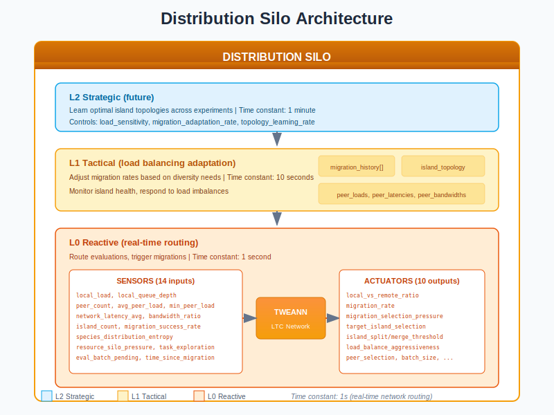
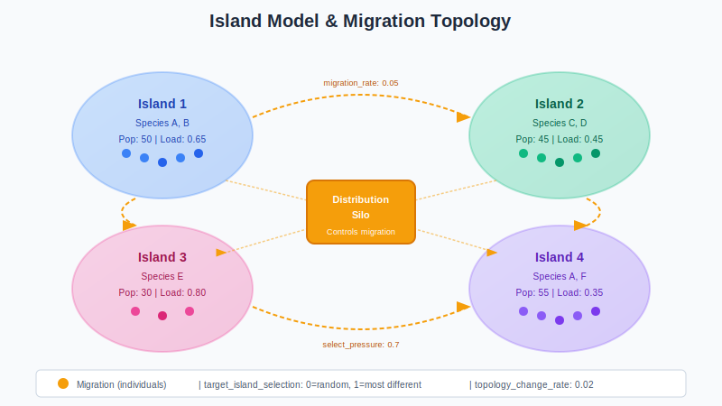
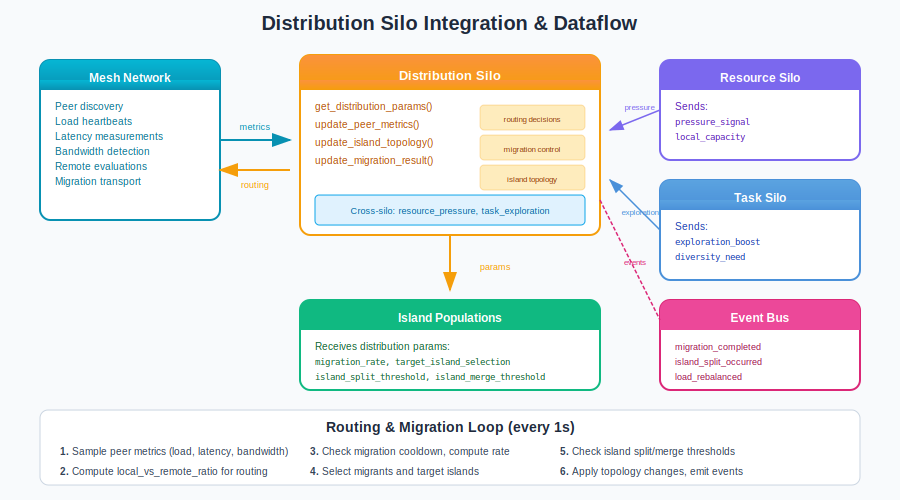

# Distribution Silo Guide

## What is the Distribution Silo?

The **Distribution Silo** is the network efficiency controller in the Liquid Conglomerate architecture. It manages how populations are distributed across islands, how individuals migrate between them, and how evaluations are balanced across peer nodes in a mesh network.

Think of the Distribution Silo as an **air traffic controller** for a network of airports (islands). It decides which flights (migrations) to schedule, routes passengers (individuals) to appropriate destinations, and balances load across terminals (peer nodes) to prevent congestion while maximizing throughput.

The Distribution Silo solves two fundamental problems in distributed neuroevolution:

1. **Load Balancing**: How to efficiently distribute evaluation work across available compute nodes
2. **Diversity Maintenance**: How to manage population structure through islands and migration to maintain genetic diversity while enabling specialization

## Architecture Overview



The Distribution Silo operates as a three-level hierarchical controller:

| Level | Name | Role | Time Constant |
|-------|------|------|---------------|
| **L0** | Reactive | Real-time routing decisions, trigger migrations | 1 second |
| **L1** | Tactical | Adapt migration rates based on diversity/load | 10 seconds |
| **L2** | Strategic | Learn optimal island topologies (future) | 1 minute |

### Key Principle: Network Awareness

The Distribution Silo uniquely operates on **wall-clock time** rather than evaluation counts because it manages real-time network conditions:

- Peer availability changes in real-time
- Network latency affects routing decisions
- Load imbalances require immediate response
- Migration windows are time-sensitive

## How It Works

### Sensors (Inputs)

The Distribution Silo observes 14 sensors describing network and population state:

| Sensor | Range | Description |
|--------|-------|-------------|
| `local_load` | [0, 1] | Combined CPU/memory pressure locally |
| `local_queue_depth` | [0, 1] | Pending evaluations / max queue |
| `peer_count` | [0, 1] | Connected peers / max peers |
| `avg_peer_load` | [0, 1] | Average load across all peers |
| `min_peer_load` | [0, 1] | Load of least loaded peer |
| `network_latency_avg` | [0, 1] | Average RTT to peers (normalized) |
| `network_bandwidth_ratio` | [0, 1] | Available / max bandwidth |
| `island_count` | [0, 1] | Current islands / max islands |
| `migration_success_rate` | [0, 1] | Successful / attempted migrations |
| `species_distribution_entropy` | [0, 1] | Species diversity across islands |
| `resource_silo_pressure` | [0, 1] | Cross-silo from Resource Silo |
| `task_silo_exploration` | [0, 1] | Cross-silo from Task Silo |
| `evaluation_batch_pending` | [0, 1] | Queued batches (normalized) |
| `time_since_last_migration` | [0, 1] | Time / cooldown period |

### Actuators (Outputs)

The Distribution Silo controls 10 parameters governing distribution behavior:

| Actuator | Range | Default | Description |
|----------|-------|---------|-------------|
| `local_vs_remote_ratio` | [0, 1] | 0.8 | 0=all remote, 1=all local |
| `migration_rate` | [0, 0.2] | 0.05 | Fraction to migrate per cycle |
| `migration_selection_pressure` | [0, 1] | 0.5 | 0=random, 1=best only |
| `target_island_selection` | [0, 1] | 0.5 | 0=random, 1=most different |
| `island_split_threshold` | [0.5, 0.95] | 0.8 | When to split island |
| `island_merge_threshold` | [0.1, 0.5] | 0.3 | When to merge islands |
| `load_balance_aggressiveness` | [0, 1] | 0.5 | Eagerness to offload work |
| `peer_selection_strategy` | [0, 1] | 0.5 | 0=nearest, 1=least loaded |
| `batch_size_for_remote` | [1, 20] | 5 | Remote evaluation batch size |
| `topology_change_rate` | [0, 0.1] | 0.02 | Island connection evolution |

### Island Model & Migration



The Distribution Silo implements an **island model** for population structure:

**Islands** are semi-isolated subpopulations that:
- Evolve independently most of the time
- Exchange individuals through controlled migration
- Can specialize on different solution strategies
- Maintain diversity through geographic isolation

**Migration** connects islands:
- `migration_rate`: How many individuals migrate per cycle (0-20% of population)
- `migration_selection_pressure`: Who migrates (random vs. best individuals)
- `target_island_selection`: Where to migrate (random vs. most genetically different island)

**Island Topology Evolution**:
- `island_split_threshold`: When speciation is high, split an island into two
- `island_merge_threshold`: When islands become too similar, merge them
- `topology_change_rate`: How frequently topology changes are allowed

### The Control Loop

1. **Sample Network**: Every 1 second, collect peer metrics (load, latency, bandwidth)
2. **Update Sensors**: Compute normalized sensor values from network state
3. **Compute Routing**: Determine `local_vs_remote_ratio` for evaluation routing
4. **Check Migration**: If cooldown expired, compute migration parameters
5. **Select Migrants**: Choose individuals based on `migration_selection_pressure`
6. **Select Targets**: Choose destination islands based on `target_island_selection`
7. **Execute Migration**: Transfer individuals via mesh network
8. **Check Topology**: Evaluate split/merge conditions, apply changes
9. **Emit Events**: Publish migration and topology events

```erlang
%% Typical usage in evaluation loop
route_evaluation(Individual, State) ->
    %% Get distribution parameters
    #{local_vs_remote_ratio := Ratio} = distribution_l0_actuators:get_distribution_params(),

    case rand:uniform() < Ratio of
        true ->
            %% Evaluate locally
            evaluate_local(Individual);
        false ->
            %% Route to peer
            Peer = select_peer(State),
            evaluate_remote(Individual, Peer)
    end.
```

## Integration with the Neuroevolution Engine



### Wiring Diagram

The Distribution Silo integrates with mesh networking and population management:

**Data Sources:**
- `mesh_network` - Peer discovery, load heartbeats, latency measurements
- `island_manager` - Population structure, species distribution
- `migration_tracker` - Success/failure of recent migrations

**Data Consumers:**
- `evaluation_router` - Routing decisions for where to evaluate
- `island_manager` - Migration triggers, topology changes
- `neuroevolution_events` - Event bus for monitoring

### Cross-Silo Interactions

The Distribution Silo exchanges signals with other silos:

**Signals Sent:**
| Signal | To | Description |
|--------|-----|-------------|
| `network_load_contribution` | Resource | Load from distribution activities |
| `remote_capacity_available` | Resource | Peers can help with evaluations |
| `island_diversity_score` | Task | Diversity level across islands |
| `migration_activity` | Task | Recent migration level |

**Signals Received:**
| Signal | From | Effect |
|--------|------|--------|
| `pressure_signal` | Resource | High pressure = prefer local, less migration |
| `local_capacity` | Resource | Available compute for remote requests |
| `exploration_boost` | Task | High exploration = more migration for diversity |
| `diversity_need` | Task | How much diversity helps current evolution |

### Engine Integration Points

```erlang
%% Start Distribution Silo sensors/actuators
{ok, _} = distribution_l0_sensors:start_link(#{
    max_peers => 100,
    max_islands => 8,
    migration_cooldown_ms => 5000,
    max_queue_depth => 1000
}),

{ok, _} = distribution_l0_actuators:start_link(#{
    hyperparameters => #{
        local_preference_base => 0.8,
        topology_stability_weight => 0.5
    }
}),

%% Query for routing decisions
get_routing() ->
    Params = distribution_l0_actuators:get_distribution_params(),
    #{
        local_ratio => maps:get(local_vs_remote_ratio, Params),
        peer_strategy => maps:get(peer_selection_strategy, Params),
        batch_size => maps:get(batch_size_for_remote, Params)
    }.

%% Update with peer metrics from mesh
on_peer_heartbeat(PeerMetrics) ->
    distribution_l0_sensors:update_peer_metrics(PeerMetrics).

%% Record migration results
on_migration_complete(Success) ->
    distribution_l0_sensors:update_migration_result(Success),
    distribution_l0_sensors:record_migration_time().
```

## Training Velocity Impact

| Metric | Without Distribution Silo | With Distribution Silo |
|--------|--------------------------|----------------------|
| Multi-node scaling | Manual configuration | Automatic adaptation |
| Load balancing | None (hotspots) | Dynamic rebalancing |
| Diversity maintenance | Species threshold only | Island model + migration |
| Training velocity | 1.0x (single node) | 1.5-3.0x (multi-node) |

The Distribution Silo enables horizontal scaling by automatically managing work distribution and population structure across nodes.

## Practical Examples

### Example 1: Load-Based Routing

```erlang
%% Scenario: Local node is overloaded
%% Sensors show:
%% - local_load = 0.85 (high pressure)
%% - min_peer_load = 0.30 (peer available)
%% - network_latency_avg = 0.15 (low latency)

Params = distribution_l0_actuators:get_distribution_params(),
%% With high local load and available peers:
%% - local_vs_remote_ratio => 0.45 (shifted toward remote)
%% - peer_selection_strategy => 0.8 (prefer least loaded)
%% - batch_size_for_remote => 10 (larger batches for efficiency)
```

### Example 2: Diversity-Driven Migration

```erlang
%% Scenario: Task Silo reports low diversity
%% Cross-silo signal: diversity_need = 0.8

%% Distribution Silo responds:
%% - migration_rate => 0.12 (increased from 0.05)
%% - target_island_selection => 0.9 (target most different islands)
%% - migration_selection_pressure => 0.3 (include some random individuals)

%% Event emitted when migration occurs:
{migration_completed, #{
    source_island => 1,
    target_island => 3,
    individuals_migrated => 5,
    selection_method => diversity_driven,
    success => true
}}
```

### Example 3: Island Topology Change

```erlang
%% Scenario: Species distribution highly skewed on Island 2
%% species_distribution_entropy on Island 2 = 0.2 (low - dominated by one species)

%% Distribution Silo detects split condition:
%% - speciation_threshold crossed
%% - island_split_threshold = 0.8 (met)

%% Action: Split Island 2 into Islands 2a and 2b

{island_split_occurred, #{
    original_island => 2,
    new_islands => [<<"2a">>, <<"2b">>],
    reason => species_divergence,
    dominant_species => species_x,
    split_ratio => 0.55
}}
```

## Tuning Guide

### Key Parameters

| Parameter | When to Increase | When to Decrease |
|-----------|------------------|------------------|
| `local_preference_base` | Network unreliable | Underutilizing peers |
| `migration_rate` | Diversity too low | Disrupting island specialization |
| `migration_cooldown_ms` | Migration overhead high | Slow diversity spread |
| `topology_stability_weight` | Oscillating topology | Stuck in suboptimal structure |
| L1 `load_sensitivity` | Slow response to imbalance | Oscillating routing |
| L1 `migration_adaptation_rate` | Slow diversity recovery | Unstable migration |

### Common Pitfalls

1. **Local preference too high**: Underutilizing available peers
   - Symptom: Local load high while peers idle
   - Fix: Reduce `local_preference_base` to 0.6-0.7

2. **Migration rate too high**: Disrupting island specialization
   - Symptom: All islands converge to same strategy
   - Fix: Reduce `migration_rate` to 0.02-0.03

3. **Migration selection too elitist**: Reducing diversity
   - Symptom: Only best individuals migrate, islands become homogeneous
   - Fix: Lower `migration_selection_pressure` to 0.3-0.5

4. **Topology changes too frequent**: Unstable population structure
   - Symptom: Islands constantly splitting/merging
   - Fix: Increase `topology_stability_weight` to 0.7+

### Debugging Tips

```erlang
%% Get current sensor values
Sensors = distribution_l0_sensors:get_sensors(),
io:format("Local load: ~.2f~n", [maps:get(local_load, Sensors)]),
io:format("Avg peer load: ~.2f~n", [maps:get(avg_peer_load, Sensors)]),
io:format("Migration success: ~.2f~n", [maps:get(migration_success_rate, Sensors)]),
io:format("Species entropy: ~.2f~n", [maps:get(species_distribution_entropy, Sensors)]),

%% Get current actuator values
Actuators = distribution_l0_actuators:get_actuator_values(),
io:format("Local/remote ratio: ~.2f~n", [maps:get(local_vs_remote_ratio, Actuators)]),
io:format("Migration rate: ~.3f~n", [maps:get(migration_rate, Actuators)]),
io:format("Split threshold: ~.2f~n", [maps:get(island_split_threshold, Actuators)]).
```

## Events Reference

The Distribution Silo emits events on significant actions:

| Event | Trigger | Key Payload |
|-------|---------|-------------|
| `migration_completed` | Individuals migrated | `source_island`, `target_island`, `count`, `success` |
| `island_split_occurred` | Island divided | `original_island`, `new_islands`, `reason` |
| `island_merge_occurred` | Islands combined | `merged_islands`, `result_island`, `reason` |
| `load_rebalanced` | Work redistributed | `from_node`, `to_node`, `batch_size` |
| `peer_discovered` | New peer joined | `peer_id`, `load`, `latency` |
| `peer_lost` | Peer disconnected | `peer_id`, `reason` |

**Example Event Payload:**
```erlang
{migration_completed, #{
    realm => <<"default">>,
    source => distribution_silo,
    source_island => 1,
    target_island => 4,
    individuals_migrated => 3,
    selection_method => fitness_proportional,
    target_selection => most_different,
    success => true,
    timestamp => 1703318400000
}}
```

## L0 Hyperparameters (L1-Tuned)

| Parameter | Range | Default | Description |
|-----------|-------|---------|-------------|
| `max_islands` | [2, 32] | 8 | Maximum island count |
| `min_island_size` | [5, 50] | 10 | Minimum individuals per island |
| `migration_cooldown_ms` | [1000, 30000] | 5000 | Between migrations |
| `load_imbalance_threshold` | [0.1, 0.6] | 0.3 | When to rebalance |
| `network_timeout_ms` | [100, 5000] | 1000 | Communication timeout |
| `local_preference_base` | [0.5, 1.0] | 0.8 | Default local bias |
| `diversity_migration_boost` | [1.0, 3.0] | 1.5 | Migration boost for diversity |
| `topology_stability_weight` | [0.0, 1.0] | 0.5 | Resist topology changes |

## L1 Hyperparameters (L2-Tuned)

| Parameter | Range | Default | Description |
|-----------|-------|---------|-------------|
| `load_sensitivity` | [0.5, 2.0] | 1.0 | Response to load changes |
| `migration_adaptation_rate` | [0.01, 0.3] | 0.1 | How fast to adjust migration |
| `topology_learning_rate` | [0.01, 0.2] | 0.05 | Island structure adaptation |
| `cross_silo_responsiveness` | [0.0, 1.0] | 0.5 | React to other silos |
| `exploration_diversity_coupling` | [0.0, 1.0] | 0.5 | Link exploration to distribution |

## Source Code Reference

| Module | Purpose | Location |
|--------|---------|----------|
| `distribution_l0_morphology.erl` | TWEANN topology (14→10) | `src/silos/distribution_silo/` |
| `distribution_l0_sensors.erl` | Sensor collection | Same |
| `distribution_l0_actuators.erl` | Actuator application | Same |
| `lc_cross_silo.erl` | Cross-silo signals | `src/silos/` |

## Further Reading

- [Liquid Conglomerate Overview](../liquid-conglomerate.md) - Full LC architecture
- [Cooperative Silos](../cooperative-silos.md) - Cross-silo communication
- [Task Silo](task-silo.md) - Hyperparameter adaptation
- [Resource Silo](resource-silo.md) - Computational resource management
- [Meta-Controller Guide](../meta-controller.md) - L2 strategic layer

## References

### Island Models
- Whitley, D., Rana, S., Heckendorn, R.B. (1999). "The Island Model Genetic Algorithm: On Separability, Population Size and Convergence." *Journal of Computing and Information Technology*.
- Skolicki, Z., De Jong, K. (2005). "The Influence of Migration Sizes and Intervals on Island Models." *GECCO '05*.

### Load Balancing in Distributed Systems
- Eager, D.L., Lazowska, E.D., Zahorjan, J. (1986). "Adaptive Load Sharing in Homogeneous Distributed Systems." *IEEE Transactions on Software Engineering*.

### Speciation and Diversity
- Stanley, K.O., Miikkulainen, R. (2002). "Evolving Neural Networks through Augmenting Topologies." *Evolutionary Computation*.
- Mahfoud, S.W. (1995). "Niching Methods for Genetic Algorithms." PhD Thesis, University of Illinois.
