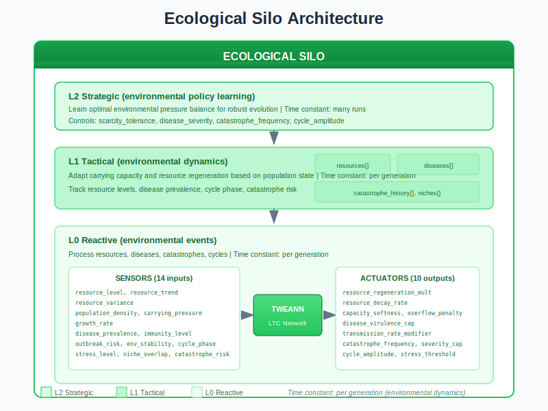
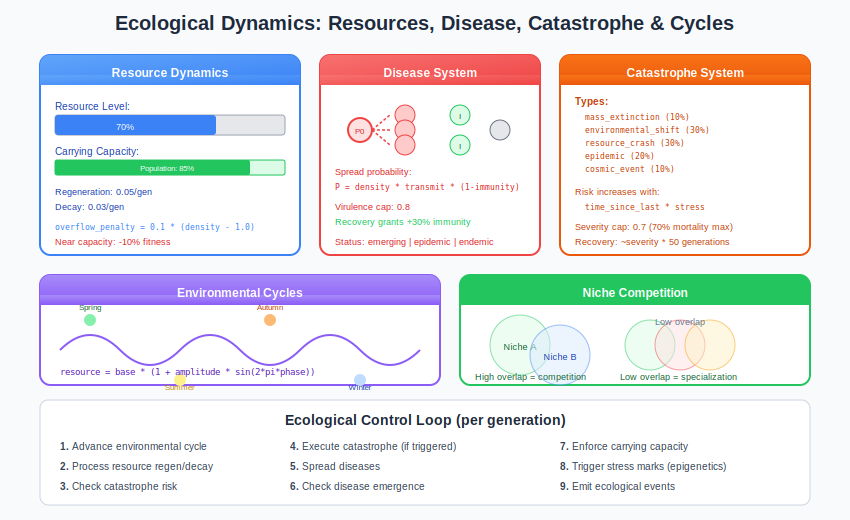
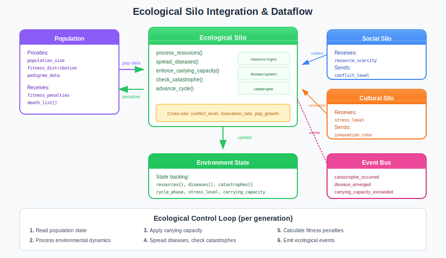

# Ecological Silo Guide

The Ecological Silo manages environmental dynamics that shape evolution: resources, carrying capacity, diseases, catastrophes, and environmental cycles. It simulates the selective pressures of nature.

## Overview

The Ecological Silo creates a dynamic environment that prevents populations from merely optimizing for a static fitness landscape. Instead, populations must adapt to:

- **Resource scarcity and abundance** - Boom and bust cycles
- **Carrying capacity pressure** - Population size limits
- **Disease outbreaks** - Pathogen spread and immunity evolution
- **Catastrophic events** - Mass extinctions and recovery
- **Environmental cycles** - Seasonal and periodic changes
- **Niche competition** - Specialization pressure



## Why Ecological Pressure?

Without environmental pressure, evolution finds solutions that work only in idealized conditions. Real-world deployment faces:

| Static Environment | Dynamic Ecology |
|--------------------|-----------------|
| Overfits to conditions | Stress-tested robustness |
| Brittle under change | Adapts to variation |
| Single-niche specialists | Multi-niche generalists |
| Poor generalization | Strong transfer learning |

The Ecological Silo ensures evolved solutions can handle real-world variability.

## Architecture

The Ecological Silo uses TWEANN controllers at three levels:

| Level | Time Constant | Controls |
|-------|---------------|----------|
| **L2 Strategic** | Many runs | Environmental pressure philosophy |
| **L1 Tactical** | Per generation | Adapt parameters to population state |
| **L0 Reactive** | Per operation | Process resources, diseases, catastrophes |

### Sensors (14 inputs)

The L0 controller receives 14 environmental measurements:

| Sensor | Range | Description |
|--------|-------|-------------|
| `resource_level` | [0.0, 1.0] | Current resource availability |
| `resource_trend` | [-1.0, 1.0] | Resource change direction |
| `resource_variance` | [0.0, 1.0] | Resource distribution variance |
| `population_density` | [0.0, 2.0] | Population relative to carrying capacity |
| `carrying_pressure` | [0.0, 1.0] | Proximity to capacity limit |
| `growth_rate` | [-1.0, 1.0] | Population growth rate |
| `disease_prevalence` | [0.0, 1.0] | Proportion infected |
| `immunity_level` | [0.0, 1.0] | Average population immunity |
| `outbreak_risk` | [0.0, 1.0] | Risk of new disease outbreak |
| `environmental_stability` | [0.0, 1.0] | How stable conditions are |
| `cycle_phase` | [0.0, 1.0] | Position in environmental cycle |
| `stress_level` | [0.0, 1.0] | Environmental stress on population |
| `niche_overlap` | [0.0, 1.0] | Degree of niche competition |
| `catastrophe_risk` | [0.0, 1.0] | Risk of catastrophic event |

### Actuators (10 outputs)

The controller adjusts 10 environmental parameters:

| Actuator | Range | Default | Effect |
|----------|-------|---------|--------|
| `resource_regeneration_multiplier` | [0.5, 2.0] | 1.0 | Resource replenishment speed |
| `resource_decay_rate` | [0.0, 0.2] | 0.05 | Resource consumption rate |
| `capacity_softness` | [0.0, 1.0] | 0.3 | How hard the capacity limit is |
| `overflow_penalty` | [0.0, 0.5] | 0.1 | Fitness penalty for overcrowding |
| `disease_virulence_cap` | [0.0, 1.0] | 0.8 | Maximum disease lethality |
| `transmission_rate_modifier` | [0.5, 2.0] | 1.0 | Disease spread rate multiplier |
| `catastrophe_frequency` | [0.0, 0.1] | 0.01 | Base catastrophe probability |
| `catastrophe_severity_cap` | [0.3, 1.0] | 0.7 | Maximum catastrophe severity |
| `cycle_amplitude` | [0.0, 1.0] | 0.3 | Strength of environmental cycles |
| `stress_threshold` | [0.3, 0.9] | 0.6 | Stress level triggering epigenetic marks |

## Ecological Dynamics



### Resource Dynamics

Resources regenerate and decay according to environmental parameters:

```
resource_level(t+1) = resource_level(t)
                    * (1 + regeneration_multiplier * cycle_modifier)
                    * (1 - decay_rate * population_density)
```

When resources are scarce:
- Competition intensifies (→ Social Silo)
- Stress levels rise (→ triggers epigenetic marks)
- Innovation pressure increases (→ Cultural Silo)

### Carrying Capacity

The carrying capacity enforces population size limits:

```erlang
%% Fitness penalty when over capacity
penalty = overflow_penalty * (1 - exp(-(density - 1.0) / capacity_softness))
```

| Softness | Effect |
|----------|--------|
| 0.0 | Hard limit - immediate death above capacity |
| 0.5 | Moderate - gradual penalty increase |
| 1.0 | Soft - slow penalty accumulation |

### Disease System

Diseases emerge, spread, and drive immunity evolution:

**Spread probability:**
```
P(infection) = density * transmissibility * (1 - immunity)
```

**Disease status progression:**
1. **Emerging** - Patient zero infected
2. **Epidemic** - Rapid spread (>5% infected)
3. **Endemic** - Stable prevalence
4. **Declining** - Immunity rising
5. **Eradicated** - No active cases

**Immunity acquisition:**
- Recovery grants +30% immunity
- Immunity decays slowly over generations
- Creates immune diversity under selection

### Catastrophe System

Catastrophic events create punctuated equilibrium:

| Type | Weight | Effect |
|------|--------|--------|
| `mass_extinction` | 10% | Up to 80% mortality |
| `environmental_shift` | 30% | Niche disruption |
| `resource_crash` | 30% | Resource depletion |
| `epidemic` | 20% | Disease outbreak |
| `cosmic_event` | 10% | Random destruction |

**Risk calculation:**
```
risk = base_frequency * (1 + generations_since_last/100) * (1 + stress_level)
```

Catastrophe severity is capped by `catastrophe_severity_cap` to prevent total extinction.

**Recovery period:**
```
recovery_generations ≈ severity * 50
```

### Environmental Cycles

Sinusoidal cycles create seasonal variation:

```
resource_modifier = 1.0 + amplitude * sin(2π * phase)
```

**Cycle phases:**
- **Spring** (0.0-0.25): Rising resources, growth opportunity
- **Summer** (0.25-0.5): Peak resources, population boom
- **Autumn** (0.5-0.75): Declining resources, competition rises
- **Winter** (0.75-1.0): Scarcity, stress, selection pressure

### Niche Competition

Multiple niches create specialization pressure:

| Overlap | Effect |
|---------|--------|
| High (>0.7) | Intense competition, generalist disadvantage |
| Medium (0.3-0.7) | Balanced competition |
| Low (<0.3) | Niche specialization favored |

### Symbiosis

Inter-individual relationships emerge:

| Type | Partner A | Partner B | Example |
|------|-----------|-----------|---------|
| **Mutualism** | +benefit | +benefit | Both gain fitness |
| **Commensalism** | neutral | +benefit | One gains, other unaffected |
| **Parasitism** | +benefit | -cost | One exploits other |

Symbiotic relationships affect fitness calculations and can spread through the population.

## Integration with Other Silos



### Outgoing Signals

| Signal | To Silo | Trigger |
|--------|---------|---------|
| `resource_scarcity` | Social | Resources below 30% |
| `stress_level` | All (Epigenetics) | Stress above threshold |
| `catastrophe_recovery` | Task | Post-catastrophe phase |
| `carrying_pressure` | Distribution | Near capacity limit |

### Incoming Signals

| Signal | From Silo | Effect |
|--------|-----------|--------|
| `conflict_level` | Social | Conflict depletes resources faster |
| `innovation_rate` | Cultural | Innovation improves resource efficiency |
| `population_growth` | Task | Updates carrying pressure |

### Signal Examples

```erlang
%% Receiving social conflict
handle_cross_silo_signal({conflict_level, Level}, State) ->
    %% High conflict depletes resources
    ResourceMultiplier = 1.0 - (Level * 0.2),
    UpdatedEnv = State#state.environment#environment{
        resource_level = State#state.environment#environment.resource_level * ResourceMultiplier
    },
    {ok, State#state{environment = UpdatedEnv}};

%% Sending scarcity signal
maybe_emit_scarcity_signal(#environment{resource_level = Level} = Env)
  when Level < 0.3 ->
    lc_cross_silo:send_signal(resource_scarcity, #{
        level => 1.0 - (Level / 0.3),
        trend => calculate_resource_trend(Env)
    });
maybe_emit_scarcity_signal(_) -> ok.
```

## Events Emitted

| Event | Payload | Trigger |
|-------|---------|---------|
| `carrying_capacity_exceeded` | `{population_id, capacity, actual, deaths}` | Population over capacity |
| `resource_depleted` | `{resource_type, level}` | Resources exhausted |
| `resource_replenished` | `{resource_type, new_level}` | Resources restored |
| `disease_emerged` | `{disease_id, patient_zero, virulence}` | New disease appears |
| `disease_spread` | `{disease_id, new_infections, prevalence}` | Infection spread |
| `epidemic_started` | `{disease_id, infection_rate}` | Outbreak threshold crossed |
| `epidemic_ended` | `{disease_id, duration, peak}` | Outbreak concluded |
| `immunity_developed` | `{individual_id, disease_id, level}` | Resistance evolved |
| `catastrophe_occurred` | `{type, severity, mortality, recovery_est}` | Major event |
| `recovery_began` | `{catastrophe_id, generation}` | Post-catastrophe recovery |
| `environmental_cycle_shifted` | `{phase_name, phase_value}` | Seasonal transition |
| `symbiosis_formed` | `{partners, type, benefits}` | Relationship established |

## Practical Examples

### Example 1: Resource-Scarce Environment

Configure a harsh environment with limited resources:

```erlang
Config = #{
    resource_regeneration_multiplier => 0.7,  % Slow regeneration
    resource_decay_rate => 0.15,              % Fast consumption
    capacity_softness => 0.2,                 % Hard capacity limit
    overflow_penalty => 0.3,                  % Severe overcrowding penalty
    catastrophe_frequency => 0.02,            % More frequent disasters
    cycle_amplitude => 0.5                    % Strong seasonal variation
}.
```

**Expected outcomes:**
- Smaller, more efficient networks
- Competition-driven innovation
- Robust stress tolerance

### Example 2: Disease Pressure

Configure high disease pressure:

```erlang
Config = #{
    disease_virulence_cap => 0.9,             % Deadly diseases possible
    transmission_rate_modifier => 1.5,        % Fast spread
    catastrophe_frequency => 0.005            % Lower base catastrophe
}.
```

**Expected outcomes:**
- Immune diversity in population
- Avoidance behaviors evolve
- Recovery speed becomes selected trait

### Example 3: Stable Environment

For baseline comparison without ecological pressure:

```erlang
Config = #{
    resource_regeneration_multiplier => 1.5,
    resource_decay_rate => 0.02,
    capacity_softness => 0.9,
    overflow_penalty => 0.02,
    disease_virulence_cap => 0.3,
    catastrophe_frequency => 0.001,
    cycle_amplitude => 0.1
}.
```

**Note:** Stable environments produce solutions that may not generalize well.

## Tuning Guide

### Training Velocity vs. Robustness

| Goal | Settings |
|------|----------|
| **Fast convergence** | Low pressure (abundance) |
| **Robust solutions** | High pressure (scarcity, disease) |
| **Generalization** | High cycle amplitude, variable pressure |

### Common Issues

| Problem | Likely Cause | Fix |
|---------|--------------|-----|
| Population extinction | Pressure too high | Lower `catastrophe_severity_cap`, increase `capacity_softness` |
| Stagnation | Environment too stable | Increase `cycle_amplitude`, `catastrophe_frequency` |
| Poor generalization | Static conditions | Enable cycles, increase variability |
| Disease wipes out population | Virulence too high | Lower `disease_virulence_cap` |

### Recommended Starting Point

```erlang
%% Balanced ecological pressure
DefaultConfig = #{
    resource_regeneration_multiplier => 1.0,
    resource_decay_rate => 0.05,
    capacity_softness => 0.3,
    overflow_penalty => 0.1,
    disease_virulence_cap => 0.8,
    transmission_rate_modifier => 1.0,
    catastrophe_frequency => 0.01,
    catastrophe_severity_cap => 0.7,
    cycle_amplitude => 0.3,
    stress_threshold => 0.6
}.
```

## Control Loop

The Ecological Silo executes per generation:

1. **Advance environmental cycle** - Update phase, calculate modifiers
2. **Process resource regeneration/decay** - Update resource levels
3. **Check catastrophe risk** - Probability increases over time
4. **Execute catastrophe** (if triggered) - Apply mortality, resource impact
5. **Spread diseases** - Process each active disease
6. **Check disease emergence** - New pathogens may appear
7. **Enforce carrying capacity** - Apply overcrowding deaths
8. **Trigger stress marks** - Epigenetic effects if threshold exceeded
9. **Emit ecological events** - Notify other systems

## Configuration Reference

### Full Configuration Record

```erlang
-record(ecological_config, {
    %% Resource dynamics
    resource_regeneration_multiplier = 1.0 :: float(),
    resource_decay_rate = 0.05 :: float(),
    resource_capacity = 1.0 :: float(),

    %% Carrying capacity
    carrying_capacity = 1000 :: non_neg_integer(),
    capacity_softness = 0.3 :: float(),
    overflow_penalty = 0.1 :: float(),

    %% Disease
    disease_virulence_cap = 0.8 :: float(),
    transmission_rate_modifier = 1.0 :: float(),
    immunity_decay_rate = 0.01 :: float(),

    %% Catastrophe
    catastrophe_frequency = 0.01 :: float(),
    catastrophe_severity_cap = 0.7 :: float(),

    %% Environment
    cycle_period = 100 :: non_neg_integer(),
    cycle_amplitude = 0.3 :: float(),
    stress_threshold = 0.6 :: float(),

    %% Symbiosis
    symbiosis_formation_rate = 0.05 :: float(),
    symbiosis_decay_rate = 0.1 :: float(),

    %% Enable/disable
    enabled = true :: boolean()
}).
```

### API Functions

```erlang
%% Start the ecological silo
ecological_silo:start_link(#{population_id => PopId})

%% Read current environment state
{ok, Environment} = ecological_silo:get_environment(PopId)

%% Manually trigger a catastrophe (for testing)
ecological_silo:trigger_catastrophe(PopId, #{type => resource_crash, severity => 0.5})

%% Introduce a disease (for testing)
ecological_silo:introduce_disease(PopId, #{virulence => 0.6, transmissibility => 0.8})

%% Get full silo state
{ok, State} = ecological_silo:get_state(PopId)
```

## Source Code Reference

Core implementation files:

| File | Purpose |
|------|---------|
| `src/lc_silos/ecological_silo.erl` | Main silo gen_server |
| `src/lc_silos/ecological_silo_sensors.erl` | L0 sensor implementation |
| `src/lc_silos/ecological_silo_actuators.erl` | L0 actuator implementation |
| `src/lc_silos/ecological_carrying.erl` | Carrying capacity system |
| `src/lc_silos/ecological_disease.erl` | Disease spread and immunity |
| `src/lc_silos/ecological_cycles.erl` | Environmental cycles |
| `src/lc_silos/ecological_catastrophe.erl` | Catastrophe system |
| `src/lc_silos/ecological_symbiosis.erl` | Symbiotic relationships |

## References

- PLAN_ECOLOGICAL_SILO.md - Full specification
- "Ecology: Concepts and Applications" - Molles
- "The Theory of Island Biogeography" - MacArthur & Wilson
- "Epidemiology" - Rothman

## See Also

- [Task Silo Guide](task-silo.md) - Population fitness management
- [Social Silo Guide](social-silo.md) - Competition and cooperation
- [Cultural Silo Guide](cultural-silo.md) - Innovation and learning
- [Distribution Silo Guide](distribution-silo.md) - Population diversity
