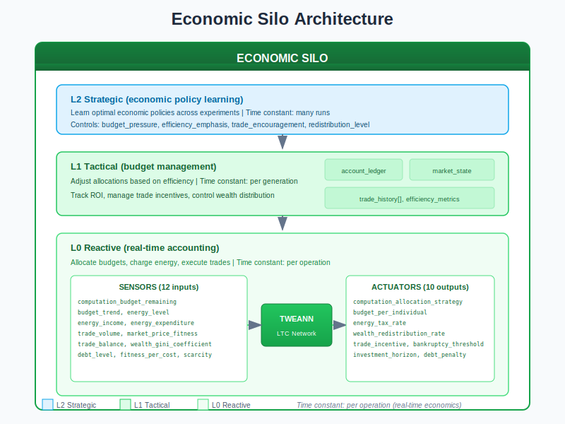
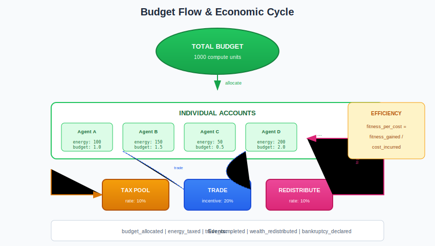
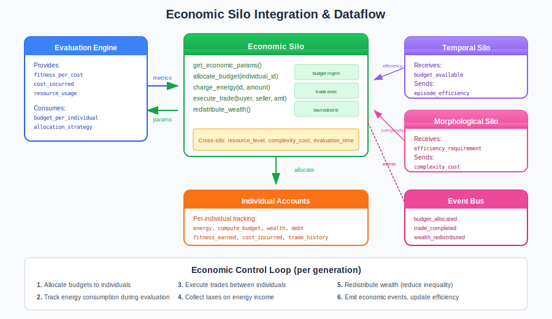

# Economic Silo Guide

## What is the Economic Silo?

The **Economic Silo** is the resource allocation controller in the Liquid Conglomerate architecture. It manages computation budgets, energy economics, trade between individuals, and creates efficiency pressure so that networks must be cost-effective - not just fit.

Think of the Economic Silo as a **central bank and marketplace combined**. It allocates computational budgets, tracks energy consumption, facilitates trade between individuals, collects taxes, and redistributes wealth. Without it, all individuals receive equal resources regardless of promise, leading to massive waste.

The Economic Silo solves two fundamental problems in neuroevolution:

1. **Cost Awareness**: Training should respect real-world budget constraints
2. **Efficiency Pressure**: Better fitness/cost ratio should be rewarded

## Architecture Overview



The Economic Silo operates as a three-level hierarchical controller:

| Level | Name | Role | Time Constant |
|-------|------|------|---------------|
| **L0** | Reactive | Allocate budgets, charge energy, execute trades | Per operation |
| **L1** | Tactical | Adjust allocations based on efficiency | Per generation |
| **L2** | Strategic | Learn optimal economic policies (future) | Across runs |

### Key Principle: Efficiency Matters

The Economic Silo operates on the principle that fitness alone isn't enough:

- Cost-effective solutions are better than expensive ones
- Budget pressure drives innovation in efficiency
- Trade enables specialization (networks can share capabilities)
- Redistribution prevents wealth concentration

## How It Works

### Sensors (Inputs)

The Economic Silo observes 12 sensors describing economic dynamics:

| Sensor | Range | Description |
|--------|-------|-------------|
| `computation_budget_remaining` | [0, 1] | Available compute / total budget |
| `budget_trend` | [-1, 1] | Direction of budget change |
| `energy_level` | [0, 1] | Current energy reserves |
| `energy_income` | [0, 1] | Energy gain rate |
| `energy_expenditure` | [0, 1] | Energy spend rate |
| `trade_volume` | [0, 1] | Amount of trading activity |
| `market_price_fitness` | [0, 1] | Cost of fitness improvement |
| `trade_balance` | [-1, 1] | Net trade position |
| `wealth_gini_coefficient` | [0, 1] | Wealth inequality |
| `debt_level` | [0, 1] | Population debt |
| `fitness_per_cost` | [0, 1] | Efficiency ratio |
| `scarcity_index` | [0, 1] | Resource scarcity level |

### Actuators (Outputs)

The Economic Silo controls 10 parameters governing economic behavior:

| Actuator | Range | Default | Description |
|----------|-------|---------|-------------|
| `computation_allocation_strategy` | [0.0, 1.0] | 0.5 | Equal vs fitness-proportional |
| `budget_per_individual` | [0.1, 10.0] | 1.0 | Compute units per individual |
| `energy_tax_rate` | [0.0, 0.3] | 0.1 | Tax on energy income |
| `wealth_redistribution_rate` | [0.0, 0.5] | 0.1 | Redistribution from rich to poor |
| `trade_incentive` | [0.0, 0.5] | 0.2 | Bonus for trading |
| `bankruptcy_threshold` | [0.0, 0.3] | 0.05 | When to declare bankruptcy |
| `investment_horizon` | [1, 20] | 5 | Generations for ROI calculation |
| `resource_discovery_bonus` | [0.0, 0.5] | 0.1 | Bonus for finding resources |
| `inflation_control` | [0.0, 0.1] | 0.02 | Control fitness inflation |
| `debt_penalty` | [0.0, 0.2] | 0.05 | Fitness penalty for debt |

### Budget Flow & Economic Cycle



The economic cycle operates as follows:

**1. Budget Allocation**
```erlang
%% Each individual receives budget based on strategy
{ok, Budget} = economic_silo:allocate_budget(EconPid, IndividualId),
%% Strategy 0.0 = equal allocation
%% Strategy 1.0 = fitness-proportional allocation
```

**2. Energy Consumption**
```erlang
%% Charge energy during evaluation
ok = economic_silo:charge_energy(EconPid, IndividualId, EvaluationCost),
%% Tracks cost_incurred for efficiency calculation
```

**3. Trade Execution**
```erlang
%% Individuals can trade resources
ok = economic_silo:execute_trade(EconPid, BuyerId, SellerId, Amount),
%% Enables specialization and comparative advantage
```

**4. Taxation**
```erlang
%% Collect taxes on energy income
ok = economic_silo:collect_taxes(EconPid),
%% Funds redistribution pool
```

**5. Redistribution**
```erlang
%% Redistribute from wealthy to poor
ok = economic_silo:redistribute_wealth(EconPid),
%% Reduces inequality, prevents runaway concentration
```

### The Control Loop

1. **Per Operation**: Allocate budgets, charge energy, execute trades
2. **Per Generation**: Collect taxes, redistribute wealth, update prices
3. **Per Update Cycle**: Collect sensors, adjust actuators via TWEANN
4. **Emit Events**: Publish economic events to event bus

## Integration with the Neuroevolution Engine



### Wiring Diagram

The Economic Silo integrates with evaluation and other silos:

**Data Sources:**
- `evaluation_engine` - Fitness per cost, resource usage
- `morphological_silo` - Network complexity costs
- `temporal_silo` - Evaluation time (affects cost)

**Data Consumers:**
- `evaluation_engine` - Budget allocations, efficiency requirements
- `temporal_silo` - Budget constraints on evaluation time
- `morphological_silo` - Efficiency requirements for network size
- `neuroevolution_events` - Event bus for monitoring

### Cross-Silo Interactions

The Economic Silo exchanges signals with other silos:

**Signals Sent:**
| Signal | To | Description |
|--------|-----|-------------|
| `economic_pressure` | Task | High pressure = need simpler solutions |
| `budget_available` | Temporal | Budget constrains evaluation time |
| `efficiency_requirement` | Morphological | Efficiency targets for network size |

**Signals Received:**
| Signal | From | Effect |
|--------|------|--------|
| `resource_level` | Ecological | Resources affect available budget |
| `complexity_cost` | Morphological | Network size affects energy cost |
| `episode_efficiency` | Temporal | Efficiency information for pricing |

### Engine Integration Points

```erlang
%% Start Economic Silo
{ok, _} = economic_silo:start_link(#economic_config{
    enabled = true,
    initial_energy = 100.0,
    initial_budget = 1.0,
    enable_trade = true,
    enable_taxation = true,
    emit_events = true
}),

%% Before evaluation: allocate budget
{ok, Budget} = economic_silo:allocate_budget(EconPid, IndividualId),

%% During evaluation: track costs
economic_silo:charge_energy(EconPid, IndividualId, StepCost),

%% End of generation: economic cycle
economic_silo:collect_taxes(EconPid),
economic_silo:redistribute_wealth(EconPid).
```

## Training Velocity Impact

| Metric | Without Economic Silo | With Economic Silo |
|--------|----------------------|-------------------|
| Compute efficiency | 1.0x | 2-4x |
| Cost per fitness | Untracked | Optimized |
| Resource waste | High | Low |
| Deployment readiness | Variable | Cost-aware |

The Economic Silo provides **significant cost optimization** by creating selection pressure for efficient solutions.

## Practical Examples

### Example 1: Budget-Proportional Allocation

```erlang
%% Scenario: Some individuals are more promising
%% allocation_strategy = 0.8 (fitness-proportional)

%% High-fitness individual gets more budget:
%% fitness=0.9 -> budget=1.8x average

%% Low-fitness individual gets less:
%% fitness=0.1 -> budget=0.2x average

%% Result: Promising individuals get more evaluation time
```

### Example 2: Trade Enables Specialization

```erlang
%% Scenario: Agent A is good at exploration, Agent B at exploitation
%% They can trade capabilities

ok = economic_silo:execute_trade(EconPid, AgentA, AgentB, 50.0),

%% Trade event emitted:
{trade_completed, #{
    buyer_id => AgentA,
    seller_id => AgentB,
    amount => 50.0,
    price => 500.0
}}

%% Result: Both benefit from comparative advantage
```

### Example 3: Wealth Redistribution Reduces Inequality

```erlang
%% Scenario: High Gini coefficient (0.8 = very unequal)
%% wealth_redistribution_rate = 0.1

%% Before: Agent A wealth=1000, Agent B wealth=10
%% After: Agent A wealth=901, Agent B wealth=109

%% Event:
{wealth_redistributed, #{
    rate => 0.1,
    total_transferred => 99.0
}}

%% Result: Poor agents can still compete
```

## Tuning Guide

### Key Parameters

| Parameter | When to Increase | When to Decrease |
|-----------|------------------|------------------|
| `budget_per_individual` | Rich compute environment | Cost-constrained |
| `computation_allocation_strategy` | Want to focus on promising | Want exploration |
| `energy_tax_rate` | High inequality | Low activity |
| `wealth_redistribution_rate` | Extreme inequality | Need competition |
| `trade_incentive` | Want specialization | Prefer independence |
| `debt_penalty` | Runaway debt | Too conservative |

### Common Pitfalls

1. **Budget too low**: Good individuals don't have time to show potential
   - Symptom: All fitnesses converge to same low value
   - Fix: Increase `budget_per_individual` to 2.0+

2. **No trade**: Missing specialization benefits
   - Symptom: All individuals evolve same strategies
   - Fix: Increase `trade_incentive` to 0.3+

3. **High inequality**: Poor individuals can't compete
   - Symptom: Same few individuals always win
   - Fix: Increase `wealth_redistribution_rate` to 0.2+

4. **No cost pressure**: Bloated, inefficient networks
   - Symptom: Networks grow without bound
   - Fix: Lower `budget_per_individual`, increase `debt_penalty`

### Debugging Tips

```erlang
%% Get individual account
Account = economic_silo:get_account(EconPid, IndividualId),
io:format("Energy: ~.2f~n", [Account#individual_account.energy]),
io:format("Debt: ~.2f~n", [Account#individual_account.debt]),
io:format("Efficiency: ~.3f~n", [
    Account#individual_account.fitness_earned /
    max(1.0, Account#individual_account.cost_incurred)
]),

%% Get overall economic state
State = economic_silo:get_state(EconPid),
io:format("Market price: ~.2f~n", [State#economic_state.market_price]),
io:format("Total tax collected: ~.2f~n", [State#economic_state.total_tax_collected]),
io:format("Bankruptcies: ~p~n", [State#economic_state.bankruptcies]).
```

## Events Reference

The Economic Silo emits events on significant actions:

| Event | Trigger | Key Payload |
|-------|---------|-------------|
| `budget_allocated` | Compute assigned | `individual_id`, `amount` |
| `budget_exhausted` | Ran out of compute | `individual_id`, `needed`, `available` |
| `trade_completed` | Exchange occurred | `buyer_id`, `seller_id`, `amount`, `price` |
| `bankruptcy_declared` | Out of resources | `individual_id`, `debt`, `assets` |
| `wealth_redistributed` | Transfer occurred | `rate`, `total_transferred` |
| `energy_taxed` | Tax collected | `rate`, `total_collected` |
| `investment_matured` | ROI realized | `investor_id`, `investment`, `return` |
| `resource_discovered` | New resource found | `individual_id`, `resource_type`, `amount` |

**Example Event Payload:**
```erlang
{trade_completed, #{
    silo => economic,
    timestamp => 1703318400000,
    generation => 42,
    payload => #{
        trade_id => <<"trade_12345">>,
        buyer_id => <<"agent_a">>,
        seller_id => <<"agent_b">>,
        quantity => 50.0,
        price => 500.0
    }
}}
```

## L0 Hyperparameters (L1-Tuned)

| Parameter | Range | Default | Description |
|-----------|-------|---------|-------------|
| `initial_energy` | [10, 1000] | 100 | Starting energy per individual |
| `initial_budget` | [0.1, 10.0] | 1.0 | Starting compute budget |
| `enable_trade` | bool | true | Allow trade between individuals |
| `enable_taxation` | bool | true | Collect energy taxes |
| `max_debt` | [0, 1000] | 100 | Maximum allowed debt |
| `market_price_base` | [1, 100] | 10 | Base market price |

## L1 Hyperparameters (L2-Tuned)

| Parameter | Range | Default | Description |
|-----------|-------|---------|-------------|
| `budget_pressure` | [0.0, 1.0] | 0.5 | Urgency of budget constraints |
| `efficiency_emphasis` | [0.0, 1.0] | 0.5 | Weight on efficiency vs fitness |
| `trade_encouragement` | [0.0, 1.0] | 0.5 | How much to encourage trade |
| `redistribution_level` | [0.0, 1.0] | 0.5 | Degree of wealth redistribution |

## Configuration Examples

### Cost-Constrained Cloud Training
```erlang
#economic_config{
    enabled = true,
    initial_energy = 50.0,         % Limited
    initial_budget = 0.5,          % Tight
    enable_trade = true,
    enable_taxation = true,
    emit_events = true
}.

%% With actuators:
%% budget_per_individual = 0.3
%% debt_penalty = 0.15 (aggressive)
%% efficiency emphasized
```

### Research/Exploration Mode
```erlang
#economic_config{
    enabled = true,
    initial_energy = 1000.0,       % Abundant
    initial_budget = 5.0,          % Generous
    enable_trade = false,          % Independent evolution
    enable_taxation = false,       % No redistribution
    emit_events = true
}.

%% Let evolution explore freely without cost pressure
```

### Multi-Agent Marketplace
```erlang
#economic_config{
    enabled = true,
    initial_energy = 200.0,
    initial_budget = 2.0,
    enable_trade = true,            % Critical
    enable_taxation = true,
    emit_events = true
}.

%% With actuators:
%% trade_incentive = 0.4 (high)
%% wealth_redistribution_rate = 0.15
%% Enable specialization through trade
```

## Source Code Reference

| Module | Purpose | Location |
|--------|---------|----------|
| `economic_silo.erl` | Main gen_server | `src/silos/economic_silo/` |
| `economic_silo_sensors.erl` | Sensor collection (12) | Same |
| `economic_silo_actuators.erl` | Actuator application (10) | Same |
| `economic_silo.hrl` | Record definitions | Same |
| `lc_cross_silo.erl` | Cross-silo signals | `src/silos/` |

## Further Reading

- [Liquid Conglomerate Overview](../liquid-conglomerate.md) - Full LC architecture
- [Temporal Silo](temporal-silo.md) - Time and episode management
- [Task Silo](task-silo.md) - Hyperparameter adaptation
- [Morphological Silo](morphological-silo.md) - Network structure optimization
- [Meta-Controller Guide](../meta-controller.md) - L2 strategic layer

## References

### Evolutionary Economics
- Potts, J. (2000). "The New Evolutionary Microeconomics: Complexity, Competence and Adaptive Behaviour." Edward Elgar Publishing.

### Resource Allocation in Distributed Systems
- Buyya, R., et al. (2002). "Economic Models for Resource Management and Scheduling in Grid Computing." Concurrency and Computation: Practice and Experience.

### Multi-Agent Economies
- Varian, H.R. (2014). "Intermediate Microeconomics: A Modern Approach." W.W. Norton.
- Arthur, W.B. (1994). "Increasing Returns and Path Dependence in the Economy." University of Michigan Press.
