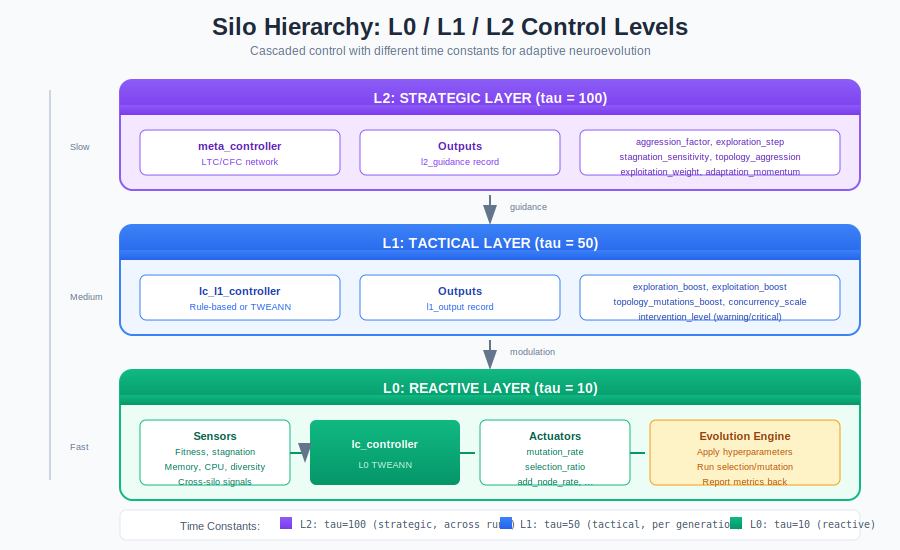
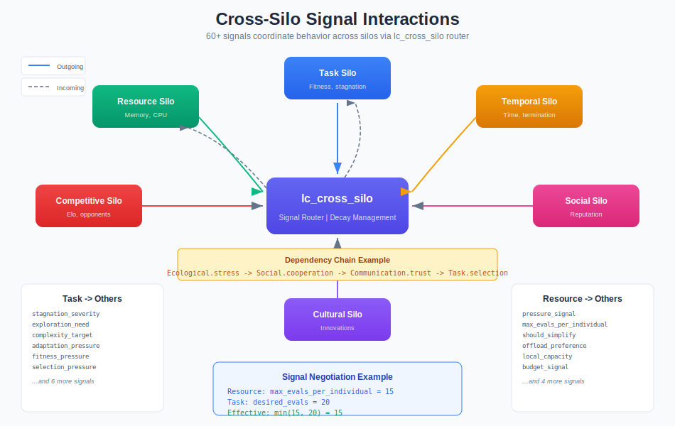

# Liquid Conglomerate Silo Guides

## Introduction

The **Liquid Conglomerate (LC)** is a hierarchical meta-learning architecture that uses specialized **silos** to control different aspects of neuroevolution. Each silo is a self-contained controller with its own sensors (inputs), actuators (outputs), and internal TWEANN (Topology and Weight Evolving Artificial Neural Network).

This section provides comprehensive guides for each of the 13 silos in the LC architecture.

## Silo Overview


### What is a Silo?

A silo is a modular control unit that:

1. **Observes** specific aspects of the evolutionary process (sensors)
2. **Decides** how to respond using an evolved neural network (TWEANN)
3. **Acts** by adjusting parameters that affect evolution (actuators)
4. **Learns** to optimize its own behavior over many generations

Think of silos as specialized organs in a body - each handles a specific function, but they work together to maintain the health of the whole system.

### The 13 Silos

| Category | Silo | Purpose | Training Impact |
|----------|------|---------|-----------------|
| **Core** | [Task](task-silo.md) | Fitness evaluation and learning | Baseline |
| **Core** | [Resource](resource-silo.md) | Computational resource management | +20-40% |
| **Core** | [Distribution](distribution-silo.md) | Population structure control | Neutral |
| **Performance** | [Temporal](temporal-silo.md) | Time and episode management | **+++** (2-4x) |
| **Performance** | [Economic](economic-silo.md) | Resource economics and budgets | **++** (1.5-2x) |
| **Performance** | [Morphological](morphological-silo.md) | Network structure control | Neutral |
| **Evolutionary** | [Competitive](competitive-silo.md) | Adversarial dynamics | Neutral |
| **Evolutionary** | [Cultural](cultural-silo.md) | Knowledge transfer and traditions | **+** (1.2-1.5x) |
| **Evolutionary** | [Social](social-silo.md) | Reputation and cooperation | Neutral |
| **Evolutionary** | [Ecological](ecological-silo.md) | Environmental pressures | Variable |
| **Advanced** | [Developmental](developmental-silo.md) | Lifetime learning | **−** (0.8-0.9x) |
| **Advanced** | [Regulatory](regulatory-silo.md) | Gene expression control | **+** (1.1-1.2x) |
| **Advanced** | [Communication](communication-silo.md) | Signal evolution | Slight overhead |

## Silo Hierarchy

Silos operate within a hierarchical control structure:



| Level | Role | Examples |
|-------|------|----------|
| **L0** | Hard limits and constraints | Max neurons, minimum mutation rate |
| **L1** | Tactical, per-generation control | Adjust mutation based on stagnation |
| **L2** | Strategic, cross-experiment learning | Learn optimal policies for task types |

Each silo has sensors and actuators at L0, controlled by a TWEANN that receives guidance from L2.

## Cross-Silo Interactions

Silos don't operate in isolation - they exchange signals to coordinate their behavior:



### Signal Flow Example

```
Ecological Silo
    ↓ stress_level
Social Silo
    ↓ social_network_density
Communication Silo
    ↓ coordination_capability
Task Silo
    ↓ stagnation_severity
Temporal Silo
```

When the Ecological Silo detects resource scarcity:
1. It signals `stress_level` to Social Silo
2. Social Silo may increase cooperation incentives
3. Communication Silo improves coordination signals
4. Task Silo may ease fitness requirements
5. Temporal Silo may extend evaluation time

This cascading coordination creates emergent system-wide responses.

## Silo Dependencies

Some silos depend on others and must be enabled in the correct order:

```
                    ┌─────────────┐
                    │   temporal  │
                    └──────┬──────┘
                           │
                    ┌──────▼──────┐
                    │developmental│
                    └──────┬──────┘
                           │
                    ┌──────▼──────┐
                    │  regulatory │
                    └─────────────┘

                    ┌─────────────┐
                    │ competitive │
                    └──────┬──────┘
                           │
              ┌────────────┼────────────┐
              │            │            │
       ┌──────▼──────┐     │     ┌──────▼──────┐
       │   social    │◄────┘     │   cultural  │
       └──────┬──────┘           └─────────────┘
              │
       ┌──────▼──────┐
       │communication│
       └─────────────┘
```

| Silo | Requires | Reason |
|------|----------|--------|
| `social` | `competitive` | Social dynamics build on competitive interactions |
| `cultural` | `social` | Cultural transmission requires social networks |
| `communication` | `social` | Communication uses social graph for message routing |
| `developmental` | `temporal` | Development timing depends on temporal silo |
| `regulatory` | `developmental` | Gene expression regulated by developmental stage |

Enable silos in dependency order, or use `lc_supervisor:enable_silo/1` which enforces dependencies automatically.

## Application Configuration (sys.config)

Configure silos at application startup via `sys.config`:

```erlang
%% sys.config
[
 {faber_neuroevolution, [
   {lc_supervisor, #{
     %% Enable/disable silos
     silos => #{
       task => true,        %% Always enabled (core)
       resource => true,    %% Always enabled (core)
       temporal => true,    %% Performance silo
       economic => true,    %% Performance silo
       morphological => false,
       competitive => true, %% Enables competitive dynamics
       social => true,      %% Requires competitive
       cultural => true,    %% Requires social
       ecological => false,
       developmental => false,
       regulatory => false,
       communication => false,
       distribution => false
     },

     %% Per-silo configuration
     temporal_config => #{
       episode_length_target => 1000,
       evaluation_timeout_ms => 5000,
       early_termination_threshold => 0.1
     },

     economic_config => #{
       budget_per_individual => 1.0,
       energy_tax_rate => 0.1,
       wealth_redistribution_rate => 0.1
     },

     competitive_config => #{
       archive_max_size => 100,
       matchmaking_elo_range => 200,
       self_play_ratio => 0.3
     }
   }}
 ]}
].
```

### Runtime Reconfiguration

Silos can be enabled/disabled and reconfigured at runtime:

```erlang
%% Enable a silo (checks dependencies automatically)
ok = lc_supervisor:enable_silo(competitive).
ok = lc_supervisor:enable_silo(social).

%% Get current configuration
{ok, Config} = lc_supervisor:get_silo_config(temporal).

%% Reconfigure a running silo
ok = lc_supervisor:reconfigure_silo(temporal, #{
    episode_length_target => 2000,
    evaluation_timeout_ms => 10000
}).

%% Disable a silo (fails if dependents are enabled)
ok = lc_supervisor:disable_silo(social).
{error, {has_dependents, [cultural]}} = lc_supervisor:disable_silo(competitive).
```

See [LC Overview](lc-overview.md) for detailed runtime control API.

## Choosing Which Silos to Enable

### Minimal Configuration (fastest training)
```erlang
EnabledSilos = [task, resource, temporal].
```

### Balanced Configuration
```erlang
EnabledSilos = [task, resource, distribution, temporal, economic, cultural].
```

### Full Configuration (most robust)
```erlang
EnabledSilos = all.  % All 13 silos
```

### Domain-Specific Recommendations

| Domain | Recommended Silos |
|--------|-------------------|
| **Single-agent optimization** | Task, Resource, Temporal, Morphological |
| **Multi-agent games** | + Competitive, Communication, Social |
| **Real-time systems** | + Temporal (strict), Economic |
| **Robustness required** | + Ecological, Developmental |
| **Knowledge transfer** | + Cultural, Regulatory |

## Quick Reference

### Sensors and Actuators Summary

| Silo | Sensors | Actuators | Target |
|------|---------|-----------|--------|
| Task | 16 | 12 | Engine |
| Resource | 15 | 10 | Engine |
| Distribution | 14 | 10 | Population |
| Temporal | 12 | 10 | Engine + Population |
| Competitive | 12 | 10 | Population |
| Cultural | 10 | 8 | Population |
| Social | 10 | 8 | Population |
| Ecological | 14 | 10 | Population |
| Morphological | 10 | 8 | Individual |
| Developmental | 10 | 8 | Individual |
| Regulatory | 10 | 8 | Individual |
| Economic | 12 | 10 | Engine + Population |
| Communication | 10 | 8 | Population |

### Events Emitted

Each silo emits behavioral events that can be stored and replayed:

| Silo | Key Events |
|------|------------|
| Task | `fitness_evaluated`, `stagnation_detected`, `breakthrough_achieved` |
| Resource | `resource_allocated`, `throttling_applied`, `budget_exhausted` |
| Temporal | `evaluation_timeout`, `early_termination`, `convergence_detected` |
| Competitive | `match_completed`, `elo_updated`, `counter_strategy_emerged` |
| Cultural | `innovation_discovered`, `tradition_formed`, `knowledge_transferred` |
| Social | `reputation_changed`, `coalition_formed`, `cooperation_rewarded` |
| Ecological | `resource_depleted`, `disease_spread`, `catastrophe_occurred` |
| ... | (see individual guides for complete event lists) |

## Further Reading

- [Liquid Conglomerate Overview](../liquid-conglomerate.md) - High-level architecture
- [Meta-Controller Guide](../meta-controller.md) - TWEANN implementation details
- [Behavioral Events Plan](../../plans/PLAN_BEHAVIORAL_EVENTS.md) - Event system design
- [L2-L1 Hierarchical Interface](../../plans/PLAN_L2_L1_HIERARCHICAL_INTERFACE.md) - Hierarchy design

## Individual Silo Guides

### Core Silos
- [Task Silo](task-silo.md) - Fitness evaluation and learning dynamics
- [Resource Silo](resource-silo.md) - Computational resource management
- [Distribution Silo](distribution-silo.md) - Population structure and topology

### Performance Silos
- [Temporal Silo](temporal-silo.md) - Time management and early termination
- [Economic Silo](economic-silo.md) - Resource economics and budgeting
- [Morphological Silo](morphological-silo.md) - Network structure optimization

### Evolutionary Silos
- [Competitive Silo](competitive-silo.md) - Adversarial dynamics and matchmaking
- [Cultural Silo](cultural-silo.md) - Knowledge transfer and traditions
- [Social Silo](social-silo.md) - Reputation, cooperation, coalitions
- [Ecological Silo](ecological-silo.md) - Environmental pressures and cycles

### Advanced Silos
- [Developmental Silo](developmental-silo.md) - Lifetime development and plasticity
- [Regulatory Silo](regulatory-silo.md) - Gene expression and context switching
- [Communication Silo](communication-silo.md) - Signal evolution and coordination
