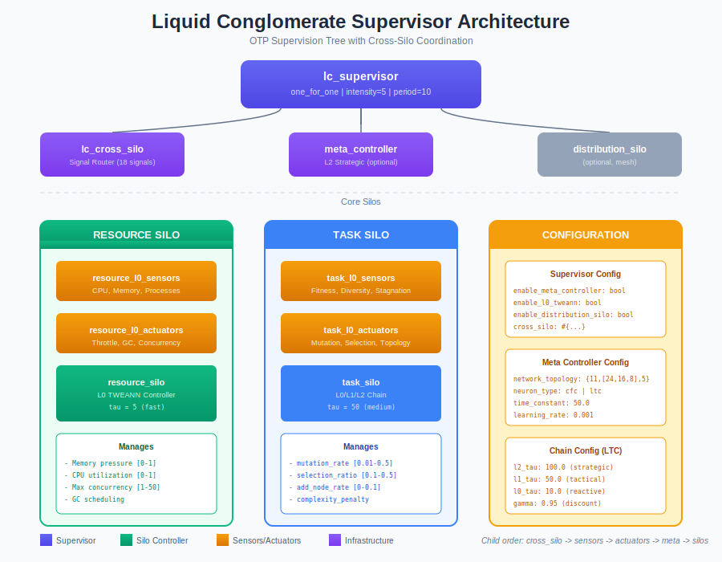
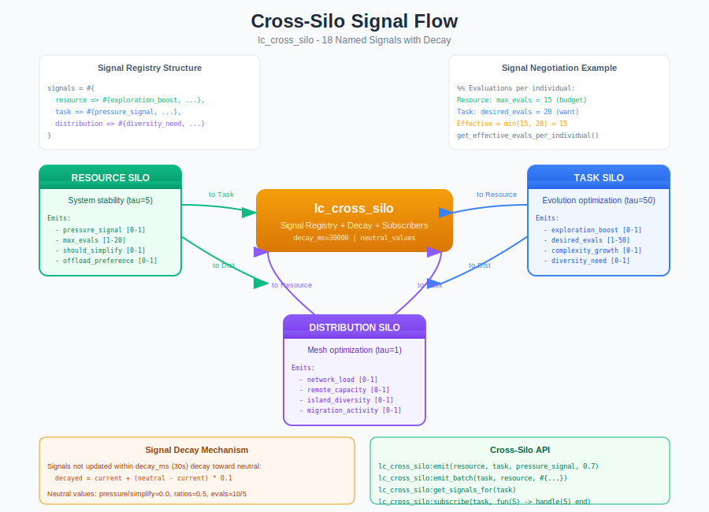
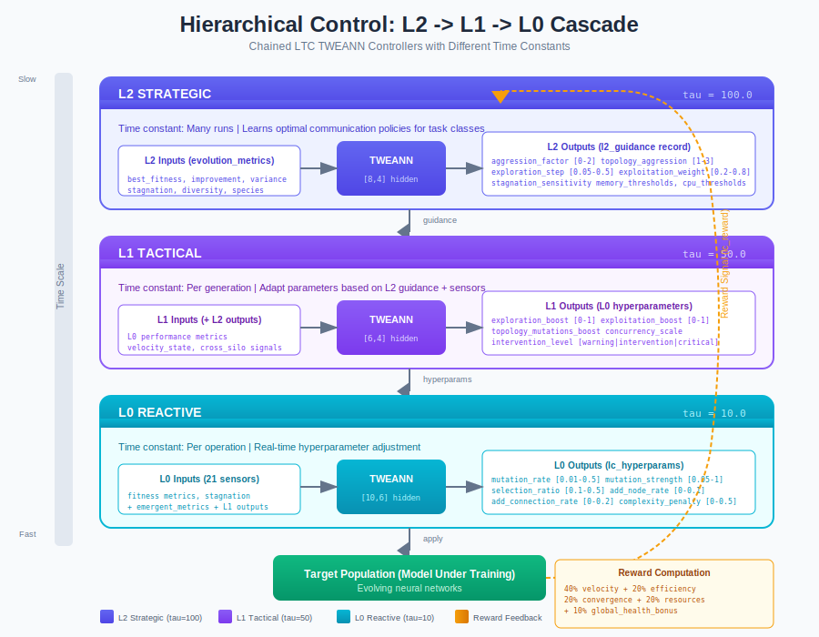

# Liquid Conglomerate (LC) Overview

The Liquid Conglomerate is the meta-controller architecture that supervises, coordinates, and configures all silos. It provides unified management of 13 specialized silos through OTP supervision, cross-silo signal routing, and hierarchical L0/L1/L2 TWEANN controllers.

## Overview

The LC architecture implements "learning to learn" - TWEANNs that adapt hyperparameters based on training dynamics, enabling neuroevolution to self-optimize without manual tuning.

**Key Components:**
- **lc_supervisor** - OTP supervisor managing all silo processes
- **lc_cross_silo** - Signal router coordinating inter-silo communication
- **Hierarchical Controllers** - L2 (strategic) -> L1 (tactical) -> L0 (reactive)
- **lc_reward** - Cooperative reward computation encouraging silo alignment



## Why a Meta-Controller?

| Traditional Approach | Liquid Conglomerate |
|---------------------|---------------------|
| Fixed hyperparameters | Adaptive hyperparameters |
| Manual tuning required | Self-tuning via TWEANNs |
| Isolated subsystems | Coordinated silos |
| Static resource allocation | Dynamic resource negotiation |
| Single timescale control | Hierarchical timescales (L0/L1/L2) |

## Architecture

### OTP Supervision Tree

The `lc_supervisor` manages the LC as an OTP application with one-for-one restart strategy:

```erlang
%% Supervisor configuration
SupFlags = #{
    strategy => one_for_one,
    intensity => 5,   % Max 5 restarts
    period => 10      % Per 10 seconds
}.
```

**Child Start Order** (dependencies require this order):
1. `lc_cross_silo` - Signal router (must start first)
2. `resource_l0_sensors` / `task_l0_sensors` - Metric collectors
3. `resource_l0_actuators` / `task_l0_actuators` - Hyperparameter appliers
4. `meta_controller` (optional) - L2 strategic layer
5. `resource_silo` / `task_silo` - Main controllers
6. `distribution_silo` (optional) - Mesh optimization

### Core Silos

| Silo | Purpose | Time Constant |
|------|---------|---------------|
| **Resource Silo** | System stability (memory, CPU, GC) | tau = 5 (fast) |
| **Task Silo** | Evolution optimization (mutation, selection) | tau = 50 (medium) |
| **Distribution Silo** | Mesh networking (optional) | tau = 1 (very fast) |

## Cross-Silo Coordination

The `lc_cross_silo` module manages signal exchange between silos, enabling cooperative control.



### Signal Routes

18 named signals are valid between silos:

| From | To | Signals |
|------|----|---------|
| Resource | Task | `pressure_signal`, `max_evals_per_individual`, `should_simplify` |
| Resource | Distribution | `offload_preference`, `local_capacity` |
| Task | Resource | `exploration_boost`, `desired_evals_per_individual`, `expected_complexity_growth` |
| Task | Distribution | `diversity_need`, `speciation_pressure` |
| Distribution | Resource | `network_load_contribution`, `remote_capacity_available` |
| Distribution | Task | `island_diversity_score`, `migration_activity` |

### Signal Negotiation

Silos negotiate shared resources via signals:

```erlang
%% Example: Evaluations per individual
ResourceMax = 15,     % Resource Silo sets budget limit
TaskDesired = 20,     % Task Silo requests based on fitness needs
Effective = min(15, 20) = 15  % Negotiated result
```

### Signal Decay

Signals not updated within `decay_ms` (default 30s) decay toward neutral values:

```erlang
%% Decay formula (10% per decay period)
decayed_value = current + (neutral - current) * 0.1

%% Neutral values by signal type
pressure_signal -> 0.0
should_simplify -> 0.0
max_evals_per_individual -> 10
diversity ratios -> 0.5
```

### Signal API

```erlang
%% Emit a signal from one silo to another
lc_cross_silo:emit(resource, task, pressure_signal, 0.7)

%% Emit multiple signals at once
lc_cross_silo:emit_batch(task, resource, #{
    exploration_boost => 0.5,
    desired_evals_per_individual => 15
})

%% Get all signals destined for a silo
Signals = lc_cross_silo:get_signals_for(task)
%% Returns: #{pressure_signal => 0.7, max_evals_per_individual => 15, ...}

%% Subscribe to signal changes
lc_cross_silo:subscribe(task, fun(Signals) -> handle_signals(Signals) end)

%% Get negotiated effective evals
Effective = lc_cross_silo:get_effective_evals_per_individual()
```

## Hierarchical Control (L0/L1/L2)

The LC uses cascaded TWEANN controllers operating at different timescales.



### Time Constants

| Level | Name | Time Constant | Timescale | Controls |
|-------|------|---------------|-----------|----------|
| **L2** | Strategic | tau = 100 | Many runs | How L1 should adjust |
| **L1** | Tactical | tau = 50 | Per generation | How L0 should behave |
| **L0** | Reactive | tau = 10 | Per operation | Direct hyperparameters |

### L2 Strategic Layer

L2 learns optimal policies across entire training runs:

**Inputs (evolution_metrics):**
- `best_fitness`, `avg_fitness`
- `fitness_improvement`, `fitness_variance`
- `stagnation_counter`, `generation_progress`
- `population_diversity`, `species_count`

**Outputs (l2_guidance record):**

| Parameter | Range | Effect |
|-----------|-------|--------|
| `aggression_factor` | [0.0, 2.0] | How strongly L1 responds to stagnation |
| `exploration_step` | [0.05, 0.5] | Speed of exploration boost increase |
| `stagnation_sensitivity` | [0.0001, 0.01] | What counts as "improvement" |
| `topology_aggression` | [1.0, 3.0] | Structural mutation boost |
| `exploitation_weight` | [0.2, 0.8] | Exploration vs exploitation balance |
| `adaptation_momentum` | [0.0, 0.95] | Smoothness of transitions |

### L1 Tactical Layer

L1 adapts L0 hyperparameters based on L2 guidance and current metrics:

**Inputs:**
- L2 guidance parameters
- L0 performance metrics
- `velocity_state` (improvement rate)
- Cross-silo signals

**Outputs:**
- `exploration_boost` [0-1]
- `exploitation_boost` [0-1]
- `topology_mutations_boost`
- `concurrency_scale`
- `intervention_level` (warning/intervention/critical)

### L0 Reactive Layer

L0 directly controls evolution hyperparameters in real-time:

**Inputs (21 sensors):**
- Fitness metrics
- Stagnation severity
- `emergent_metrics` (convergence, complexity, innovation)
- L1 outputs

**Outputs (lc_hyperparams record):**

| Parameter | Range | Default | Effect |
|-----------|-------|---------|--------|
| `mutation_rate` | [0.01, 0.5] | 0.1 | Probability of mutation |
| `mutation_strength` | [0.05, 1.0] | 0.3 | Magnitude of mutations |
| `selection_ratio` | [0.1, 0.5] | 0.2 | Fraction selected |
| `add_node_rate` | [0.0, 0.1] | 0.03 | Structural mutation rate |
| `add_connection_rate` | [0.0, 0.2] | 0.05 | Connection mutation rate |

## Reward Computation

The `lc_reward` module computes cooperative reward signals encouraging silo alignment.

### Task Silo Reward

```erlang
%% Weighted components
reward = 0.40 * velocity_score      % Fitness improvement rate
       + 0.20 * efficiency_score    % Progress vs evaluations used
       + 0.20 * convergence_score   % Avoiding premature convergence
       + 0.20 * resource_score      % Memory/CPU efficiency
```

### Resource Silo Reward

```erlang
reward = 0.35 * throughput_score    % Evaluations per second
       + 0.25 * stability_score     % GC triggers, pauses avoided
       + 0.15 * efficiency_score    % Optimal utilization
       - 0.15 * task_blocked_penalty
       - 0.10 * distribution_blocked_penalty
```

### Global Health Bonus

All silos receive a cooperative bonus based on overall system improvement:

```erlang
global_health = (resource_reward + task_reward + distribution_reward) / 3
bonus = 0.1 * (current_global_health - previous_global_health)
```

This encourages silos to help each other rather than compete.

## Configuration

### Supervisor Configuration

```erlang
Config = #{
    %% Enable optional components
    enable_meta_controller => true,        % L2 strategic layer
    enable_l0_tweann => true,              % Neural network control (vs rule-based)
    enable_distribution_silo => false,      % Mesh networking

    %% Cross-silo settings
    cross_silo => #{
        signal_decay_ms => 30000
    },

    %% Meta-controller settings
    meta_controller => #{
        network_topology => {11, [24, 16, 8], 5},
        neuron_type => cfc,                 % cfc (fast) or ltc (accurate)
        time_constant => 50.0,
        learning_rate => 0.001
    },

    %% Per-silo configuration
    resource_silo => #{...},
    task_silo => #{...}
}.
```

### Chain Configuration (lc_chain_config)

```erlang
#lc_chain_config{
    %% Time constants (override defaults)
    l2_tau = 100.0,    % Strategic: very slow
    l1_tau = 50.0,     % Tactical: medium
    l0_tau = 10.0,     % Reactive: fast

    %% Learning
    learning_rate = 0.001,
    gamma = 0.95,      % Reward discount

    %% Architecture
    evolve_topology = true,
    l2_hidden_layers = [8, 4],
    l1_hidden_layers = [6, 4],
    l0_hidden_layers = [10, 6],
    activation = tanh
}.
```

## Starting the LC

### Basic Start

```erlang
%% Start with defaults
{ok, Pid} = lc_supervisor:start_link()

%% Start with custom configuration
{ok, Pid} = lc_supervisor:start_link(#{
    enable_meta_controller => true,
    enable_l0_tweann => true
})
```

### Checking Status

```erlang
%% Get all cross-silo signals
AllSignals = lc_cross_silo:get_all_signals()

%% Get signals for a specific silo
TaskSignals = lc_cross_silo:get_signals_for(task)

%% Get negotiated effective evals
EffectiveEvals = lc_cross_silo:get_effective_evals_per_individual()
```

## Runtime Silo Control

The LC supervisor supports dynamic enabling/disabling of extension silos at runtime. This allows applications to activate specialized silos only when needed, reducing resource usage.

### Core vs Extension Silos

| Type | Silos | Behavior |
|------|-------|----------|
| **Core** | task, resource | Always enabled, cannot be disabled |
| **Extension** | temporal, competitive, social, cultural, ecological, morphological, developmental, regulatory, economic, communication, distribution | Disabled by default, enable on demand |

### Enabling/Disabling Silos

```erlang
%% Enable an extension silo
ok = lc_supervisor:enable_silo(temporal)
ok = lc_supervisor:enable_silo(competitive, #{realm => <<"game">>})

%% Disable an extension silo
ok = lc_supervisor:disable_silo(temporal)

%% Attempting to disable core silos returns error
{error, cannot_disable_core_silo} = lc_supervisor:disable_silo(task)

%% Enabling already-enabled silo returns error
{error, already_enabled} = lc_supervisor:enable_silo(temporal)

%% Disabling not-enabled silo returns error
{error, not_enabled} = lc_supervisor:disable_silo(social)

%% Unknown silo returns error
{error, unknown_silo} = lc_supervisor:enable_silo(unknown)
```

### Querying Silo Status

```erlang
%% Check if a silo is currently enabled
true = lc_supervisor:is_silo_enabled(task)
false = lc_supervisor:is_silo_enabled(temporal)

%% List all currently enabled silos
[task, resource] = lc_supervisor:list_enabled_silos()

%% List all available silo types (13 total)
AllTypes = lc_supervisor:list_available_silos()
%% [task, resource, temporal, competitive, social, cultural,
%%  ecological, morphological, developmental, regulatory,
%%  economic, communication, distribution]
```

### Silo Type to Module Mapping

```erlang
%% Get the module name for a silo type
task_silo = lc_supervisor:silo_module(task)
temporal_silo = lc_supervisor:silo_module(temporal)
{error, unknown_silo} = lc_supervisor:silo_module(unknown)

%% All 13 silo types
AllTypes = lc_supervisor:all_silo_types()
```

### Silo Dependencies

Some silos require other silos to be enabled first:

| Silo | Requires | Reason |
|------|----------|--------|
| social | competitive | Coalition competition signals |
| cultural | social | Norm transmission via social network |
| communication | social | Trust network for signaling |
| developmental | temporal | Critical period timing |
| regulatory | developmental | Expression stage coordination |

```erlang
%% Query dependencies for a silo
[competitive] = lc_supervisor:silo_dependencies(social)
[social] = lc_supervisor:silo_dependencies(cultural)
[] = lc_supervisor:silo_dependencies(temporal)  %% No dependencies

%% Enable fails if dependencies not met
{error, {missing_dependency, competitive}} = lc_supervisor:enable_silo(social)

%% Disable fails if other silos depend on it
{error, {has_dependents, [social]}} = lc_supervisor:disable_silo(competitive)
```

### Configuration Management

#### Get Silo Configuration

```erlang
%% Get the config used to start a silo
{ok, #{realm := <<"game">>}} = lc_supervisor:get_silo_config(competitive)
{ok, #{}} = lc_supervisor:get_silo_config(task)  %% Core silos return empty map
{error, not_enabled} = lc_supervisor:get_silo_config(temporal)
```

#### Reconfigure Running Silo

```erlang
%% Hot-reload configuration (restarts silo with new config)
ok = lc_supervisor:reconfigure_silo(temporal, #{realm => <<"new_realm">>})

%% Core silos cannot be reconfigured
{error, cannot_reconfigure_core_silo} = lc_supervisor:reconfigure_silo(task, #{})
```

#### Validate Configuration

```erlang
%% Validate config before enabling
ok = lc_supervisor:validate_silo_config(temporal, #{realm => <<"test">>})
{error, unknown_silo} = lc_supervisor:validate_silo_config(unknown, #{})
```

### Configuration from Application Environment

Silos can be pre-configured in `sys.config`:

```erlang
%% sys.config
[
  {faber_neuroevolution, [
    {lc_supervisor, #{
      silos => #{
        temporal => #{enabled => true, realm => <<"default">>},
        competitive => #{enabled => true, archive_max_size => 200},
        social => #{enabled => true}  %% Will auto-enable competitive first
      }
    }}
  ]}
].
```

The `silos` map uses the format `#{silo_type => #{enabled => true/false, ...config...}}`.

### Use Cases

| Scenario | Silos to Enable |
|----------|-----------------|
| Basic neuroevolution | task, resource (core only) |
| Time-constrained training | + temporal |
| Competitive game AI | + competitive, social |
| Open-ended evolution | + cultural, ecological, developmental |
| Distributed training | + distribution |
| Full LC exploration | All 13 silos |

## Control Loop

The LC executes the following loop per generation:

1. **Collect metrics** - L0 sensors gather fitness, diversity, resource usage
2. **Process L2** - Strategic controller outputs L1 guidance (every tau_L2)
3. **Process L1** - Tactical controller outputs L0 hyperparameters (every tau_L1)
4. **Process L0** - Reactive controller computes hyperparameters (every operation)
5. **Apply actuators** - L0 actuators apply hyperparameters to evolution
6. **Exchange signals** - Cross-silo signals update between silos
7. **Compute rewards** - lc_reward computes feedback for learning
8. **Update controllers** - TWEANNs learn from reward signals

## Tuning Guide

### Common Issues

| Problem | Likely Cause | Fix |
|---------|--------------|-----|
| Slow adaptation | High time constants | Decrease tau values |
| Oscillating hyperparameters | Low momentum | Increase `adaptation_momentum` |
| Stuck at local optima | Low aggression | Increase `aggression_factor` |
| Resource pressure ignored | Low cross-silo penalty | Increase penalty weights |
| Premature convergence | Low diversity pressure | Increase diversity bonuses |

### Recommended Defaults

The LC defaults are designed to be aggressive (responsive) for initial deployment:

```erlang
%% L2 Guidance Defaults (aggressive for rule-based L1)
#l2_guidance{
    aggression_factor = 1.5,         % 3x default response
    exploration_step = 0.5,          % 5x default ramp speed
    stagnation_sensitivity = 0.001,  % Sensitive to stagnation
    topology_aggression = 2.5,       % Strong structural mutations
    exploitation_weight = 0.3,       % Favor exploration
    adaptation_momentum = 0.3,       % Fast response (30% old)
    warning_threshold = 0.2,         % Warn early
    intervention_threshold = 0.4,    % Intervene early
    critical_threshold = 0.7         % Critical earlier
}.
```

## Source Code Reference

| File | Purpose |
|------|---------|
| `src/silos/lc_supervisor.erl` | OTP supervisor, runtime silo control |
| `src/silos/lc_cross_silo.erl` | Signal routing |
| `src/silos/lc_controller.erl` | L0 TWEANN controller |
| `src/silos/lc_l1_controller.erl` | L1 tactical controller |
| `src/silos/lc_l2_controller.erl` | L2 strategic controller |
| `src/silos/lc_chain.erl` | Chained L2->L1->L0 |
| `src/silos/lc_reward.erl` | Reward computation |
| `src/silos/lc_population.erl` | Population of LC controllers |
| `include/lc_chain.hrl` | Chain records |
| `include/meta_controller.hrl` | Meta-controller records |

## References

- PLAN_L2_L1_HIERARCHICAL_INTERFACE.md - Hierarchical control design
- PLAN_CHAINED_LTC_CONTROLLER.md - LTC cascade architecture
- "Meta-Learning in Neural Networks: A Survey" - Hospedales et al.
- "Liquid Time-constant Networks" - Hasani et al.

## See Also

- [Task Silo Guide](task-silo.md) - Evolution optimization
- [Resource Silo Guide](resource-silo.md) - System stability
- [Distribution Silo Guide](distribution-silo.md) - Mesh networking
