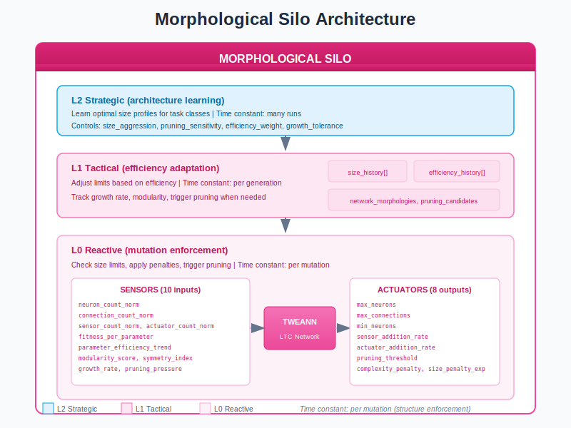
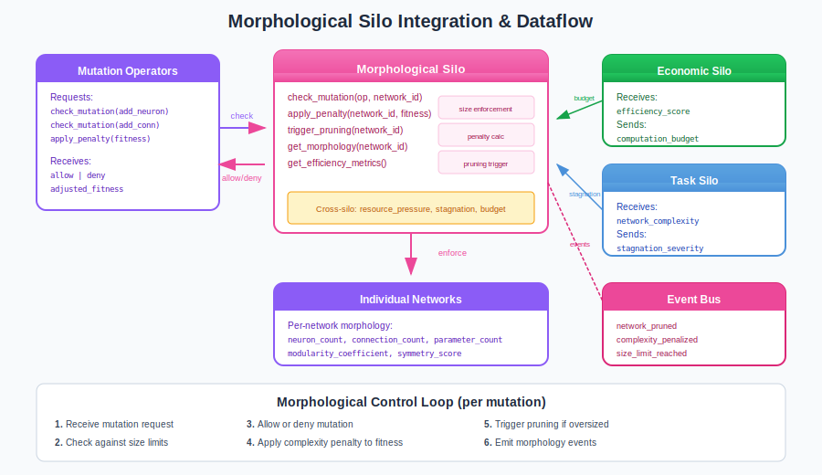

# Morphological Silo Guide

## What is the Morphological Silo?

The **Morphological Silo** is the network structure controller in the Liquid Conglomerate architecture. It manages the "body plan" of neural networks - not just weights and topology, but fundamental structural constraints: neuron budgets, connection limits, complexity penalties, and automatic pruning.

Think of the Morphological Silo as a **building code inspector for neural networks**. It sets size limits, enforces efficiency standards, removes unused structure, and ensures networks stay within deployment constraints. Without it, networks can grow without bound, wasting resources and becoming impossible to deploy on target hardware.

The Morphological Silo solves two fundamental problems in neuroevolution:

1. **Unbounded Growth**: Prevent networks from bloating beyond usable size
2. **Efficiency Pressure**: Reward networks that achieve fitness with fewer parameters

## Architecture Overview



The Morphological Silo operates as a three-level hierarchical controller:

| Level | Name | Role | Time Constant |
|-------|------|------|---------------|
| **L0** | Reactive | Check size limits, apply penalties, trigger pruning | Per mutation |
| **L1** | Tactical | Adjust limits based on efficiency trends | Per generation |
| **L2** | Strategic | Learn optimal size profiles for task classes | Across runs |

### Key Principle: Efficiency Over Size

The Morphological Silo operates on the principle that fitness alone isn't enough:

- Smaller networks are preferred over larger ones with equal fitness
- Complexity penalties create selection pressure for efficiency
- Automatic pruning removes unused structure
- Size budgets ensure deployment feasibility

## How It Works

### Sensors (Inputs)

The Morphological Silo observes 10 sensors describing network structure:

| Sensor | Range | Description |
|--------|-------|-------------|
| `neuron_count_norm` | [0, 1] | Current neurons / max allowed |
| `connection_count_norm` | [0, 1] | Current connections / max allowed |
| `sensor_count_norm` | [0, 1] | Input neurons / max input budget |
| `actuator_count_norm` | [0, 1] | Output neurons / max output budget |
| `fitness_per_parameter` | [0, 1] | Efficiency: fitness / parameters |
| `parameter_efficiency_trend` | [-1, 1] | Efficiency change over generations |
| `modularity_score` | [0, 1] | Clustering coefficient (modular structure) |
| `symmetry_index` | [0, 1] | Structural symmetry (bilateral, radial) |
| `growth_rate` | [-1, 1] | Rate of size increase per generation |
| `pruning_pressure` | [0, 1] | Amount of unused structure |

### Actuators (Outputs)

The Morphological Silo controls 8 parameters governing network structure:

| Actuator | Range | Default | Description |
|----------|-------|---------|-------------|
| `max_neurons` | [10, 1000] | 100 | Maximum hidden neurons allowed |
| `max_connections` | [20, 10000] | 500 | Maximum synaptic connections |
| `min_neurons` | [1, 50] | 5 | Minimum hidden neurons required |
| `sensor_addition_rate` | [0.0, 0.1] | 0.01 | Probability of adding input |
| `actuator_addition_rate` | [0.0, 0.1] | 0.01 | Probability of adding output |
| `pruning_threshold` | [0.0, 0.5] | 0.1 | Weight magnitude below which to prune |
| `complexity_penalty` | [0.0, 0.1] | 0.01 | Fitness penalty per parameter |
| `size_penalty_exponent` | [1.0, 3.0] | 1.5 | How aggressively to penalize size |

### Network Structure Control


The morphological control flow operates as follows:

**1. Size Limit Enforcement**
```erlang
%% Before any mutation, check limits
case morphological_silo:check_mutation(MorphPid, add_neuron, NetworkId) of
    allow -> apply_mutation(Mutation, Network);
    deny -> skip_mutation()  % Network at size limit
end
```

**2. Complexity Penalty**
```erlang
%% Apply penalty to fitness
AdjustedFitness = morphological_silo:apply_penalty(MorphPid, NetworkId, RawFitness),
%% Example: fitness=0.80, params=500, penalty=0.01, exp=1.5
%% adjusted = 0.80 - (0.01 * 500^1.5 / 1000) = 0.69
```

**3. Automatic Pruning**
```erlang
%% Trigger pruning when network is oversized or inefficient
Result = morphological_silo:trigger_pruning(MorphPid, NetworkId),
%% Returns: #{connections_removed => 4, neurons_removed => 2}
```

### The Control Loop

1. **Per Mutation**: Check size limits before allowing structural changes
2. **Per Evaluation**: Apply complexity penalty to fitness
3. **Per Generation**: Collect sensors, adjust actuators via TWEANN, prune if needed
4. **Emit Events**: Publish morphology events to event bus

## Integration with the Neuroevolution Engine



### Wiring Diagram

The Morphological Silo integrates with mutation operators and other silos:

**Data Sources:**
- `mutation_operators` - Mutation requests for size checking
- `evaluation_engine` - Fitness for efficiency calculation
- Network topology - Neuron/connection counts

**Data Consumers:**
- `mutation_operators` - Allow/deny mutation decisions
- `evaluation_engine` - Adjusted fitness with complexity penalty
- `neuroevolution_events` - Event bus for monitoring

### Cross-Silo Interactions

The Morphological Silo exchanges signals with other silos:

**Signals Sent:**
| Signal | To | Description |
|--------|-----|-------------|
| `network_complexity` | Task | Complex networks need different mutation rates |
| `size_budget_remaining` | Resource | Available growth room |
| `efficiency_score` | Economic | Cost-effectiveness of morphology |

**Signals Received:**
| Signal | From | Effect |
|--------|------|--------|
| `resource_pressure` | Resource | High pressure = tighter size limits |
| `stagnation_severity` | Task | Stagnation may warrant structural expansion |
| `computation_budget` | Economic | Budget constrains max size |

### Engine Integration Points

```erlang
%% Start Morphological Silo
{ok, _} = morphological_silo:start_link(#morphological_config{
    enabled = true,
    max_neurons = 100,
    max_connections = 500,
    pruning_threshold = 0.1,
    complexity_penalty = 0.01
}),

%% Before mutation: check limits
case morphological_silo:check_mutation(MorphPid, add_neuron, NetworkId) of
    allow -> apply_mutation();
    deny -> skip_mutation()
end,

%% After evaluation: apply penalty
AdjustedFitness = morphological_silo:apply_penalty(MorphPid, NetworkId, Fitness),

%% Periodic: trigger pruning
morphological_silo:trigger_pruning(MorphPid, NetworkId).
```

## Training Velocity Impact

| Metric | Without Morphological Silo | With Morphological Silo |
|--------|---------------------------|------------------------|
| Network bloat | Unbounded growth | Constrained by budgets |
| Inference latency | Variable, often high | Predictable, optimized |
| Training velocity | 1.0x | 0.9-1.0x (neutral) |
| Memory footprint | Unpredictable | Bounded by limits |
| Deployment success | ~60% fit hardware | ~95% fit hardware |

The Morphological Silo provides **significant deployment benefits** while having minimal impact on training speed.

## Practical Examples

### Example 1: Mutation Blocked by Size Limit

```erlang
%% Scenario: Network already at max_neurons = 100
%% Mutation operator wants to add another neuron

case morphological_silo:check_mutation(MorphPid, add_neuron, NetworkId) of
    allow -> should_not_reach_here();
    deny ->
        %% Mutation blocked, emit event
        io:format("add_neuron denied: at max_neurons limit~n")
end

%% Event emitted:
{size_limit_reached, #{
    individual_id => NetworkId,
    limit_type => neurons,
    current_value => 100,
    max_value => 100
}}
```

### Example 2: Complexity Penalty Favors Efficiency

```erlang
%% Scenario: Two networks with similar raw fitness
%% Network A: fitness=0.80, params=500 (bloated)
%% Network B: fitness=0.75, params=100 (efficient)

%% With complexity_penalty=0.01, size_penalty_exponent=1.5:

%% Network A adjusted = 0.80 - (0.01 * 500^1.5 / 1000) = 0.69
%% Network B adjusted = 0.75 - (0.01 * 100^1.5 / 1000) = 0.74

%% Result: Efficient Network B wins selection despite lower raw fitness
```

### Example 3: Pruning Removes Unused Structure

```erlang
%% Scenario: Network has 13 neurons, 4 orphan, 14 connections, 4 weak
%% pruning_threshold = 0.1

Result = morphological_silo:trigger_pruning(MorphPid, NetworkId),
%% Result = #{connections_removed => 4, neurons_removed => 4}

%% Event emitted:
{network_pruned, #{
    individual_id => NetworkId,
    neurons_removed => 4,
    connections_removed => 4,
    old_efficiency => 0.42,
    new_efficiency => 0.78
}}

%% Result: Network is 31% smaller, 86% more efficient
```

## Tuning Guide

### Key Parameters

| Parameter | When to Increase | When to Decrease |
|-----------|------------------|------------------|
| `max_neurons` | Task needs capacity | Targeting small devices |
| `max_connections` | Complex mappings | Memory constrained |
| `pruning_threshold` | Many weak connections | Over-pruning |
| `complexity_penalty` | Networks too large | Fitness suffering |
| `size_penalty_exponent` | Need aggressive pruning | Want gradual control |

### Common Pitfalls

1. **Size limits too tight**: Good solutions can't emerge
   - Symptom: Fitness plateaus early
   - Fix: Increase `max_neurons` to 200+

2. **No pruning**: Dead connections accumulate
   - Symptom: Networks grow but efficiency drops
   - Fix: Increase `pruning_threshold` to 0.15+

3. **Excessive penalty**: Underfitting
   - Symptom: Networks too small for task
   - Fix: Reduce `complexity_penalty` to 0.005

4. **Aggressive exponent**: Kills all growth
   - Symptom: No network exceeds minimal size
   - Fix: Reduce `size_penalty_exponent` to 1.2

### Debugging Tips

```erlang
%% Get network morphology
Morphology = morphological_silo:get_morphology(MorphPid, NetworkId),
io:format("Neurons: ~p (max: ~p)~n", [
    Morphology#network_morphology.neuron_count,
    Config#morphological_config.max_neurons
]),
io:format("Connections: ~p~n", [Morphology#network_morphology.connection_count]),
io:format("Efficiency: ~.3f~n", [Morphology#network_morphology.modularity_coefficient]),

%% Get overall state
State = morphological_silo:get_state(MorphPid),
io:format("Growth rate: ~.2f~n", [State#morphological_state.growth_rate]),
io:format("Pruning pressure: ~.2f~n", [State#morphological_state.pruning_pressure]).
```

## Events Reference

The Morphological Silo emits events on significant actions:

| Event | Trigger | Key Payload |
|-------|---------|-------------|
| `morphology_constrained` | Size limits changed | `max_neurons`, `max_connections` |
| `network_pruned` | Pruning occurred | `neurons_removed`, `connections_removed` |
| `complexity_penalized` | Penalty applied | `individual_id`, `penalty_amount` |
| `efficiency_improved` | Better fitness/param | `old_efficiency`, `new_efficiency` |
| `size_limit_reached` | Hit max | `limit_type`, `current_value` |
| `morphology_expanded` | Significant growth | `old_count`, `new_count`, `growth_rate` |

**Example Event Payload:**
```erlang
{network_pruned, #{
    silo => morphological,
    timestamp => 1703318400000,
    generation => 42,
    payload => #{
        individual_id => <<"net_12345">>,
        neurons_removed => 4,
        connections_removed => 6,
        pruning_threshold => 0.1,
        new_efficiency => 0.78
    }
}}
```

## L0 Hyperparameters (L1-Tuned)

| Parameter | Range | Default | Description |
|-----------|-------|---------|-------------|
| `max_neurons` | [10, 1000] | 100 | Maximum hidden neurons |
| `max_connections` | [20, 10000] | 500 | Maximum synaptic connections |
| `min_neurons` | [1, 50] | 5 | Minimum hidden neurons |
| `pruning_threshold` | [0.0, 0.5] | 0.1 | Weight below which to prune |
| `complexity_penalty` | [0.0, 0.1] | 0.01 | Fitness penalty rate |

## L1 Hyperparameters (L2-Tuned)

| Parameter | Range | Default | Description |
|-----------|-------|---------|-------------|
| `size_aggression` | [0.0, 2.0] | 0.5 | How aggressively to control size |
| `pruning_sensitivity` | [0.0, 1.0] | 0.5 | How easily pruning triggers |
| `efficiency_weight` | [0.0, 1.0] | 0.5 | Weight on efficiency vs capacity |
| `growth_tolerance` | [0.0, 1.0] | 0.5 | Allowance for network growth |

## Configuration Examples

### Edge Device Deployment
```erlang
#morphological_config{
    enabled = true,
    max_neurons = 50,              % Strict limit
    max_connections = 200,         % Minimal
    min_neurons = 3,
    pruning_threshold = 0.15,      % Aggressive pruning
    complexity_penalty = 0.02,     % Strong penalty
    size_penalty_exponent = 2.0    % Aggressive scaling
}.

%% Evolves minimal networks for microcontrollers
```

### Research Exploration Mode
```erlang
#morphological_config{
    enabled = true,
    max_neurons = 500,             % Generous
    max_connections = 5000,        % Lots of room
    min_neurons = 10,
    pruning_threshold = 0.05,      % Light pruning
    complexity_penalty = 0.005,    % Mild penalty
    size_penalty_exponent = 1.2    % Gentle scaling
}.

%% Allows exploration of larger architectures
```

### Balanced Production
```erlang
#morphological_config{
    enabled = true,
    max_neurons = 100,
    max_connections = 500,
    min_neurons = 5,
    pruning_threshold = 0.1,
    complexity_penalty = 0.01,
    size_penalty_exponent = 1.5
}.

%% Default balanced configuration
```

## Source Code Reference

| Module | Purpose | Location |
|--------|---------|----------|
| `morphological_silo.erl` | Main gen_server | `src/silos/morphological_silo/` |
| `morphological_silo_sensors.erl` | Sensor collection (10) | Same |
| `morphological_silo_actuators.erl` | Actuator application (8) | Same |
| `morphological_size.erl` | Size limit enforcement | Same |
| `morphological_efficiency.erl` | Efficiency calculation | Same |
| `morphological_pruning.erl` | Pruning operations | Same |
| `morphological_modularity.erl` | Modularity metrics | Same |
| `morphological_silo.hrl` | Record definitions | Same |
| `lc_cross_silo.erl` | Cross-silo signals | `src/silos/` |

## Further Reading

- [Liquid Conglomerate Overview](../liquid-conglomerate.md) - Full LC architecture
- [Economic Silo](economic-silo.md) - Resource allocation and efficiency
- [Temporal Silo](temporal-silo.md) - Time management and early termination
- [Task Silo](task-silo.md) - Hyperparameter adaptation
- [Meta-Controller Guide](../meta-controller.md) - L2 strategic layer

## References

### Neuroevolution and Topology
- Stanley, K.O. & Miikkulainen, R. (2002). "Evolving Neural Networks through Augmenting Topologies." Evolutionary Computation.

### Network Pruning
- Han, S., Pool, J., Tran, J., & Dally, W. (2015). "Learning both Weights and Connections for Efficient Neural Networks." NeurIPS.
- Frankle, J. & Carlin, M. (2019). "The Lottery Ticket Hypothesis." ICLR.

### Modularity in Networks
- Newman, M.E.J. (2006). "Modularity and Community Structure in Networks." PNAS.
- Clune, J., Mouret, J.B., & Lipson, H. (2013). "The evolutionary origins of modularity." Proceedings of the Royal Society B.
