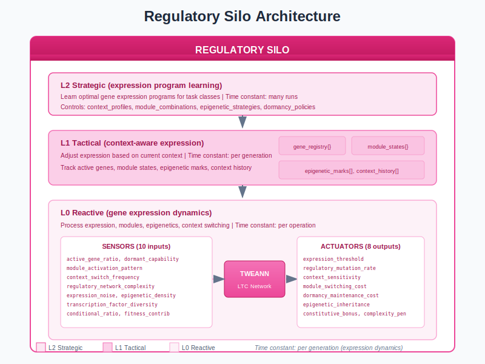
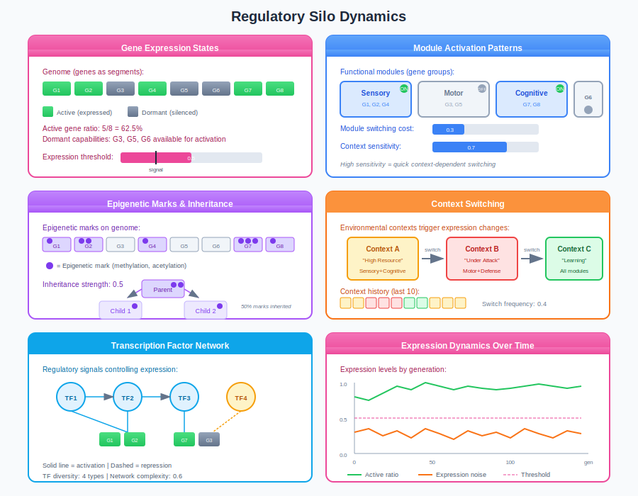
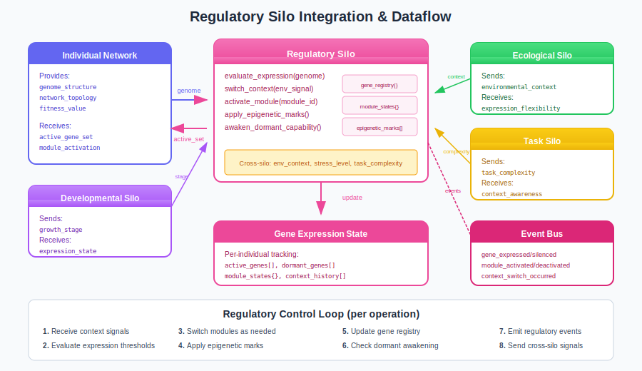

# Regulatory Silo Guide

The Regulatory Silo manages gene expression and network activation - which parts of the genome are expressed in which contexts. Like biological gene regulation, this enables the same genotype to produce different phenotypes based on environmental conditions, supporting multi-modal behavior and graceful degradation.

## Overview

Traditional neuroevolution treats networks as static expressions of genotype. The Regulatory Silo introduces dynamic control:

- **Context-dependent expression** - Different genes active in different contexts
- **Module activation** - Functional gene groups switch on/off together
- **Dormant capabilities** - Hidden genes available for future activation
- **Epigenetic inheritance** - Expression patterns passed across generations
- **Transcription factors** - Regulatory signals controlling gene expression



## Why Gene Regulation?

| Static Networks | Regulated Networks |
|-----------------|-------------------|
| All genes always expressed | Context-appropriate expression |
| Single behavioral mode | Multi-modal behavior |
| No hidden capabilities | Dormant genes for adaptation |
| Wasteful resources | Energy-efficient operation |
| Fixed phenotype | Dynamic phenotype switching |

## Architecture

The Regulatory Silo uses TWEANN controllers at three levels:

| Level | Time Constant | Controls |
|-------|---------------|----------|
| **L2 Strategic** | Many runs | Optimal expression programs for task classes |
| **L1 Tactical** | Per generation | Adapt parameters based on context history |
| **L0 Reactive** | Per operation | Process expression, switching, epigenetics |

### Sensors (10 inputs)

The L0 controller receives 10 regulatory measurements:

| Sensor | Range | Description |
|--------|-------|-------------|
| `active_gene_ratio` | [0.0, 1.0] | Expressed genes / total genes |
| `dormant_capability_count` | [0.0, 1.0] | Unexpressed but available capabilities |
| `module_activation_pattern` | [0.0, 1.0] | Entropy of module activation |
| `context_switch_frequency` | [0.0, 1.0] | How often context changes |
| `regulatory_network_complexity` | [0.0, 1.0] | Complexity of regulation logic |
| `expression_noise` | [0.0, 1.0] | Stochasticity in expression |
| `epigenetic_mark_density` | [0.0, 1.0] | Epigenetic marks per gene |
| `transcription_factor_diversity` | [0.0, 1.0] | Variety of regulatory signals |
| `conditional_expression_ratio` | [0.0, 1.0] | Context-dependent vs constitutive |
| `regulatory_fitness_contribution` | [0.0, 1.0] | How much regulation helps fitness |

### Actuators (8 outputs)

The controller adjusts 8 regulatory parameters:

| Actuator | Range | Default | Effect |
|----------|-------|---------|--------|
| `expression_threshold` | [0.0, 1.0] | 0.5 | Signal needed for gene expression |
| `regulatory_mutation_rate` | [0.0, 0.1] | 0.02 | Rate of regulation changes |
| `context_sensitivity` | [0.0, 1.0] | 0.5 | How responsive to context changes |
| `module_switching_cost` | [0.0, 0.5] | 0.1 | Fitness cost of switching modules |
| `dormancy_maintenance_cost` | [0.0, 0.1] | 0.01 | Cost per dormant gene |
| `epigenetic_inheritance_strength` | [0.0, 1.0] | 0.5 | How much marks inherit |
| `constitutive_expression_bonus` | [0.0, 0.2] | 0.05 | Bonus for always-on genes |
| `regulatory_complexity_penalty` | [0.0, 0.1] | 0.02 | Cost of complex regulation |

## Regulatory Dynamics



### Gene Expression States

Each gene in the genome exists in one of several states:

| State | Description | Example |
|-------|-------------|---------|
| **Expressed** | Gene is active, contributing to phenotype | Sensory processing gene |
| **Silenced** | Gene is off, not contributing | Motor gene during sensing |
| **Dormant** | Gene is off but can be activated later | Defense capability |
| **Constitutive** | Gene is always expressed | Core metabolism gene |
| **Conditional** | Gene expression depends on context | Context-specific behavior |

**Expression threshold:**
```erlang
%% Gene is expressed if signal exceeds threshold
expressed = signal >= expression_threshold
```

### Module Activation

Modules group related genes for coordinated activation:

| Module Type | Description | Genes |
|-------------|-------------|-------|
| **Sensory** | Input processing | G1, G2, G4 |
| **Motor** | Output generation | G3, G5 |
| **Cognitive** | Internal processing | G7, G8 |
| **Defense** | Stress response | G6 (dormant) |

**Module switching:**
- Modules activate/deactivate as a unit
- Switching incurs fitness cost (`module_switching_cost`)
- Context preference determines activation

### Context Switching

Networks change behavior based on environmental context:

| Context | Active Modules | Expression Pattern |
|---------|----------------|-------------------|
| **High Resource** | Sensory + Cognitive | Exploration mode |
| **Under Attack** | Motor + Defense | Response mode |
| **Learning** | All modules | Full capability |
| **Low Energy** | Core only | Conservation mode |

**Context history:**
- Last 10 contexts tracked
- Switch frequency measured
- High switching = volatile environment

### Epigenetic Inheritance

Expression patterns can be inherited across generations:

```erlang
%% Epigenetic inheritance
inherited_marks = parent_marks * inheritance_strength
%% With inheritance_strength = 0.5, half of marks pass to offspring
```

| Mark Type | Effect | Inheritance |
|-----------|--------|-------------|
| **Methylation** | Silences genes | 50% (default) |
| **Acetylation** | Activates genes | 50% (default) |
| **Phosphorylation** | Temporary activation | 30% |

### Transcription Factors

Regulatory signals that control gene expression:

| Factor Type | Effect | Target |
|-------------|--------|--------|
| **Activator** | Increases expression | Specific genes |
| **Repressor** | Decreases expression | Specific genes |
| **Context-dependent** | Varies by context | Gene groups |

**Network complexity:**
- Simple: few factors, direct control
- Complex: many factors, cascading effects
- Complexity penalized (`regulatory_complexity_penalty`)

## Integration with Other Silos



### Outgoing Signals

| Signal | To Silo | Trigger |
|--------|---------|---------|
| `expression_flexibility` | Cultural | Conditional gene ratio |
| `dormant_potential` | Competitive | Dormant gene count |
| `context_awareness` | Task | Sensitivity + switch rate |
| `expression_cost` | Morphological | Active gene energy |
| `energy_requirement` | Economic | Total expression load |

### Incoming Signals

| Signal | From Silo | Effect |
|--------|-----------|--------|
| `environmental_context` | Ecological | Sets current context |
| `stress_level` | Ecological | Stress > 0.7 activates dormant genes |
| `task_complexity` | Task | Complexity > 0.7 lowers threshold |
| `developmental_stage` | Developmental | Stage affects expression patterns |
| `energy_available` | Economic | Low energy limits expression |

### Signal Examples

```erlang
%% Receive stress from ecological silo
handle_cast({cross_silo, stress_level, Stress}, State) when Stress > 0.7 ->
    %% High stress activates dormant genes
    NewGenes = activate_dormant_genes(State#regulatory_state.genes, Stress),
    {noreply, State#regulatory_state{genes = NewGenes}};

%% Send flexibility signal to cultural silo
signal_expression_flexibility(Pid) ->
    Genes = maps:values(State#regulatory_state.genes),
    Conditional = length([G || G <- Genes, not G#gene.is_constitutive]),
    Flexibility = Conditional / length(Genes),
    clamp(Flexibility, 0.0, 1.0).
```

## Events Emitted

| Event | Payload | Trigger |
|-------|---------|---------|
| `gene_expressed` | `{gene_id, trigger}` | Gene turned on |
| `gene_silenced` | `{gene_id, reason}` | Gene turned off |
| `module_activated` | `{module_id, context}` | Module switched on |
| `module_deactivated` | `{module_id}` | Module switched off |
| `context_switch_occurred` | `{old_context, new_context}` | Context changed |
| `dormant_capability_awakened` | `{gene_id, trigger}` | Hidden gene expressed |
| `epigenetic_mark_acquired` | `{gene_id, mark_type}` | Mark added |
| `regulatory_mutation` | `{gene_id, old_regulation, new_regulation}` | Regulation changed |

## Practical Examples

### Example 1: Multi-Task Agent

Configure for context-switching multi-task behavior:

```erlang
Config = #{
    expression_threshold => 0.4,         % Easy expression
    context_sensitivity => 0.8,          % High sensitivity
    module_switching_cost => 0.05,       % Low switching cost
    dormancy_maintenance_cost => 0.005,  % Low dormancy cost
    epigenetic_inheritance_strength => 0.3
}.
```

**Expected outcomes:**
- Quick mode switching between tasks
- Multiple behavioral modes
- Low overhead for maintaining capabilities

### Example 2: Specialist Agent

Configure for deep specialization in one context:

```erlang
Config = #{
    expression_threshold => 0.7,         % High threshold
    context_sensitivity => 0.2,          % Low sensitivity
    module_switching_cost => 0.3,        % High switching cost
    constitutive_expression_bonus => 0.15,% Reward always-on
    regulatory_complexity_penalty => 0.05
}.
```

**Expected outcomes:**
- Stable, specialized behavior
- Few modules active
- High efficiency in primary context

### Example 3: Adaptive Agent

Configure for stress-responsive adaptation:

```erlang
Config = #{
    expression_threshold => 0.5,
    context_sensitivity => 0.6,
    dormancy_maintenance_cost => 0.005,  % Keep dormant capabilities
    epigenetic_inheritance_strength => 0.7,% Strong inheritance
    regulatory_mutation_rate => 0.03     % Some exploration
}.
```

**Expected outcomes:**
- Dormant genes activate under stress
- Expression patterns inherit to offspring
- Gradual adaptation to environment

## Tuning Guide

### Trade-offs

| Goal | Settings |
|------|----------|
| **Quick switching** | Low switching cost, high sensitivity |
| **Stable behavior** | High switching cost, low sensitivity |
| **Energy efficiency** | High threshold, dormancy cost |
| **Flexibility** | Low threshold, low dormancy cost |
| **Heritage** | High epigenetic inheritance |

### Common Issues

| Problem | Likely Cause | Fix |
|---------|--------------|-----|
| Too much switching | Low switching cost | Increase `module_switching_cost` |
| No context response | Low sensitivity | Increase `context_sensitivity` |
| All genes always on | Low threshold | Increase `expression_threshold` |
| Dormant genes never used | High dormancy cost | Decrease `dormancy_maintenance_cost` |
| Complex regulation | Low penalty | Increase `regulatory_complexity_penalty` |

### Recommended Starting Point

```erlang
DefaultConfig = #{
    expression_threshold => 0.5,
    regulatory_mutation_rate => 0.02,
    context_sensitivity => 0.5,
    module_switching_cost => 0.1,
    dormancy_maintenance_cost => 0.01,
    epigenetic_inheritance_strength => 0.5,
    constitutive_expression_bonus => 0.05,
    regulatory_complexity_penalty => 0.02
}.
```

## Control Loop

The Regulatory Silo executes per operation:

1. **Receive context signals** - Get environment from Ecological Silo
2. **Evaluate expression thresholds** - Determine which genes should be active
3. **Switch modules as needed** - Activate/deactivate gene groups
4. **Apply epigenetic marks** - Update expression modifiers
5. **Update gene registry** - Record current expression state
6. **Check dormant awakening** - Activate hidden genes if triggered
7. **Emit regulatory events** - Notify listeners of changes
8. **Send cross-silo signals** - Update dependent silos

## Configuration Reference

### Full Configuration Record

```erlang
-record(regulatory_config, {
    %% Enable/disable
    enabled = true :: boolean(),

    %% Gene configuration
    max_genes = 1000 :: pos_integer(),
    max_modules = 50 :: pos_integer(),

    %% Epigenetics
    enable_epigenetics = true :: boolean(),
    max_marks_per_gene = 10 :: pos_integer(),

    %% Context
    available_contexts = [default] :: [context_id()],

    %% Event emission
    emit_events = true :: boolean()
}).
```

### API Functions

```erlang
%% Start the regulatory silo
regulatory_silo:start_link(Config)

%% Context management
regulatory_silo:set_context(Pid, ContextId)
regulatory_silo:update_context(Pid, RegContext)

%% Gene expression
ok = regulatory_silo:express_gene(Pid, GeneId)
ok = regulatory_silo:silence_gene(Pid, GeneId)
Expressed = regulatory_silo:get_expressed_genes(Pid)

%% Module activation
ok = regulatory_silo:activate_module(Pid, ModuleId)
ok = regulatory_silo:deactivate_module(Pid, ModuleId)
Active = regulatory_silo:get_active_modules(Pid)

%% Epigenetics
ok = regulatory_silo:add_epigenetic_mark(Pid, GeneId, Mark)
regulatory_silo:inherit_marks(Pid, ParentGeneId, ChildGeneId)

%% Get regulatory parameters
Params = regulatory_silo:get_regulatory_params(Pid)

%% Enable/disable silo
regulatory_silo:enable(Pid)
regulatory_silo:disable(Pid)
```

## Biological Inspiration

The Regulatory Silo mirrors biological gene regulation:

| Biology | Regulatory Silo |
|---------|-----------------|
| Gene promoters | Expression threshold |
| Transcription factors | Regulatory signals |
| Epigenetic marks | Inherited expression patterns |
| Cell differentiation | Module specialization |
| Stress response genes | Dormant capabilities |
| Tissue-specific expression | Context-dependent activation |

## Source Code Reference

Core implementation files:

| File | Purpose |
|------|---------|
| `src/lc_silos/regulatory_silo.erl` | Main silo gen_server |
| `src/lc_silos/regulatory_silo_sensors.erl` | L0 sensor implementation |
| `src/lc_silos/regulatory_silo_actuators.erl` | L0 actuator implementation |
| `src/lc_silos/regulatory_silo.hrl` | Record definitions |

## References

- PLAN_REGULATORY_SILO.md - Full specification
- "The Logic of Gene Regulation" - Ptashne
- "Epigenetics" - Allis, Jenuwein, Reinberg
- "Gene Regulatory Networks" - Davidson

## See Also

- [Ecological Silo Guide](ecological-silo.md) - Environmental context source
- [Developmental Silo Guide](developmental-silo.md) - Stage affects expression
- [Cultural Silo Guide](cultural-silo.md) - Expression flexibility for learning
- [Competitive Silo Guide](competitive-silo.md) - Dormant capabilities for counter-strategies
