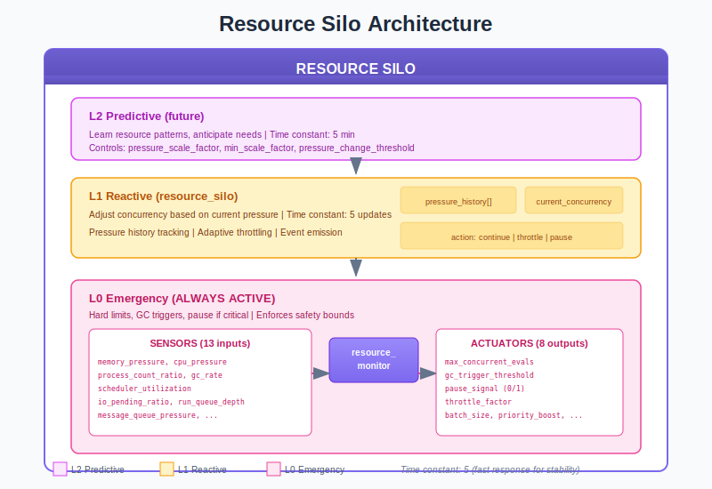
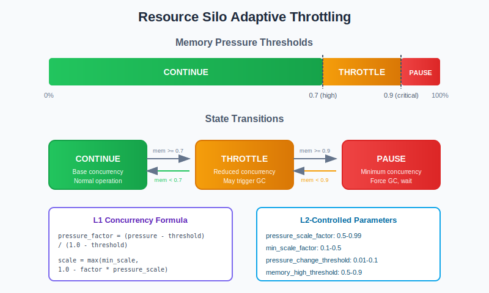
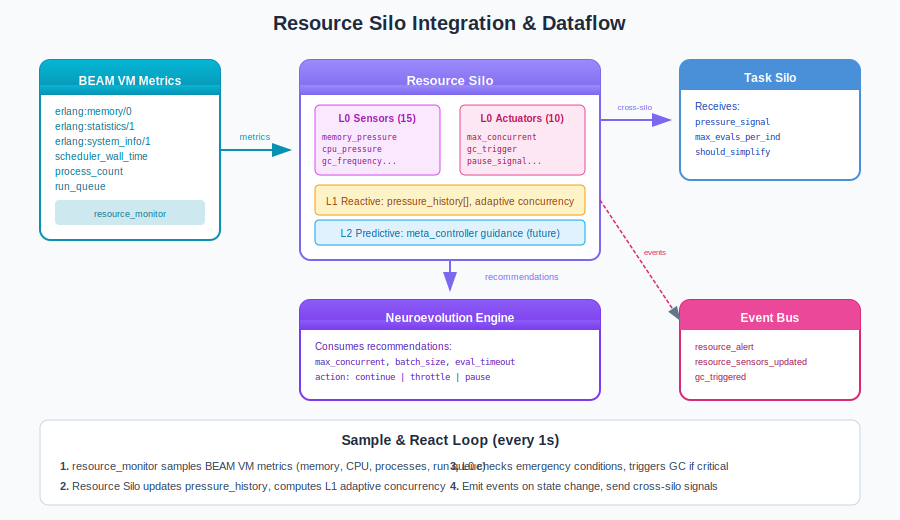

# Resource Silo Guide

## What is the Resource Silo?

The **Resource Silo** is the system stability controller in the Liquid Conglomerate architecture. It monitors computational resources (memory, CPU, processes) and dynamically adjusts the evolution engine's concurrency to prevent system crashes while maximizing throughput.

Think of the Resource Silo as a **traffic controller** for a busy highway. When traffic is light (low resource pressure), it allows full speed (high concurrency). As congestion builds, it slows traffic down (throttles). In emergencies, it can stop traffic entirely (pause) until conditions improve.

The Resource Silo solves a fundamental problem in neuroevolution: **resource exhaustion**. Evaluating thousands of neural networks concurrently can quickly exhaust system memory or saturate CPU. Without active management, the system crashes. The Resource Silo prevents this by continuously monitoring system state and adapting evaluation intensity.

## Architecture Overview



The Resource Silo operates as a three-level hierarchical controller:

| Level | Name | Role | Time Constant |
|-------|------|------|---------------|
| **L0** | Emergency | Hard limits, GC triggers, pause if critical | Always active |
| **L1** | Reactive | Adjust concurrency based on current pressure | 5 updates |
| **L2** | Predictive | Learn resource patterns, anticipate needs | Future |

### Key Principle: Safety First

The levels are designed for fail-safe operation:

- **L0** is always active - it cannot be disabled and enforces absolute limits
- If **L2** produces bad predictions → L1 ignores them and uses defaults
- If **L1** computes extreme values → L0 clamps to safe bounds
- Even if all higher layers fail, L0 will trigger GC and pause to protect the system

## How It Works

### Sensors (Inputs)

The Resource Silo observes 15 sensors that describe current system state:

| Sensor | Range | Description |
|--------|-------|-------------|
| `memory_pressure` | [0, 1] | Used memory / total memory |
| `memory_velocity` | [-1, 1] | Rate of memory change |
| `cpu_pressure` | [0, 1] | CPU utilization (scheduler-based) |
| `cpu_velocity` | [-1, 1] | Rate of CPU change |
| `run_queue_pressure` | [0, 1] | Run queue / (schedulers * 2) |
| `process_pressure` | [0, 1] | Process count / process limit |
| `message_queue_pressure` | [0, 1] | Aggregate message queue depth |
| `binary_memory_ratio` | [0, 1] | Binary heap / total memory |
| `gc_frequency` | [0, 1] | GC rate (normalized) |
| `current_concurrency_ratio` | [0, 1] | Current / max concurrency |
| `task_silo_exploration` | [0, 1] | Signal from Task Silo |
| `evaluation_throughput` | [0, 1] | Evaluations per second |
| `time_since_last_gc` | [0, 1] | Time since last forced GC |
| `archive_memory_ratio` | [0, 1] | Self-play archive memory usage |
| `crdt_state_size_ratio` | [0, 1] | CRDT sync overhead |

### Actuators (Outputs)

The Resource Silo controls 10 parameters that govern system behavior:

| Actuator | Range | Default | Description |
|----------|-------|---------|-------------|
| `max_concurrent_evaluations` | [1, base*2] | base_concurrency | Max parallel evals |
| `evaluation_batch_size` | [1, 50] | 10 | Evals per batch |
| `gc_trigger_threshold` | [0.5, 0.95] | 0.85 | Memory % to trigger GC |
| `pause_threshold` | [0.7, 0.99] | 0.95 | Memory % to pause |
| `throttle_intensity` | [0, 1] | 0.0 | How aggressively to throttle |
| `max_evals_per_individual` | [1, 20] | 5 | Evaluation cap per agent |
| `task_silo_pressure_signal` | [0, 1] | 0.0 | Cross-silo signal to Task |
| `gc_aggressiveness` | [0, 1] | 0.5 | GC intensity |
| `archive_gc_pressure` | [0, 1] | 0.0 | Force archive cleanup |
| `evaluation_timeout` | [1000, 10000] | 3000 | Worker timeout (ms) |

### Adaptive Throttling



The Resource Silo uses a **three-state machine** to manage system load:

**State: CONTINUE**
- Memory pressure below `memory_high_threshold` (default: 0.7)
- Full concurrency allowed
- Normal operation

**State: THROTTLE**
- Memory pressure between `memory_high_threshold` and `memory_critical_threshold`
- Concurrency reduced proportionally
- May trigger GC if pressure is rising

**State: PAUSE**
- Memory pressure at or above `memory_critical_threshold` (default: 0.9)
- Minimum concurrency (or full stop)
- Force GC on all processes
- Wait for pressure to decrease

### The L1 Concurrency Formula

```erlang
%% Compute pressure factor (0.0 to 1.0)
PressureFactor = max(MemFactor, CpuFactor),

%% Scale concurrency using L2-controlled factors
ScaleFactor = max(MinScale, 1.0 - (PressureFactor * PressureScale)),
NewConcurrency = max(1, round(Base * ScaleFactor))
```

Where:
- `PressureScale` (L2-controlled): How aggressively to reduce (default: 0.9)
- `MinScale` (L2-controlled): Minimum concurrency fraction (default: 0.1)

### The Control Loop

1. **Sample Metrics**: Every 1 second, collect VM metrics via `resource_monitor`
2. **Update History**: Add pressure to rolling window for velocity calculation
3. **Query L2**: If enabled, get strategic guidance from `meta_controller`
4. **Compute L1 Concurrency**: Calculate adaptive concurrency based on pressure
5. **Check L0 Emergency**: If critical, trigger GC and increment pause count
6. **Emit Events**: On state change, publish `resource_alert` event
7. **Return Recommendations**: Engine queries for `max_concurrent` and `action`

```erlang
%% Typical usage in evolution loop
run_evaluations(Population, State) ->
    %% Get recommendations from Resource Silo
    #{action := Action, max_concurrent := MaxConc} = resource_silo:get_recommendations(),

    case Action of
        pause ->
            %% Wait for resources to recover
            timer:sleep(1000),
            run_evaluations(Population, State);
        throttle ->
            %% Proceed with reduced concurrency
            evaluate_batch(Population, MaxConc, State);
        continue ->
            %% Full speed ahead
            evaluate_batch(Population, MaxConc, State)
    end.
```

## Integration with the Neuroevolution Engine



### Wiring Diagram

The Resource Silo integrates with the system at the lowest level:

**Data Sources:**
- `resource_monitor` - Raw BEAM VM metrics (memory, CPU, processes)
- `neuroevolution_server` - Evaluation throughput, current concurrency
- `opponent_archive` - Self-play archive memory statistics (optional)

**Data Consumers:**
- `neuroevolution_server` - Applies concurrency limits, timeout settings
- `task_silo` - Receives pressure signals for hyperparameter adaptation
- `neuroevolution_events` - Event bus for monitoring

### Cross-Silo Interactions

The Resource Silo exchanges signals with other silos:

**Signals Sent:**
| Signal | To | Description |
|--------|-----|-------------|
| `pressure_signal` | Task | Current resource pressure (0-1) |
| `max_evals_per_individual` | Task | Caps evaluation budget |
| `should_simplify` | Task | Suggests simpler networks when resources stressed |
| `local_capacity` | Distribution | Available local compute capacity |

**Signals Received:**
| Signal | From | Effect |
|--------|------|--------|
| `exploration_boost` | Task | High exploration = expect more evaluations |
| `desired_evals_per_individual` | Task | Requested evaluation budget |
| `expected_complexity_growth` | Task | Anticipated memory needs |

### Engine Integration Points

```erlang
%% Start Resource Silo with configuration
{ok, _} = resource_silo:start_link(#{
    enabled_levels => [l0, l1],           % L2 not yet implemented
    base_concurrency => 100000,            % Erlang can handle it
    memory_high_threshold => 0.7,          % Start throttling at 70%
    memory_critical_threshold => 0.9,      % Pause at 90%
    cpu_high_threshold => 0.9,             % Throttle at 90% CPU
    sample_interval => 1000                % Sample every 1 second
}),

%% In evaluation loop
before_evaluation_batch() ->
    case resource_silo:should_pause() of
        true ->
            %% Wait for resources
            timer:sleep(500),
            before_evaluation_batch();
        false ->
            #{max_concurrent := N} = resource_silo:get_recommendations(),
            {ok, N}
    end.
```

## Training Velocity Impact

| Metric | Without Resource Silo | With Resource Silo |
|--------|----------------------|-------------------|
| System stability | Crashes under load | Graceful degradation |
| Concurrency management | Fixed (guess) | Adaptive to pressure |
| Memory safety | None (OOM kills) | Proactive GC, pause |
| Training velocity | 0.0x (crashes) | 1.0x (baseline) |

The Resource Silo establishes the baseline training velocity by keeping the system alive. Without it, aggressive neuroevolution experiments would crash, yielding 0x velocity.

## Practical Examples

### Example 1: Handling Memory Pressure

```erlang
%% Scenario: Memory pressure climbing during evolution
%% resource_monitor reports memory_pressure = 0.75

%% Resource Silo detects THROTTLE condition
Recommendations = resource_silo:get_recommendations(),

%% With pressure at 0.75 (above 0.7 threshold):
%% - action => throttle
%% - max_concurrent => 65000 (reduced from 100000)
%% - reason => <<"High resource pressure - reducing concurrency">>

%% Event emitted:
%% {resource_alert, #{
%%     previous_action => continue,
%%     action => throttle,
%%     memory_pressure => 0.75,
%%     cpu_pressure => 0.45,
%%     message => <<"Resource pressure detected, reducing concurrency">>
%% }}
```

### Example 2: Critical Pressure Response

```erlang
%% Scenario: Memory pressure hits critical level
%% resource_monitor reports memory_pressure = 0.92

%% Resource Silo L0 triggers emergency response
%% 1. Forces garbage collection on all processes
%% 2. Increments pause_count
%% 3. Returns pause action

Recommendations = resource_silo:get_recommendations(),
%% #{
%%     action => pause,
%%     max_concurrent => 1,
%%     memory_pressure => 0.92,
%%     reason => <<"Memory critical - evolution should pause">>,
%%     gc_triggered_count => 5,
%%     pause_count => 3
%% }
```

### Example 3: Pressure Rising Detection

```erlang
%% Resource Silo tracks pressure history for velocity calculation
%% If pressure is rising rapidly, it preemptively triggers GC

%% Pressure history: [0.68, 0.65, 0.60, 0.55, 0.50]
%% Current pressure: 0.72
%% Velocity: (0.72 - 0.68) = 0.04 per sample

%% Even though 0.72 < 0.9 (critical),
%% pressure is rising above pressure_change_threshold (0.05)
%% L0 triggers preemptive GC to prevent reaching critical
```

## Tuning Guide

### Key Parameters

| Parameter | When to Increase | When to Decrease |
|-----------|------------------|------------------|
| `base_concurrency` | Underutilizing resources | OOM errors |
| `memory_high_threshold` | Throttling too early | System sluggish |
| `memory_critical_threshold` | Pausing unnecessarily | Crashes before pause |
| `sample_interval` | Too much monitoring overhead | Slow response to spikes |
| L2 `pressure_scale_factor` | Throttling too weak | Oscillating concurrency |
| L2 `min_scale_factor` | Concurrency drops too low | Not enough throttling |

### Common Pitfalls

1. **Base concurrency too low**: Underutilizing Erlang's massive concurrency
   - Symptom: Low CPU utilization, slow training
   - Fix: Increase `base_concurrency` (Erlang handles 100K+ processes easily)

2. **Thresholds too aggressive**: Constant throttling/pausing
   - Symptom: `pause_count` climbing rapidly, low throughput
   - Fix: Raise `memory_high_threshold` to 0.8

3. **Thresholds too permissive**: System crashes before intervention
   - Symptom: OOM kills, VM crashes
   - Fix: Lower `memory_critical_threshold` to 0.85

4. **Sample interval too long**: Slow reaction to pressure spikes
   - Symptom: Memory spikes cause crashes before silo reacts
   - Fix: Reduce `sample_interval` to 500ms

### Debugging Tips

```erlang
%% Get full Resource Silo state
State = resource_silo:get_state(),
io:format("Memory pressure: ~.1f%~n", [maps:get(memory_pressure, maps:get(current_metrics, State)) * 100]),
io:format("Current concurrency: ~p~n", [maps:get(current_concurrency, State)]),
io:format("GC triggered count: ~p~n", [maps:get(gc_triggered_count, State)]),
io:format("Pause count: ~p~n", [maps:get(pause_count, State)]),

%% Get sensor details
Sensors = maps:get(sensors, State),
io:format("Run queue pressure: ~.3f~n", [maps:get(run_queue_pressure, Sensors, 0.0)]),
io:format("Process pressure: ~.3f~n", [maps:get(process_pressure, Sensors, 0.0)]),

%% Check thresholds
Thresholds = maps:get(thresholds, State),
io:format("Memory high threshold: ~.2f~n", [maps:get(memory_high, Thresholds)]).
```

## Events Reference

The Resource Silo emits events on state transitions:

| Event | Trigger | Key Payload |
|-------|---------|-------------|
| `resource_alert` | Action state changes | `previous_action`, `action`, `memory_pressure`, `cpu_pressure` |
| `resource_sensors_updated` | Sensors change significantly | `sensors` (full map) |
| `gc_triggered` | L0 forces garbage collection | `memory_pressure`, `reason` |

**Example Event Payload:**
```erlang
{resource_alert, #{
    realm => <<"default">>,
    source => resource_silo,
    previous_action => continue,
    action => throttle,
    memory_pressure => 0.75,
    cpu_pressure => 0.45,
    message => <<"Resource pressure detected, reducing concurrency">>,
    timestamp => 1703318400000
}}
```

## L2 Guidance Parameters

When L2 is enabled (future), the meta_controller provides strategic guidance:

| Parameter | Range | Default | Effect |
|-----------|-------|---------|--------|
| `memory_high_threshold` | [0.5, 0.9] | 0.7 | When to start throttling |
| `memory_critical_threshold` | [0.7, 0.99] | 0.9 | When to pause |
| `cpu_high_threshold` | [0.7, 0.99] | 0.9 | CPU throttle threshold |
| `pressure_scale_factor` | [0.5, 0.99] | 0.9 | Throttling intensity |
| `min_scale_factor` | [0.1, 0.5] | 0.1 | Minimum concurrency |
| `pressure_change_threshold` | [0.01, 0.1] | 0.05 | Sensitivity to pressure changes |

## Source Code Reference

| Module | Purpose | Location |
|--------|---------|----------|
| `resource_silo.erl` | Main gen_server | `src/silos/resource_silo/` |
| `resource_monitor.erl` | BEAM VM metrics collection | Same |
| `resource_l0_sensors.erl` | Sensor normalization | Same |
| `resource_l0_actuators.erl` | Actuator application | Same |
| `resource_l0_morphology.erl` | TWEANN topology definition | Same |
| `lc_cross_silo.erl` | Cross-silo signals | `src/silos/` |

## Further Reading

- [Liquid Conglomerate Overview](../liquid-conglomerate.md) - Full LC architecture
- [Cooperative Silos](../cooperative-silos.md) - Cross-silo communication
- [Task Silo](task-silo.md) - Hyperparameter adaptation
- [Distribution Silo](distribution-silo.md) - Population structure control
- [Meta-Controller Guide](../meta-controller.md) - L2 strategic layer

## References

### Resource Management in BEAM
- Armstrong, J. (2007). "Programming Erlang: Software for a Concurrent World." Pragmatic Bookshelf.
- Cesarini, F., Thompson, S. (2009). "Erlang Programming." O'Reilly Media.

### Adaptive Systems
- Hellerstein, J.L., et al. (2004). "Feedback Control of Computing Systems." Wiley.
- Diao, Y., et al. (2005). "Control of Computing Systems." IEEE Computer.

### Garbage Collection
- Jones, R., Hosking, A., Moss, E. (2011). "The Garbage Collection Handbook." CRC Press.
