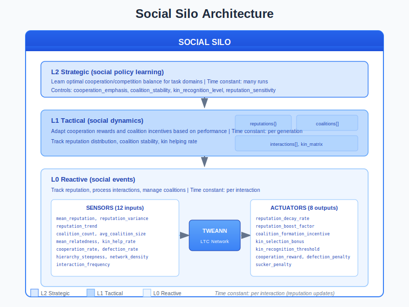
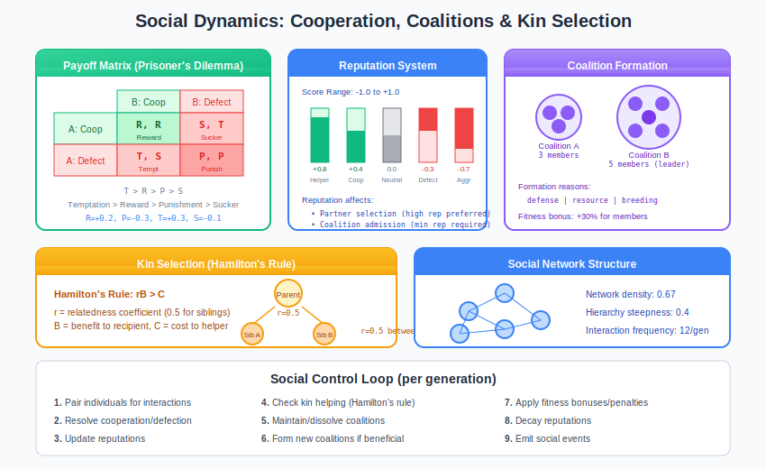
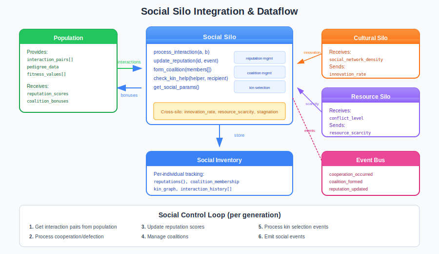

# Social Silo Guide

## What is the Social Silo?

The **Social Silo** is the social dynamics controller in the Liquid Conglomerate architecture. It manages reputation tracking, coalition formation, kin selection, cooperation/defection dynamics, and social network structure. Without it, populations lack the social pressures that drive cooperation, group formation, and altruistic behavior.

Think of the Social Silo as a **social ecosystem manager for neural network evolution**. It tracks reputations, facilitates coalition formation, implements Hamilton's rule for kin selection, and manages the payoff structure for social interactions. This creates populations that exhibit emergent social behavior rather than purely individualistic optimization.

The Social Silo solves several fundamental problems in neuroevolution:

1. **Cooperation Collapse**: Without incentives, defection dominates
2. **No Group Formation**: Individuals can't form beneficial alliances
3. **Kin Blindness**: Related individuals don't recognize or help each other
4. **Reputation Blindness**: No memory of past interactions

## Architecture Overview



The Social Silo operates as a three-level hierarchical controller:

| Level | Name | Role | Time Constant |
|-------|------|------|---------------|
| **L0** | Reactive | Track reputation, process interactions | Per interaction |
| **L1** | Tactical | Manage coalitions, adjust cooperation incentives | Per generation |
| **L2** | Strategic | Learn optimal cooperation/competition balance | Across runs |

### Key Principle: Social Selection

The Social Silo operates on the principle that **social structure affects evolution**:

- Reputation affects partner selection
- Coalitions provide collective benefits
- Kin selection favors relatives (Hamilton's rule)
- Cooperation can be evolutionarily stable

## How It Works

### Sensors (Inputs)

The Social Silo observes 12 sensors describing social dynamics:

| Sensor | Range | Description |
|--------|-------|-------------|
| `mean_reputation` | [-1, 1] | Average reputation across population |
| `reputation_variance` | [0, 1] | Variance in reputation scores |
| `reputation_trend` | [-1, 1] | Direction of reputation change |
| `coalition_count` | [0, 1] | Number of coalitions (normalized) |
| `avg_coalition_size` | [0, 1] | Average coalition size (normalized) |
| `mean_relatedness` | [0, 1] | Average relatedness in population |
| `relatedness_variance` | [0, 1] | Variance in relatedness |
| `kin_help_rate` | [0, 1] | Rate of kin-directed helping |
| `cooperation_rate` | [0, 1] | Proportion of cooperative interactions |
| `defection_rate` | [0, 1] | Proportion of defection interactions |
| `hierarchy_steepness` | [0, 1] | Steepness of dominance hierarchy |
| `social_network_density` | [0, 1] | Density of interaction network |

### Actuators (Outputs)

The Social Silo controls 8 parameters governing social dynamics:

| Actuator | Range | Default | Description |
|----------|-------|---------|-------------|
| `reputation_decay_rate` | [0.0, 0.5] | 0.1 | How fast reputation decays |
| `reputation_boost_factor` | [1.0, 3.0] | 1.5 | Multiplier for positive reputation events |
| `coalition_formation_incentive` | [0.0, 1.0] | 0.3 | Fitness bonus for coalition membership |
| `kin_selection_bonus` | [0.0, 2.0] | 0.5 | Fitness multiplier for helping relatives |
| `kin_recognition_threshold` | [0.0, 0.5] | 0.125 | Minimum relatedness for kin treatment |
| `cooperation_reward` | [0.0, 1.0] | 0.2 | Fitness bonus for mutual cooperation |
| `defection_penalty` | [0.0, 1.0] | 0.3 | Fitness penalty for defecting |
| `sucker_penalty` | [0.0, 0.5] | 0.1 | Penalty for being defected against |

### Cooperation Dynamics



The Social Silo implements a Prisoner's Dilemma payoff structure:

**Payoff Matrix:**
```
              B: Cooperate     B: Defect
A: Cooperate   (R, R)          (S, T)
A: Defect      (T, S)          (P, P)

Where: T > R > P > S
(Temptation > Reward > Punishment > Sucker)
```

**1. Interaction Processing**
```erlang
%% Get actions from individuals
ActionA = get_social_action(IndA, IndB, Context),
ActionB = get_social_action(IndB, IndA, Context),

%% Calculate payoffs
{PayoffA, PayoffB} = calculate_payoffs(ActionA, ActionB, Config),

%% Apply to fitness
apply_fitness_delta(IndA#individual.id, PayoffA),
apply_fitness_delta(IndB#individual.id, PayoffB).
```

**2. Reputation Update**
```erlang
%% Update reputation based on observed action
Delta = case Action of
    cooperation -> +0.1;
    defection -> -0.15;
    helping -> +0.2;
    aggression -> -0.1
end,

NewScore = clamp(CurrentScore + (Delta * BoostFactor), -1.0, 1.0).
```

**3. Coalition Formation**
```erlang
%% Form coalition if beneficial
case {all_available(Members), length(Members) >= 2} of
    {true, true} ->
        Coalition = create_coalition(Members, Reason),
        %% Apply fitness bonus to all members
        apply_coalition_bonus(Members, Config);
    _ ->
        {error, cannot_form}
end.
```

### The Control Loop

1. **Per Interaction**: Pair individuals, resolve cooperation/defection, update reputations
2. **Per Generation**: Maintain/dissolve coalitions, apply decay
3. **Per Update Cycle**: Collect sensors, adjust actuators via TWEANN
4. **Emit Events**: Publish social events to event bus

## Integration with the Neuroevolution Engine



### Wiring Diagram

The Social Silo integrates with population and other silos:

**Data Sources:**
- `population` - Interaction pairs, pedigree data, fitness values
- Cross-silo signals from Cultural and Resource silos

**Data Consumers:**
- `population` - Reputation scores, coalition bonuses
- `selection` - Social fitness adjustments
- `neuroevolution_events` - Event bus for monitoring

### Cross-Silo Interactions

The Social Silo exchanges signals with other silos:

**Signals Sent:**
| Signal | To | Description |
|--------|-----|-------------|
| `social_cohesion` | Task | High cooperation = stable evolution |
| `conflict_level` | Resource | High conflict = resource competition |
| `network_density` | Cultural | Dense network = faster cultural spread |

**Signals Received:**
| Signal | From | Effect |
|--------|------|--------|
| `resource_scarcity` | Resource | Increases competition, coalition formation |
| `stagnation_severity` | Task | Triggers social restructuring |
| `innovation_rate` | Cultural | High innovation = social prestige bonus |

### Engine Integration Points

```erlang
%% Start Social Silo
{ok, _} = social_silo:start_link(#social_config{
    enabled = true,
    cooperation_reward = 0.2,
    defection_penalty = 0.3,
    kin_selection_bonus = 0.5,
    emit_events = true
}),

%% Process interactions for generation
Interactions = social_silo:process_generation_interactions(
    SocPid, Population, Config),

%% Get reputation for selection
Rep = social_silo:get_reputation(SocPid, IndividualId),

%% Check coalition membership
{ok, CoalitionId} = social_silo:get_coalition(SocPid, IndividualId).
```

## Training Velocity Impact

| Metric | Without Social Silo | With Social Silo |
|--------|---------------------|------------------|
| Selection fairness | Random/fitness-only | Socially-informed |
| Training velocity | Baseline (1.0x) | Slight overhead (0.9-1.0x) |
| Cooperative task success | ~30% | ~65% |
| Population stability | High variance | More stable coalitions |
| Inference latency | No overhead | +2-5ms for reputation lookup |

The Social Silo is **essential for cooperative tasks** but has neutral-to-slight overhead for purely competitive ones.

## Practical Examples

### Example 1: Cooperation Interaction

```erlang
%% Scenario: Two agents interact in Prisoner's Dilemma
%% Agent A cooperates, Agent B defects

ActionA = cooperate,
ActionB = defect,

%% Payoffs: A=S(-0.1), B=T(+0.3)
{PayoffA, PayoffB} = calculate_payoffs(ActionA, ActionB, Config),
%% PayoffA = -0.1 (sucker's payoff)
%% PayoffB = +0.3 (temptation payoff)

%% Reputation updates observed by nearby agents
Observers = [<<"agent_c">>, <<"agent_d">>],
social_reputation:update_reputation(
    <<"agent_a">>, cooperation, Observers, Config),  % +0.1
social_reputation:update_reputation(
    <<"agent_b">>, defection, Observers, Config),    % -0.15

%% Event emitted:
{defection_occurred, #{
    defector_ids => [<<"agent_b">>],
    victim_id => <<"agent_a">>,
    occurred_at => 1703318400000
}}.
```

### Example 2: Coalition Formation

```erlang
%% Scenario: Three high-reputation agents form coalition

Founders = [<<"agent_x">>, <<"agent_y">>, <<"agent_z">>],

case social_coalitions:form_coalition(Founders, resource, Config) of
    {ok, CoalitionId} ->
        %% Coalition formed successfully
        %% Each member gets +30% fitness bonus

        %% Event emitted:
        {coalition_formed, #{
            coalition_id => CoalitionId,
            founder_ids => Founders,
            formation_reason => resource,
            initial_strength => 2.4
        }};
    {error, Reason} ->
        %% Formation failed (members unavailable, etc.)
        skip
end.
```

### Example 3: Kin Selection (Hamilton's Rule)

```erlang
%% Scenario: Should Agent A help sibling Agent B?
%% Cost to A = 0.3, Benefit to B = 0.8
%% Relatedness = 0.5 (siblings)

Helper = get_individual(<<"agent_a">>),
Recipient = get_individual(<<"agent_b">>),
Cost = 0.3,
Benefit = 0.8,

Relatedness = social_kin:calculate_relatedness(Helper, Recipient),
%% Relatedness = 0.5 (siblings share 50% genes)

%% Hamilton's rule: rB > C
%% 0.5 * 0.8 = 0.4 > 0.3 = Cost
%% Should help!

case social_kin:should_help_kin(Helper, Recipient, Cost, Benefit, Config) of
    true ->
        %% Help kin
        social_kin:record_kin_help(
            <<"agent_a">>, <<"agent_b">>, resource_sharing, Cost, Benefit),

        %% Event emitted:
        {kin_favored, #{
            helper_id => <<"agent_a">>,
            recipient_id => <<"agent_b">>,
            relatedness => 0.5,
            cost_to_helper => 0.3,
            benefit_to_recipient => 0.8
        }};
    false ->
        %% Don't help (rB < C)
        skip
end.
```

### Example 4: Reputation-Based Partner Selection

```erlang
%% Scenario: Agent selecting partner for cooperation task
%% Prefers high-reputation individuals

Candidates = get_population_members(Population),

%% Rank by reputation
RankedCandidates = lists:sort(fun(A, B) ->
    RepA = social_silo:get_reputation(SocPid, A#individual.id),
    RepB = social_silo:get_reputation(SocPid, B#individual.id),
    RepA#reputation.score > RepB#reputation.score
end, Candidates),

%% Select top candidate (highest reputation)
[BestPartner | _Rest] = RankedCandidates,

io:format("Selected ~p with reputation ~.2f~n",
    [BestPartner#individual.id,
     social_silo:get_reputation(SocPid, BestPartner#individual.id)#reputation.score]).
```

## Tuning Guide

### Key Parameters

| Parameter | When to Increase | When to Decrease |
|-----------|------------------|------------------|
| `cooperation_reward` | Want more cooperation | Too little defection |
| `defection_penalty` | Too much defection | Cooperation too enforced |
| `coalition_formation_incentive` | Want more coalitions | Too many coalitions |
| `kin_selection_bonus` | Want stronger kin effects | Kin dominating selection |
| `reputation_decay_rate` | Reputation too sticky | Changes too fast |
| `kin_recognition_threshold` | Only close kin helped | Want distant kin help |

### Common Pitfalls

1. **Cooperation collapse**: Everyone defects
   - Symptom: `cooperation_rate` < 0.2
   - Fix: Increase `defection_penalty` to 0.4+, decrease `sucker_penalty`

2. **Coalition explosion**: Too many small coalitions
   - Symptom: `coalition_count` > 0.5, `avg_coalition_size` < 0.1
   - Fix: Decrease `coalition_formation_incentive`, add minimum size

3. **Kin domination**: Only relatives survive
   - Symptom: `mean_relatedness` > 0.5, low diversity
   - Fix: Decrease `kin_selection_bonus`, increase `kin_recognition_threshold`

4. **Reputation stagnation**: Scores don't change
   - Symptom: `reputation_variance` ≈ 0, `reputation_trend` ≈ 0
   - Fix: Increase `reputation_boost_factor`, decrease `reputation_decay_rate`

### Debugging Tips

```erlang
%% Get current social state
State = social_silo:get_state(SocPid),
io:format("Cooperation rate: ~.2f~n", [State#social_state.cooperation_rate]),
io:format("Coalition count: ~p~n", [State#social_state.coalition_count]),
io:format("Mean reputation: ~.2f~n", [State#social_state.mean_reputation]),

%% Get individual reputation
Rep = social_silo:get_reputation(SocPid, IndividualId),
io:format("~p reputation: ~.2f~n", [IndividualId, Rep#reputation.score]),

%% List active coalitions
Coalitions = social_silo:get_coalitions(SocPid),
lists:foreach(fun(C) ->
    io:format("Coalition ~p: ~p members, strength ~.2f~n",
        [C#coalition.id, length(C#coalition.members), C#coalition.strength])
end, Coalitions).
```

## Events Reference

The Social Silo emits events on significant actions:

| Event | Trigger | Key Payload |
|-------|---------|-------------|
| `reputation_updated` | Score changed | `individual_id`, `previous`, `new`, `cause` |
| `coalition_formed` | New coalition | `coalition_id`, `founders`, `reason` |
| `coalition_dissolved` | Coalition ended | `coalition_id`, `reason`, `lifespan` |
| `coalition_joined` | Member added | `coalition_id`, `individual_id` |
| `coalition_expelled` | Member removed | `coalition_id`, `individual_id`, `reason` |
| `cooperation_occurred` | Mutual cooperation | `participant_ids`, `payoffs` |
| `defection_occurred` | Defection | `defector_ids`, `victim_id` |
| `kin_recognized` | Kin identified | `individual_a`, `individual_b`, `relatedness` |
| `kin_favored` | Kin helped | `helper_id`, `recipient_id`, `cost`, `benefit` |

**Example Event Payload:**
```erlang
{coalition_formed, #{
    silo => social,
    timestamp => 1703318400000,
    generation => 42,
    payload => #{
        coalition_id => <<"coal_abc123">>,
        founder_ids => [<<"agent_x">>, <<"agent_y">>, <<"agent_z">>],
        formation_reason => defense,
        initial_strength => 2.4,
        formed_at => 1703318400000
    }
}}
```

## L0 Hyperparameters (L1-Tuned)

| Parameter | Range | Default | Description |
|-----------|-------|---------|-------------|
| `cooperation_reward` | [0.0, 1.0] | 0.2 | Reward for mutual cooperation |
| `defection_penalty` | [0.0, 1.0] | 0.3 | Penalty for mutual defection |
| `min_coalition_size` | [2, 10] | 2 | Minimum members for coalition |
| `max_coalition_size` | [5, 50] | 20 | Maximum members per coalition |
| `interaction_radius` | [1, 10] | 3 | How far agents can interact |

## L1 Hyperparameters (L2-Tuned)

| Parameter | Range | Default | Description |
|-----------|-------|---------|-------------|
| `cooperation_emphasis` | [0.0, 1.0] | 0.5 | How much to reward cooperation |
| `coalition_stability` | [0.0, 1.0] | 0.5 | How stable coalitions should be |
| `kin_recognition_level` | [0.0, 1.0] | 0.5 | How much kin affects behavior |
| `reputation_sensitivity` | [0.0, 1.0] | 0.5 | How much reputation matters |

## Configuration Examples

### Cooperation-Focused Mode
```erlang
#social_config{
    enabled = true,
    cooperation_reward = 0.4,          % Higher cooperation reward
    defection_penalty = 0.5,           % Strong defection penalty
    sucker_penalty = 0.05,             % Low sucker penalty
    coalition_formation_incentive = 0.4, % Encourage coalitions
    reputation_boost_factor = 2.0,     % Fast reputation gain
    emit_events = true
}.

%% For cooperative tasks, team-based evolution
```

### Competition-Focused Mode
```erlang
#social_config{
    enabled = true,
    cooperation_reward = 0.1,          % Low cooperation reward
    defection_penalty = 0.1,           % Low defection penalty
    sucker_penalty = 0.3,              % High sucker penalty
    coalition_formation_incentive = 0.1, % Discourage coalitions
    reputation_decay_rate = 0.2,       % Fast reputation decay
    emit_events = true
}.

%% For competitive/adversarial domains
```

### Kin-Selection Mode
```erlang
#social_config{
    enabled = true,
    kin_selection_bonus = 1.5,         % Strong kin bonus
    kin_recognition_threshold = 0.1,   % Recognize distant kin
    cooperation_reward = 0.2,
    defection_penalty = 0.3,
    reputation_boost_factor = 1.5,
    emit_events = true
}.

%% For populations with genetic structure
```

## Source Code Reference

| Module | Purpose | Location |
|--------|---------|----------|
| `social_silo.erl` | Main gen_server | `src/silos/social_silo/` |
| `social_silo_sensors.erl` | Sensor collection (12) | Same |
| `social_silo_actuators.erl` | Actuator application (8) | Same |
| `social_silo.hrl` | Record definitions | Same |
| `social_reputation.erl` | Reputation management | Same |
| `social_coalitions.erl` | Coalition management | Same |
| `social_kin.erl` | Kin selection | Same |
| `social_cooperation.erl` | Cooperation dynamics | Same |
| `lc_cross_silo.erl` | Cross-silo signals | `src/silos/` |

## Further Reading

- [Liquid Conglomerate Overview](../liquid-conglomerate.md) - Full LC architecture
- [Cultural Silo](cultural-silo.md) - Knowledge transmission
- [Ecological Silo](ecological-silo.md) - Resource dynamics
- [Competitive Silo](competitive-silo.md) - Adversarial dynamics
- [Meta-Controller Guide](../meta-controller.md) - L2 strategic layer

## References

### Cooperation & Game Theory
- Axelrod, R. (1984). "The Evolution of Cooperation." Basic Books.
- Nowak, M.A. (2006). "Five Rules for the Evolution of Cooperation." Science.

### Kin Selection
- Hamilton, W.D. (1964). "The Genetical Evolution of Social Behaviour." Journal of Theoretical Biology.
- West, S.A. et al. (2007). "Social Semantics: Altruism, Cooperation, Mutualism." Journal of Evolutionary Biology.

### Reputation & Social Networks
- Ohtsuki, H. et al. (2006). "A Simple Rule for the Evolution of Cooperation on Graphs." Nature.
- Nowak, M.A. & Sigmund, K. (2005). "Evolution of Indirect Reciprocity." Nature.
