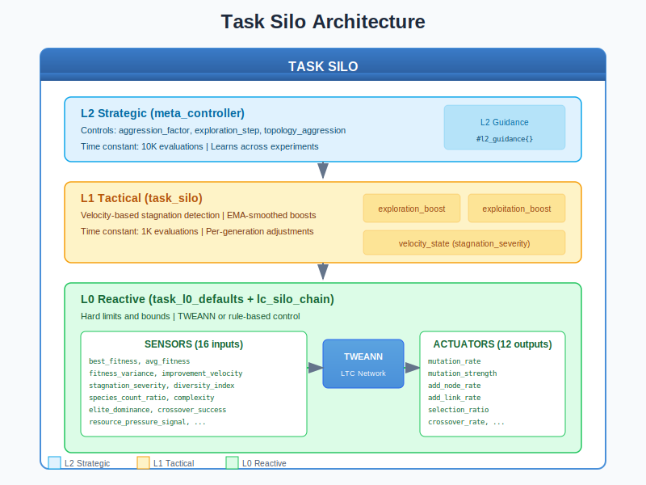
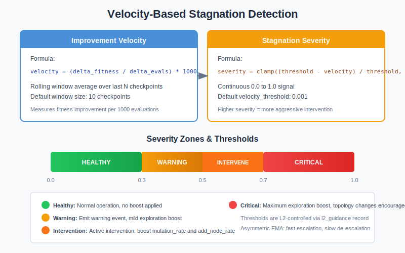
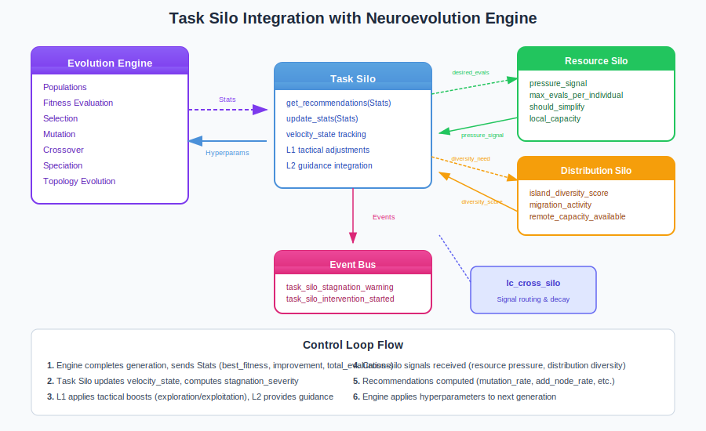

# Task Silo Guide

## What is the Task Silo?

The **Task Silo** is the core controller in the Liquid Conglomerate architecture responsible for optimizing the evolution process itself. While the neuroevolution engine evolves neural networks to solve problems, the Task Silo evolves *how* that evolution happens - adjusting hyperparameters like mutation rates, selection pressure, and topology mutation probabilities in real-time.

Think of the Task Silo as a **coach** watching a team practice. The coach doesn't play the game directly, but observes performance, identifies when the team is struggling (stagnation), and adjusts the training regimen accordingly. When progress is good, the coach might focus on refinement (exploitation). When the team is stuck, the coach might try something completely new (exploration).

The Task Silo solves a fundamental problem in neuroevolution: **hyperparameter sensitivity**. Traditional approaches use fixed hyperparameters, which may be optimal for one phase of training but suboptimal for others. The Task Silo learns to adapt these parameters dynamically based on training dynamics.

## Architecture Overview



The Task Silo operates as a three-level hierarchical controller:

| Level | Name | Role | Time Constant |
|-------|------|------|---------------|
| **L0** | Reactive | Hard limits, bounds enforcement, TWEANN output | 10 updates |
| **L1** | Tactical | Stagnation detection, exploration/exploitation boosts | 1K evaluations |
| **L2** | Strategic | Cross-experiment learning, guidance to L1 | 10K evaluations |

### Key Principle: Graceful Degradation

Each level provides a safety net for the level above:

- If **L2** fails or produces bad guidance → L1 uses defaults
- If **L1** produces extreme values → L0 clamps to safe bounds
- **L0** always enforces hard limits, ensuring stability

## How It Works

### Sensors (Inputs)

The Task Silo observes 16 sensors that describe the current state of evolution:

| Sensor | Range | Description |
|--------|-------|-------------|
| `best_fitness` | [0, 1] | Normalized best fitness in population |
| `avg_fitness` | [0, 1] | Average population fitness |
| `fitness_variance` | [0, 1] | Variance in fitness (diversity indicator) |
| `improvement_velocity` | [-1, 1] | Rate of fitness improvement |
| `stagnation_severity` | [0, 1] | How stuck the evolution is |
| `diversity_index` | [0, 1] | Genetic diversity measure |
| `species_count_ratio` | [0, 1] | Number of species / max |
| `avg_network_complexity` | [0, 1] | Average neurons + connections |
| `complexity_velocity` | [-1, 1] | Rate of complexity change |
| `elite_dominance` | [0, 1] | How much elites dominate |
| `crossover_success_rate` | [0, 1] | Proportion of successful crosses |
| `mutation_impact` | [0, 1] | Effect of recent mutations |
| `resource_pressure_signal` | [0, 1] | From Resource Silo |
| `evaluation_progress` | [0, 1] | Total evals / budget |
| `entropy` | [0, 1] | Information entropy |
| `convergence_trend` | [-1, 1] | Direction of convergence |

### Actuators (Outputs)

The Task Silo controls 12 hyperparameters that govern evolution:

| Actuator | Range | Default | Description |
|----------|-------|---------|-------------|
| `mutation_rate` | [0.01, 0.5] | 0.10 | Probability of mutation |
| `mutation_strength` | [0.05, 1.0] | 0.30 | Magnitude of weight changes |
| `selection_ratio` | [0.05, 0.5] | 0.20 | Fraction surviving selection |
| `add_node_rate` | [0.001, 0.1] | 0.03 | Probability of adding neuron |
| `add_link_rate` | [0.01, 0.3] | 0.10 | Probability of adding connection |
| `crossover_rate` | [0.1, 0.9] | 0.50 | Probability of crossover |
| `species_threshold` | [0.1, 5.0] | 1.0 | Distance for speciation |
| `elitism_ratio` | [0.0, 0.3] | 0.10 | Fraction preserved as elites |
| `tournament_size` | [2, 10] | 3 | Selection tournament size |
| `weight_mutation_power` | [0.1, 2.0] | 0.5 | Weight perturbation magnitude |
| `compatibility_weight` | [0.1, 2.0] | 1.0 | Weight in distance calculation |
| `complexity_penalty` | [0.0, 0.5] | 0.05 | Fitness penalty per parameter |

### Velocity-Based Stagnation Detection



The Task Silo uses a **velocity-based** approach to detect stagnation, rather than simple generation counters. This provides continuous severity measurement rather than binary thresholds.

**Improvement Velocity:**
```
velocity = (delta_fitness / delta_evaluations) * 1000
```

The velocity measures fitness improvement per 1000 evaluations, calculated as a rolling average over a configurable window (default: 10 checkpoints).

**Stagnation Severity:**
```
severity = clamp((threshold - velocity) / threshold, 0, 1)
```

When velocity drops below the threshold, severity increases proportionally. This continuous signal enables graduated responses rather than sudden interventions.

### The Control Loop

1. **Collect Stats**: Engine sends generation statistics to Task Silo
2. **Update Velocity**: Compute improvement velocity from fitness checkpoints
3. **Calculate Severity**: Derive stagnation_severity from velocity
4. **Apply L1 Boosts**: Compute exploration/exploitation boosts
5. **Receive L2 Guidance**: Query meta_controller for strategic guidance
6. **Compute Recommendations**: Generate hyperparameter recommendations
7. **Return to Engine**: Engine applies recommendations to next generation

```erlang
%% Typical usage in evolution loop
handle_generation_complete(Stats, State) ->
    %% Get recommendations from Task Silo
    Params = task_silo:get_recommendations(TaskSiloPid, Stats),

    %% Apply to evolution config
    NewConfig = apply_hyperparameters(State#state.config, Params),

    %% Continue evolution with new parameters
    State#state{config = NewConfig}.
```

## Integration with the Neuroevolution Engine



### Wiring Diagram

The Task Silo integrates with the neuroevolution engine at generation boundaries:

**Incoming Data:**
- Generation statistics from `neuroevolution_engine`
- Resource pressure signals from `resource_silo`
- Diversity signals from `distribution_silo`

**Outgoing Data:**
- Hyperparameter recommendations to `neuroevolution_engine`
- Cross-silo signals via `lc_cross_silo`
- Events to `neuroevolution_events` bus

### Cross-Silo Interactions

The Task Silo exchanges signals with other silos:

**Signals Sent:**
| Signal | To | Description |
|--------|-----|-------------|
| `exploration_boost` | Resource | Current exploration level |
| `desired_evals_per_individual` | Resource | How many evaluations wanted |
| `expected_complexity_growth` | Resource | Anticipated memory needs |
| `diversity_need` | Distribution | How much migration helps |
| `speciation_pressure` | Distribution | Species splitting tendency |

**Signals Received:**
| Signal | From | Effect |
|--------|------|--------|
| `pressure_signal` | Resource | Reduces exploration when resources stressed |
| `max_evals_per_individual` | Resource | Caps evaluation budget |
| `should_simplify` | Resource | Increases complexity_penalty |
| `island_diversity_score` | Distribution | Informs diversity_need |

### Engine Integration Points

```erlang
%% Start Task Silo with configuration
{ok, TaskPid} = task_silo:start_link(#{
    enabled_levels => [l0, l1],         % L2 optional
    velocity_threshold => 0.001,         % Stagnation sensitivity
    velocity_window_size => 10,          % Rolling average window
    l2_enabled => false,                 % Enable meta_controller
    l0_tweann_enabled => false           % Use TWEANN vs rule-based
}),

%% In evolution loop
on_generation_complete(GenStats) ->
    %% Update Task Silo with stats
    ok = task_silo:update_stats(TaskPid, GenStats),

    %% Get adapted hyperparameters
    Params = task_silo:get_recommendations(TaskPid, GenStats),

    %% Params contains mutation_rate, selection_ratio, etc.
    apply_params_to_next_generation(Params).
```

## Training Velocity Impact

| Metric | Without Task Silo | With Task Silo |
|--------|-------------------|----------------|
| Hyperparameter tuning | Manual, static | Automatic, adaptive |
| Stagnation recovery | None (stuck forever) | Automatic intervention |
| Phase transitions | Manual schedules | Learned from dynamics |
| Training velocity | Baseline (1.0x) | Baseline (defines 1.0x) |

The Task Silo defines the baseline training velocity because it controls the core evolution parameters. Other silos build on top of this foundation.

## Practical Examples

### Example 1: Detecting and Recovering from Stagnation

```erlang
%% Scenario: Evolution has been stuck for many evaluations
Stats = #{
    best_fitness => 0.65,
    total_evaluations => 50000,
    improvement => 0.0001  % Very slow improvement
},

%% Task Silo detects stagnation
Params = task_silo:get_recommendations(TaskPid, Stats),

%% With high stagnation_severity, expect:
%% - mutation_rate: 0.10 → 0.18 (increased exploration)
%% - add_node_rate: 0.03 → 0.06 (try new topologies)
%% - selection_ratio: 0.20 → 0.25 (less pressure)

%% Event emitted:
%% {task_silo_intervention_started, #{
%%     stagnation_severity => 0.72,
%%     improvement_velocity => 0.0001,
%%     ...
%% }}
```

### Example 2: Exploiting Good Progress

```erlang
%% Scenario: Evolution is improving rapidly
Stats = #{
    best_fitness => 0.85,
    total_evaluations => 30000,
    improvement => 0.05  % Strong improvement
},

%% Task Silo detects good progress
Params = task_silo:get_recommendations(TaskPid, Stats),

%% With low stagnation_severity and high improvement:
%% - mutation_rate: 0.10 → 0.08 (refine, don't disrupt)
%% - mutation_strength: 0.30 → 0.25 (smaller steps)
%% - selection_ratio: 0.20 → 0.15 (higher pressure)
```

### Example 3: Resource-Constrained Training

```erlang
%% Resource Silo signals high pressure
ok = lc_cross_silo:send_signal(resource, task, #{
    pressure_signal => 0.8,
    max_evals_per_individual => 5,
    should_simplify => 0.6
}),

%% Task Silo adapts to resource constraints
Stats = #{best_fitness => 0.70, total_evaluations => 40000},
Params = task_silo:get_recommendations(TaskPid, Stats),

%% Response to resource pressure:
%% - complexity_penalty: 0.05 → 0.15 (prefer smaller networks)
%% - add_node_rate: reduced (less topology growth)
%% - evaluations_per_individual: capped at 5
```

## Tuning Guide

### Key Parameters

| Parameter | When to Increase | When to Decrease |
|-----------|------------------|------------------|
| `velocity_threshold` | Evolution too aggressive | Missing subtle improvements |
| `velocity_window_size` | Noisy fitness, need smoothing | Need faster response |
| L2 `aggression_factor` | Interventions too weak | Oscillating parameters |
| L2 `exploration_step` | Stagnation recovery slow | Disrupting good progress |

### Common Pitfalls

1. **Velocity threshold too high**: Everything looks like stagnation
   - Symptom: Constant intervention, parameters always maxed
   - Fix: Lower `velocity_threshold` (e.g., 0.0005)

2. **Velocity threshold too low**: Never detects stagnation
   - Symptom: Evolution stuck but no intervention
   - Fix: Raise `velocity_threshold` (e.g., 0.002)

3. **Window size too small**: Noisy stagnation detection
   - Symptom: Parameters oscillate rapidly
   - Fix: Increase `velocity_window_size` (e.g., 20)

4. **L2 not enabled**: Missing strategic adaptation
   - Symptom: Same response patterns regardless of domain
   - Fix: Enable L2 with `l2_enabled => true`

### Debugging Tips

```erlang
%% Get full Task Silo state
State = task_silo:get_state(TaskPid),
io:format("Stagnation severity: ~.3f~n", [maps:get(stagnation_severity, State)]),
io:format("Velocity: ~.5f~n", [maps:get(improvement_velocity, State)]),
io:format("Exploration boost: ~.3f~n", [maps:get(exploration_boost, State)]),

%% Check L2 guidance
L2Guidance = maps:get(l2_guidance, State),
io:format("L2 aggression: ~.2f~n", [maps:get(aggression_factor, L2Guidance)]).
```

## Events Reference

The Task Silo emits events on threshold crossings:

| Event | Trigger | Key Payload |
|-------|---------|-------------|
| `task_silo_stagnation_warning` | Severity crosses warning threshold (0.3) | `stagnation_severity`, `improvement_velocity` |
| `task_silo_intervention_started` | Severity crosses intervention threshold (0.5) | Same + `threshold` |
| `task_silo_intervention_critical` | Severity crosses critical threshold (0.7) | Same |
| `task_silo_intervention_ended` | Severity drops below warning | Same |

**Example Event Payload:**
```erlang
{task_silo_intervention_started, #{
    realm => <<"default">>,
    source => task_silo,
    timestamp => 1703318400000,
    total_evaluations => 45000,
    cohort => 90,
    stagnation_severity => 0.65,
    improvement_velocity => 0.0003,
    threshold => 0.5,
    message => <<"Stagnation detected, boosting exploration">>
}}
```

## L2 Guidance Parameters

When L2 is enabled, the meta_controller provides strategic guidance:

| Parameter | Range | Default | Effect |
|-----------|-------|---------|--------|
| `aggression_factor` | [0.0, 2.0] | 1.0 | Multiplier for L1 adjustments |
| `exploration_step` | [0.05, 0.5] | 0.1 | Intensity of exploration boost |
| `topology_aggression` | [1.0, 3.0] | 1.5 | Multiplier for add_node_rate |
| `exploitation_weight` | [0.2, 0.8] | 0.5 | Balance explore/exploit |
| `stagnation_sensitivity` | [0.5, 2.0] | 1.0 | Velocity threshold multiplier |
| `adaptation_momentum` | [0.0, 0.9] | 0.5 | EMA smoothing factor |

## Source Code Reference

| Module | Purpose | Location |
|--------|---------|----------|
| `task_silo.erl` | Main gen_server | `src/silos/task_silo/` |
| `task_l0_defaults.erl` | L0 bounds and defaults | Same |
| `task_l0_morphology.erl` | TWEANN topology definition | Same |
| `task_l0_sensors.erl` | Sensor collection | Same |
| `task_l0_actuators.erl` | Actuator application | Same |
| `lc_reward.erl` | Reward computation | `src/silos/` |
| `lc_cross_silo.erl` | Cross-silo signals | Same |

## Further Reading

- [Liquid Conglomerate Overview](../liquid-conglomerate.md) - Full LC architecture
- [Cooperative Silos](../cooperative-silos.md) - Cross-silo communication
- [Resource Silo](resource-silo.md) - Computational resource management
- [Distribution Silo](distribution-silo.md) - Population structure control
- [Meta-Controller Guide](../meta-controller.md) - L2 strategic layer

## References

### Adaptive Hyperparameters
- Jaderberg, M., et al. (2017). "Population Based Training of Neural Networks." *arXiv:1711.09846*
- Schmidhuber, J. (1987). "Evolutionary principles in self-referential learning."

### Stagnation Detection
- Stanley, K.O., Miikkulainen, R. (2002). "Evolving Neural Networks through Augmenting Topologies." *Evolutionary Computation*.
- Lehman, J., Stanley, K.O. (2011). "Abandoning Objectives: Evolution through the Search for Novelty Alone."

### Multi-Timescale Learning
- Sutton, R.S., et al. (1999). "Between MDPs and semi-MDPs: A framework for temporal abstraction."
