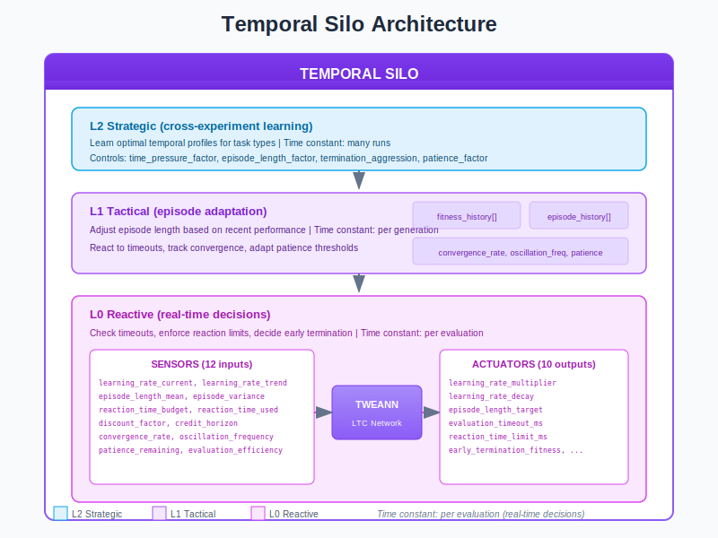
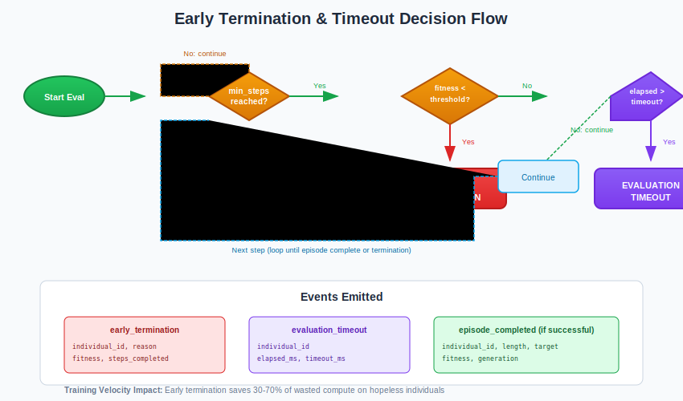
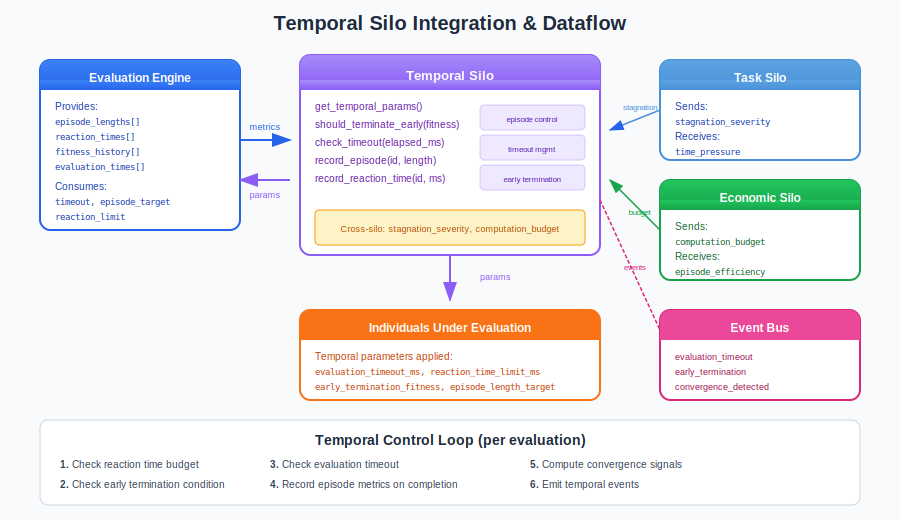

# Temporal Silo Guide

## What is the Temporal Silo?

The **Temporal Silo** is the time management controller in the Liquid Conglomerate architecture. It manages how long to evaluate individuals, episode durations, reaction time budgets, and early termination decisions. Poor time management wastes 30-70% of evaluation compute on hopeless individuals or cuts off promising ones too early.

Think of the Temporal Silo as a **project manager with a stopwatch**. It decides how long each individual gets to prove itself, terminates hopeless cases early to save resources, and extends evaluation time when task complexity demands it. Without it, every individual - good or bad - receives the same fixed evaluation time.

The Temporal Silo solves two fundamental problems in neuroevolution:

1. **Wasted Compute**: Stopping hopeless individuals early saves 2-5x compute
2. **Adaptive Difficulty**: Matching episode length to task complexity improves results

## Architecture Overview



The Temporal Silo operates as a three-level hierarchical controller:

| Level | Name | Role | Time Constant |
|-------|------|------|---------------|
| **L0** | Reactive | Real-time timeout/termination decisions | Per evaluation |
| **L1** | Tactical | Adapt episode length based on performance | Per generation |
| **L2** | Strategic | Learn optimal temporal profiles (future) | Across runs |

### Key Principle: Time is Money

The Temporal Silo operates on the principle that evaluation time is the primary cost in neuroevolution:

- Bad individuals waste time if evaluated fully
- Good individuals may need more time to show potential
- Different tasks require different episode lengths
- Real-time applications have strict timing constraints

## How It Works

### Sensors (Inputs)

The Temporal Silo observes 12 sensors describing time-related dynamics:

| Sensor | Range | Description |
|--------|-------|-------------|
| `learning_rate_current` | [0, 1] | Current network learning rate (normalized) |
| `learning_rate_trend` | [-1, 1] | Direction of learning rate change |
| `episode_length_mean` | [0, 1] | Average episode duration / max duration |
| `episode_length_variance` | [0, 1] | Variance in episode lengths |
| `reaction_time_budget` | [0, 1] | Allowed reaction time per step |
| `reaction_time_used` | [0, 1] | Actual reaction time / budget |
| `discount_factor` | [0, 1] | Temporal discount for credit assignment |
| `credit_horizon` | [0, 1] | How far back credit propagates |
| `convergence_rate` | [0, 1] | Speed of fitness convergence |
| `oscillation_frequency` | [0, 1] | Fitness oscillation (instability indicator) |
| `patience_remaining` | [0, 1] | Generations until early stopping |
| `evaluation_efficiency` | [0, 1] | Fitness gained per evaluation time |

### Actuators (Outputs)

The Temporal Silo controls 10 parameters governing time management:

| Actuator | Range | Default | Description |
|----------|-------|---------|-------------|
| `learning_rate_multiplier` | [0.1, 10.0] | 1.0 | Scale factor for learning rates |
| `learning_rate_decay` | [0.9, 1.0] | 0.99 | Per-generation decay rate |
| `episode_length_target` | [10, 10000] | 1000 | Target episode steps |
| `episode_variance_allowed` | [0.0, 1.0] | 0.3 | Acceptable variance in episode length |
| `evaluation_timeout_ms` | [100, 60000] | 5000 | Maximum evaluation time |
| `reaction_time_limit_ms` | [1, 1000] | 100 | Max per-step thinking time |
| `discount_factor` | [0.9, 0.999] | 0.99 | Gamma for credit assignment |
| `patience_threshold` | [5, 100] | 20 | Generations without improvement tolerance |
| `early_termination_fitness` | [0.0, 1.0] | 0.1 | Fitness below which to terminate early |
| `eligibility_trace_decay` | [0.0, 1.0] | 0.9 | Lambda for eligibility traces |

### Early Termination



Early termination is the primary mechanism for saving compute:

**Decision Logic:**
1. Wait for `min_steps_before_termination` to gather data
2. Check if `fitness < early_termination_fitness` threshold
3. Also consider fitness trend (is it improving?)
4. If hopeless, terminate and emit `early_termination` event

**Benefits:**
- 30-70% compute savings by stopping bad individuals
- False termination rate can be tuned via threshold
- Frees resources for promising individuals

### The Control Loop

1. **Per Step**: Check reaction time limits (for real-time applications)
2. **Per Evaluation**: Track elapsed time, check timeout, check early termination
3. **Per Episode**: Record episode length, update efficiency metrics
4. **Per Generation**: Adapt episode targets based on performance
5. **Emit Events**: Publish timeout/termination/convergence events

```erlang
%% Typical usage in evaluation
evaluate_individual(Individual, State) ->
    %% Get temporal parameters
    Params = temporal_silo:get_temporal_params(TempPid),
    #{evaluation_timeout_ms := Timeout,
      early_termination_fitness := TermThreshold} = Params,

    StartTime = erlang:monotonic_time(millisecond),
    evaluate_loop(Individual, StartTime, Timeout, TermThreshold, State).

evaluate_loop(Individual, StartTime, Timeout, TermThreshold, State) ->
    Elapsed = erlang:monotonic_time(millisecond) - StartTime,

    %% Check timeout
    case temporal_silo:check_timeout(TempPid, Elapsed) of
        true ->
            {timeout, current_fitness(Individual)};
        false ->
            %% Check early termination
            Fitness = current_fitness(Individual),
            case temporal_silo:should_terminate_early(TempPid, Fitness) of
                true ->
                    {early_termination, Fitness};
                false ->
                    %% Continue evaluation
                    step_evaluation(Individual, State)
            end
    end.
```

## Integration with the Neuroevolution Engine



### Wiring Diagram

The Temporal Silo integrates with evaluation and other silos:

**Data Sources:**
- `evaluation_engine` - Episode lengths, reaction times, fitness history
- `task_silo` - Stagnation severity (triggers longer episodes)
- `economic_silo` - Computation budget (constrains timeouts)

**Data Consumers:**
- `evaluation_engine` - Timeout limits, episode targets
- `individuals` - Reaction time limits, termination thresholds
- `neuroevolution_events` - Event bus for monitoring

### Cross-Silo Interactions

The Temporal Silo exchanges signals with other silos:

**Signals Sent:**
| Signal | To | Description |
|--------|-----|-------------|
| `time_pressure` | Task | High pressure = need simpler solutions |
| `convergence_status` | Resource | Near convergence = can reduce compute |
| `episode_efficiency` | Economic | Compute spent per fitness gained |
| `eval_time_constraint` | Competitive | Available time for evaluation matches |

**Signals Received:**
| Signal | From | Effect |
|--------|------|--------|
| `computation_budget` | Economic | Constrains evaluation timeout |
| `stagnation_severity` | Task | Stagnation = try longer episodes |
| `population_diversity` | Distribution | Low diversity = earlier termination |
| `resource_pressure` | Resource | Pressure reduces available time |

### Engine Integration Points

```erlang
%% Start Temporal Silo
{ok, _} = temporal_silo:start_link(#temporal_config{
    enabled = true,
    min_episode_length = 100,
    max_episode_length = 10000,
    min_timeout_ms = 500,
    max_timeout_ms = 30000,
    enable_early_termination = true,
    min_steps_before_termination = 20,
    enforce_reaction_time = false,
    emit_events = true
}),

%% Query for temporal parameters
get_evaluation_params() ->
    Params = temporal_silo:get_temporal_params(?MODULE),
    #{
        timeout => maps:get(evaluation_timeout_ms, Params),
        episode_target => maps:get(episode_length_target, Params),
        early_term_threshold => maps:get(early_termination_fitness, Params)
    }.

%% Record completed episode
on_episode_complete(IndividualId, Length, Fitness) ->
    temporal_silo:record_episode(TempPid, IndividualId, Length),
    %% Temporal silo tracks for efficiency analysis.
```

## Training Velocity Impact

| Metric | Without Temporal Silo | With Temporal Silo |
|--------|----------------------|-------------------|
| Wasted evaluation time | 40-60% | 10-20% |
| Time to convergence | Baseline | 0.4-0.6x (faster) |
| Compute efficiency | 1.0x | 2-4x |
| Real-time compliance | No guarantees | Enforced limits |

The Temporal Silo provides the **largest training velocity improvement** of all silos by eliminating wasted compute on hopeless individuals.

## Practical Examples

### Example 1: Early Termination Saves Compute

```erlang
%% Scenario: Individual showing poor performance early
%% After 50 steps, fitness = 0.05 (very low)

%% Temporal Silo parameters:
%% - early_termination_fitness = 0.1
%% - min_steps_before_termination = 20

%% Decision: Terminate early
%% Without early termination: 1000 steps wasted
%% With early termination: Only 50 steps used
%% Savings: 950 steps = 95% compute saved for this individual
```

### Example 2: Stagnation Triggers Longer Episodes

```erlang
%% Scenario: Task Silo reports stagnation
%% Cross-silo signal: stagnation_severity = 0.8

%% Temporal Silo responds:
%% - episode_length_target increased from 1000 to 1500
%% - evaluation_timeout increased proportionally

%% Rationale: Complex problems may need more time
%% The stuck population might benefit from longer evaluation

{episode_extended, #{
    old_length => 1000,
    new_length => 1500,
    reason => stagnation
}}
```

### Example 3: Budget Constrains Timeouts

```erlang
%% Scenario: Economic Silo signals budget pressure
%% Cross-silo signal: computation_budget = 0.3 (low)

%% Temporal Silo responds:
%% - evaluation_timeout_ms reduced from 5000 to 2000
%% - early_termination_fitness raised to 0.15 (more aggressive)

%% Rationale: Limited budget = faster decisions
%% Accept lower accuracy for speed

{temporal_params_updated, #{
    old_timeout => 5000,
    new_timeout => 2000,
    trigger => budget_pressure
}}
```

## Tuning Guide

### Key Parameters

| Parameter | When to Increase | When to Decrease |
|-----------|------------------|------------------|
| `evaluation_timeout_ms` | Complex tasks, slow evaluation | Simple tasks, speed needed |
| `episode_length_target` | Long-horizon tasks | Fast feedback loops |
| `early_termination_fitness` | Too many bad individuals | False terminations |
| `patience_threshold` | Noisy fitness, slow progress | Clear improvements |
| `reaction_time_limit_ms` | Complex decisions | Real-time requirements |
| `min_steps_before_termination` | High fitness variance | Clear early signals |

### Common Pitfalls

1. **Termination threshold too aggressive**: Good individuals killed early
   - Symptom: Best fitness drops unexpectedly
   - Fix: Lower `early_termination_fitness` to 0.05

2. **Episodes too short**: Not enough time to show potential
   - Symptom: All individuals seem equally bad
   - Fix: Increase `episode_length_target` 2-4x

3. **No early termination**: Wasting compute on hopeless cases
   - Symptom: Evaluation takes forever, most individuals are bad
   - Fix: Enable early termination, start with threshold 0.1

4. **Patience too high**: Stuck on local optima
   - Symptom: No improvement but keeps running
   - Fix: Lower `patience_threshold` to 10-15 generations

### Debugging Tips

```erlang
%% Get current sensor values
Context = build_temporal_context(State),
Sensors = temporal_silo_sensors:collect_sensors(Context),
io:format("Convergence rate: ~.2f~n", [lists:nth(9, Sensors)]),
io:format("Oscillation freq: ~.2f~n", [lists:nth(10, Sensors)]),
io:format("Eval efficiency: ~.2f~n", [lists:nth(12, Sensors)]),

%% Get current actuator values
Params = temporal_silo:get_temporal_params(TempPid),
io:format("Timeout: ~p ms~n", [maps:get(evaluation_timeout_ms, Params)]),
io:format("Episode target: ~p~n", [maps:get(episode_length_target, Params)]),
io:format("Term threshold: ~.2f~n", [maps:get(early_termination_fitness, Params)]).
```

## Events Reference

The Temporal Silo emits events on significant actions:

| Event | Trigger | Key Payload |
|-------|---------|-------------|
| `evaluation_timeout` | Hit time limit | `individual_id`, `elapsed_ms`, `timeout_ms` |
| `early_termination` | Terminated early | `individual_id`, `reason`, `fitness`, `steps_completed` |
| `episode_extended` | Episode length increased | `old_length`, `new_length`, `reason` |
| `episode_shortened` | Episode length decreased | `old_length`, `new_length`, `reason` |
| `reaction_time_exceeded` | Over time budget | `individual_id`, `budget_ms`, `actual_ms` |
| `convergence_detected` | Fitness stabilized | `convergence_rate`, `final_fitness` |
| `patience_exhausted` | No improvement | `generations_waited`, `action_taken` |
| `episode_completed` | Episode finished | `individual_id`, `length`, `target`, `fitness` |

**Example Event Payload:**
```erlang
{early_termination, #{
    silo => temporal,
    timestamp => 1703318400000,
    generation => 42,
    payload => #{
        individual_id => <<"agent_123">>,
        reason => low_fitness,
        fitness => 0.03,
        steps_completed => 75
    }
}}
```

## L0 Hyperparameters (L1-Tuned)

| Parameter | Range | Default | Description |
|-----------|-------|---------|-------------|
| `min_episode_length` | [10, 1000] | 100 | Absolute minimum episode |
| `max_episode_length` | [100, 100000] | 10000 | Maximum allowed episode |
| `min_timeout_ms` | [100, 5000] | 500 | Minimum timeout |
| `max_timeout_ms` | [1000, 600000] | 60000 | Maximum timeout (10 min) |
| `enable_early_termination` | bool | true | Allow early stopping |
| `min_steps_before_termination` | [1, 100] | 20 | Min steps before deciding |
| `enforce_reaction_time` | bool | false | Strict reaction limits |
| `max_history_size` | [10, 1000] | 100 | History for analysis |

## L1 Hyperparameters (L2-Tuned)

| Parameter | Range | Default | Description |
|-----------|-------|---------|-------------|
| `time_pressure_factor` | [0.5, 2.0] | 1.0 | Urgency multiplier |
| `episode_length_factor` | [0.5, 2.0] | 1.0 | Episode length scaling |
| `termination_aggression` | [0.0, 1.0] | 0.5 | How aggressive to terminate |
| `patience_factor` | [0.5, 2.0] | 1.0 | Patience scaling |
| `convergence_sensitivity` | [0.5, 2.0] | 1.0 | How quickly to detect convergence |

## Configuration Examples

### Real-time Application Config
```erlang
#temporal_config{
    enabled = true,
    min_episode_length = 100,
    max_episode_length = 1000,
    min_timeout_ms = 500,
    max_timeout_ms = 5000,
    enable_early_termination = true,
    min_steps_before_termination = 50,
    enforce_reaction_time = true,  % Critical for real-time
    emit_events = true
}.
```

### Exploratory Research Config
```erlang
#temporal_config{
    enabled = true,
    min_episode_length = 1000,
    max_episode_length = 100000,
    min_timeout_ms = 10000,
    max_timeout_ms = 600000,  % 10 minutes
    enable_early_termination = false,  % Let everything run
    enforce_reaction_time = false,
    emit_events = true
}.
```

### Cost-Optimized Config
```erlang
#temporal_config{
    enabled = true,
    min_episode_length = 50,
    max_episode_length = 500,
    min_timeout_ms = 100,
    max_timeout_ms = 2000,
    enable_early_termination = true,
    min_steps_before_termination = 10,  % Aggressive
    emit_events = true
}.
```

## Source Code Reference

| Module | Purpose | Location |
|--------|---------|----------|
| `temporal_silo.erl` | Main gen_server | `src/silos/temporal_silo/` |
| `temporal_silo_sensors.erl` | Sensor collection (12) | Same |
| `temporal_silo_actuators.erl` | Actuator application (10) | Same |
| `temporal_silo.hrl` | Record definitions | Same |
| `lc_cross_silo.erl` | Cross-silo signals | `src/silos/` |

## Further Reading

- [Liquid Conglomerate Overview](../liquid-conglomerate.md) - Full LC architecture
- [Economic Silo](economic-silo.md) - Budget and cost management
- [Task Silo](task-silo.md) - Hyperparameter adaptation
- [Resource Silo](resource-silo.md) - Computational resource management
- [Meta-Controller Guide](../meta-controller.md) - L2 strategic layer

## References

### Early Termination and Adaptive Evaluation
- Jaderberg, M., et al. (2017). "Population Based Training of Neural Networks." arXiv preprint arXiv:1711.09846.
- Li, L., et al. (2018). "Hyperband: A Novel Bandit-Based Approach to Hyperparameter Optimization." JMLR.

### Credit Assignment and Temporal Difference Learning
- Sutton, R.S. (1988). "Learning to Predict by the Methods of Temporal Differences." Machine Learning.
- Williams, R.J. (1992). "Simple Statistical Gradient-Following Algorithms for Connectionist Reinforcement Learning." Machine Learning.

### Convergence Detection
- Henderson, P., et al. (2018). "Deep Reinforcement Learning that Matters." AAAI.
