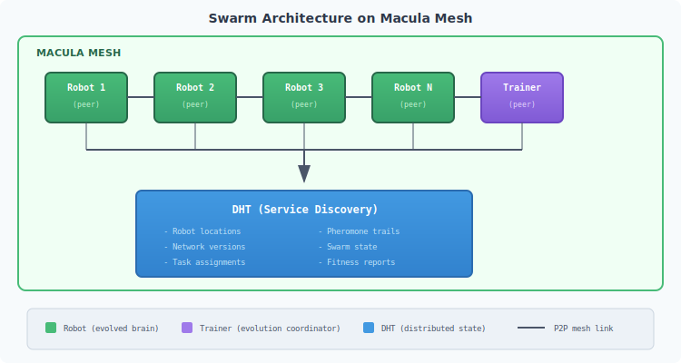
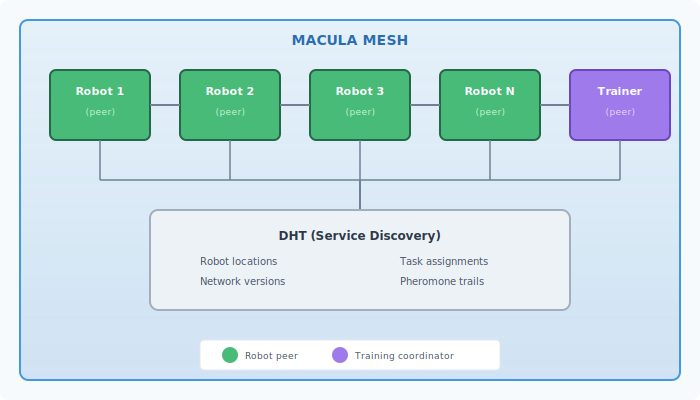
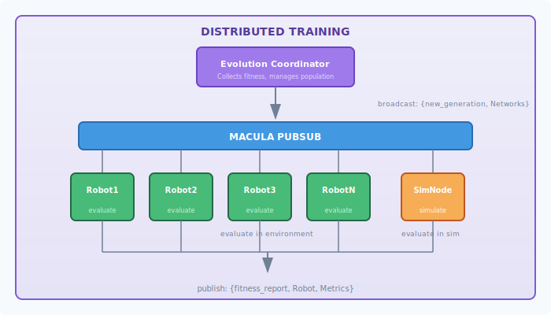

# Swarm Robotics with Evolved Neural Networks

This guide explores how to build cooperative autonomous robotic systems using evolved neural networks and the Macula mesh networking platform.

## Vision: The Liquid Swarm

Imagine a swarm of autonomous robots that:

- **Self-organize** without central control
- **Adapt** to changing environments in real-time
- **Communicate** through a decentralized mesh network
- **Learn** collectively through distributed neuroevolution
- **Scale** from a handful to thousands of agents

This is achievable by combining:

1. **faber_neuroevolution** - Evolve swarm behaviors
2. **faber_tweann** - LTC neural controllers
3. **macula** - Decentralized mesh networking
4. **Nerves** - Embedded Elixir for robots

## Architecture Overview





## Swarm Intelligence Patterns

### 1. Stigmergic Communication

Robots leave "digital pheromones" in the DHT that influence swarm behavior:

```erlang
-module(stigmergy).

%% Deposit a pheromone at current location
deposit_pheromone(Type, Intensity, Position) ->
    Key = position_to_key(Position),
    Pheromone = #{
        type => Type,           % food, danger, path, etc.
        intensity => Intensity,
        deposited_by => node(),
        timestamp => erlang:system_time(millisecond)
    },
    macula_dht:put(Key, Pheromone, #{ttl => 60000}).  % Evaporates in 60s

%% Sense pheromones in area
sense_pheromones(Position, Radius) ->
    Keys = positions_in_radius(Position, Radius),
    Pheromones = lists:filtermap(fun(Key) ->
        case macula_dht:get(Key) of
            {ok, P} -> {true, P};
            _ -> false
        end
    end, Keys),

    %% Decay by time
    Now = erlang:system_time(millisecond),
    [{P, decay_intensity(P, Now)} || P <- Pheromones].

%% Network inputs from pheromones
pheromone_inputs(Position, SensorDirections) ->
    %% For each sensor direction, sum pheromone intensities
    [sum_pheromones_in_direction(Position, Dir) || Dir <- SensorDirections].
```

### 2. Flocking Behavior (Boids)

Classic swarm rules encoded in network inputs:

```erlang
-module(flocking).

%% Calculate flocking inputs for neural network
flocking_inputs(MyPosition, MyVelocity, Neighbors) ->
    %% Rule 1: Separation - avoid crowding
    Separation = calculate_separation(MyPosition, Neighbors),

    %% Rule 2: Alignment - match velocity of neighbors
    Alignment = calculate_alignment(MyVelocity, Neighbors),

    %% Rule 3: Cohesion - steer toward center of mass
    Cohesion = calculate_cohesion(MyPosition, Neighbors),

    %% Normalize to network inputs
    [
        Separation#vec.x, Separation#vec.y,
        Alignment#vec.x, Alignment#vec.y,
        Cohesion#vec.x, Cohesion#vec.y,
        length(Neighbors) / max_neighbors()  % Crowd density
    ].

calculate_separation(MyPos, Neighbors) ->
    Repulsions = [
        vec_scale(
            vec_normalize(vec_sub(MyPos, N#neighbor.position)),
            1.0 / max(0.1, vec_distance(MyPos, N#neighbor.position))
        )
        || N <- Neighbors
    ],
    vec_normalize(vec_sum(Repulsions)).

calculate_alignment(MyVel, Neighbors) ->
    AvgVelocity = vec_avg([N#neighbor.velocity || N <- Neighbors]),
    vec_normalize(vec_sub(AvgVelocity, MyVel)).

calculate_cohesion(MyPos, Neighbors) ->
    CenterOfMass = vec_avg([N#neighbor.position || N <- Neighbors]),
    vec_normalize(vec_sub(CenterOfMass, MyPos)).
```

### 3. Task Allocation (Market-Based)

Robots bid on tasks using evolved valuation networks:

```erlang
-module(task_allocation).

%% Robot evaluates and bids on available tasks
evaluate_and_bid(Robot, AvailableTasks) ->
    Bids = lists:map(fun(Task) ->
        %% Network evaluates task value given robot's state
        Inputs = task_evaluation_inputs(Robot, Task),
        [Value, Confidence] = network_evaluator:evaluate(
            Robot#robot.valuation_network,
            Inputs
        ),

        #{
            task_id => Task#task.id,
            bid => Value * Confidence,
            robot_id => Robot#robot.id,
            estimated_completion => estimate_completion(Robot, Task)
        }
    end, AvailableTasks),

    %% Submit bids to task coordinator
    lists:foreach(fun(Bid) ->
        macula_pubsub:publish(<<"swarm.bids">>, Bid)
    end, Bids).

task_evaluation_inputs(Robot, Task) ->
    [
        %% Distance to task
        distance(Robot#robot.position, Task#task.location) / max_range(),

        %% Robot's energy level
        Robot#robot.battery / 100.0,

        %% Robot's current load
        Robot#robot.cargo / Robot#robot.max_cargo,

        %% Task urgency
        Task#task.priority / 10.0,

        %% Task reward
        Task#task.reward / max_reward(),

        %% Specialization match (if robot is specialized)
        specialization_match(Robot#robot.type, Task#task.type)
    ].

%% Coordinator assigns tasks based on bids
assign_tasks(Bids, Tasks) ->
    %% Group bids by task
    BidsByTask = group_by(task_id, Bids),

    %% For each task, assign to highest bidder
    lists:map(fun(Task) ->
        TaskBids = maps:get(Task#task.id, BidsByTask, []),
        case TaskBids of
            [] ->
                {Task#task.id, unassigned};
            _ ->
                Winner = lists:max_by(fun(B) -> maps:get(bid, B) end, TaskBids),
                {Task#task.id, maps:get(robot_id, Winner)}
        end
    end, Tasks).
```

## Distributed Neuroevolution for Swarms

### Evolution Architecture



### Implementation

```erlang
-module(swarm_evolution).

%% Start distributed evolution for swarm
start_distributed_evolution(Config) ->
    %% Subscribe to fitness reports
    macula_pubsub:subscribe(<<"swarm.fitness">>),

    %% Initialize population
    Population = initialize_swarm_population(Config),

    %% Broadcast initial networks to all robots
    broadcast_networks(Population),

    %% Start evolution loop
    evolution_loop(#{
        population => Population,
        generation => 0,
        config => Config,
        pending_evaluations => #{},
        fitness_reports => []
    }).

evolution_loop(State) ->
    receive
        {macula_event, <<"swarm.fitness">>, Report} ->
            %% Collect fitness report from robot
            NewReports = [Report | maps:get(fitness_reports, State)],

            case length(NewReports) >= expected_reports(State) of
                true ->
                    %% All robots reported - evolve next generation
                    evolve_generation(State#{fitness_reports := NewReports});
                false ->
                    evolution_loop(State#{fitness_reports := NewReports})
            end;

        {timeout, generation} ->
            %% Force evolution with available reports
            evolve_generation(State)
    end.

evolve_generation(State) ->
    Reports = maps:get(fitness_reports, State),

    %% Aggregate fitness from multiple robots running same network
    AggregatedFitness = aggregate_swarm_fitness(Reports),

    %% Update population fitness
    Population = update_population_fitness(
        maps:get(population, State),
        AggregatedFitness
    ),

    %% Standard neuroevolution: select, breed, mutate
    Survivors = neuroevolution_selection:top_n(Population, 0.2),
    Offspring = neuroevolution_genetic:create_offspring(Survivors),
    NewPopulation = Survivors ++ Offspring,

    %% Broadcast new networks to swarm
    broadcast_networks(NewPopulation),

    %% Continue evolution
    evolution_loop(State#{
        population := NewPopulation,
        generation := maps:get(generation, State) + 1,
        fitness_reports := []
    }).

%% Fitness aggregation strategies for swarm evaluation
aggregate_swarm_fitness(Reports) ->
    %% Group reports by network ID
    ByNetwork = group_by(network_id, Reports),

    maps:map(fun(_NetworkId, NetworkReports) ->
        %% Extract metrics from all robots running this network
        Metrics = [R#report.metrics || R <- NetworkReports],

        #{
            %% Individual performance
            avg_task_completion => avg([M#m.tasks_completed || M <- Metrics]),
            avg_energy_efficiency => avg([M#m.energy_efficiency || M <- Metrics]),

            %% Swarm-level emergent metrics
            swarm_coverage => calculate_coverage(Metrics),
            coordination_score => calculate_coordination(Metrics),
            collision_avoidance => 1.0 - avg([M#m.collisions || M <- Metrics]),

            %% Robustness
            variance => std_dev([fitness(M) || M <- Metrics])
        }
    end, ByNetwork).

%% Combined fitness function for swarm behavior
fitness(Metrics) ->
    0.3 * maps:get(avg_task_completion, Metrics) +
    0.2 * maps:get(avg_energy_efficiency, Metrics) +
    0.2 * maps:get(swarm_coverage, Metrics) +
    0.2 * maps:get(coordination_score, Metrics) +
    0.1 * maps:get(collision_avoidance, Metrics).
```

### Robot-Side Implementation

```elixir
defmodule SwarmRobot do
  use GenServer

  def start_link(opts) do
    GenServer.start_link(__MODULE__, opts, name: __MODULE__)
  end

  def init(opts) do
    # Subscribe to network updates
    :macula_pubsub.subscribe("swarm.networks")

    # Join the swarm
    :macula_dht.register_service(%{
      type: "swarm_robot",
      id: robot_id(),
      position: initial_position(),
      capabilities: capabilities()
    })

    schedule_control_loop()
    schedule_fitness_report()

    {:ok, %{
      network: nil,
      network_id: nil,
      metrics: initial_metrics(),
      neighbors: []
    }}
  end

  # Receive new network from evolution coordinator
  def handle_info({:macula_event, "swarm.networks", %{networks: networks}}, state) do
    # Each robot gets assigned a network (round-robin or random)
    my_network = select_network_for_robot(networks, robot_id())

    {:noreply, %{state |
      network: my_network.network,
      network_id: my_network.id,
      metrics: initial_metrics()  # Reset metrics for new generation
    }}
  end

  # Main control loop
  def handle_info(:control_tick, state) do
    # 1. Sense environment
    sensors = read_sensors()
    neighbors = discover_neighbors()

    # 2. Get swarm inputs (flocking, pheromones, etc.)
    swarm_inputs = SwarmInputs.compute(
      sensors,
      neighbors,
      state.metrics
    )

    # 3. Neural network inference
    inputs = sensors.raw ++ swarm_inputs
    outputs = :network_evaluator.evaluate(state.network, inputs)

    # 4. Execute actions
    execute_actions(outputs)

    # 5. Update metrics
    new_metrics = update_metrics(state.metrics, sensors, outputs)

    schedule_control_loop()
    {:noreply, %{state | metrics: new_metrics, neighbors: neighbors}}
  end

  # Report fitness periodically
  def handle_info(:fitness_report, state) do
    report = %{
      robot_id: robot_id(),
      network_id: state.network_id,
      metrics: state.metrics,
      timestamp: :erlang.system_time(:millisecond)
    }

    :macula_pubsub.publish("swarm.fitness", report)

    schedule_fitness_report()
    {:noreply, state}
  end

  defp discover_neighbors do
    # Query DHT for nearby robots
    {:ok, services} = :macula_dht.find_services(%{
      type: "swarm_robot",
      within: 10.0,  # meters
      of: current_position()
    })

    # Filter to actual neighbors
    Enum.filter(services, fn s ->
      distance(s.position, current_position()) < communication_range()
    end)
  end

  defp execute_actions([left_motor, right_motor, arm, gripper, communicate]) do
    # Motor control
    Motor.set(:left, left_motor)
    Motor.set(:right, right_motor)

    # Arm control
    Servo.set(:arm, arm * 180.0)

    # Gripper
    if gripper > 0.5, do: Gripper.close(), else: Gripper.open()

    # Communication action (deposit pheromone, signal, etc.)
    if communicate > 0.5 do
      :stigmergy.deposit_pheromone(:signal, communicate, current_position())
    end
  end
end
```

## Evolved Behaviors

### Emergent Swarm Behaviors

Through evolution, swarms can develop sophisticated emergent behaviors:

| Behavior | Description | Evolution Target |
|----------|-------------|------------------|
| **Foraging** | Find and collect resources | Task completion rate |
| **Formation** | Maintain geometric patterns | Formation error |
| **Coverage** | Spread to cover area | Area coverage % |
| **Aggregation** | Gather at locations | Gathering speed |
| **Pursuit** | Coordinate to catch target | Capture success |
| **Construction** | Build structures together | Structure quality |

### Example: Evolved Foraging

```erlang
%% Fitness function for foraging behavior
foraging_fitness(Metrics) ->
    #{
        food_collected := FoodCollected,
        energy_spent := EnergySpent,
        collisions := Collisions,
        time_to_depot := TimeToDepot
    } = Metrics,

    %% Multi-objective fitness
    Efficiency = FoodCollected / max(1, EnergySpent),
    Safety = 1.0 - (Collisions / max_collisions()),
    Speed = 1.0 - (TimeToDepot / max_time()),

    0.5 * Efficiency + 0.3 * Safety + 0.2 * Speed.

%% Network inputs for foraging robot
foraging_inputs(Robot, Environment) ->
    [
        %% Local sensors
        Robot#robot.food_sensor_left,
        Robot#robot.food_sensor_center,
        Robot#robot.food_sensor_right,
        Robot#robot.obstacle_sensor_left,
        Robot#robot.obstacle_sensor_right,
        Robot#robot.carrying_food,

        %% Swarm communication
        pheromone_gradient(food, Robot#robot.position),
        pheromone_gradient(path, Robot#robot.position),
        nearest_depot_direction(Robot#robot.position),

        %% Internal state
        Robot#robot.energy / 100.0,
        Robot#robot.time_since_found_food / 1000.0
    ].
```

## Simulation Before Deployment

Always evolve in simulation before deploying to physical robots:

```erlang
-module(swarm_simulator).

%% Run swarm simulation for evaluation
simulate_swarm(Networks, Config) ->
    %% Initialize simulated environment
    Environment = create_environment(Config),

    %% Create simulated robots with evolved networks
    Robots = [create_simulated_robot(N, I, Environment)
              || {N, I} <- lists:zip(Networks, lists:seq(1, length(Networks)))],

    %% Run simulation
    FinalState = run_simulation_loop(
        #{
            robots => Robots,
            environment => Environment,
            tick => 0,
            max_ticks => maps:get(max_ticks, Config, 10000)
        }
    ),

    %% Calculate swarm-level metrics
    calculate_swarm_metrics(FinalState).

run_simulation_loop(State = #{tick := Tick, max_ticks := MaxTicks})
    when Tick >= MaxTicks ->
    State;
run_simulation_loop(State) ->
    %% 1. Each robot senses and decides
    Robots = [simulate_robot_tick(R, State) || R <- maps:get(robots, State)],

    %% 2. Resolve collisions and interactions
    ResolvedRobots = resolve_interactions(Robots),

    %% 3. Update environment (resources, pheromones decay, etc.)
    Environment = update_environment(maps:get(environment, State)),

    %% 4. Continue
    run_simulation_loop(State#{
        robots := ResolvedRobots,
        environment := Environment,
        tick := maps:get(tick, State) + 1
    }).

simulate_robot_tick(Robot, State) ->
    %% Simulate sensors
    Sensors = simulate_sensors(Robot, State),

    %% Get network decision
    Inputs = robot_inputs(Robot, Sensors, State),
    Outputs = network_evaluator:evaluate(Robot#sim_robot.network, Inputs),

    %% Apply outputs to simulated physics
    apply_simulated_actions(Robot, Outputs).
```

## Fault Tolerance

### Graceful Degradation

```erlang
%% Robot handles neighbor failures gracefully
handle_neighbor_failure(FailedRobotId, State) ->
    %% Remove from known neighbors
    NewNeighbors = lists:filter(
        fun(N) -> N#neighbor.id =/= FailedRobotId end,
        State#state.neighbors
    ),

    %% If was coordinating on task, reassign
    case State#state.current_task of
        #{coordinator := FailedRobotId} = Task ->
            %% Become new coordinator or release task
            handle_coordinator_failure(Task, NewNeighbors);
        _ ->
            ok
    end,

    State#state{neighbors = NewNeighbors}.

%% Swarm continues functioning with fewer robots
handle_coordinator_failure(Task, Neighbors) ->
    case Neighbors of
        [] ->
            %% No neighbors, take over coordination
            become_coordinator(Task);
        _ ->
            %% Elect new coordinator (highest ID wins)
            MaxNeighbor = lists:max_by(fun(N) -> N#neighbor.id end, Neighbors),
            case node() > MaxNeighbor#neighbor.id of
                true -> become_coordinator(Task);
                false -> wait_for_new_coordinator(Task)
            end
    end.
```

### Network Redundancy

```erlang
%% Each robot carries multiple evolved networks
-record(robot_state, {
    primary_network,
    backup_networks,  % List of alternative networks
    network_health    % Performance monitoring
}).

%% Switch to backup if primary is performing poorly
maybe_switch_network(State) ->
    Health = State#robot_state.network_health,
    case Health#health.recent_fitness < Health#health.threshold of
        true ->
            %% Primary is struggling, try backup
            [Backup | Rest] = State#robot_state.backup_networks,
            State#robot_state{
                primary_network = Backup,
                backup_networks = Rest ++ [State#robot_state.primary_network]
            };
        false ->
            State
    end.
```

## Deployment Checklist

Before deploying evolved swarm controllers to physical robots:

- [ ] **Simulation validation**: 1000+ successful simulation runs
- [ ] **Safety bounds**: All actuator outputs have hard limits
- [ ] **Emergency stop**: Hardware kill switch on each robot
- [ ] **Communication fallback**: Robots function independently if network fails
- [ ] **Battery management**: Low battery triggers safe behavior
- [ ] **Collision avoidance**: Works even if evolved behavior fails
- [ ] **Gradual rollout**: Start with 2-3 robots, scale up
- [ ] **Monitoring**: Real-time telemetry to operator station
- [ ] **Rollback plan**: Can revert to previous network version

## Related Guides

- [Interoperability](interoperability.md) - Export networks for deployment
- [Inference Scenarios](inference-scenarios.md) - Production deployment patterns
- [LTC Meta-Controller](meta-controller.md) - Adaptive hyperparameter control
- [Custom Evaluators](custom-evaluator.md) - Domain-specific fitness functions
