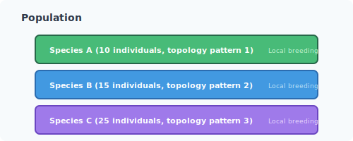
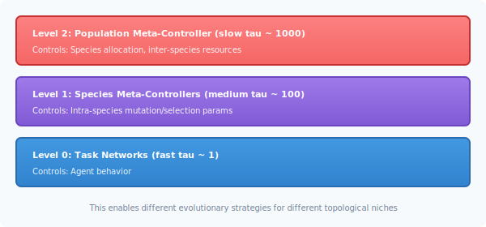
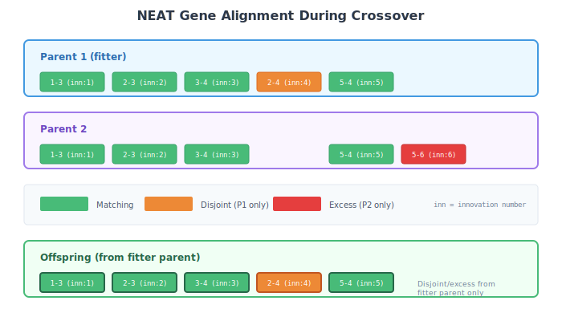

# Topology Evolution Roadmap

This document outlines the planned integration of full TWEANN (Topology and Weight Evolving Artificial Neural Networks) capabilities into `faber_neuroevolution`, and how the Liquid Conglomerate meta-learning architecture will control topology evolution.

## Current State

Currently, `faber_neuroevolution` uses fixed-topology networks where:
- Network structure is defined at initialization: `{InputSize, HiddenLayers, OutputSize}`
- Only weights are evolved through crossover and mutation
- All individuals in the population have identical topology

The underlying `faber_tweann` library already supports full topology evolution operators:

| Operator | Description |
|----------|-------------|
| `add_neuron/1` | Insert neuron into existing connection |
| `add_outlink/1` | Add output connection from neuron |
| `add_inlink/1` | Add input connection to neuron |
| `outsplice/1` | Split output connection with new neuron |
| `add_sensorlink/1` | Connect sensor to neuron |
| `add_actuatorlink/1` | Connect neuron to actuator |
| `add_bias/1` | Add bias connection to neuron |
| `add_sensor/1` | Add new sensor (planned) |
| `add_actuator/1` | Add new actuator (planned) |

## NEAT-Inspired Topology Evolution

The planned topology evolution follows the NEAT (NeuroEvolution of Augmenting Topologies) approach by Stanley and Miikkulainen (2002):

### Core Principles

1. **Start Minimal** - Networks begin with minimal structure (direct input-output connections)
2. **Complexify Gradually** - Structure grows through mutations over generations
3. **Protect Innovation** - New structures need time to optimize their weights
4. **Speciation** - Similar topologies compete primarily with each other

### Innovation Numbers

Each structural change (new connection, new node) receives a unique innovation number:

```
Connection Gene: {from: 1, to: 4, weight: 0.5, enabled: true, innovation: 42}
```

Innovation numbers enable:
- Alignment during crossover (match genes by innovation)
- Distance calculation for speciation
- Historical tracking of structural changes

## Liquid Conglomerate Integration

The Liquid Conglomerate meta-controller will extend to control topology evolution parameters dynamically.

### Extended Meta-Controller Outputs

Current outputs (weight evolution):
- `mutation_rate` - Probability of weight mutation
- `mutation_strength` - Magnitude of weight perturbation
- `selection_ratio` - Survival ratio per generation

New outputs (topology evolution):
- `topology_mutation_rate` - Probability of structural mutation
- `add_neuron_rate` - Relative probability of adding neurons
- `add_connection_rate` - Relative probability of adding connections
- `remove_connection_rate` - Relative probability of removing connections
- `complexity_penalty` - Fitness penalty per structural element

### Extended Meta-Controller Inputs

Current inputs (population metrics):
- Best/average/worst fitness
- Fitness improvement rate
- Population diversity
- Stagnation count

New inputs (topology metrics):
- Average network complexity (neuron count, connection count)
- Complexity variance across population
- Topology diversity (unique structures)
- Innovation frequency
- Species count and health

### Adaptive Topology Control

The meta-controller learns when to:

1. **Encourage Complexification**
   - Fitness plateaus but hasn't peaked
   - High diversity in weights but not structure
   - Problem appears to need more representational capacity

2. **Discourage Complexification**
   - Networks growing without fitness improvement
   - Over-fitting indicators (train/test divergence)
   - Computational budget concerns

3. **Encourage Simplification**
   - Prune unused connections
   - Remove redundant neurons
   - Regularize toward minimal effective complexity

## Speciation with Liquid Conglomerate

### Species as Sub-Populations

Each species maintains its own population dynamics:



### Meta-Controller Per Species

The Liquid Conglomerate hierarchy could extend to species-level control:



This enables different evolutionary strategies for different topological niches.

## Crossover with Variable Topology

When crossing individuals with different topologies:

### Gene Alignment



### Compatibility Distance

```erlang
compatibility_distance(Genome1, Genome2, Config) ->
    {Excess, Disjoint, WeightDiff} = compare_genomes(Genome1, Genome2),
    N = max(genome_size(Genome1), genome_size(Genome2)),

    Config#compat_config.c1 * Excess / N +
    Config#compat_config.c2 * Disjoint / N +
    Config#compat_config.c3 * WeightDiff.
```

## Implementation Phases

### Phase 1: Foundation

- Add innovation number tracking to networks
- Implement gene-based genome representation
- Add compatibility distance calculation
- Basic speciation without meta-control

### Phase 2: Topology Operators

- Integrate `add_neuron`, `add_outlink`, `add_inlink` operators
- Implement connection enable/disable
- Add crossover for variable topologies
- Implement speciation dynamics

### Phase 3: Meta-Controller Extension

- Extend meta-controller inputs (complexity metrics)
- Add topology evolution outputs
- Train meta-controller on topology-aware reward signal
- Implement adaptive complexity penalties

### Phase 4: Species-Level Meta-Control

- Per-species meta-controllers
- Inter-species resource allocation
- Hierarchical Liquid Conglomerate for species

## Expected Benefits

### From Topology Evolution

1. **Automatic Architecture Discovery** - No manual network design needed
2. **Minimal Complexity Bias** - Solutions grow only as complex as needed
3. **Diverse Strategies** - Different topologies for different sub-problems
4. **Incremental Building** - Complex solutions built on simpler precursors

### From Liquid Conglomerate Control

1. **Adaptive Complexification** - Grow structure when needed, not randomly
2. **Phase-Appropriate Strategies** - Explore structure early, refine late
3. **Automatic Regularization** - Meta-learned complexity penalties
4. **Transfer of Meta-Knowledge** - Learn "how to evolve topology" across domains

## Relation to DXNN2

This roadmap draws heavily from Gene Sher's DXNN2 architecture (described in "Handbook of Neuroevolution Through Erlang"). Key concepts from DXNN2:

- Morphology-based sensor/actuator specification
- Constraint records for controlling mutation operators
- Substrate encoding for hypercube geometry
- Exoself architecture for agent lifecycle

The Liquid Conglomerate extends DXNN2's concepts by adding:
- Hierarchical meta-learning at multiple timescales
- LTC neurons for continuous temporal dynamics
- Adaptive tau for timescale self-organization
- Species-level meta-control

## References

- Stanley, K.O. & Miikkulainen, R. (2002). Evolving Neural Networks through Augmenting Topologies. *Evolutionary Computation*, 10(2), 99-127.

- Sher, G.I. (2013). *Handbook of Neuroevolution Through Erlang*. Springer.

- Hasani, R. et al. (2021). Liquid Time-constant Networks. *AAAI*.

## Next Steps

See [The Liquid Conglomerate](liquid-conglomerate.md) for the full meta-learning theory, or [LTC Meta-Controller](meta-controller.md) for current implementation details.
