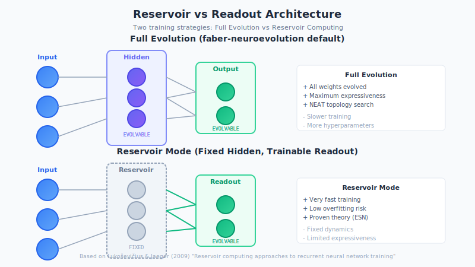
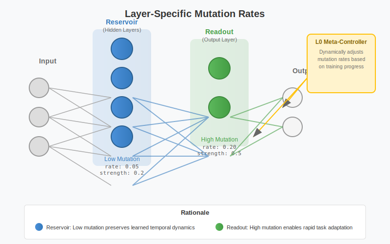

# Training Strategies: Reservoir vs Full Evolution

This guide explains the different training strategies available in faber-neuroevolution and when to use each approach.

## Overview

When training neural networks with neuroevolution, you have two fundamental approaches:

1. **Full Evolution** (default) - Evolve the entire network
2. **Reservoir Mode** - Keep the reservoir (hidden layers) fixed, evolve only the readout

Understanding when to use each approach can significantly impact training speed and final performance.



## Background: Reservoir Computing

### What is a Reservoir?

In [Reservoir Computing](https://en.wikipedia.org/wiki/Reservoir_computing) (Echo State Networks, Liquid State Machines), the network is divided into two parts:

```
[Input] ──→ [FIXED Reservoir] ──→ [TRAINABLE Readout]
                  ↑
            Random weights
            Never trained
```

**Key principle:** The reservoir is a fixed, randomly initialized recurrent network. Only the linear readout weights are trained (via simple linear regression).

### Why Does This Work?

1. **Nonlinear transformation**: The reservoir maps inputs to a high-dimensional space
2. **Fading memory**: The recurrent dynamics separate temporal patterns
3. **Separation property**: Different input sequences produce different reservoir states
4. **Universality**: A sufficiently large reservoir can approximate any fading-memory filter

This approach was formalized by:

> Lukoševičius, M., & Jaeger, H. (2009). "Reservoir computing approaches to recurrent neural network training." *Computer Science Review*, 3(3), 127-149.

## What Macula Currently Does

By default, faber-neuroevolution trains **the entire network**:

```
[Input] ──→ [Evolved Hidden Layers] ──→ [Evolved Output Layer]
                     ↑                           ↑
               Mutations applied           Mutations applied
               (same rates)                (same rates)
```

From the mutation pipeline:
- All weights are mutated with uniform `mutation_rate` and `mutation_strength`
- No layer-specific treatment
- Both structure (NEAT topology) and weights evolve together

### Is This "Wrong"?

**No.** This is a different approach with different trade-offs. In fact, our approach aligns with how Hasani & Lechner train their Liquid Time-Constant Networks:

> Hasani, R., Lechner, M., et al. (2022). "Closed-form Continuous-time Neural Networks." *Nature Machine Intelligence*.

They train **all weights** (backbone, f, g, h networks) using gradient descent. Our evolutionary approach does the same with mutations instead of gradients.

## Strategy Comparison

| Aspect | Reservoir (Fixed Hidden) | Full Evolution (Current) |
|--------|--------------------------|--------------------------|
| **Training speed** | Very fast (linear regression) | Slower (evolutionary search) |
| **Expressiveness** | Limited by random reservoir | Full network can be optimized |
| **Overfitting risk** | Low (few trainable params) | Higher (many trainable params) |
| **Theoretical basis** | Proven universal approximator | Empirically effective |
| **Temporal processing** | Fixed dynamics | Evolvable dynamics |
| **Computational cost** | Low (only readout evolves) | Higher (full population evolves) |
| **Ideal for** | Prototyping, limited compute | Final optimization, complex tasks |

## Configuring Training Strategy

### Full Evolution (Default)

This is the current default behavior:

```erlang
Config = #{
    mutation_rate => 0.1,
    mutation_strength => 0.3,
    %% All neurons mutated equally
}.
```

### Layer-Specific Mutation Rates



For more control, configure different rates for reservoir vs readout:

```erlang
Config = #{
    %% Reservoir (hidden layers) - lower mutation for stability
    reservoir_mutation_rate => 0.05,
    reservoir_mutation_strength => 0.2,

    %% Readout (output layer) - higher mutation for faster adaptation
    readout_mutation_rate => 0.2,
    readout_mutation_strength => 0.5
}.
```

**Rationale:** The readout layer often benefits from faster adaptation (it maps reservoir states to actions), while the reservoir dynamics should evolve more slowly to maintain useful temporal representations.

### Reservoir Mode (Fixed Hidden)

To use pure reservoir computing (fixed hidden layers):

```erlang
Config = #{
    training_mode => reservoir,
    reservoir_freeze_after => 0  %% Freeze immediately
}.
```

Or freeze after initial exploration:

```erlang
Config = #{
    training_mode => reservoir,
    reservoir_freeze_after => 50  %% Evolve reservoir for 50 generations, then freeze
}.
```

## When to Use Each Strategy

### Use Full Evolution When:

- **Final optimization**: You want the best possible performance
- **Complex temporal tasks**: The task requires specific temporal dynamics
- **Sufficient compute budget**: You can afford longer training times
- **Novel domains**: No prior knowledge about what dynamics are needed
- **Structural search**: You want NEAT to find optimal topology

### Use Reservoir Mode When:

- **Rapid prototyping**: Quick experiments to test feasibility
- **Limited compute**: Training budget is constrained
- **Known good dynamics**: The reservoir dynamics are already suitable
- **Benchmark comparisons**: Comparing against reservoir computing baselines
- **Transfer learning**: Using a pre-trained reservoir from a related task

### Use Layer-Specific Rates When:

- **Balanced approach**: Want faster readout adaptation without destabilizing reservoir
- **Incremental refinement**: Already have good reservoir, want to optimize readout
- **Stability concerns**: Reservoir dynamics are good, want to preserve them
- **Late-stage training**: Convergence is near, want fine-grained control

## Plasticity Considerations

Layer-specific strategies also apply to Hebbian plasticity:

```erlang
Config = #{
    %% Different plasticity rules for different layers
    reservoir_plasticity => hebbian,      %% Local learning in reservoir
    readout_plasticity => modulated       %% Reward-modulated in readout
}.
```

**Reservoir plasticity:** Unsupervised Hebbian learning helps the reservoir develop useful representations based on input statistics.

**Readout plasticity:** Reward-modulated plasticity (neuromodulation) allows the readout to adapt based on task performance.

## Temporal Abstraction in Readout

An advanced technique: provide the readout with temporal features of the reservoir state:

```erlang
%% The readout can receive:
%% - Current reservoir state x(t)
%% - Exponential moving average of reservoir (slow features)
%% - Rate of change dx/dt (fast features)
%% - Peak values (episodic memory)

Config = #{
    readout_features => [
        current,           %% x(t)
        ema_slow,          %% EMA with tau=100
        ema_fast,          %% EMA with tau=10
        rate_of_change     %% dx/dt
    ]
}.
```

This gives the readout multiple temporal views without modifying the reservoir itself.

## Experimental Validation

Before choosing a strategy, consider running ablation experiments:

### Experiment 1: Mutation Rate Sensitivity

Compare training with:
- Uniform rates (current)
- Higher readout rates (2x, 4x)
- Lower reservoir rates (0.5x)

**Metrics:** Convergence speed, final fitness, generalization

### Experiment 2: Reservoir Baseline

Compare training with:
- Full evolution (current)
- Fixed reservoir after generation 50
- Fixed reservoir from start (pure reservoir computing)

**Metrics:** Training time, final fitness, computational cost

### Experiment 3: Ablation Study (LTC Networks)

For LTC networks specifically:
- Train only tau (time constants)
- Train only readout weights
- Train both (current)

**Metrics:** Temporal task performance, stability

## Integration with Liquid Conglomerate

The [Liquid Conglomerate](liquid-conglomerate.md) meta-controller can learn optimal training strategies dynamically:

- Automatically adjusts mutation rates based on training progress
- Learns when to shift from exploration to exploitation
- Can implement adaptive reservoir freezing based on convergence signals

See the LC guide for details on self-tuning hyperparameters.

## Summary

| Strategy | Speed | Expressiveness | Use Case |
|----------|-------|----------------|----------|
| **Full Evolution** | Slow | Highest | Complex tasks, final optimization |
| **Layer-Specific** | Medium | High | Balanced approach, stability-aware |
| **Reservoir Mode** | Fast | Limited | Prototyping, constrained compute |

**Default recommendation:** Start with full evolution for complex tasks. If training is too slow, try layer-specific rates with higher readout mutation. Use reservoir mode for quick experiments and comparisons.

## References

### Reservoir Computing

- Lukoševičius, M., & Jaeger, H. (2009). "Reservoir computing approaches to recurrent neural network training." *Computer Science Review*, 3(3), 127-149.
- Maass, W., Natschläger, T., & Markram, H. (2002). "Real-time computing without stable states: A new framework for neural computation based on perturbations." *Neural computation*, 14(11), 2531-2560.

### LTC Training

- Hasani, R., Lechner, M., et al. (2021). "Liquid Time-constant Networks." *Proceedings of AAAI 2021*.
- Hasani, R., Lechner, M., et al. (2022). "Closed-form Continuous-time Neural Networks." *Nature Machine Intelligence*.

### NEAT Evolution

- Stanley, K. O., & Miikkulainen, R. (2002). "Evolving neural networks through augmenting topologies." *Evolutionary computation*, 10(2), 99-127.

## Related Guides

- [Overview](overview.md) - Neuroevolution fundamentals
- [Liquid Conglomerate](liquid-conglomerate.md) - Self-tuning hyperparameters
- [Topology Evolution](topology-evolution.md) - NEAT structural mutations
- [Custom Evaluator](custom-evaluator.md) - Domain-specific training
