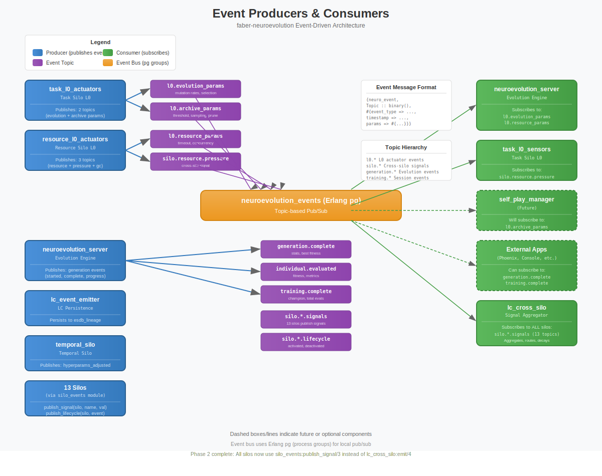

# Event-Driven Architecture Refactoring Plan

**Status:** In Progress
**Created:** 2025-12-26
**Severity:** CRITICAL - Core architecture violates event-driven principles

---

## Architecture Diagram



---

## Executive Summary

Both `faber-tweann` and `faber-neuroevolution` have significant imperative/command-driven patterns that violate the event-driven architecture principles defined in CLAUDE.md. This document catalogs all violations and provides a remediation plan.

### Violation Counts

| Repository | Critical | High | Medium | Total |
|------------|----------|------|--------|-------|
| faber-tweann | 12 | 9 | 6 | 27 |
| faber-neuroevolution | 4 | 17 | 9 | 30 |
| **Total** | **16** | **26** | **15** | **57** |

---

## Part 1: faber-tweann Violations

### CRITICAL: Cortex Orchestration (Direct Message Push)

The cortex directly commands network components instead of publishing events.

| File | Line | Imperative Pattern | Should Be Event |
|------|------|-------------------|-----------------|
| `cortex.erl` | 181 | `SensorPid ! {cortex, sync}` | Publish `evaluation_cycle_started` |
| `cortex.erl` | 244 | `neuron:backup(NeuronPid)` | Publish `backup_requested` |
| `cortex.erl` | 284 | `SensorPid ! {cortex, terminate}` | Publish `network_terminating` |
| `cortex.erl` | 292 | `NeuronPid ! {cortex, terminate}` | Publish `network_terminating` |
| `cortex.erl` | 300 | `ActuatorPid ! {cortex, terminate}` | Publish `network_terminating` |

### CRITICAL: Exoself Network Control (Direct Function Calls)

| File | Line | Imperative Pattern | Should Be Event |
|------|------|-------------------|-----------------|
| `exoself.erl` | 135 | `cortex:sync(CortexPid)` | Publish `evaluation_requested` |
| `exoself.erl` | 389 | `cortex:sync(CortexPid)` | Publish `weights_perturbed` |
| `exoself.erl` | 446 | `cortex:sync(CortexPid)` | Publish `evaluation_requested` |
| `exoself.erl` | 472 | `NeuronPid ! {perturb, Range}` | Publish `perturbation_scheduled` |
| `exoself.erl` | 483 | `NeuronPid ! backup` | Publish `backup_requested` |
| `exoself.erl` | 494 | `NeuronPid ! restore` | Publish `restore_requested` |
| `exoself.erl` | 514 | `cortex:terminate(CortexPid)` | Publish `termination_requested` |

### HIGH: Sensor/Neuron/Actuator Data Flow (Direct Push)

| File | Line | Imperative Pattern | Should Be Event |
|------|------|-------------------|-----------------|
| `sensor.erl` | 138 | `NeuronPid ! {forward, self(), Signal}` | Publish `sensor_output_ready` |
| `neuron.erl` | 267 | `OutputPid ! {forward, self(), [Output]}` | Publish `neuron_output_ready` |
| `neuron.erl` | 275 | `RoPid ! {forward, self(), [Output]}` | Publish `neuron_output_ready` |
| `neuron.erl` | 326 | `CortexPid ! {backup, Id, Weights, Bias}` | Publish `weights_backed_up` |
| `actuator.erl` | 147 | `CortexPid ! {actuator_output, ...}` | Publish `actuator_output_ready` |

### MEDIUM: Population Monitor (Self-Casts)

| File | Line | Imperative Pattern | Should Be Event |
|------|------|-------------------|-----------------|
| `population_monitor.erl` | 270 | `gen_server:cast(self(), start_evaluation)` | React to `generation_complete` |
| `population_monitor.erl` | 281 | `genotype:delete_Agent(AgentId)` | Publish `agent_culled` |
| `population_monitor.erl` | 291 | `gen_server:cast(self(), start_evaluation)` | React to events |

### GOOD PATTERNS (Reference Implementation)

These modules correctly use event-driven patterns:

| File | Pattern | Why It's Good |
|------|---------|---------------|
| `brain_pubsub.erl` | Pure pub/sub | Decoupled event broker |
| `brain_learner.erl` | `brain_pubsub:publish()` | Publishes learning events |
| `brain.erl` | `publish_evaluated()` | Publishes evaluation results |

---

## Part 2: faber-neuroevolution Violations

### CRITICAL: Config Updates (Command Pattern)

| File | Line | Imperative Pattern | Should Be Event |
|------|------|-------------------|-----------------|
| `neuroevolution_server.erl` | 141 | `update_config(ServerRef, Params)` | Subscribe to `config_update_requested` |
| `task_l0_actuators.erl` | 395 | `neuroevolution_server:update_config()` | Publish `l0_params_computed` |
| `resource_l0_actuators.erl` | 283 | `neuroevolution_server:update_config()` | Publish `resource_params_computed` |
| `coevolution_manager.erl` | 167 | `set_config(Pid, ConfigUpdates)` | Publish `coevolution_config_changed` |

### HIGH: Silo Signal Emission (Direct Push)

The `lc_cross_silo:emit()` pattern is imperative push, not pub/sub:

| File | Line | Imperative Pattern | Should Be Event |
|------|------|-------------------|-----------------|
| `communication_silo.erl` | 314 | `lc_cross_silo:emit_batch(...)` | Publish to topic `silo.communication.signals` |
| `ecological_silo.erl` | 325 | `lc_cross_silo:emit_batch(...)` | Publish to topic `silo.ecological.signals` |
| `distribution_silo.erl` | 302 | `lc_cross_silo:emit_batch(...)` | Publish to topic `silo.distribution.signals` |
| `competitive_silo.erl` | 298 | `lc_cross_silo:emit_batch(...)` | Publish to topic `silo.competitive.signals` |
| `temporal_silo.erl` | 310 | `lc_cross_silo:emit_batch(...)` | Publish to topic `silo.temporal.signals` |
| `regulatory_silo.erl` | 295 | `lc_cross_silo:emit_batch(...)` | Publish to topic `silo.regulatory.signals` |

### HIGH: Cross-Module Blocking Queries

| File | Line | Imperative Pattern | Should Be |
|------|------|-------------------|-----------|
| `neuroevolution_server.erl` | 648 | `resource_silo:get_recommendations()` | Subscribe to `resource_recommendations` |
| `neuroevolution_server.erl` | 1587 | `task_silo:get_recommendations(...)` | Publish `generation_stats`, subscribe to recommendations |
| `task_silo.erl` | 551 | `lc_silo_chain:get_recommendations(...)` | Event-driven chain |
| `meta_controller.erl` | 124 | `get_l1_guidance(ServerRef, GenStats)` | Subscribe to guidance events |

### HIGH: State Updates as Commands

| File | Line | Imperative Pattern | Should Be Event |
|------|------|-------------------|-----------------|
| `social_silo.erl` | 147 | `update_reputation(Pid, Id, Delta)` | Publish `reputation_changed` |
| `ecological_silo.erl` | 152 | `update_niche(Pid, NicheId, Updates)` | Publish `niche_updated` |
| `temporal_silo.erl` | 156 | `update_episode(...)` | Publish `episode_completed` |
| `competitive_silo.erl` | 151 | `record_match(...)` | Publish `match_completed` |
| `regulatory_silo.erl` | 144 | `update_expression(...)` | Publish `gene_expression_changed` |

### HIGH: Controller Chain Commands

| File | Line | Imperative Pattern | Should Be Event |
|------|------|-------------------|-----------------|
| `lc_chain.erl` | 111 | `train(ServerRef, Reward)` | Publish `reward_signal` |
| `lc_silo_chain.erl` | 131 | `report_reward(Chain, Reward)` | Publish `silo_reward` |
| `lc_population.erl` | 123 | `report_metrics(Pid, Metrics)` | Publish `population_metrics` |
| `lc_l1_controller.erl` | 115 | `observe_l0(L0Metrics)` | Subscribe to `l0_metrics` |
| `lc_l2_controller.erl` | 101 | `observe_l1(L1Metrics)` | Subscribe to `l1_metrics` |

### MEDIUM: Registry Coupling

| File | Line | Imperative Pattern | Should Be |
|------|------|-------------------|-----------|
| `evaluator_pool_registry.erl` | 65 | `register_evaluator()` | Publish `evaluator_available` |
| `evaluator_pool_registry.erl` | 69 | `unregister_evaluator()` | Publish `evaluator_unavailable` |
| `distributed_evaluator.erl` | 157 | `register_evaluator()` | Publish event |
| `distributed_evaluator.erl` | 240 | `report_evaluation_started()` | Publish `evaluation_started` |
| `distributed_evaluator.erl` | 253 | `report_evaluation_completed()` | Publish `evaluation_completed` |

### GOOD PATTERNS (Reference Implementation)

| File | Pattern | Why It's Good |
|------|---------|---------------|
| `neuroevolution_events.erl` | `publish(Topic, Event)` | Correct pub/sub |
| `neuroevolution_events_local.erl` | Erlang `pg` groups | Correct local pub/sub |
| `lc_event_emitter.erl` | Optional event persistence | Good for audit trail |

---

## Part 3: Remediation Plan

### Phase 1: Immediate (v0.24.2) - Fix L0 Actuators ✅ COMPLETE

**Priority:** CRITICAL
**Effort:** 1 day
**Status:** COMPLETE (2025-12-26)

1. [x] Refactor `task_l0_actuators.erl`:
   - Remove direct `neuroevolution_server:update_config()` call
   - Publish `<<"l0.evolution_params">>` event via `neuroevolution_events`

2. [x] Update `neuroevolution_server.erl`:
   - Subscribe to `<<"l0.evolution_params">>` in `init/1`
   - Handle event in `handle_info/2`
   - Remove `update_config/2` export (deprecate)

3. [x] Refactor `resource_l0_actuators.erl`:
   - Publish `<<"l0.resource_params">>` event
   - Remove direct update call

### Phase 2: Cross-Silo Events (v0.25.0) ✅ COMPLETE

**Priority:** HIGH
**Effort:** 3 days
**Status:** COMPLETE (2025-12-26)

1. [x] Replace `lc_cross_silo:emit()` with topic-based pub/sub:
   - Created `silo_events.erl` with `publish_signal/3` and `publish_signals/2`
   - Each silo now publishes to `<<"silo.<name>.signals">>` topic
   - `lc_cross_silo` subscribes to all silo topics and aggregates
   - Deprecated `emit/4` and `emit_batch/3` (kept for backward compat with warnings)

2. [x] Add silo lifecycle events:
   - `silo_activated` published on enable
   - `silo_deactivated` published on disable
   - Uses `silo_events:publish_lifecycle/2`

### Phase 3: Controller Chain Events (v0.25.0) ✅ COMPLETE

**Priority:** HIGH
**Effort:** 2 days
**Status:** COMPLETE (2025-12-26)

1. [x] Created `controller_events.erl` module:
   - Topics: `controller.reward`, `controller.<silo>.l0.metrics`,
     `controller.<silo>.l1.metrics`, `controller.<silo>.l2.guidance`,
     `controller.population.metrics`
   - Publish/subscribe functions for all event types

2. [x] Refactored `lc_chain.erl`:
   - Subscribes to reward events in init
   - Added deprecation warning to `train/2`
   - Handles reward events via `handle_info`

3. [x] Refactored `lc_silo_chain.erl`:
   - Subscribes to reward events in init
   - Added deprecation warning to `report_reward/2`
   - Handles reward events via `handle_info`

4. [x] Refactored `lc_population.erl`:
   - Subscribes to population metrics events in init
   - Added deprecation warning to `report_metrics/2`
   - Handles metrics events via `handle_info`

5. [x] Refactored `lc_l1_controller.erl`:
   - Subscribes to L0 metrics and L2 guidance in init
   - Added deprecation warning to `observe_l0_performance/2`
   - Publishes L1 metrics after processing L0 observations

6. [x] Refactored `lc_l2_controller.erl`:
   - Subscribes to L1 metrics in init
   - Added deprecation warning to `observe_l1_performance/2`
   - Publishes L2 guidance after adjustments

### Phase 4: faber-tweann Network Events (v0.18.0) ✅ COMPLETE

**Priority:** HIGH
**Effort:** 5 days
**Status:** COMPLETE (2025-12-26)

1. [x] Created `network_pubsub.erl` (parallel to `brain_pubsub.erl`):
   - Uses OTP pg (process groups) for pub/sub
   - Topics: `evaluation_cycle_started`, `sensor_output_ready`, `neuron_output_ready`,
     `actuator_output_ready`, `backup_requested`, `weights_backed_up`, `network_terminating`
   - API: `init/1`, `cleanup/1`, `subscribe/2,3`, `publish/3`, `list_topics/1`

2. [x] Refactored cortex to event-driven (opt-in via `event_driven` option):
   - Publishes `evaluation_cycle_started` when `event_driven=true`
   - Publishes `backup_requested` instead of direct neuron calls
   - Publishes `network_terminating` instead of direct terminate messages
   - Subscribes to `actuator_output_ready` for collecting outputs

3. [x] Refactored sensor to event-driven:
   - Subscribes to `evaluation_cycle_started` and `network_terminating`
   - Publishes `sensor_output_ready` with signal payload when `event_driven=true`
   - Falls back to direct `{forward, ...}` messages when `event_driven=false`

4. [x] Refactored neuron to event-driven:
   - Subscribes to `backup_requested` and `network_terminating`
   - Publishes `weights_backed_up` when backup requested
   - Signal flow kept as direct messages for performance
   - Pre-compiled weights for NIF acceleration preserved

5. [x] Refactored actuator to event-driven:
   - Subscribes to `network_terminating`
   - Publishes `actuator_output_ready` when `event_driven=true`
   - Falls back to direct cortex message when `event_driven=false`

**Design Decision:** Hybrid approach for performance:
- Lifecycle events (sync, terminate, backup) → Use pubsub
- Signal flow ({forward, ...}) → Keep direct messages for low latency

### Phase 5: Query Patterns (v0.26.0)

**Priority:** MEDIUM
**Effort:** 3 days

1. [ ] Replace blocking `get_recommendations()` calls:
   - Silos publish recommendations on state change
   - Consumers subscribe and cache latest
   - No blocking calls in event flow

2. [ ] Replace registry direct calls with events:
   - `evaluator_available` / `evaluator_unavailable`
   - Registry subscribes and maintains state

---

## Architectural Principles to Follow

### Event Naming Convention

| Type | Naming | Example |
|------|--------|---------|
| State changed | Past tense | `weights_updated`, `generation_completed` |
| Action needed | Requested suffix | `evaluation_requested`, `backup_requested` |
| Data ready | Ready suffix | `sensor_output_ready`, `recommendations_ready` |

### Topic Hierarchy

```
neuro.<realm>.<component>.<event_type>

Examples:
- neuro.default.l0.params_computed
- neuro.default.silo.task.signals
- neuro.default.generation.completed
- neuro.default.individual.evaluated
```

### Event Payload Structure

```erlang
#{
    event_type => <<"l0_params_computed">>,
    timestamp => erlang:system_time(millisecond),
    source => task_l0_actuators,
    realm => <<"default">>,
    payload => #{
        mutation_rate => 0.15,
        selection_ratio => 0.20,
        ...
    }
}
```

---

## Success Criteria

1. **No direct module calls for state updates** - All state changes flow through events
2. **No blocking queries in event handlers** - Use cached state from subscriptions
3. **Decoupled components** - Can start/stop silos without breaking others
4. **Auditable event stream** - All significant actions are events with timestamps
5. **Testable in isolation** - Mock event publisher, verify events emitted

---

## Files Created

| File | Purpose | Status |
|------|---------|--------|
| `faber-tweann/src/network_pubsub.erl` | Pub/sub for process-based network | ✅ Created |
| `faber-neuroevolution/src/silo_events.erl` | Cross-silo event topics and schemas | ✅ Created |
| `faber-neuroevolution/src/controller_events.erl` | Controller chain event topics | ✅ Created |
| `faber-neuroevolution/guides/event-driven-architecture.md` | Architecture guide | Pending

---

## References

- CLAUDE.md: Event-driven principles, naming conventions
- `brain_pubsub.erl`: Reference implementation of correct pattern
- `neuroevolution_events.erl`: Reference for neuroevolution events
